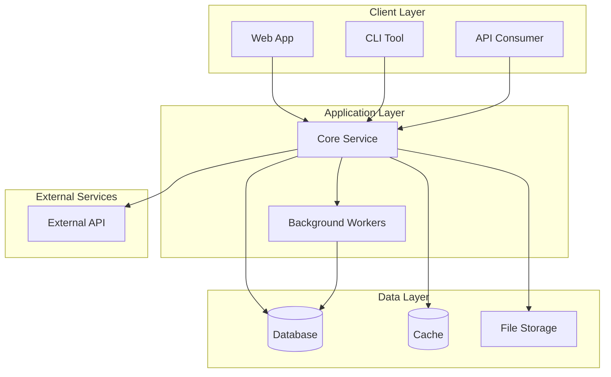
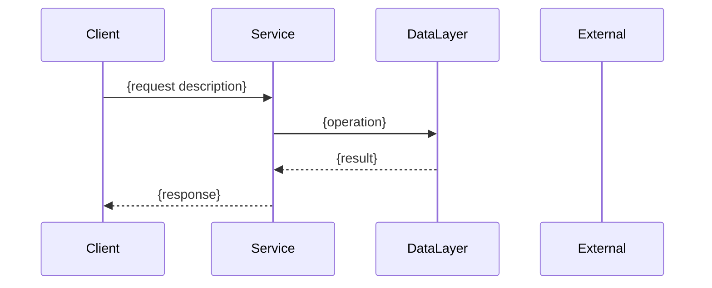

# Architecture Document Template (02-architecture.md)

This template is for the system architecture document. Target length: 150-200 lines.

---

# System Architecture: {Feature Name}

**Epic**: {epic-key}
**Feature**: {feature-key}
**Date**: {YYYY-MM-DD}
**Author**: backend-architect

## Architecture Overview

{2-3 sentences describing the backend scope and approach}

### Key Design Decisions
1. {Decision}: {Rationale}
2. {Decision}: {Rationale}

## System Architecture Diagram

## Component Details

### {ComponentName}

**Purpose**: {What this component does}

**Responsibilities**:
- {Responsibility 1}
- {Responsibility 2}

**Dependencies**:
- {DependencyName}: {What it provides}

**Interfaces**:
- Exposes: {What interfaces it exposes}
- Consumes: {What interfaces it uses}

---

### {Another Component}

{Same structure...}

## Data Flow

### {Primary Flow Name}

## Integration Points

### Internal Services

| Service | Integration Type | Purpose |
|---------|-----------------|---------|
| {ServiceName} | REST/gRPC/Event/Function | {What data exchanged} |

### External Services

| Service | Protocol | Purpose | Fallback |
|---------|----------|---------|----------|
| {ExternalAPI} | REST | {Purpose} | {What happens if unavailable} |

## Technology Stack

| Layer | Technology | Justification |
|-------|------------|---------------|
| {Layer} | {Technology} | {Why this choice} |

## Deployment Considerations

### Scaling Strategy
- Horizontal: {What can scale horizontally}
- Vertical: {What needs vertical scaling}

### High Availability
- {Approach to redundancy}
- {Failover strategy}

## Technical Risks & Mitigations

| Risk | Likelihood | Impact | Mitigation |
|------|------------|--------|------------|
| {Risk description} | High/Med/Low | High/Med/Low | {Strategy} |
