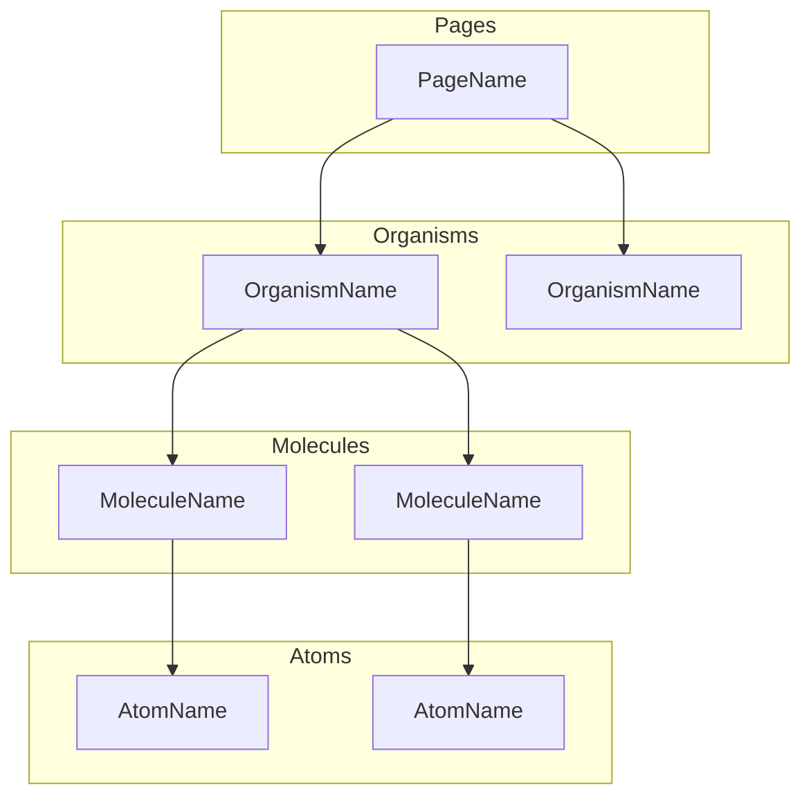
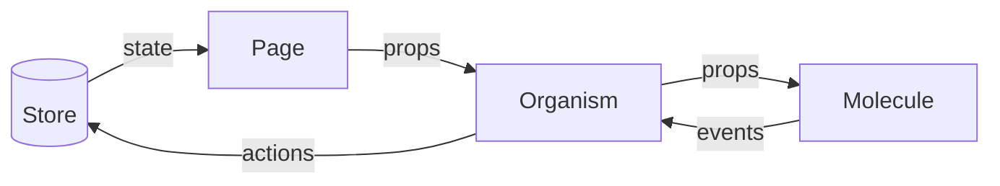
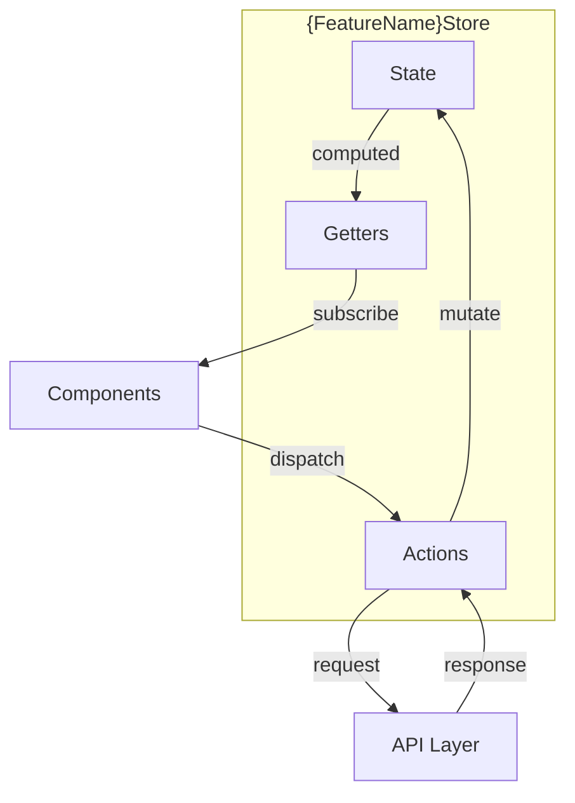
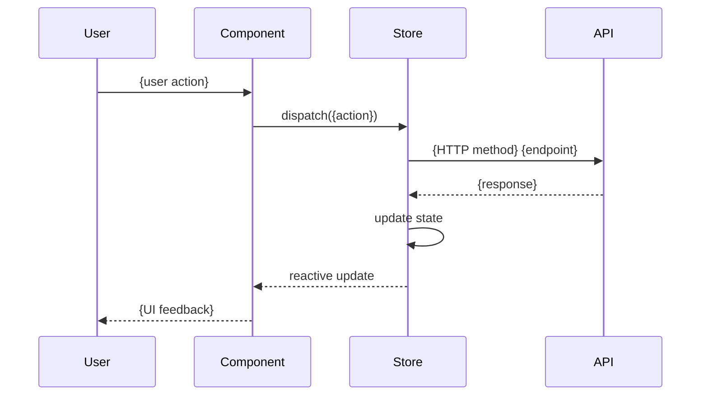

# Frontend Design Document Template (05-frontend-design.md)

This template is extracted from the frontend-architect agent. Target length: 150-200 lines.

---

# Frontend Design: {Feature Name}

**Epic**: {epic-key}
**Feature**: {feature-key}
**Date**: {YYYY-MM-DD}
**Author**: frontend-architect

## Overview

{2-3 sentences describing the frontend scope for this feature}

### User Stories Covered
- As a {user}, I can {action} so that {benefit}
- ...

### Key UI Components
- {ComponentName} - {brief purpose}
- ...

## Component Architecture

### Component Hierarchy

### Component Data Flow

## Component Specifications

### {PageName}

**Type**: Page (Route: `/path`)

**Purpose**: {What this page does and when users see it}

**Layout**:
- Header section: {description}
- Main content: {description}
- Sidebar (if applicable): {description}

**Child Components**:
- `{OrganismName}` - {purpose}
- `{OrganismName}` - {purpose}

**Route Parameters**:
- `{param}` - {type and purpose}

**Data Requirements**:
- Fetches {data} from {endpoint}
- Requires {state} from store

---

### {OrganismName}

**Type**: Organism

**Purpose**: {What this component does}

**Props**:
- `{propName}`: {type description} - {purpose}
- `{propName}`: {type description}, optional - {purpose}

**State** (local):
- `{stateName}`: {type description} - {what triggers changes}

**Events Emitted**:
- `{eventName}`: Emitted when {condition}, payload: {description}

**Child Components**:
- `{MoleculeName}` - {how it's used}

**Behavior**:
- On mount: {what happens}
- On {action}: {what happens}

**Accessibility**:
- Role: {ARIA role}
- Keyboard: {keyboard interactions supported}

---

## State Management

### Store Architecture

### State Shape

**{FeatureName} State**:
- `{property}`: {type description} - {purpose}
- `loading`: boolean - tracks API request status
- `error`: string or null - stores error messages

### Getters (Computed)

- `{getterName}`: Computes {what} from {source state}

### Actions

- `{actionName}({params})`: {What it does, which API it calls}

## API Integration

### Endpoints Used

| Endpoint | Method | Request DTO | Response DTO | Component |
|----------|--------|-------------|--------------|-----------|
| `/api/v1/{resource}` | GET | - | {ResponseDTO} | {Component} |

### Data Flow: {Primary User Action}

### Error Handling

- **Network Errors**: {how handled in UI}
- **Validation Errors (422)**: {how displayed}
- **Auth Errors (401/403)**: {redirect/message behavior}

## UX Patterns

### Loading States

- **Initial Load**: {skeleton, spinner, or placeholder approach}
- **Action Pending**: {inline loading indicator pattern}

### Form Handling

- **Validation**: {client-side validation approach}
- **Submission**: {optimistic vs. wait for response}
- **Error Display**: {inline, toast, summary, etc.}

### Empty States

- **No Data**: {what to show, call-to-action}

## Responsive Design

### Breakpoints

| Breakpoint | Width | Layout Changes |
|------------|-------|----------------|
| Mobile | < 640px | {description} |
| Tablet | 640-1024px | {description} |
| Desktop | > 1024px | {description} |

## Accessibility (WCAG 2.1 AA)

### Keyboard Navigation

- Tab order: {logical flow description}
- Focus management: {how focus moves on actions}

### Screen Reader Support

- ARIA labels: {key aria-label requirements}
- Semantic HTML: {key semantic elements to use}
