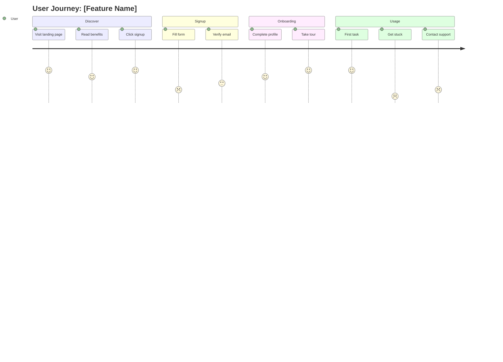

# Customer Journey Mapping Workflow

Map the end-to-end customer journey to understand touchpoints, emotions, pain points, and opportunities.

## When to Use

- During Feature-Refinement at Story_And_Design_Start node
- For multi-step or cross-channel experiences
- When understanding context beyond a single feature
- Before designing complex user flows
- To identify service design opportunities

## Prerequisites

**Required artifacts**:
- F01-feature-prd.md - Feature specification
- D06-stakeholder-insights.md (recommended) - User research

**Optional context**:
- User personas
- F07-wireframes.md - Screen designs
- Existing journey maps (for related features)

## Workflow Steps

### 1. Define Journey Scope

Identify the journey to map:

**Journey Boundaries**:
- **Start Point**: When does the journey begin? (First awareness? Entry to feature?)
- **End Point**: What constitutes completion? (Goal achieved? Exit?)
- **Scope**: Single feature? Entire product experience? Cross-product?

**User Perspective**:
- Which user persona or segment?
- What goal are they trying to accomplish?
- What context are they in? (Work? Home? Mobile? Desktop?)

### 2. Identify Journey Stages

Break the journey into high-level stages:

**Common Stage Patterns**:

**Awareness → Consideration → Purchase → Onboarding → Usage → Retention**
(Product adoption journey)

**Discover → Learn → Try → Buy → Use → Support**
(SaaS product journey)

**Trigger → Research → Evaluate → Decide → Execute → Follow-up**
(Task-oriented journey)

**Adapt stages to your specific journey**.

### 3. Map Touchpoints

For each stage, identify touchpoints:

**Touchpoint Types**:
- **Digital**: Website, app screens, emails, notifications
- **Human**: Customer support, sales calls, in-person
- **Physical**: Packaging, printed materials, physical locations
- **Internal**: Backend processes, data flows

**For Each Touchpoint Document**:
- Channel (web, mobile, email, etc.)
- Actor (user, system, support team)
- Action (what happens)
- Purpose (why this touchpoint exists)

### 4. Capture User Actions and Thoughts

For each touchpoint, document:

**Actions**: What the user does
- Clicks button
- Fills form
- Reads content
- Contacts support

**Thoughts**: What the user is thinking
- "Is this secure?"
- "How long will this take?"
- "What if I make a mistake?"
- "Do I really need this?"

**Questions**: What users wonder
- "Where do I find X?"
- "What happens if Y?"
- "Can I trust this?"

### 5. Map Emotional Journey

Rate emotional state at each stage:

**Emotion Scale**:
- 😊 Positive: Delighted, confident, satisfied
- 😐 Neutral: Indifferent, focused, calm
- 😟 Negative: Frustrated, confused, anxious

**Identify**:
- **Peak moments**: Highest positive emotion
- **Pain points**: Lowest negative emotion
- **Emotional transitions**: Where feelings shift

### 6. Identify Pain Points and Opportunities

For each stage and touchpoint:

**Pain Points**:
- Friction (things that slow users down)
- Confusion (unclear or ambiguous)
- Errors (failures or mistakes)
- Missing capabilities (can't do what they want)
- Workarounds (users finding alternatives)

**Opportunity Areas**:
- Simplification opportunities
- Automation potential
- Personalization possibilities
- Delight moments to enhance
- Gaps to fill

### 7. Map Supporting Systems

Document what enables each touchpoint:

**Technology**:
- Frontend components
- Backend services
- APIs and integrations
- Data sources

**People**:
- Support teams
- Sales teams
- Operations

**Processes**:
- Automated workflows
- Manual procedures
- Business rules

### 8. Define Success Metrics

For each stage, identify how to measure success:

**Metrics Examples**:
- Completion rate
- Time to complete
- Error rate
- Satisfaction score (NPS, CSAT)
- Abandonment rate
- Support ticket volume

### 9. Document Journey Map

Create F09-customer-journey.md:

```markdown
# Customer Journey Map: [Journey Name]

## Overview

**Journey**: [Name and description]
**User Persona**: [Who we're mapping]
**User Goal**: [What they're trying to accomplish]
**Journey Scope**: [Start] → [End]

## Journey Stages

1. [Stage 1 Name]
2. [Stage 2 Name]
3. [Stage 3 Name]
4. [Stage 4 Name]
5. [Stage 5 Name]

---

## Journey Map

### Stage 1: [Stage Name]

#### Overview
**Goal**: [What user wants to accomplish in this stage]
**Duration**: [Typical time spent]
**Emotion**: [😊/😐/😟] [Emotional state description]

#### Touchpoints

##### Touchpoint 1.1: [Name]
- **Channel**: [Web/Mobile/Email/etc.]
- **Actor**: [User/System/Support]
- **User Action**: [What user does]
  - [Specific action 1]
  - [Specific action 2]
- **User Thoughts**:
  - "[What they're thinking]"
  - "[Another thought]"
- **User Questions**:
  - "[Question they have]"
- **System Response**: [What happens in response]

##### Touchpoint 1.2: [Name]
[Same structure]

#### Pain Points
1. **[Pain Point Name]**
   - **Description**: [What's frustrating/confusing]
   - **Impact**: [How it affects user]
   - **Frequency**: [How often it happens]
   - **Severity**: High/Medium/Low

2. **[Another Pain Point]**
   [Same structure]

#### Opportunities
1. **[Opportunity Name]**
   - **Description**: [Improvement idea]
   - **Expected Impact**: [How it would help]
   - **Effort**: High/Medium/Low
   - **Priority**: High/Medium/Low

2. **[Another Opportunity]**
   [Same structure]

#### Supporting Systems
**Technology**:
- [System/component 1]: [Purpose]
- [System/component 2]: [Purpose]

**People**:
- [Role]: [Involvement]

**Data**:
- [Data source]: [What data is used]

#### Success Metrics
- **[Metric Name]**: [Current state] → [Target state]
- **[Metric Name]**: [Current state] → [Target state]

---

### Stage 2: [Stage Name]
[Repeat structure above for each stage]

---

### Stage 3: [Stage Name]
[Continue for all stages]

---

## Emotional Journey Visualization

```
Emotion
  😊  |     ●              ●
      |    / \            /
  😐  |   /   \    ●    /
      |  /     \  / \  /
  😟  | /       \/   \/
      +------------------------
       Stage1 Stage2 Stage3...
```

**Key Moments**:
- **Peak 1 (Stage X)**: [What creates delight]
- **Valley 1 (Stage Y)**: [What creates frustration]

---

## Journey Summary

### Overall Pain Points (Prioritized)

| Pain Point | Stage | Impact | Frequency | Severity | Priority |
|------------|-------|--------|-----------|----------|----------|
| [Name] | [Stage] | [Description] | High/Med/Low | High/Med/Low | 1 |
| [Name] | [Stage] | [Description] | High/Med/Low | High/Med/Low | 2 |

### Overall Opportunities (Prioritized)

| Opportunity | Stage | Expected Impact | Effort | Priority |
|-------------|-------|----------------|--------|----------|
| [Name] | [Stage] | [Impact] | High/Med/Low | 1 |
| [Name] | [Stage] | [Impact] | High/Med/Low | 2 |

### Critical Success Factors

1. [Factor that must be addressed]
2. [Another critical factor]
3. [Another factor]

### Success Metrics Summary

| Stage | Key Metric | Current | Target |
|-------|-----------|---------|--------|
| [Stage 1] | [Metric] | [Value] | [Value] |
| [Stage 2] | [Metric] | [Value] | [Value] |

---

## Personas

### [Persona Name]

**Demographics**: [Age, role, context]

**Goals**:
- [Primary goal]
- [Secondary goal]

**Pain Points**:
- [Frustration 1]
- [Frustration 2]

**Motivations**:
- [What drives them]

**Tech Savviness**: [Low/Medium/High]

**Quote**: "[Memorable quote that captures their perspective]"

**Journey Variations**:
- [How this persona's journey differs from others]

---

## Recommendations

### Immediate Actions (High Priority)
1. **[Recommendation 1]**
   - **Problem**: [What it addresses]
   - **Solution**: [What to do]
   - **Stage**: [Where in journey]
   - **Expected Impact**: [Benefit]
   - **Effort**: [Level]

2. **[Recommendation 2]**
   [Same structure]

### Near-Term Actions (Medium Priority)
[Same structure as above]

### Long-Term Opportunities (Future)
[Same structure as above]

---

## Alternative Journeys

### Alternative Path 1: [Scenario]
[Brief description of how journey differs for this scenario]

Key differences:
- Stage X: [Variation]
- Stage Y: [Variation]

### Error Recovery Journey
[How journey changes when errors occur]

---

## Assumptions and Validations

### Assumptions Made
1. [Assumption about user behavior]
2. [Assumption about systems]

### Needs Validation
1. [Hypothesis to test with users]
2. [Another hypothesis]

---

## Next Steps

- [ ] Validate journey map with users (testing/interviews)
- [ ] Review with cross-functional team
- [ ] Prioritize opportunities with ProductManager
- [ ] Use insights to inform feature design
- [ ] Update metrics baseline
- [ ] Plan improvements for high-priority pain points
```

### 10. Visualize the Journey (Optional)

Consider creating a visual journey map:

**Visual Elements**:
- Timeline showing stages
- Emotion curve graph
- Touchpoint icons
- Pain point markers (red)
- Opportunity markers (green)
- Actor swimlanes

**Tools**:
- Mermaid diagrams (for simple flows)
- HTML/CSS visualization (using frontend-design skill)
- Descriptive ASCII art (for quick visualization)

Example Mermaid Journey:


### 11. Store Artifact

Save journey map:
```bash
/home/jwwelbor/projects/ai-dev-team/docs/workflow/artifacts/F09-customer-journey.md
```

## Journey Mapping Templates

### Simplified Journey Template

```markdown
| Stage | Actions | Thoughts | Emotions | Pain Points | Opportunities |
|-------|---------|----------|----------|-------------|---------------|
| [Stage 1] | [What they do] | [What they think] | 😊😐😟 | [Issues] | [Ideas] |
| [Stage 2] | [Actions] | [Thoughts] | [Emotion] | [Issues] | [Ideas] |
```

### Service Blueprint Template

Extends journey map to show backstage systems:

```markdown
## Stage: [Name]

**Frontstage (User Visible)**:
- User Action: [What user does]
- UI/Touchpoint: [What they see/interact with]

**Backstage (Behind the Scenes)**:
- System Process: [What happens in backend]
- Database Operations: [Data changes]
- APIs Called: [External integrations]

**Support Processes**:
- People: [Team involvement]
- Policies: [Business rules applied]
```

## Success Criteria

Journey map is complete when:
- All journey stages are identified and documented
- Touchpoints are mapped for each stage
- Emotional journey is visualized
- Pain points are prioritized by impact and severity
- Opportunities are identified with effort estimates
- Metrics are defined for each stage
- Recommendations are specific and actionable
- Supporting systems are documented

## Next Steps

After journey mapping:
- Validate journey with users through testing
- Review with ProductManager and CXDesigner
- Prioritize improvements based on impact
- Use insights to inform wireframes and prototypes
- Define metrics tracking for journey analytics
- Plan iterative improvements over time

## Related Workflows

- `wireframing.md` - Design screens for touchpoints
- `prototyping.md` - Create prototypes of journey stages
- `discovery/stakeholder-research.md` - Gather user insights
- `specification-writing/workflows/write-stories.md` - User stories for journey stages
