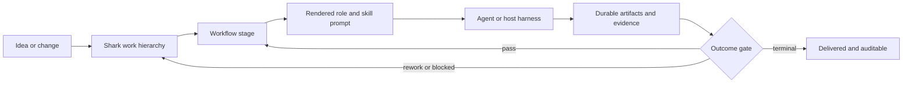

# Shark: the open-source AI delivery lifecycle harness

**Make AI-assisted software delivery predictable.** Shark connects the work,
engineering process, prompts, specialist roles, and evidence that an agent team
needs to take a change from idea to a verified result.

Shark is an open-source **AI delivery lifecycle (AI-DLC) harness**. It gives
coding agents a shared, durable operating model for large projects: what work
exists, what stage it is in, which instructions apply, what artifact proves the
stage is complete, and what must happen next. The result is less dependence on
chat history and less improvisation between sessions, agents, and handoffs.

It is not another coding agent. Shark works alongside the agent harness you use
and supplies the workflow, context, state, and guardrails that make agent work
repeatable.

Shark has two cooperating parts:

- The **Shark CLI** owns work, workflow state, prompt assembly, claims, and
  evidence.
- The **Shark Rider skill** connects those capabilities to an interactive agent
  host. It translates requests such as `/shark-rider run E01` into the
  host-side orchestration loop that calls Shark and dispatches agents.

## Why Shark

AI coding agents can write code quickly. Sustained software delivery also
requires discovery, specification, test planning, implementation, review, QA,
acceptance, and integration checks. Those steps often disappear when the work
is driven by an isolated prompt or an untracked chat session.

Shark turns that implicit process into a configurable, inspectable system:

- **Persist the work, not just the conversation.** Track epics, features,
  tasks, bugs, changes, technical debt, questions, and sprints with links,
  history, dependencies, and durable artifacts.
- **Route work through an engineering workflow.** Define stages and semantic
  outcomes in YAML instead of asking every agent to remember the process.
- **Give each stage the right context.** Assemble a rendered dispatch prompt
  from the workflow, a specialist role, reusable skills, and entity data.
- **Make evidence a delivery input.** Default prompts direct agents to produce
  and check research reports, specifications, test plans, review reports, test
  results, and acceptance evidence as they move work forward.
- **Coordinate real agent work.** Claims, heartbeats, and session-scoped
  releases prevent two workers from silently owning the same item.
- **Keep the process yours.** Customize prompts, roles, skills, templates, and
  per-entity workflows without forking the application.

## How Shark fits into an AI-DLC



At a dispatchable stage, Shark resolves the entity's workflow and returns a
complete prompt through `shark next <key> --json`. The host harness runs that
prompt. Shark then records the semantic outcome and routes the entity to the
next configured stage. The host controls execution; Shark controls the
delivery contract.

The default bundle models a full delivery path. An epic can move through
assessment, refinement, research, design, decomposition, feature review, and
integration review. A feature can produce a specification, test plan, and task
set before moving through implementation, code review, QA when required, and
acceptance. These are defaults, not a hard-coded method.

## What makes Shark different

| If you need... | Shark provides... |
| --- | --- |
| A coding agent to edit code | A durable process around the coding agent: work selection, role-specific instructions, lifecycle state, and verification gates. |
| A spec-first artifact chain | A live workflow engine that connects artifacts to current work, routes outcomes, tracks dependencies, and records history. |
| A task tracker | Agent-aware dispatch, atomic claims, prompt provenance, and workflow-driven completion criteria. |
| A multi-agent experiment | Reusable roles, skills, prompts, leases, and handoffs that can be inspected and customized as project assets. |

This is the practical distinction behind the AI-DLC framing: Shark does not
only help an agent start work. It helps a team govern how work becomes
reviewed, evidenced, integrated software.

## Start using Shark

### Install from source

Shark is written in Go and currently requires Go 1.25 or later.

```bash
git clone https://github.com/jwwelbor/shark-task-manager.git
cd shark-task-manager
make install-shark
shark --version
```

You can also download a release binary from the
[Releases page](https://github.com/jwwelbor/shark-task-manager/releases).

### Install Shark Rider

Install Shark Rider when you want to drive Shark through `/shark-rider`
workflows or plain-language requests in your coding agent. Direct `shark`
commands and the built-in `shark run` command do not require the skill.

The current release binary does not install Shark Rider. From a Shark source
checkout, link the skill into your host's user-level skill directory:

For Claude Code:

```bash
mkdir -p "$HOME/.claude/skills"
ln -s "$PWD/skills/shark-rider" "$HOME/.claude/skills/shark-rider"
```

For Codex and other hosts that read the shared Agent Skills directory:

```bash
mkdir -p "$HOME/.agents/skills"
ln -s "$PWD/skills/shark-rider" "$HOME/.agents/skills/shark-rider"
```

These links are convenient for source development because updates to the
checkout take effect without copying the skill again. Shark Rider currently
has validated host adapters for Claude Code and Codex. Other Agent Skills
hosts may discover the skill, but their orchestration capabilities and
host-specific instructions still require validation.

### Initialize a project

Run this command at the root of the project you want Shark to manage:

```bash
shark admin init --non-interactive
```

The command creates the local database, `docs/plan/`, and
`.sharkconfig.json`. Shark serves its default content bundle from the binary,
so a new project does not need to copy prompts or workflow files first.

Create a work item and inspect it as JSON:

```bash
shark create epic "Improve account recovery" --json
shark get E01 --json
```

Use the key returned by the create command. Keys are assigned by Shark and
should not be constructed by a harness.

### Run the delivery loop

For a host-managed loop, select and lease work, then request its next step:

```bash
shark plan --json
shark claim E01 --by my-agent
shark next E01 --json
```

The `next` response identifies the action, specialist role, provider/model
metadata, and rendered `prompt`. Run that prompt in your agent harness,
persist the required artifact, then report the semantic result:

```bash
shark status advance E01 --outcome pass
shark release E01
```

If your project enables `advance_guard`, pass the claim session and expected
source status when you advance. The route-based workflow guide shows the
guarded form.

For the built-in runner, use `shark run <key>`. It supports Claude and Codex
harnesses and can run in an isolated Git worktree. Start with `--dry-run` when
you are introducing Shark to a project:

```bash
shark run E01 --dry-run --harness codex
```

Read the [route-based workflow guide](docs/guides/route-based-workflow.md) and
[dispatch prompt assembly](docs/architecture/shark-dispatch-prompt-assembly.md)
before implementing a custom host loop.

## Make the workflow fit your team

The default workflow is deliberately opinionated about engineering discipline,
but its implementation is ordinary project content:

```bash
shark admin install-shark-data
```

This extracts an editable `shark-data/` bundle with:

- `workflow/`: YAML lifecycles and outcome routing for each entity type.
- `prompts/`: stage-specific Markdown prompts and reusable partials.
- `agents/`: specialist role definitions.
- `skills/`: reusable engineering practices, such as research, architecture,
  specification writing, test-driven development, quality, and UAT.
- `file_templates/`: durable artifact templates.
- `overrides/`: local, replace-only customizations preserved during upgrades.

Validate edits before dispatching work:

```bash
shark admin validate-data
```

See [workflow configuration](docs/cli-reference/workflow-configuration.md),
[workflow profiles](docs/guides/workflow-profiles.md), and the
[configuration reference](docs/cli-reference/configuration.md) for the
configuration model.

## Use Shark when the work must survive the session

Shark is especially useful when you have one or more of the following:

- A codebase too large for a single agent conversation to remain reliable.
- Multiple agents, models, or people contributing to the same delivery path.
- A need to make review, QA, UAT, and integration evidence visible rather than
  implied.
- A team-specific engineering process that must guide agents consistently.
- A backlog that needs to retain decisions, relationships, and completion
  history after the agent stops running.

For a one-file experiment, a direct coding-agent prompt may be enough. For a
project that must remain understandable and deliverable across many sessions,
Shark supplies the missing operating structure.

## Architecture at a glance

Shark is a Go CLI backed by SQLite, with libSQL support. Its core components
are:

- A hierarchical work model and relationship graph.
- A configuration-driven workflow engine with semantic outcome routing.
- A versioned content bundle for prompts, roles, skills, and artifact
  templates.
- JSON-first CLI surfaces for a host harness, plus built-in runners for Claude
  and Codex.
- Claims, heartbeats, history, and validation for coordination and auditability.

Read the [architecture overview](docs/architecture/architecture-overview.md)
and [CLI reference](docs/CLI_REFERENCE.md) for details.

## Contribute

Run the project quality gate before opening a pull request:

```bash
make fmt
make vet
make lint
make test
```

See [CLAUDE.md](CLAUDE.md) for repository navigation and development guidance.

## License

Shark is released under the [MIT License](LICENSE).
