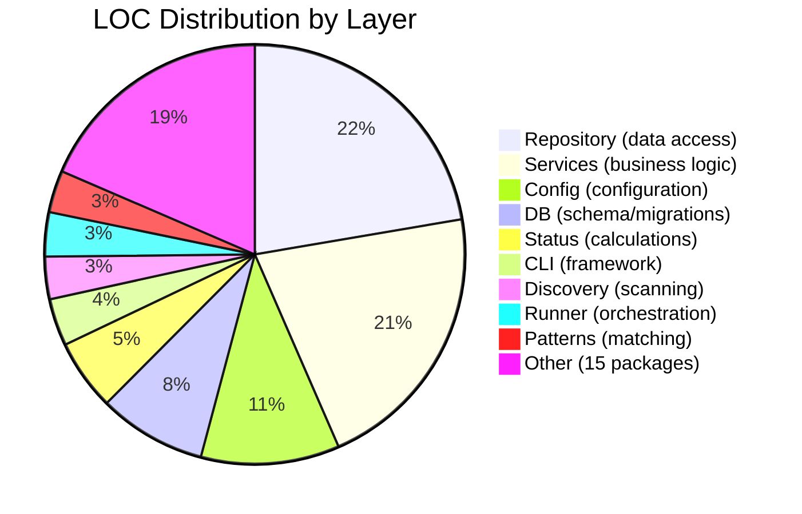

# Complexity Analysis

> Part of the Shark Task Manager Brownfield Analysis
> Generated: 2026-03-22
> Phase: 7 — Code Quality Analysis

## Hotspot Analysis

Files that are both complex and frequently referenced:

| File | LOC (est.) | Dependencies | Hotspot Score | Concern |
|------|-----------|-------------|---------------|---------|
| `internal/repository/task_repository.go` | ~2,000+ | Many services depend on it | High | Central data access for tasks |
| `internal/services/task_service.go` | ~1,500+ | All task commands depend on it | High | Core business logic |
| `internal/db/db.go` | ~1,500+ | All repos depend on it | High | Schema + migrations |
| `internal/config/config.go` | ~1,000+ | workflow, status, db depend on it | High | Central configuration |
| `internal/cli/commands/task.go` | ~1,500+ | Implements 19 subcommands | Medium | Complex arg parsing |
| `internal/services/entity_service.go` | ~1,000+ | All entity services use it | Medium | Polymorphic transitions |

## Large Packages (Potential God Packages)

### `internal/repository/` — 77 files, 30,133 LOC

**Concern**: Single package contains repositories for 10+ entity types plus adapters and test files.

**Recommendation**: Split into sub-packages per entity:
```
repository/
├── task/        # TaskRepository
├── feature/     # FeatureRepository
├── epic/        # EpicRepository
├── bug/         # BugRepository
├── change/      # ChangeCardRepository
├── note/        # EntityNoteRepository
├── history/     # EntityHistoryRepository
└── shared/      # Common types, DB wrapper
```

### `internal/config/` — 27 files, 14,408 LOC

**Concern**: Configuration parsing, workflow profiles, action routing, and validation all in one package.

**Recommendation**: Split by concern:
```
config/
├── core/        # Base config loading
├── workflow/    # Workflow profile parsing
├── actions/     # Orchestrator actions
└── validation/  # Config validation
```

### `internal/services/` — 62 files, 28,560 LOC

**Assessment**: This package is large but well-organized by service type. Each service is a separate file with clear responsibilities. No immediate split needed.

## Deeply Nested Logic

| Area | Nesting Level | Location |
|------|--------------|----------|
| Command arg parsing | 3-4 levels | `cli/commands/task.go` (positional vs flag args) |
| Status transition validation | 3 levels | `services/entity_service.go` (transition + deps + force) |
| Progress calculation | 2-3 levels | `status/` (weight lookup + aggregation) |
| Key parsing/detection | 3-4 levels | `keys/`, `patterns/` (regex branching by format) |

**Assessment**: Nesting complexity is moderate. Most complex branching is in key format detection and command argument parsing, which are inherently branchy operations.

## Complexity Distribution



See also: [Code Metrics](code-metrics.md) | [Dependency Analysis](dependency-analysis.md)
