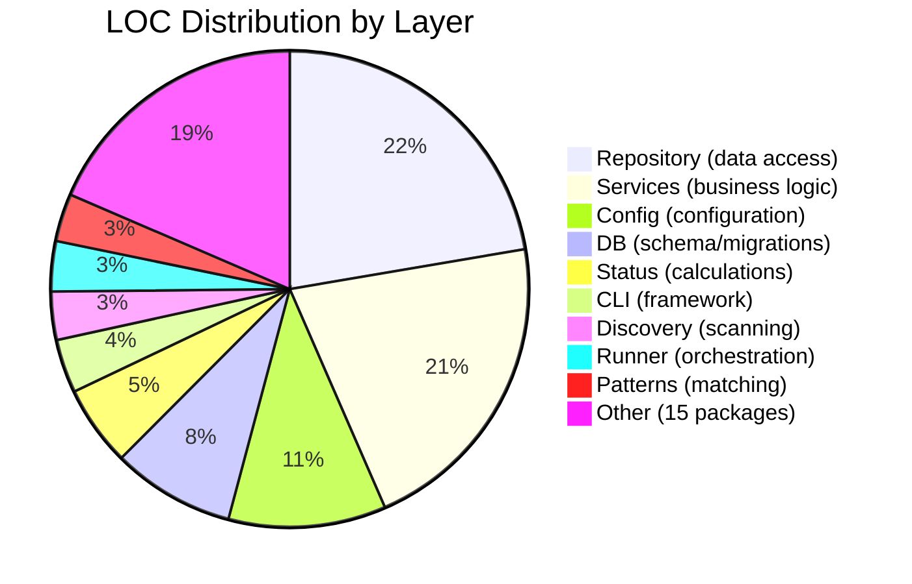

# Complexity Analysis

> Part of the Shark Task Manager Brownfield Analysis
<<<<<<< Updated upstream
> Generated: 2026-03-22
> Phase: 7 — Code Quality Analysis

## Hotspot Analysis

Files that are both complex and frequently referenced:

| File | LOC (est.) | Dependencies | Hotspot Score | Concern |
|------|-----------|-------------|---------------|---------|
| `internal/repository/task_repository.go` | ~2,000+ | Many services depend on it | High | Central data access for tasks |
| `internal/services/task_service.go` | ~1,500+ | All task commands depend on it | High | Core business logic |
| `internal/db/db.go` | ~1,500+ | All repos depend on it | High | Schema + migrations |
| `internal/config/config.go` | ~1,000+ | workflow, status, db depend on it | High | Central configuration |
| `internal/cli/commands/task.go` | ~1,500+ | Implements 19 subcommands | Medium | Complex arg parsing |
| `internal/services/entity_service.go` | ~1,000+ | All entity services use it | Medium | Polymorphic transitions |

## Large Packages (Potential God Packages)

### `internal/repository/` — 77 files, 30,133 LOC

**Concern**: Single package contains repositories for 10+ entity types plus adapters and test files.

**Recommendation**: Split into sub-packages per entity:
```
repository/
├── task/        # TaskRepository
├── feature/     # FeatureRepository
├── epic/        # EpicRepository
├── bug/         # BugRepository
├── change/      # ChangeCardRepository
├── note/        # EntityNoteRepository
├── history/     # EntityHistoryRepository
└── shared/      # Common types, DB wrapper
```

### `internal/config/` — 27 files, 14,408 LOC

**Concern**: Configuration parsing, workflow profiles, action routing, and validation all in one package.

**Recommendation**: Split by concern:
```
config/
├── core/        # Base config loading
├── workflow/    # Workflow profile parsing
├── actions/     # Orchestrator actions
└── validation/  # Config validation
```

### `internal/services/` — 62 files, 28,560 LOC

**Assessment**: This package is large but well-organized by service type. Each service is a separate file with clear responsibilities. No immediate split needed.

## Deeply Nested Logic

| Area | Nesting Level | Location |
|------|--------------|----------|
| Command arg parsing | 3-4 levels | `cli/commands/task.go` (positional vs flag args) |
| Status transition validation | 3 levels | `services/entity_service.go` (transition + deps + force) |
| Progress calculation | 2-3 levels | `status/` (weight lookup + aggregation) |
| Key parsing/detection | 3-4 levels | `keys/`, `patterns/` (regex branching by format) |

**Assessment**: Nesting complexity is moderate. Most complex branching is in key format detection and command argument parsing, which are inherently branchy operations.

## Complexity Distribution



See also: [Code Metrics](code-metrics.md) | [Dependency Analysis](dependency-analysis.md)
=======
> Generated: 2026-03-20
> Phase: 7 — Code Quality Analysis

## Complexity Hotspots

### Files Exceeding 1,000 LOC

| File | LOC | Concern Level | Notes |
|------|-----|--------------|-------|
| `internal/db/db.go` | 2,335 | High | Schema + init + migrations + integrity check in one file |
| `internal/repository/task_repository.go` | 1,806 | Medium | Many query methods, but each is simple SQL |
| `internal/db/migrate.go` | 1,560 | Medium | Expected growth as migrations accumulate |
| `internal/services/task_service.go` | 1,371 | Medium | Central service, well-decomposed methods |
| `internal/cli/commands/feature_helpers.go` | 1,209 | High | Output formatting complexity |
| `internal/cli/commands/config.go` | 1,075 | Medium | Config subcommand handlers |
| `internal/services/feature_service.go` | 1,063 | Medium | Feature business logic |
| `internal/repository/feature_repository.go` | 995 | Low | Standard repository, approaching threshold |
| `internal/cli/commands/epic_helpers.go` | 994 | High | Output formatting complexity |
| `internal/services/epic_service.go` | 923 | Low | Epic business logic |

### Potential God Objects

1. **`internal/db/db.go` (2,335 LOC)** — Combines schema creation, SQLite configuration, migration orchestration, schema versioning, and integrity checking. Should be split into:
   - `schema.go` (table definitions)
   - `config.go` (SQLite PRAGMAs)
   - `version.go` (schema versioning)

2. **`internal/cli/commands/feature_helpers.go` (1,209 LOC)** and **`epic_helpers.go` (994 LOC)** — Output formatting helpers that grow with each new display feature. Could benefit from a shared formatting framework.

### Deeply Nested Logic

- **Workflow validation**: Multi-level config resolution (task → feature → epic level) with fallback chains
- **Key parsing**: Entity type detection from key format involves multiple regex patterns and fallback strategies
- **Status transition**: Validation chain: get entity → validate transition → check force flag → create rejection note → update status → check unblocks

### Duplication Patterns

The CLI commands layer shows significant structural duplication across entity types:
- `epic_helpers.go` (994 LOC) and `feature_helpers.go` (1,209 LOC) contain parallel output formatting logic
- `epic_context.go`, `feature_context.go`, `task_context.go` share similar patterns
- `epic_note.go`, `feature_note.go`, `task_note.go` are structurally similar
- `epic_resume.go`, `feature_resume.go`, `task_resume.go` follow same pattern
- **E21 (Entity Polymorphism)** is actively addressing this duplication

### File Count by Complexity Category

| Complexity | File Count | Description |
|------------|-----------|-------------|
| **Simple** (< 100 LOC) | ~80 | Utility files, small commands, type definitions |
| **Moderate** (100-500 LOC) | ~140 | Standard services, repositories, commands |
| **Complex** (500-1000 LOC) | ~30 | Feature-rich services, large repositories |
| **Very Complex** (1000+ LOC) | 16 | Schema, migrations, central services |

## Package Complexity Assessment

| Package | Complexity | Reasoning |
|---------|-----------|-----------|
| `db` | High | 2,335 LOC schema file, migration accumulation |
| `cli/commands` | High | 68 files, structural duplication across entity types |
| `services` | Medium | Well-factored with EntityService extraction |
| `repository` | Medium | Large but simple (SQL queries) |
| `config` | Medium | Complex workflow config parsing |
| `status` | Medium | Non-trivial calculation logic |
| `models` | Low | Pure data types, minimal logic |
| `workflow` | Low | Clean, focused responsibility |

---

See also: [Code Metrics](code-metrics.md) | [Maintenance Burden](../technical-debt/maintenance-burden.md)
>>>>>>> Stashed changes
