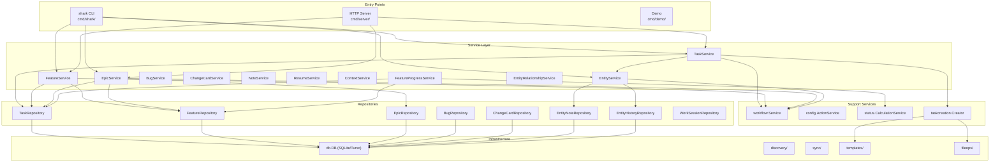

# Components

> Part of the Shark Task Manager Brownfield Analysis
<<<<<<< Updated upstream
> Generated: 2026-03-22
> Phase: 2 — Architecture Analysis

## Component Overview

## Major Components

### 1. CLI Layer (`internal/cli/`)

| File | Purpose | Key Responsibilities |
|------|---------|---------------------|
| `root.go` | Root command & global config | Flags, project root detection, lifecycle hooks |
| `db_global.go` | Global DB singleton | Lazy init, thread-safe, auto-cleanup |
| `services_global.go` | Service accessors | `GetTaskService()`, `GetEntityService()`, etc. |
| `output.go` | Output helpers | `OutputJSON()`, `OutputTable()`, `Success()`, `Error()` |
| `commands/` | Command handlers | 30+ thin wrappers (parse → call → format) |

**Size**: ~19 files, ~4,918 LOC
**Interfaces exposed**: Global config, service accessors
**Dependencies consumed**: All services, repositories (via services)

### 2. Service Layer (`internal/services/`)

| Service | Files | Key Methods | Dependencies |
|---------|-------|-------------|--------------|
| TaskService | ~8 | Create, Get, List, TransitionStatus, ValidateDependencies | TaskRepo, EntityService, Creator |
| FeatureService | ~6 | Create, Get, Complete, TransitionStatus, CascadeStatus | FeatureRepo, WorkflowSvc, TaskRepo |
| EpicService | ~6 | Create, Get, Complete, GetRollup, GetImpediments, Cascade | EpicRepo, WorkflowSvc, FeatureRepo |
| EntityService | ~8 | TransitionStatus (polymorphic), RecordHistory | WorkflowSvc, HistoryRepo, NoteRepo |
| FeatureProgressService | ~4 | GetProgress, GetHealth, GetWorkBreakdown, GetActionItems | FeatureRepo, TaskRepo, StatusCalc |
| EntityRelationshipService | ~4 | CreateRelationship, GetOutgoing, DetectCycle | RelationshipRepo |
| BugService | ~4 | CRUD, TransitionStatus | BugRepo, EntityService |
| ChangeCardService | ~4 | CRUD, TransitionStatus, Approve | ChangeCardRepo, EntityService |
| NoteService | ~3 | Add, List, GetByEntity | EntityNoteRepo |
| ContextService | ~3 | Get/Set/Clear context fields | All entity repos |
| ResumeService | ~3 | Resume with full context | All repos, NoteRepo |

**Size**: ~62 files, ~28,560 LOC
**Key Principle**: Fat services, thin controllers, dumb repositories

### 3. Repository Layer (`internal/repository/`)

| Repository | Purpose | Key Methods |
|------------|---------|-------------|
| TaskRepository | Task CRUD + queries | Create, GetByKey, List, UpdateStatus, SearchByFile |
| FeatureRepository | Feature CRUD | Create, GetByKey, ListByEpic, CalculateProgress |
| EpicRepository | Epic CRUD | Create, GetByKey, List |
| BugRepository | Bug CRUD | Create, GetByKey, List, UpdateStatus |
| ChangeCardRepository | Change card CRUD | Create, GetByKey, List |
| EntityNoteRepository | Polymorphic notes | CreateNote, GetByEntity, GetByType |
| EntityHistoryRepository | Audit trail | Create, GetByEntity, GetByDateRange |
| TaskHistoryRepository | Legacy task history | Create, GetByTaskID |
| WorkSessionRepository | Time tracking | Create, GetByTaskID, GetAnalytics |
| EntityRelationshipRepository | Entity links | Create, GetOutgoing, GetIncoming |

**Size**: ~77 files, ~30,133 LOC
**Key Principle**: Pure data access only — no business logic, no progress calculation

### 4. Database Layer (`internal/db/`)

| Responsibility | Details |
|----------------|---------|
| Schema | 16 tables, 40+ indexes, triggers for timestamps |
| Migrations | Version-tracked (v10), idempotent, skip-on-demand |
| PRAGMAs | WAL mode, foreign keys, 64MB cache, 5s busy timeout |
| Backends | Local SQLite (`go-sqlite3`) and Turso cloud (`libsql-client-go`) |

**Size**: ~27 files, ~11,225 LOC
**Schema version**: 10

### 5. Workflow System (`internal/workflow/`)

| Responsibility | Details |
|----------------|---------|
| Status validation | `ValidateTransition(from, to)` |
| Next status | `GetNextStatus(current)` via config |
| Status metadata | Color, phase, progress weight, responsibility |
| Multi-level | Separate flows for epic/feature/task |
| Profiles | Basic (5 statuses) and Advanced (19 statuses) |

**Size**: ~6 files, ~2,251 LOC

### 6. Configuration System (`internal/config/`)

| Responsibility | Details |
|----------------|---------|
| Config loading | `.sharkconfig.json` with Viper |
| Workflow profiles | Basic and Advanced presets |
| Action routing | Orchestrator actions per status |
| Database config | Backend selection (local/turso) |
| Template config | Template directory, viewer command |

**Size**: ~27 files, ~14,408 LOC

### 7. Infrastructure Packages

| Package | Purpose | Size |
|---------|---------|------|
| `discovery/` | Filesystem scanning for entities | 15 files, 4,418 LOC |
| `taskcreation/` | Task key generation, file creation | 7 files, 3,062 LOC |
| `templates/` | Go template rendering for entities | 9 files, 2,902 LOC |
| `fileops/` | Atomic file operations | ~4 files, ~500 LOC |
| `sync/` | File-database synchronization | ~5 files |
| `pathresolver/` | Project root auto-detection | ~3 files |
| `patterns/` | Entity key regex patterns | 16 files, 4,379 LOC |

### 8. Domain Models (`internal/models/`)

| Model | Key Fields | Purpose |
|-------|-----------|---------|
| Epic | Key, Title, Status, Priority, Slug | Top-level work unit |
| Feature | Key, EpicID, Title, Status, ProgressPct, Slug | Feature within epic |
| Task | Key, FeatureID, Title, Status, AgentType, Priority, DependsOn, Slug | Atomic work item |
| Bug | Key, Title, Status, Priority, Severity, LinkedEntity | Bug tracking |
| ChangeCard | Key, Title, Status, Priority, LinkedEntity | Change requests |
| TaskHistory | TaskID, FromStatus, ToStatus, Agent, Timestamp | Audit trail |
| EntityNote | EntityType, EntityID, NoteType, Content | Annotations |
| Idea | Key, Title, Status, ConvertedTo | Pre-promotion capture |

**Size**: ~28 files, ~3,212 LOC
**Interface**: All entities implement `Entity` interface
=======
> Generated: 2026-03-20
> Phase: 2 — Architecture Analysis

## Component Inventory

### 1. CLI Framework (`internal/cli/`)

| Attribute | Value |
|-----------|-------|
| **Purpose** | Command-line interface framework and entry point orchestration |
| **Files** | 82 prod, 100 test |
| **Technology** | Go + Cobra + pterm |
| **Key Entry Points** | `root.go`, `services_global.go`, `db_global.go` |

**Responsibilities:**
- Root command setup with global flags (`--json`, `--field`, `--no-color`, `--verbose`)
- 68 command files organized by entity type and function
- Global service accessor functions (lazy initialization via `sync.Once`)
- Database singleton management with automatic cleanup
- Output formatting (JSON, tables, success/error/warning messages)
- Command grouping: Inspect, Manage, Advanced

**Key Interfaces Exposed:**
- `GetTaskService()`, `GetFeatureService()`, `GetEpicService()` — Service accessors
- `GetDB(ctx)` — Database connection
- `GetWorkflowService()` — Workflow validation
- `OutputJSON()`, `OutputTable()`, `Success()`, `Error()` — Output helpers

**Dependencies:**
- `internal/services/` — All service types
- `internal/repository/` — DB type for wiring
- `internal/workflow/` — Workflow service
- `internal/config/` — Configuration loading
- `github.com/spf13/cobra` — CLI framework
- `github.com/pterm/pterm` — Terminal output

---

### 2. Service Layer (`internal/services/`)

| Attribute | Value |
|-----------|-------|
| **Purpose** | All business logic, validation, orchestration |
| **Files** | 38 prod, 22 test |
| **Technology** | Go (pure business logic, no framework dependencies) |
| **Key Entry Points** | Service constructors (`NewTaskService`, etc.) |

**Services:**

| Service | File | Purpose |
|---------|------|---------|
| `EntityService` | `entity_service.go` | Shared status transition logic for all entity types |
| `TaskService` | `task_service.go` | Task CRUD, status transitions, dependency validation |
| `FeatureService` | `feature_service.go` | Feature lifecycle, progress rollup |
| `EpicService` | `epic_service.go` | Epic lifecycle, feature rollups |
| `BugService` | `bug_service.go` | Bug tracking and triage |
| `ChangeCardService` | `change_card_service.go` | Change management |
| `NoteService` | `note_service.go` | Entity notes and rejection notes |
| `ContextService` | `context_service.go` | Entity context aggregation |
| `ResumeService` | `resume_service.go` | Resume work with full context |
| `EntityDocumentService` | `entity_document_service.go` | Related document management |
| `EntityRegistry` | `entity_registry.go` | Polymorphic entity access via adapters |
| `TaskDependencyService` | `task_dependency_service.go` | Dependency graph operations |
| `DisplayService` | `display_service.go` | Display mode (planning vs. aggregation) and data preparation |
| `EpicAnalyticsService` | `epic_analytics_service.go` | Epic-level analytics calculations |

**Dependencies:**
- Repository interfaces (defined in service package, implemented by `internal/repository/`)
- `internal/workflow/` — Workflow validation
- `internal/models/` — Domain types
- `internal/taskcreation/` — Task key generation
- `internal/config/` — Configuration types

---

### 3. Repository Layer (`internal/repository/`)

| Attribute | Value |
|-----------|-------|
| **Purpose** | Pure data access (CRUD operations) |
| **Files** | 22 prod, 50 test |
| **Technology** | Go + `database/sql` |
| **Key Entry Points** | Repository constructors |

**Repositories:**

| Repository | File | Entity |
|------------|------|--------|
| `TaskRepository` | `task_repository.go` | Tasks |
| `FeatureRepository` | `feature_repository.go` | Features |
| `EpicRepository` | `epic_repository.go` | Epics |
| `BugRepository` | `bug_repository.go` | Bugs |
| `ChangeCardRepository` | `change_card_repository.go` | Change cards |
| `EntityNoteRepository` | `entity_note_repository.go` | Entity notes |
| `TaskHistoryRepository` | `task_history_repository.go` | Status history |
| `DocumentRepository` | `document_repository.go` | Related documents |
| `IdeaRepository` | `idea_repository.go` | Ideas |
| `DB` | `db.go` | Connection wrapper |

**Dependencies:**
- `internal/models/` — Domain types
- `internal/db/` — Schema initialization
- `database/sql` — Standard library

---

### 4. Database Layer (`internal/db/`)

| Attribute | Value |
|-----------|-------|
| **Purpose** | Database initialization, schema management, migrations |
| **Files** | 9 prod, 17 test |
| **Technology** | SQLite (mattn/go-sqlite3) + Turso (libsql-client-go) |

**Responsibilities:**
- Schema creation (tables, indexes, triggers, constraints)
- Version-checked migrations (`ApplySchemaIfNeeded`)
- SQLite PRAGMA configuration (WAL, FK, cache, mmap)
- Cloud database support (Turso via libsql)

**Dependencies:**
- `github.com/mattn/go-sqlite3` — SQLite driver
- `github.com/tursodatabase/libsql-client-go` — Turso cloud driver

---

### 5. Models (`internal/models/`)

| Attribute | Value |
|-----------|-------|
| **Purpose** | Domain entity types and structural validation |
| **Files** | 20 prod, 6 test |
| **Technology** | Go structs |

**Entities:** Epic, Feature, Task, Bug, ChangeCard, Idea, EntityNote, TaskHistory, TaskCriteria, Document, WorkSession, CompletionMetadata, ContextData, StatusUpdate

**Key Design:** Entity interface for polymorphic operations (E21 feature).

---

### 6. Workflow Engine (`internal/workflow/`)

| Attribute | Value |
|-----------|-------|
| **Purpose** | Config-driven status transition validation |
| **Files** | 3 prod, 3 test |

**Responsibilities:**
- Status flow validation per entity level (epic/feature/task/bug/change)
- Valid transition enumeration
- Terminal status detection
- Status metadata (color, phase, description, agent types)
- Initial status resolution

---

### 7. Status Calculator (`internal/status/`)

| Attribute | Value |
|-----------|-------|
| **Purpose** | Progress calculation, health indicators, work breakdowns |
| **Files** | 11 prod, 9 test |

**Responsibilities:**
- Weighted progress calculation
- Completion progress
- Work remaining by responsibility (agent, human, QA)
- Action items (tasks in actionable statuses)
- Health indicators (healthy/warning/critical)
- Feature/epic impediment tracking

---

### 8. Configuration (`internal/config/`)

| Attribute | Value |
|-----------|-------|
| **Purpose** | Configuration file parsing and template helpers |
| **Files** | 13 prod, 14 test |

**Responsibilities:**
- `.sharkconfig.json` parsing
- Workflow configuration types
- Multi-level workflow support (epic/feature/task)
- Template helper functions
- Status metadata resolution

---

### 9. Supporting Packages

| Package | Files | Purpose |
|---------|-------|---------|
| `init/` | 11 + 8 | Project initialization, workflow profile application |
| `discovery/` | 8 + 7 | Filesystem scanning for entities |
| `patterns/` | 8 + 8 | File pattern matching and validation |
| `templates/` | 3 + 6 | Go template rendering for entity files |
| `validation/` | 5 + 3 | Entity validation rules |
| `formatters/` | 4 + 3 | Output formatting utilities |
| `taskcreation/` | 3 + 4 | Task key generation and file creation |
| `taskfile/` | 3 + 4 | Markdown frontmatter parsing |
| `keygen/` | 3 + 4 | Key generation utilities |
| `keys/` | 2 + 2 | Key format parsing and normalization |
| `fileops/` | 2 + 1 | Atomic file write operations |
| `slug/` | 1 + 1 | Title-to-slug conversion |
| `pathresolver/` | 1 + 2 | Project root auto-detection |

---
>>>>>>> Stashed changes

See also: [System Overview](system-overview.md) | [Dependencies](dependencies.md) | [Patterns](patterns.md)
