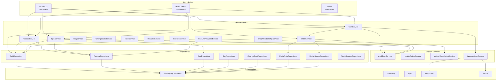

# Components

> Part of the Shark Task Manager Brownfield Analysis
> Generated: 2026-03-22
> Phase: 2 — Architecture Analysis

## Component Overview

## Major Components

### 1. CLI Layer (`internal/cli/`)

| File | Purpose | Key Responsibilities |
|------|---------|---------------------|
| `root.go` | Root command & global config | Flags, project root detection, lifecycle hooks |
| `db_global.go` | Global DB singleton | Lazy init, thread-safe, auto-cleanup |
| `services_global.go` | Service accessors | `GetTaskService()`, `GetEntityService()`, etc. |
| `output.go` | Output helpers | `OutputJSON()`, `OutputTable()`, `Success()`, `Error()` |
| `commands/` | Command handlers | 30+ thin wrappers (parse → call → format) |

**Size**: ~19 files, ~4,918 LOC
**Interfaces exposed**: Global config, service accessors
**Dependencies consumed**: All services, repositories (via services)

### 2. Service Layer (`internal/services/`)

| Service | Files | Key Methods | Dependencies |
|---------|-------|-------------|--------------|
| TaskService | ~8 | Create, Get, List, TransitionStatus, ValidateDependencies | TaskRepo, EntityService, Creator |
| FeatureService | ~6 | Create, Get, Complete, TransitionStatus, CascadeStatus | FeatureRepo, WorkflowSvc, TaskRepo |
| EpicService | ~6 | Create, Get, Complete, GetRollup, GetImpediments, Cascade | EpicRepo, WorkflowSvc, FeatureRepo |
| EntityService | ~8 | TransitionStatus (polymorphic), RecordHistory | WorkflowSvc, HistoryRepo, NoteRepo |
| FeatureProgressService | ~4 | GetProgress, GetHealth, GetWorkBreakdown, GetActionItems | FeatureRepo, TaskRepo, StatusCalc |
| EntityRelationshipService | ~4 | CreateRelationship, GetOutgoing, DetectCycle | RelationshipRepo |
| BugService | ~4 | CRUD, TransitionStatus | BugRepo, EntityService |
| ChangeCardService | ~4 | CRUD, TransitionStatus, Approve | ChangeCardRepo, EntityService |
| NoteService | ~3 | Add, List, GetByEntity | EntityNoteRepo |
| ContextService | ~3 | Get/Set/Clear context fields | All entity repos |
| ResumeService | ~3 | Resume with full context | All repos, NoteRepo |

**Size**: ~62 files, ~28,560 LOC
**Key Principle**: Fat services, thin controllers, dumb repositories

### 3. Repository Layer (`internal/repository/`)

| Repository | Purpose | Key Methods |
|------------|---------|-------------|
| TaskRepository | Task CRUD + queries | Create, GetByKey, List, UpdateStatus, SearchByFile |
| FeatureRepository | Feature CRUD | Create, GetByKey, ListByEpic, CalculateProgress |
| EpicRepository | Epic CRUD | Create, GetByKey, List |
| BugRepository | Bug CRUD | Create, GetByKey, List, UpdateStatus |
| ChangeCardRepository | Change card CRUD | Create, GetByKey, List |
| EntityNoteRepository | Polymorphic notes | CreateNote, GetByEntity, GetByType |
| EntityHistoryRepository | Audit trail | Create, GetByEntity, GetByDateRange |
| TaskHistoryRepository | Legacy task history | Create, GetByTaskID |
| WorkSessionRepository | Time tracking | Create, GetByTaskID, GetAnalytics |
| EntityRelationshipRepository | Entity links | Create, GetOutgoing, GetIncoming |

**Size**: ~77 files, ~30,133 LOC
**Key Principle**: Pure data access only — no business logic, no progress calculation

### 4. Database Layer (`internal/db/`)

| Responsibility | Details |
|----------------|---------|
| Schema | 16 tables, 40+ indexes, triggers for timestamps |
| Migrations | Version-tracked (v10), idempotent, skip-on-demand |
| PRAGMAs | WAL mode, foreign keys, 64MB cache, 5s busy timeout |
| Backends | Local SQLite (`go-sqlite3`) and Turso cloud (`libsql-client-go`) |

**Size**: ~27 files, ~11,225 LOC
**Schema version**: 10

### 5. Workflow System (`internal/workflow/`)

| Responsibility | Details |
|----------------|---------|
| Status validation | `ValidateTransition(from, to)` |
| Next status | `GetNextStatus(current)` via config |
| Status metadata | Color, phase, progress weight, responsibility |
| Multi-level | Separate flows for epic/feature/task |
| Profiles | Basic (5 statuses) and Advanced (19 statuses) |

**Size**: ~6 files, ~2,251 LOC

### 6. Configuration System (`internal/config/`)

| Responsibility | Details |
|----------------|---------|
| Config loading | `.sharkconfig.json` with Viper |
| Workflow profiles | Basic and Advanced presets |
| Action routing | Orchestrator actions per status |
| Database config | Backend selection (local/turso) |
| Template config | Template directory, viewer command |

**Size**: ~27 files, ~14,408 LOC

### 7. Infrastructure Packages

| Package | Purpose | Size |
|---------|---------|------|
| `discovery/` | Filesystem scanning for entities | 15 files, 4,418 LOC |
| `taskcreation/` | Task key generation, file creation | 7 files, 3,062 LOC |
| `templates/` | Go template rendering for entities | 9 files, 2,902 LOC |
| `fileops/` | Atomic file operations | ~4 files, ~500 LOC |
| `sync/` | File-database synchronization | ~5 files |
| `pathresolver/` | Project root auto-detection | ~3 files |
| `patterns/` | Entity key regex patterns | 16 files, 4,379 LOC |

### 8. Domain Models (`internal/models/`)

| Model | Key Fields | Purpose |
|-------|-----------|---------|
| Epic | Key, Title, Status, Priority, Slug | Top-level work unit |
| Feature | Key, EpicID, Title, Status, ProgressPct, Slug | Feature within epic |
| Task | Key, FeatureID, Title, Status, AgentType, Priority, DependsOn, Slug | Atomic work item |
| Bug | Key, Title, Status, Priority, Severity, LinkedEntity | Bug tracking |
| ChangeCard | Key, Title, Status, Priority, LinkedEntity | Change requests |
| TaskHistory | TaskID, FromStatus, ToStatus, Agent, Timestamp | Audit trail |
| EntityNote | EntityType, EntityID, NoteType, Content | Annotations |
| Idea | Key, Title, Status, ConvertedTo | Pre-promotion capture |

**Size**: ~28 files, ~3,212 LOC
**Interface**: All entities implement `Entity` interface

See also: [System Overview](system-overview.md) | [Dependencies](dependencies.md) | [Patterns](patterns.md)
