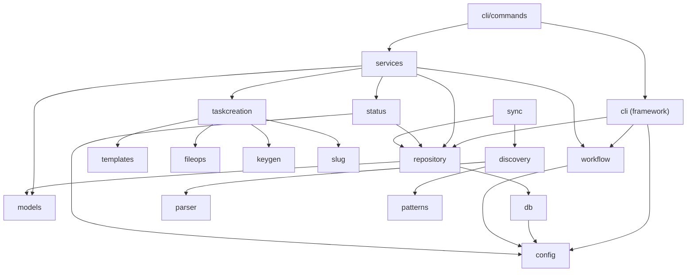

# Dependencies

> Part of the Shark Task Manager Brownfield Analysis
> Generated: 2026-03-22
> Phase: 2 — Architecture Analysis

## Internal Dependencies

### Dependency Matrix

| Source | Target | Type | Reason |
|--------|--------|------|--------|
| cli/commands | services | Compile | Business logic calls |
| cli | repository | Compile | Legacy direct access (being migrated) |
| cli | workflow | Compile | Workflow service accessor |
| cli | config | Compile | Configuration loading |
| services | repository | Compile | Data access via interfaces |
| services | workflow | Compile | Status transition validation |
| services | models | Compile | Domain types |
| services | taskcreation | Compile | Task file/key creation |
| services | status | Compile | Progress calculation |
| repository | db | Compile | Database connection |
| repository | models | Compile | Entity types |
| db | config | Compile | Cloud backend selection |
| workflow | config | Compile | Workflow configuration |
| taskcreation | templates | Compile | Entity template rendering |
| taskcreation | fileops | Compile | Atomic file writing |
| taskcreation | keygen | Compile | Key generation |
| discovery | parser | Compile | Markdown parsing |
| discovery | patterns | Compile | Entity key patterns |
| sync | discovery | Compile | Filesystem scanning |
| sync | repository | Compile | Database updates |

## External Dependencies

### Direct Dependencies (9)

| Dependency | Version | Purpose | Health |
|-----------|---------|---------|--------|
| `github.com/mattn/go-sqlite3` | v1.14.32 | SQLite driver (CGO) | Active, well-maintained |
| `github.com/tursodatabase/libsql-client-go` | v0.0.0-20251219 | Turso cloud DB client | Dev commit, not stable release |
| `github.com/spf13/cobra` | v1.10.2 | CLI framework | Active, industry standard |
| `github.com/spf13/viper` | v1.21.0 | Configuration management | Active, widely used |
| `github.com/pterm/pterm` | v0.12.82 | Terminal UI/output | Active, feature-rich |
| `github.com/stretchr/testify` | v1.11.1 | Test assertions | Active, standard Go testing |
| `gopkg.in/yaml.v3` | v3.0.1 | YAML parsing | Stable, widely used |
| `golang.org/x/term` | v0.32.0 | Terminal control | Official Go extension |
| `golang.org/x/text` | v0.28.0 | Unicode handling | Official Go extension |

### Notable Indirect Dependencies

| Dependency | Via | Purpose |
|-----------|-----|---------|
| `github.com/antlr4-go/antlr/v4` | libsql-client-go | SQL parsing for Turso |
| `github.com/coder/websocket` | libsql-client-go | WebSocket for Turso |
| `github.com/spf13/afero` | viper | Filesystem abstraction |
| `github.com/fsnotify/fsnotify` | viper | Config file watching |
| `atomicgo.dev/cursor` | pterm | Terminal cursor control |
| `atomicgo.dev/keyboard` | pterm | Keyboard input |
| `github.com/gookit/color` | pterm | ANSI color output |

### Dependency Concerns

| Concern | Dependency | Severity | Detail |
|---------|-----------|----------|--------|
| Unstable version | libsql-client-go | Medium | Using dev commit (v0.0.0-...), not a tagged release |
| CGO requirement | go-sqlite3 | Low | Requires C compiler for cross-compilation |
| Large transitive tree | viper | Low | Pulls in afero, fsnotify, mapstructure, etc. |

## Build Dependencies

| Tool | Version | Purpose |
|------|---------|---------|
| golangci-lint | v2.9.0 | Static analysis (auto-installed) |
| GoReleaser | v2.x | Cross-platform release builds |
| Air | latest | Hot-reload development server |

See also: [System Overview](system-overview.md) | [Components](components.md) | [Patterns](patterns.md)
