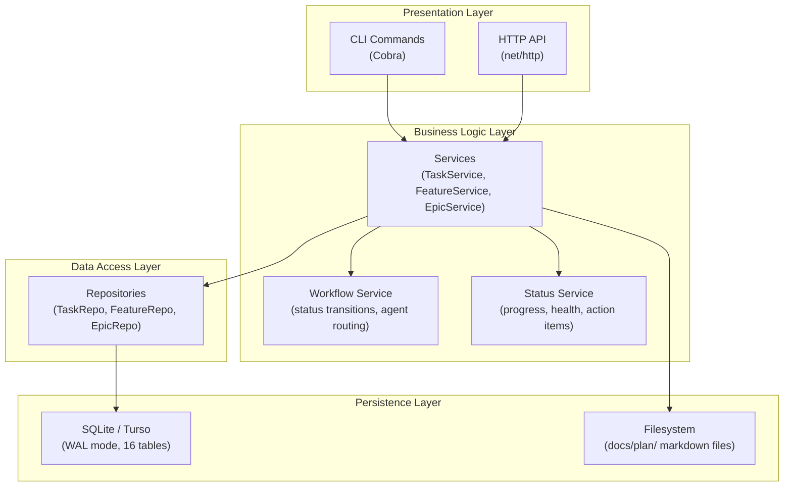
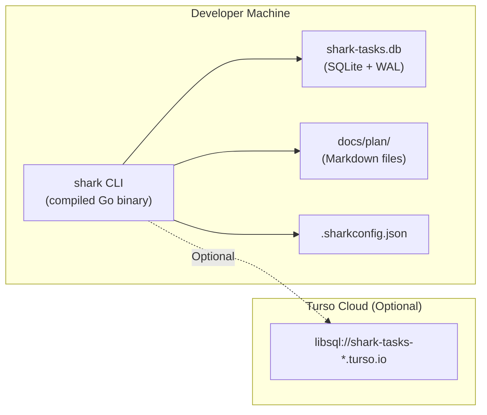

# System Overview

> Part of the Shark Task Manager Brownfield Analysis
> Generated: 2026-03-22
> Phase: 2 — Architecture Analysis

## Architecture Style

Shark Task Manager follows a **Clean Layered Architecture** with four distinct layers and strict dependency rules (dependencies only flow downward):

## Deployment Topology

Shark is a **single-binary CLI tool** with no containerization or complex deployment:

**Distribution**: Single compiled binary via GitHub Releases (GoReleaser). Supports Linux (amd64/arm64), macOS (amd64/arm64), Windows (amd64).

## Technology Choices

| Decision | Choice | Rationale |
|----------|--------|-----------|
| Language | Go 1.23.4 | Fast compilation, single binary, strong typing |
| Database | SQLite + WAL | Zero config, embedded, portable |
| Cloud DB | Turso/libSQL | SQLite-compatible cloud for multi-machine sync |
| CLI Framework | Cobra | Industry standard for Go CLIs |
| Config | Viper | Multi-format config, env var support |
| Terminal UI | pterm | Rich terminal output without TUI complexity |
| Testing | testify | Standard Go testing with assertions |
| Build | Make + GoReleaser | Simple builds, cross-platform releases |

## Key Architectural Decisions

1. **Service Layer as business logic boundary** — All business rules, workflow validation, and orchestration live in services. Commands and repositories contain zero business logic.

2. **Config-driven workflows** — Status flows, agent routing, progress weights, and colors are defined in `.sharkconfig.json`, not hardcoded. Enables basic/advanced profiles without code changes.

3. **Dual database backend** — Local SQLite for single-machine use, Turso cloud for team synchronization. Same codebase, runtime switchable via config.

4. **Entity hierarchy with polymorphic interface** — Epic → Feature → Task hierarchy with Bug and ChangeCard as standalone entities. All implement common `Entity` interface.

5. **Dual key format** — Numeric keys (E07-F01-001) plus human-readable slugged keys (E07-F01-001-implement-jwt). Both work in all commands.

6. **Filesystem as secondary store** — Markdown files in `docs/plan/` for entity specifications. Database is source of truth for status; files are output artifacts.

See also: [Components](components.md) | [Dependencies](dependencies.md) | [Patterns](patterns.md)
