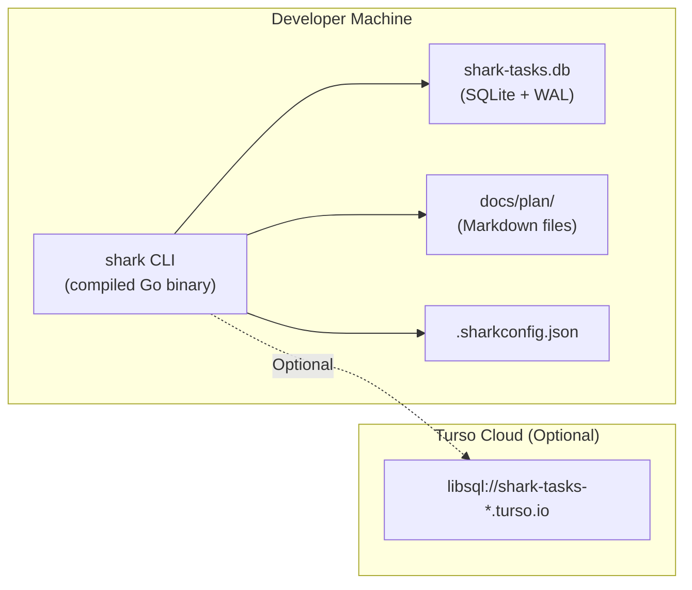

# System Overview

> Part of the Shark Task Manager Brownfield Analysis
<<<<<<< Updated upstream
> Generated: 2026-03-22
=======
> Generated: 2026-03-20
>>>>>>> Stashed changes
> Phase: 2 — Architecture Analysis

## Architecture Style

<<<<<<< Updated upstream
Shark Task Manager follows a **Clean Layered Architecture** with four distinct layers and strict dependency rules (dependencies only flow downward):

```mermaid
graph TD
    subgraph Presentation["Presentation Layer"]
        CLI["CLI Commands<br/>(Cobra)"]
        HTTP["HTTP API<br/>(net/http)"]
    end

    subgraph Business["Business Logic Layer"]
        SVC["Services<br/>(TaskService, FeatureService, EpicService)"]
        WF["Workflow Service<br/>(status transitions, agent routing)"]
        ST["Status Service<br/>(progress, health, action items)"]
    end

    subgraph Data["Data Access Layer"]
        REPO["Repositories<br/>(TaskRepo, FeatureRepo, EpicRepo)"]
    end

    subgraph Persistence["Persistence Layer"]
        DB["SQLite / Turso<br/>(WAL mode, 16 tables)"]
        FS["Filesystem<br/>(docs/plan/ markdown files)"]
    end

    CLI --> SVC
    HTTP --> SVC
    SVC --> WF
    SVC --> ST
    SVC --> REPO
    REPO --> DB
    SVC --> FS
=======
Shark Task Manager follows a **layered monolith** architecture with strict separation of concerns across four primary layers:

```
Entry Points → Service Layer → Repository Layer → Database Layer
```

The system is a single deployable binary (CLI tool) with an optional HTTP API server. All layers communicate synchronously via direct method calls — there is no message bus, event system, or async processing.

## Architecture Diagram

```mermaid
graph TD
    subgraph "Entry Points"
        CLI["CLI Binary<br/>(cmd/shark/)"]
        HTTP["HTTP API Server<br/>(cmd/server/)"]
        DEMO["Demo Runner<br/>(cmd/demo/)"]
    end

    subgraph "CLI Framework"
        ROOT["Root Command<br/>(cli/root.go)"]
        CMDS["68 Command Files<br/>(cli/commands/)"]
        GLOBALS["Global Accessors<br/>(cli/services_global.go)"]
        DBGLOBAL["DB Singleton<br/>(cli/db_global.go)"]
        WFGLOBAL["Workflow Singleton<br/>(cli/workflow_global.go)"]
    end

    subgraph "Service Layer"
        ENTITY["EntityService<br/>(shared transitions)"]
        TASK_SVC["TaskService"]
        FEAT_SVC["FeatureService"]
        EPIC_SVC["EpicService"]
        BUG_SVC["BugService"]
        CC_SVC["ChangeCardService"]
        NOTE_SVC["NoteService"]
        CTX_SVC["ContextService"]
        RESUME_SVC["ResumeService"]
        REGISTRY["EntityRegistry<br/>(polymorphic access)"]
    end

    subgraph "Repository Layer"
        TASK_REPO["TaskRepository"]
        FEAT_REPO["FeatureRepository"]
        EPIC_REPO["EpicRepository"]
        BUG_REPO["BugRepository"]
        CC_REPO["ChangeCardRepository"]
        NOTE_REPO["EntityNoteRepository"]
        DOC_REPO["DocumentRepository"]
        IDEA_REPO["IdeaRepository"]
    end

    subgraph "Infrastructure"
        DB_PKG["Database Package<br/>(internal/db/)"]
        WF_PKG["Workflow Package<br/>(internal/workflow/)"]
        CFG_PKG["Config Package<br/>(internal/config/)"]
        TMPL["Embedded Templates<br/>(shark-templates/)"]
    end

    subgraph "Storage"
        SQLITE["SQLite<br/>(shark-tasks.db)"]
        TURSO["Turso Cloud<br/>(libsql)"]
        FS["Filesystem<br/>(docs/plan/**/*.md)"]
    end

    CLI --> ROOT
    HTTP --> GLOBALS
    DEMO --> GLOBALS
    ROOT --> CMDS
    CMDS --> GLOBALS
    GLOBALS --> TASK_SVC & FEAT_SVC & EPIC_SVC & NOTE_SVC & CTX_SVC & RESUME_SVC
    GLOBALS --> DBGLOBAL & WFGLOBAL
    GLOBALS --> REGISTRY

    TASK_SVC --> ENTITY
    FEAT_SVC --> ENTITY
    EPIC_SVC --> ENTITY
    BUG_SVC --> ENTITY
    CC_SVC --> ENTITY
    ENTITY --> WF_PKG

    TASK_SVC --> TASK_REPO
    FEAT_SVC --> FEAT_REPO
    EPIC_SVC --> EPIC_REPO
    BUG_SVC --> BUG_REPO
    CC_SVC --> CC_REPO
    NOTE_SVC --> NOTE_REPO
    REGISTRY --> TASK_REPO & FEAT_REPO & EPIC_REPO & BUG_REPO & CC_REPO

    TASK_REPO & FEAT_REPO & EPIC_REPO & BUG_REPO & CC_REPO & NOTE_REPO & DOC_REPO --> DB_PKG
    DB_PKG --> SQLITE
    DB_PKG --> TURSO

    DBGLOBAL --> DB_PKG
    WFGLOBAL --> WF_PKG
    WF_PKG --> CFG_PKG
    CFG_PKG --> FS
>>>>>>> Stashed changes
```

## Deployment Topology

<<<<<<< Updated upstream
Shark is a **single-binary CLI tool** with no containerization or complex deployment:



**Distribution**: Single compiled binary via GitHub Releases (GoReleaser). Supports Linux (amd64/arm64), macOS (amd64/arm64), Windows (amd64).
=======
Shark is deployed as a **local CLI tool** — there is no server infrastructure, containers, or orchestration:

| Component | Runtime | Notes |
|-----------|---------|-------|
| `shark` binary | User's machine | Single Go binary, ~15-20MB |
| `shark-tasks.db` | Local filesystem | SQLite WAL mode |
| Turso (optional) | Cloud | `libsql://` endpoint |
| `docs/plan/` | Local filesystem | Markdown entity files |
| `.sharkconfig.json` | Project root | Configuration |

**Cross-platform**: Builds for Linux (amd64/arm64), macOS (amd64/arm64), Windows (amd64). CGO enabled for Linux only (SQLite FTS5); macOS/Windows use pure-Go SQLite fallback.
>>>>>>> Stashed changes

## Technology Choices

| Decision | Choice | Rationale |
|----------|--------|-----------|
<<<<<<< Updated upstream
| Language | Go 1.23.4 | Fast compilation, single binary, strong typing |
| Database | SQLite + WAL | Zero config, embedded, portable |
| Cloud DB | Turso/libSQL | SQLite-compatible cloud for multi-machine sync |
| CLI Framework | Cobra | Industry standard for Go CLIs |
| Config | Viper | Multi-format config, env var support |
| Terminal UI | pterm | Rich terminal output without TUI complexity |
| Testing | testify | Standard Go testing with assertions |
| Build | Make + GoReleaser | Simple builds, cross-platform releases |

## Key Architectural Decisions

1. **Service Layer as business logic boundary** — All business rules, workflow validation, and orchestration live in services. Commands and repositories contain zero business logic.

2. **Config-driven workflows** — Status flows, agent routing, progress weights, and colors are defined in `.sharkconfig.json`, not hardcoded. Enables basic/advanced profiles without code changes.

3. **Dual database backend** — Local SQLite for single-machine use, Turso cloud for team synchronization. Same codebase, runtime switchable via config.

4. **Entity hierarchy with polymorphic interface** — Epic → Feature → Task hierarchy with Bug and ChangeCard as standalone entities. All implement common `Entity` interface.

5. **Dual key format** — Numeric keys (E07-F01-001) plus human-readable slugged keys (E07-F01-001-implement-jwt). Both work in all commands.

6. **Filesystem as secondary store** — Markdown files in `docs/plan/` for entity specifications. Database is source of truth for status; files are output artifacts.
=======
| Language | Go 1.23 | Static typing, single binary, fast compilation |
| CLI Framework | Cobra | Industry standard, auto-help, nested subcommands |
| Configuration | Viper | YAML/JSON/env var support, layered config |
| Database | SQLite | Zero-dependency, portable, WAL for concurrency |
| Cloud DB | Turso (libsql) | SQLite-compatible cloud offering |
| DI Pattern | Constructor injection | No framework, compile-time safety |
| Output | pterm | Rich terminal output (tables, colors, spinners) |
| Testing | testify | Assertion library, no mocking framework |
| Release | GoReleaser | Multi-platform builds, GitHub Releases |

## Key Architectural Decisions

1. **Fat services, thin controllers, dumb repositories** — Business logic exclusively in service layer; CLI commands are thin wrappers (parse → call → format); repositories do pure data access
2. **Config-driven workflows** — Status flows, agent routing, and metadata defined in `.sharkconfig.json`, not hardcoded
3. **Interface-based DI** — Repository interfaces defined at point of use (consumer-side); concrete implementations satisfy interfaces implicitly
4. **Global singletons with lazy init** — DB connection and workflow service are `sync.Once` singletons; services created per-call
5. **Dual key format** — Both numeric (`E07-F01-001`) and slug-based (`E07-F01-001-task-name`) keys for human readability
6. **Embedded templates** — `//go:embed` for portable template distribution without external file dependencies

---
>>>>>>> Stashed changes

See also: [Components](components.md) | [Dependencies](dependencies.md) | [Patterns](patterns.md)
