# Decision Logic

> Part of the Shark Task Manager Brownfield Analysis
<<<<<<< Updated upstream
> Generated: 2026-03-22
> Phase: 4 — Behavior Analysis

## Status Transition Decision Tree

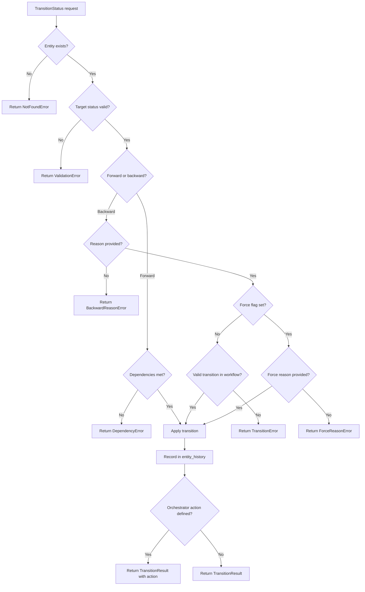

## Entity Key Auto-Detection

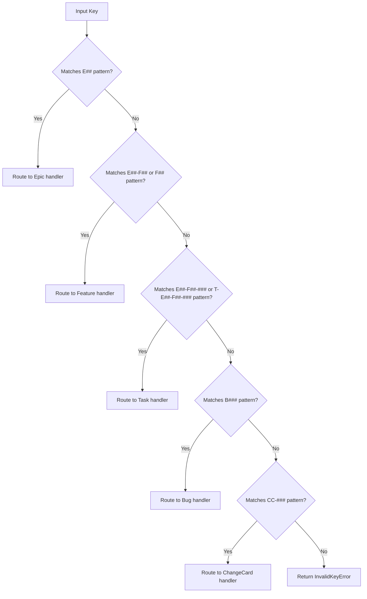

## Dual Key Lookup Strategy

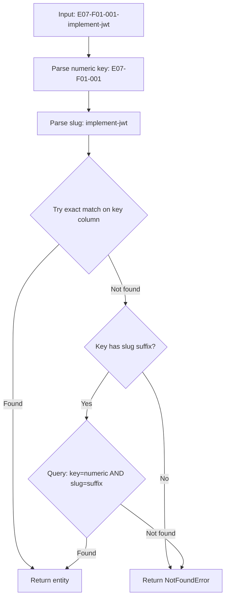

## Progress Calculation Logic

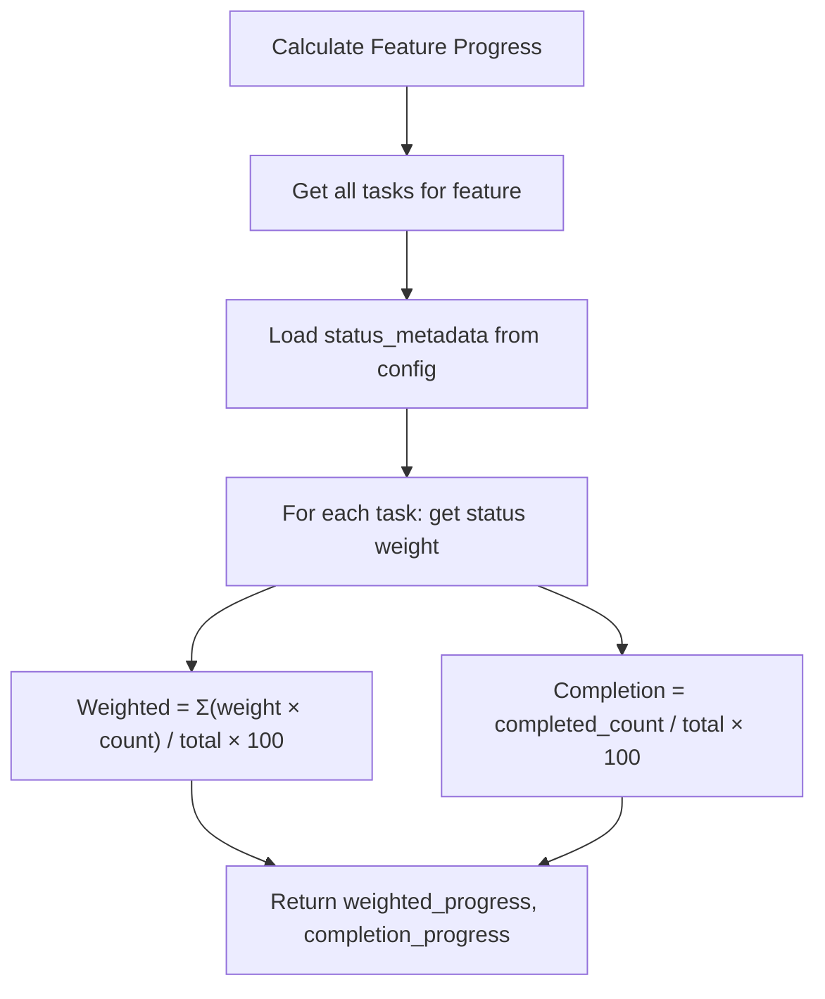

## Health Status Logic

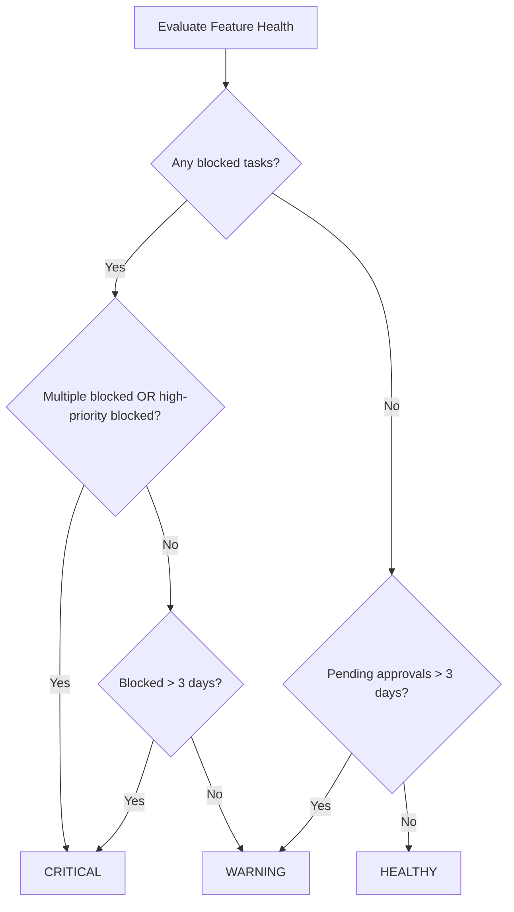

## Database Backend Selection

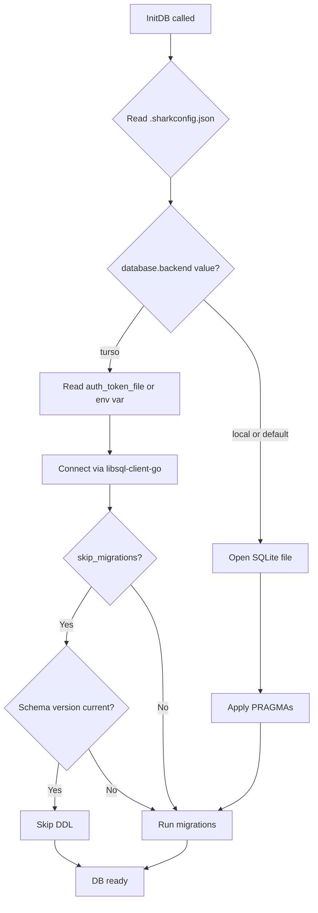

## Workflow Profile Selection

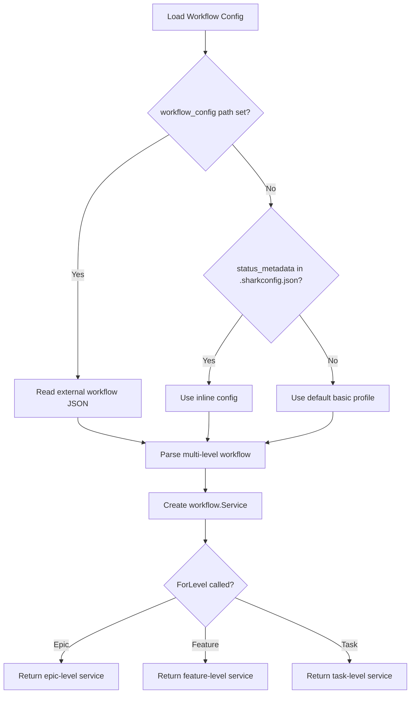

## Project Root Detection

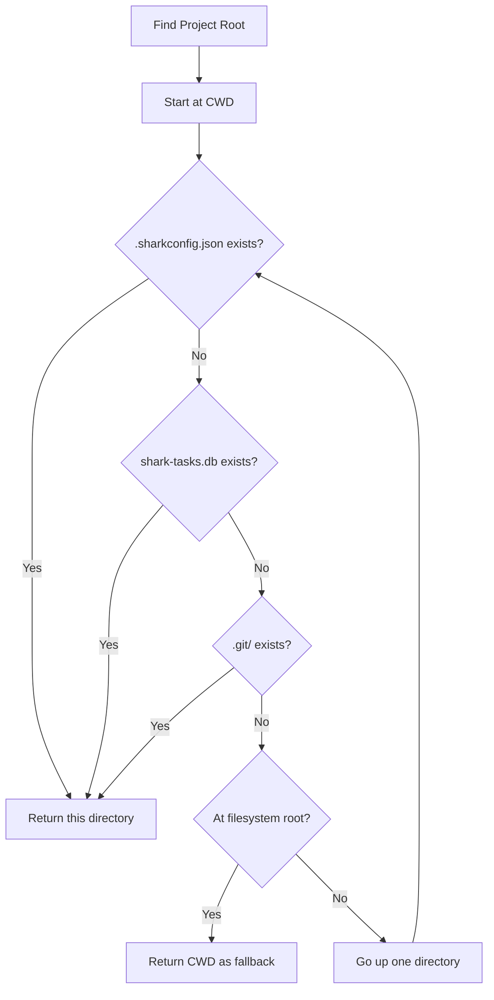

See also: [Business Logic](business-logic.md) | [Workflows](workflows.md) | [Error Handling](error-handling.md)
=======
> Generated: 2026-03-20
> Phase: 4 — Behavior Analysis

## Key Decision Points

### 1. Entity Type Detection from Key

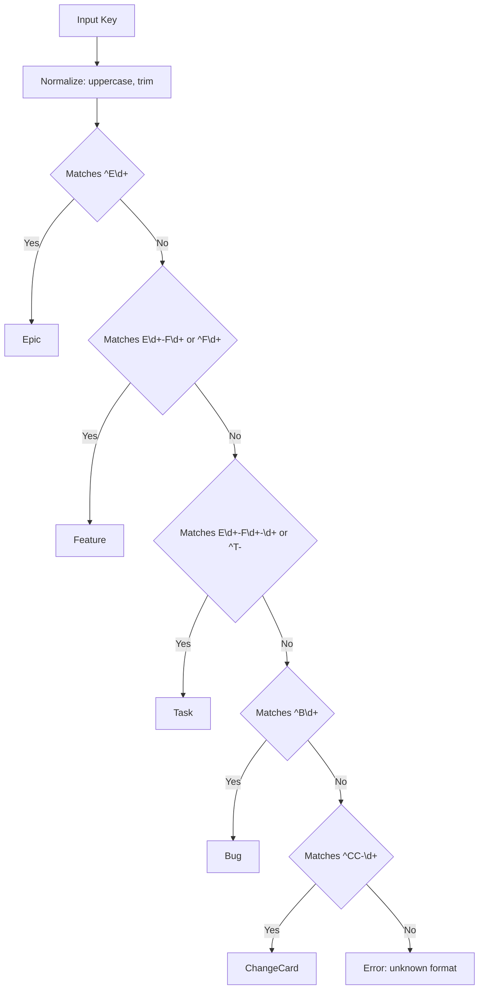

Source: `internal/keys/`, `internal/cli/commands/get.go`

### 2. Status Transition Validation

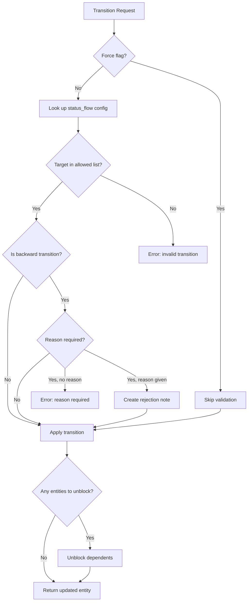

Source: `internal/services/entity_service.go`, `internal/workflow/service.go`

### 3. Database Backend Selection

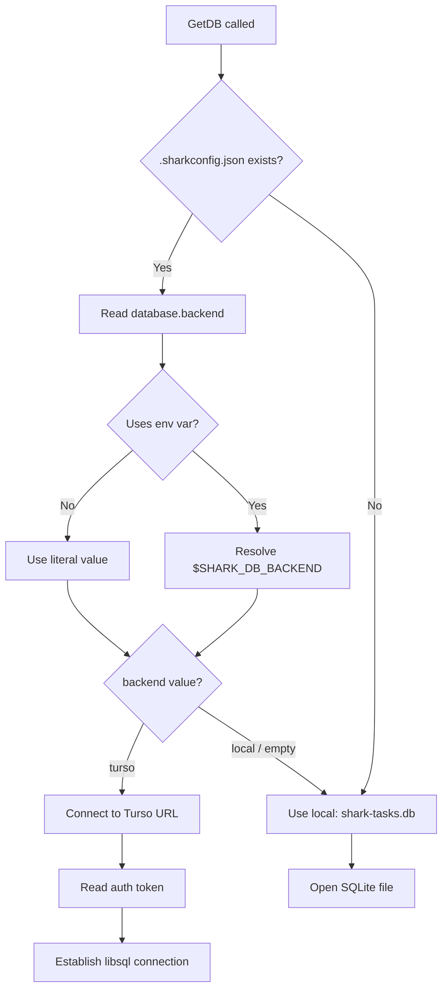

Source: `internal/cli/db_global.go`, `internal/config/`

### 4. Workflow Profile Resolution

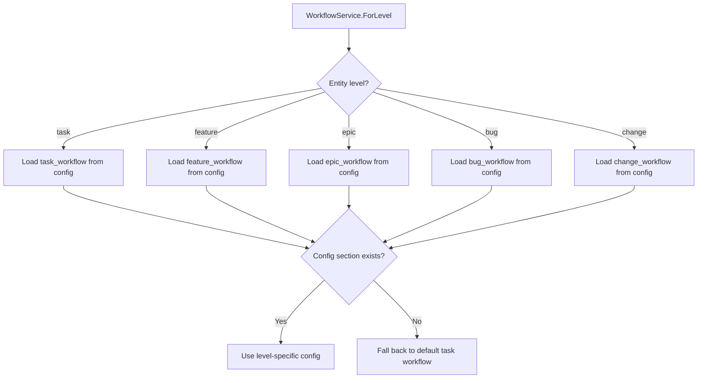

Source: `internal/workflow/service.go`

### 5. Feature Health Assessment

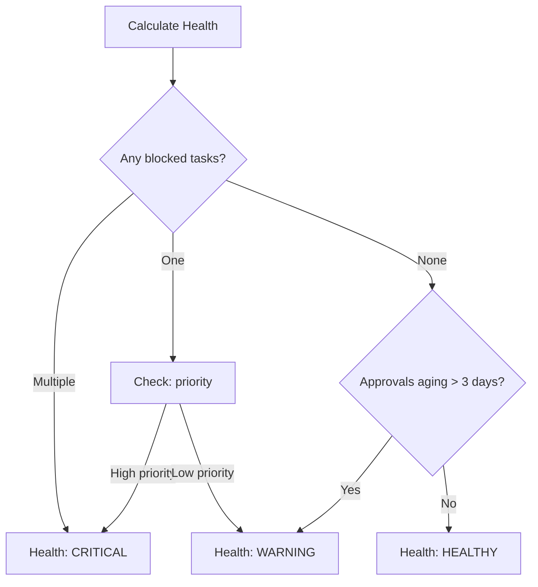

Source: `internal/status/`

### 6. Configuration-Driven Behavior

The system uses `.sharkconfig.json` to drive multiple behavioral decisions:

| Config Key | Drives | Decision |
|-----------|--------|----------|
| `status_flow` | Valid transitions | Which statuses can follow which |
| `status_metadata.phase` | Progress weighting | How much a status contributes to progress |
| `status_metadata.responsibility` | Work breakdown | Who owns tasks in this status |
| `status_metadata.blocks_feature` | Action items | Whether status requires attention |
| `status_metadata.color` | Display | Terminal output coloring |
| `require_rejection_reason` | Validation | Whether backward transitions need reasons |
| `interactive_mode` | UX | Whether to prompt for confirmation |

---

See also: [Business Logic](business-logic.md) | [Workflows](workflows.md) | [Activity Diagrams](../diagrams/behavioral/activity-diagrams.md)
>>>>>>> Stashed changes
