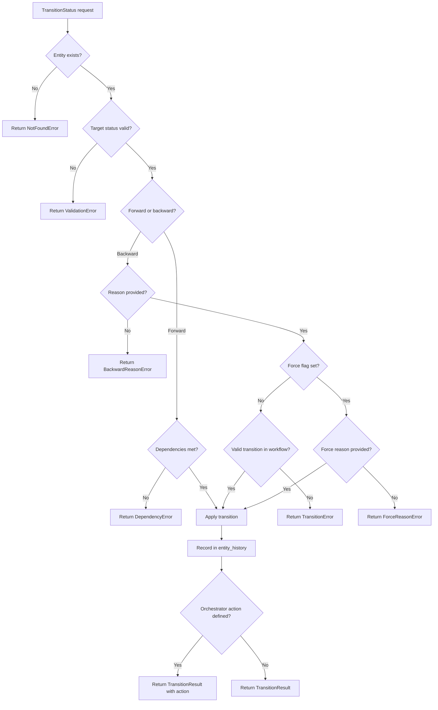
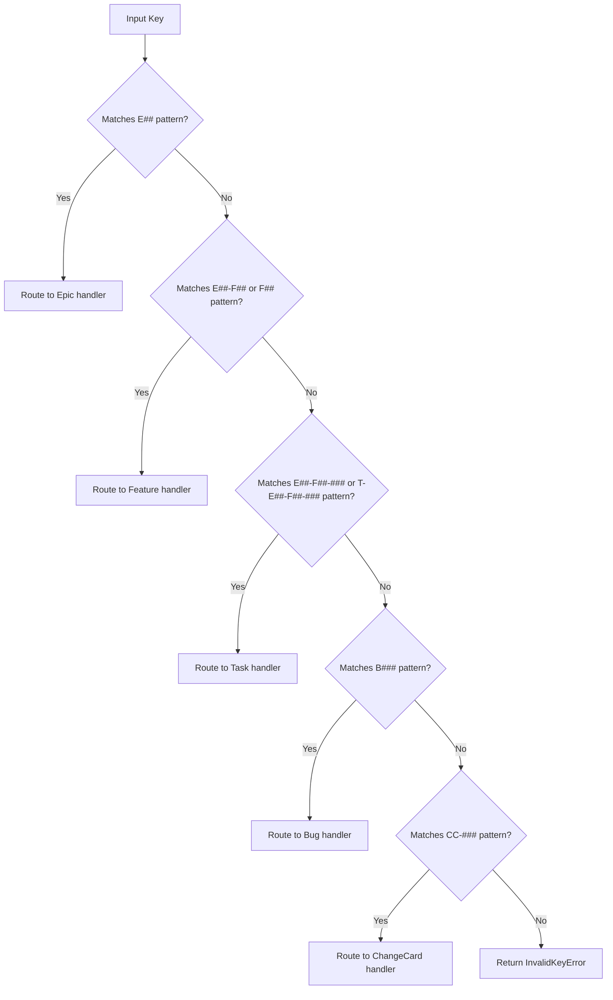
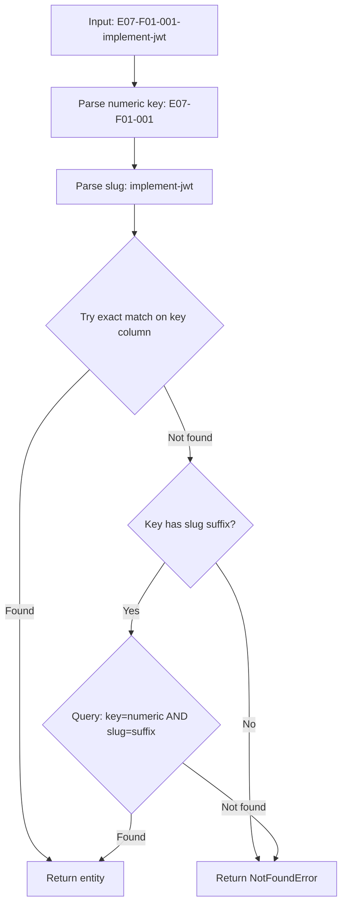
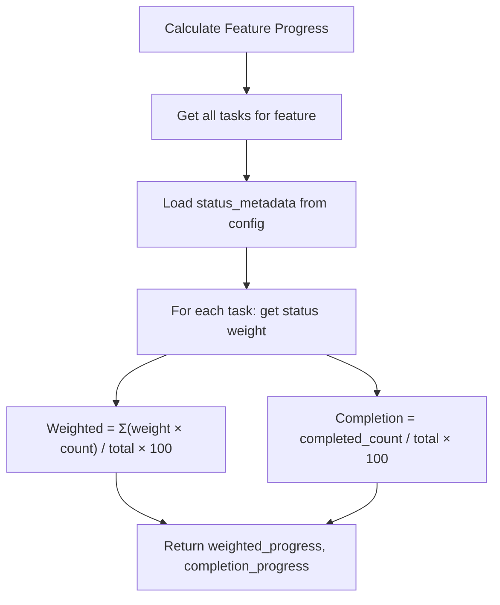
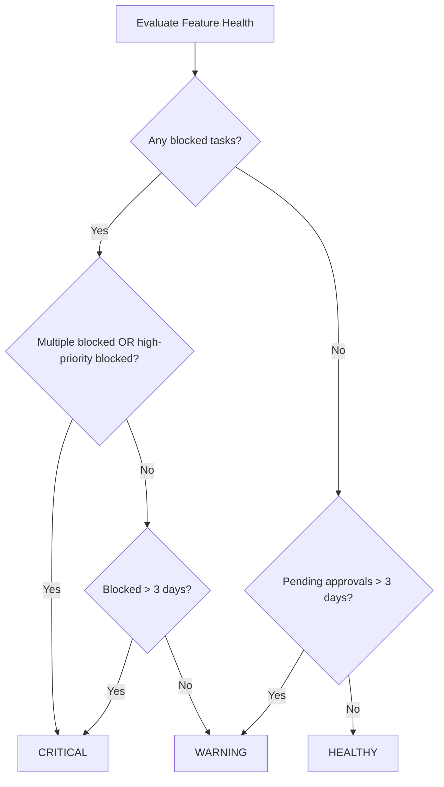
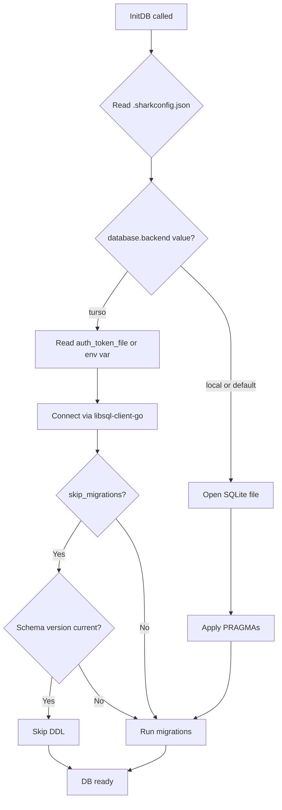
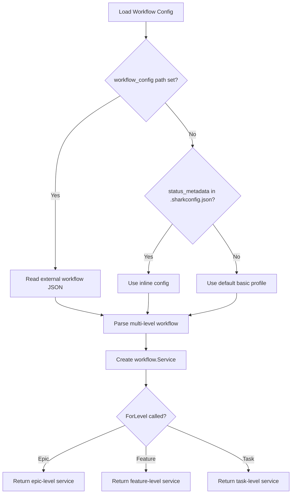
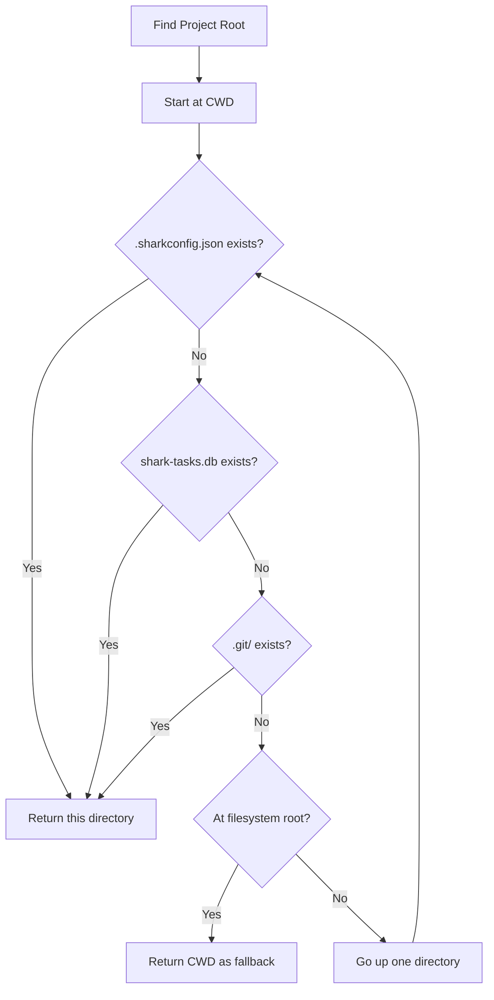

# Decision Logic

> Part of the Shark Task Manager Brownfield Analysis
> Generated: 2026-03-22
> Phase: 4 — Behavior Analysis

## Status Transition Decision Tree

## Entity Key Auto-Detection

## Dual Key Lookup Strategy

## Progress Calculation Logic

## Health Status Logic

## Database Backend Selection

## Workflow Profile Selection

## Project Root Detection

See also: [Business Logic](business-logic.md) | [Workflows](workflows.md) | [Error Handling](error-handling.md)
