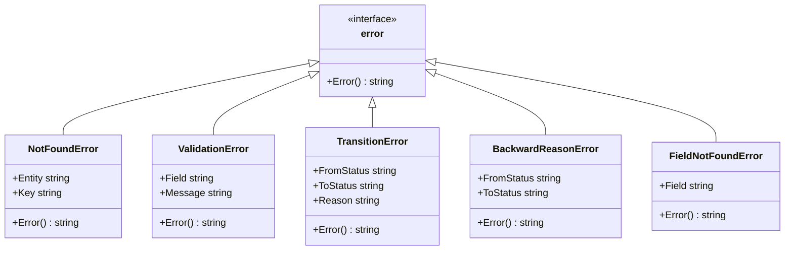

# Error Handling

> Part of the Shark Task Manager Brownfield Analysis
<<<<<<< Updated upstream
> Generated: 2026-03-22
> Phase: 4 — Behavior Analysis

## Error Hierarchy



## Exit Code Mapping

| Code | Meaning | Error Type | Example |
|------|---------|-----------|---------|
| 0 | Success | nil | Command completed |
| 1 | Not found | NotFoundError | `shark get E99` |
| 2 | Database error | Generic error | Connection failure |
| 3 | Invalid state | TransitionError, ValidationError | Invalid workflow transition |
| 4 | Field not found | FieldNotFoundError | `--field nonexistent` |

## Error Wrapping Pattern

Errors are wrapped with context at each architectural layer:

```
Database Layer:
  "UNIQUE constraint failed: tasks.key"

Repository Layer:
  "failed to create task: UNIQUE constraint failed: tasks.key"

Service Layer:
  "failed to create task in epic E07: failed to create task: UNIQUE constraint failed"

Command Layer:
  "unable to create task: failed to create task in epic E07: ..."
```

**Pattern**: `fmt.Errorf("context description: %w", err)` using Go's error wrapping

## Sentinel Errors

Defined in `internal/models/validation.go` and `internal/repository/`:

```go
var (
    ErrInvalidEpicKey     = errors.New("invalid epic key format: must match ^E\\d{2}$")
    ErrInvalidTaskStatus  = errors.New("invalid task status")
    ErrInvalidAgentType   = errors.New("invalid agent type: cannot be empty")
    ErrInvalidPriority    = errors.New("invalid priority: must be between 1 and 10")
    ErrCircularDependency = errors.New("circular dependency detected")
    ErrSelfRelationship   = errors.New("task cannot have a relationship with itself")
)
```

## Validation Patterns

### Model Layer (Structural)

Location: `internal/models/validation.go`

- Non-empty title check
- Priority range (1-10)
- Key format regex validation
- Status non-empty check
- **Does NOT validate**: status against workflow config (that's the service layer's job)

### Service Layer (Business Rules)

Location: `internal/services/*.go`

- Status transition validity via `workflow.Service`
- Dependency satisfaction check
- Entity existence validation (epic exists, feature exists)
- Backward transition reason requirement
- Force flag reason requirement

### Database Layer (Constraints)

Location: `internal/db/db.go` (schema)

- UNIQUE constraints on entity keys
- FOREIGN KEY cascade (epic → features → tasks)
- CHECK constraints on priority, status values
- NOT NULL on required fields

## Error Response Formats

### CLI Error Output

=======
> Generated: 2026-03-20
> Phase: 4 — Behavior Analysis

## Error Propagation Chain

```
Database → Repository → Service → CLI Command → User
   SQL error    wrapped      business     formatted      displayed
                context      context      as JSON/text   to terminal
```

## Exit Codes

| Code | Meaning | When |
|------|---------|------|
| 0 | Success | Operation completed |
| 1 | Not found / general error | Entity doesn't exist, or Cobra error |
| 2 | Database error | Connection failure, query error |
| 3 | Invalid state | Invalid status transition, business rule violation |
| 4 | Field not found | `--field` flag references non-existent field |

Source: `cmd/shark/main.go`, `internal/cli/commands/errors.go`

## Error Types

### Custom Error Types

| Type | Package | Used For |
|------|---------|----------|
| `FieldNotFoundError` | `internal/cli/` | `--field` extraction failure (exit code 4) |
| `CLIError` | `internal/cli/` | Structured JSON error output |

### Error Wrapping Pattern

Each layer adds context:
```go
// Repository: technical context
"failed to get task: sql: no rows in result set"

// Service: business context
"failed to start task E07-F01-001: failed to get task: sql: no rows"

// Command: user-facing context
"Error: unable to start task: failed to start task E07-F01-001: ..."
```

### Workflow Errors

Status transition failures return descriptive errors:
- `"invalid transition from 'todo' to 'completed'"`
- `"rejection reason required for backward transition"`
- `"task dependencies not met: E07-F01-001 not completed"`

## Error Response Formats

### CLI (Text Mode)
>>>>>>> Stashed changes
```
Error: task not found: E07-F01-999
```

<<<<<<< Updated upstream
### CLI JSON Error Output (--json mode)

```json
{
  "error": "task not found: E07-F01-999"
}
```

### HTTP Error Response (planned)

```json
{
  "error": "Not Found",
  "message": "Task not found: E07-F01-999"
}
```

## Recovery Patterns

| Scenario | Pattern | Location |
|----------|---------|----------|
| Transaction failure | `defer tx.Rollback()` + explicit Commit | Service methods |
| DB connection failure | Panic (fail-fast for CLI) | `cli/db_global.go` |
| File write failure | Atomic write with O_EXCL | `fileops/writer.go` |
| Config load failure | Fall back to defaults | `config/config.go` |
| Workflow config missing | Use basic profile | `workflow/service.go` |
| Optional dependency nil | Graceful degradation (skip) | Service constructors |

## Logging Patterns

- **Verbose mode** (`--verbose`): Debug-level logging via `log.Printf`
- **Normal mode**: Errors only via `cli.Error()`
- **JSON mode**: Errors as JSON objects
- **No structured logging**: Uses standard `log` package, not structured logger

See also: [Business Logic](business-logic.md) | [Workflows](workflows.md) | [Decision Logic](decision-logic.md)
=======
### CLI (JSON Mode)
```json
{
  "error": {
    "code": "not_found",
    "message": "task not found: E07-F01-999"
  }
}
```

Source: `internal/cli/root.go` — `ErrorJSON()` function

## Validation Layers

| Layer | Validates | Example |
|-------|-----------|---------|
| **Cobra** | Argument count, flag types | `cobra.ExactArgs(1)` |
| **Models** | Structural validity | Title non-empty, priority 1-10 |
| **Services** | Business rules | Valid status transitions, dependencies met |
| **Database** | Constraints | UNIQUE, CHECK, FOREIGN KEY |

## Recovery Patterns

### Transaction Rollback
Services that manage transactions use `defer tx.Rollback()`:
```go
tx, err := s.db.BeginTx(ctx, nil)
if err != nil { return err }
defer tx.Rollback() // Automatic rollback if not committed

// ... operations ...

return tx.Commit()
```

### Graceful Degradation
Optional service dependencies (note repo, creator service) are nil-checked:
```go
if s.noteRepo != nil && reason != "" {
    _ = s.noteRepo.CreateRejectionNote(ctx, ...)
}
```

### Database Integrity
- `CheckIntegrity()` function runs `PRAGMA integrity_check`
- Foreign keys prevent orphaned records
- `ON DELETE CASCADE` maintains referential integrity
- WAL mode prevents corruption from concurrent access

## Logging Patterns

- **Verbose mode** (`--verbose`): Debug logging to stderr
- **No structured logging framework**: Uses `fmt.Fprintf(os.Stderr, ...)`
- **Audit logging**: Status changes recorded in `task_history` table
- **No log files**: Output goes to terminal only

---

See also: [Business Logic](business-logic.md) | [Decision Logic](decision-logic.md) | [Security Patterns](../analysis/security-patterns.md)
>>>>>>> Stashed changes
