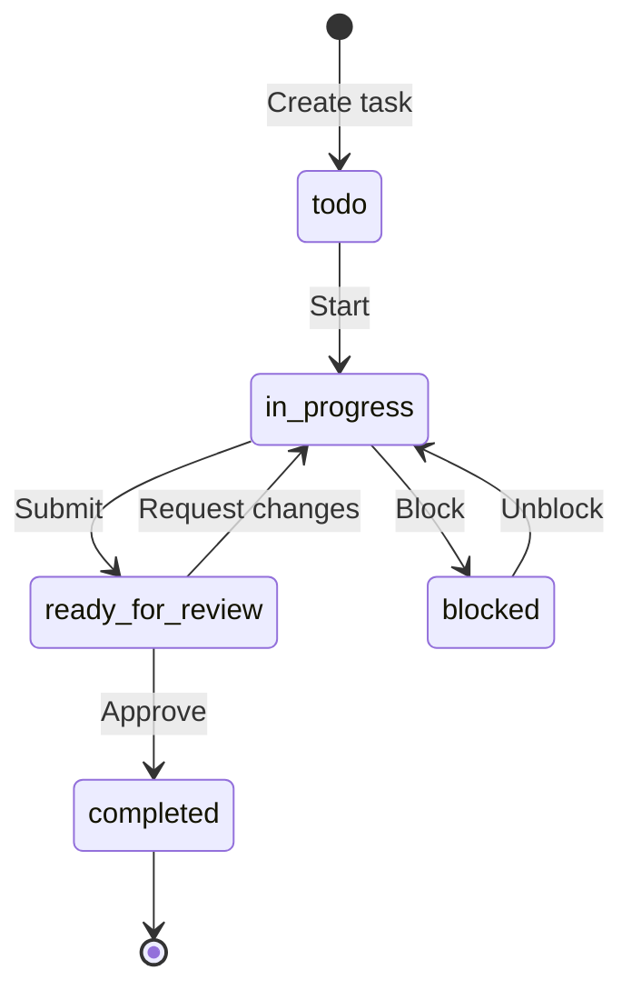
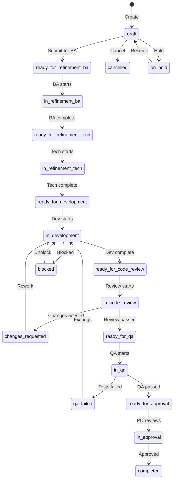
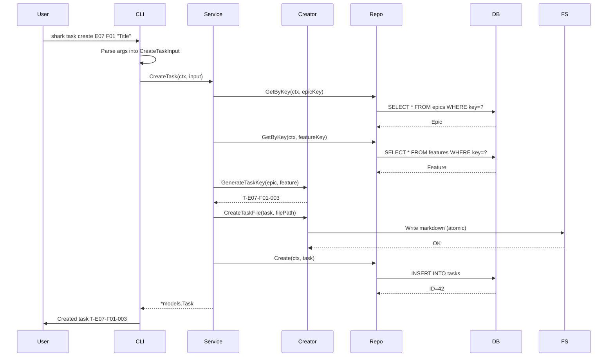
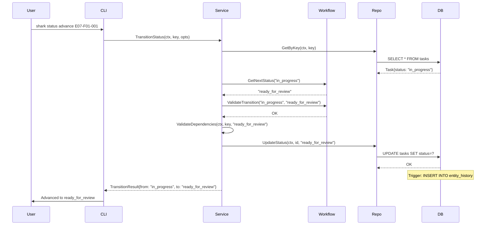
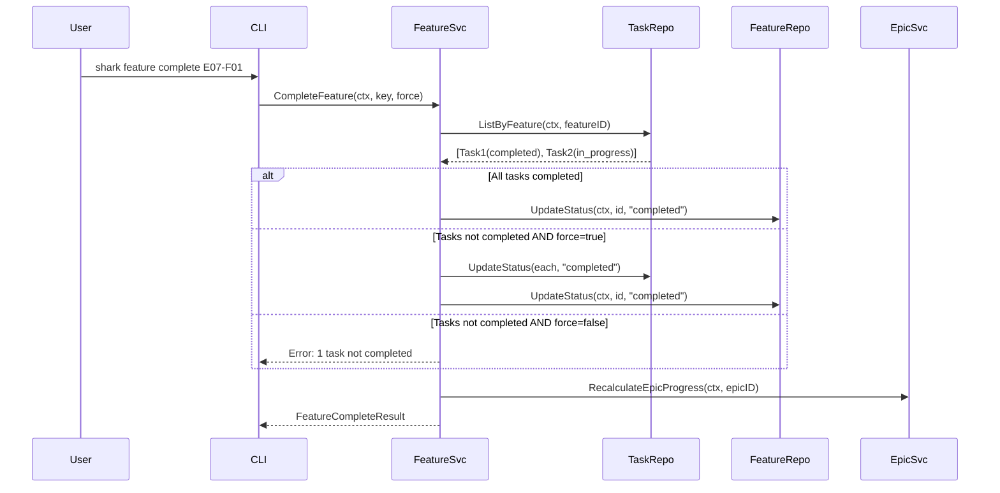
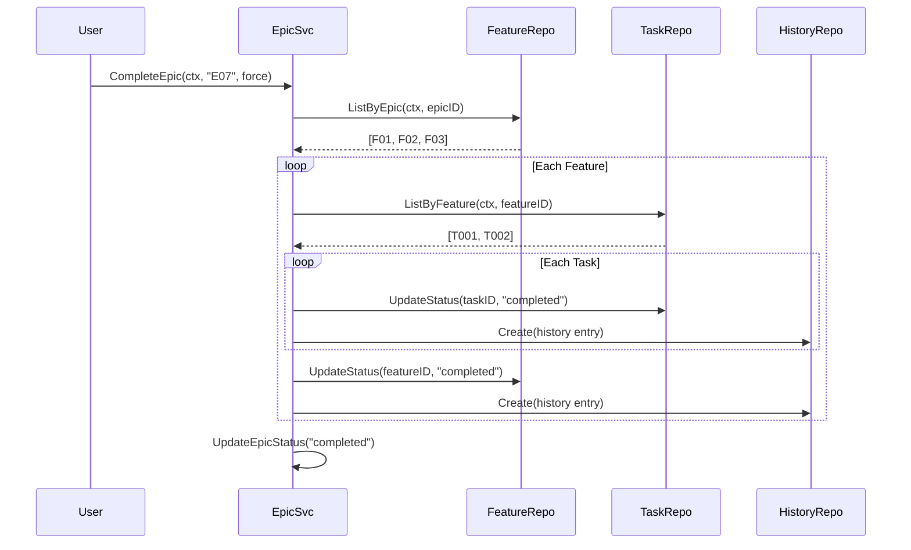
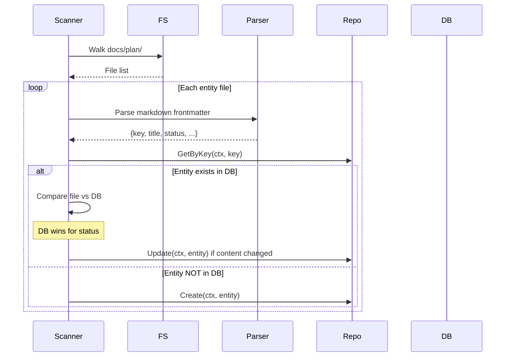

# Workflows

> Part of the Shark Task Manager Brownfield Analysis
> Generated: 2026-03-22
> Phase: 4 — Behavior Analysis

## Task Lifecycle (Basic Profile)

## Task Lifecycle (Advanced Profile)

## Entity Creation Workflow

## Status Transition Workflow

## Feature Completion Workflow

## Epic Cascade Workflow

## File Discovery & Sync Workflow

See also: [Business Logic](business-logic.md) | [Decision Logic](decision-logic.md) | [Error Handling](error-handling.md)
