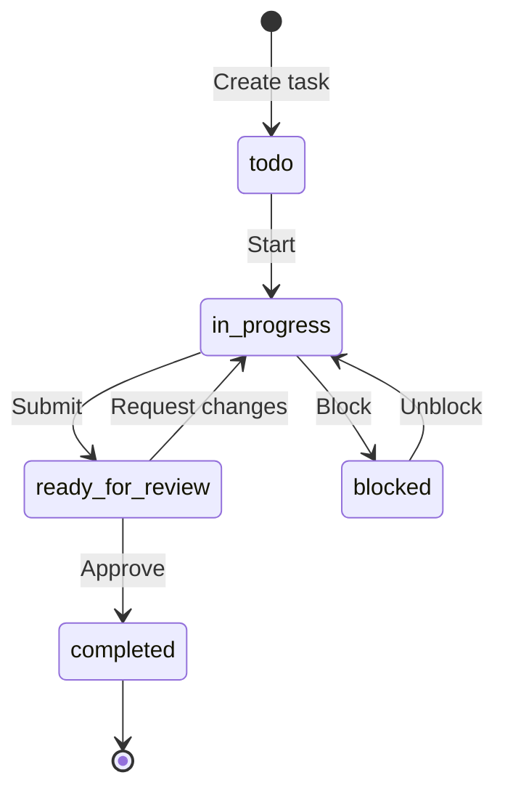
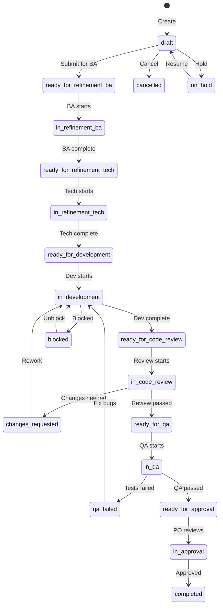
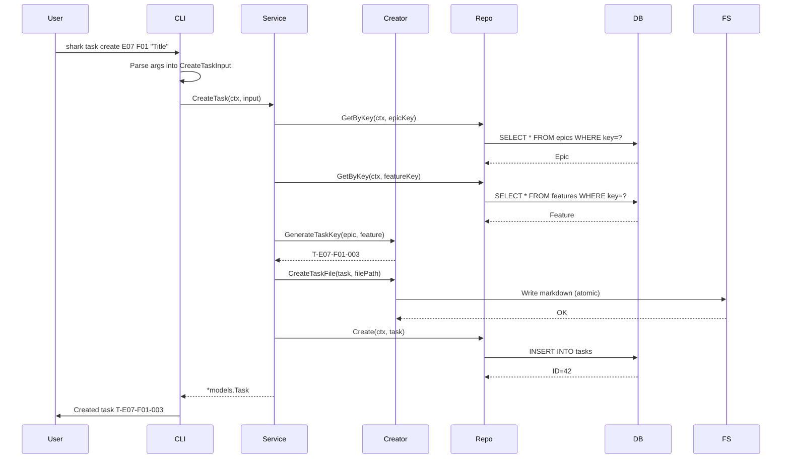
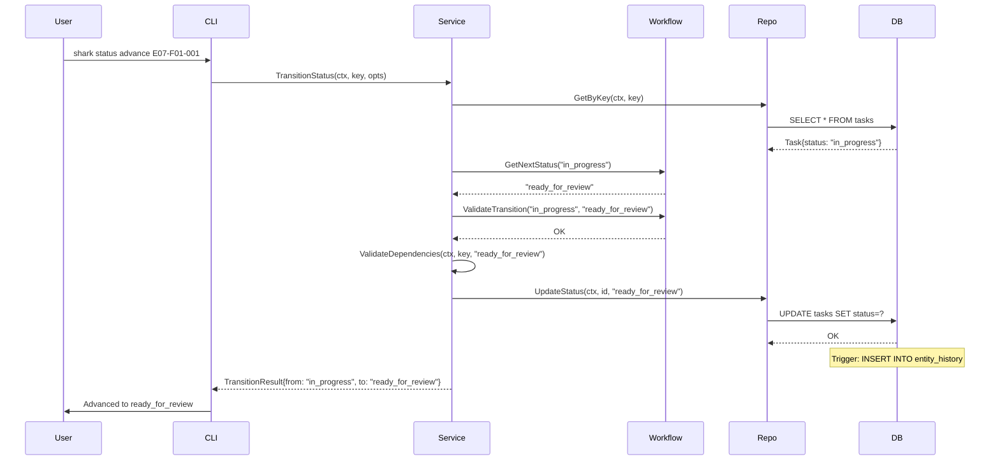
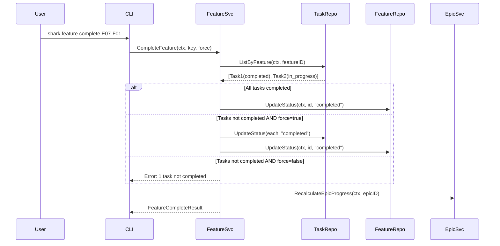
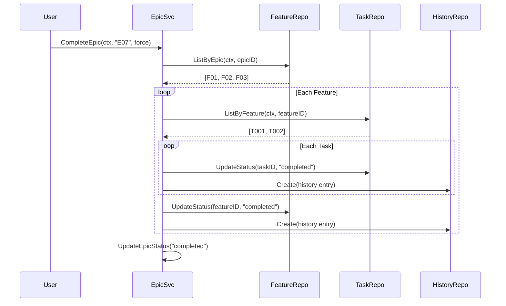
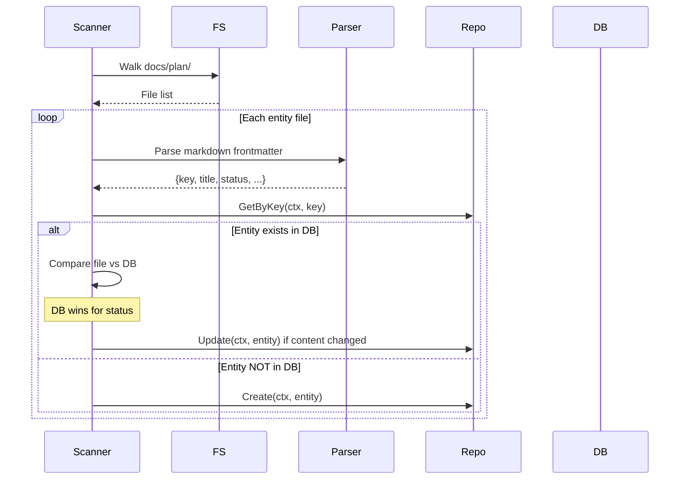
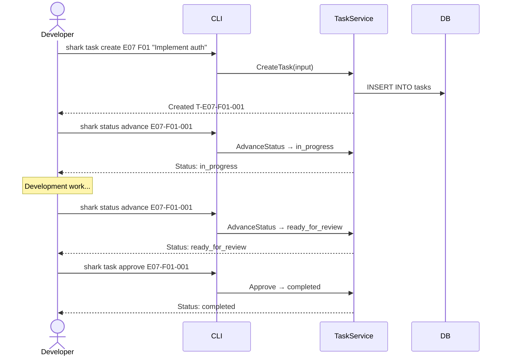
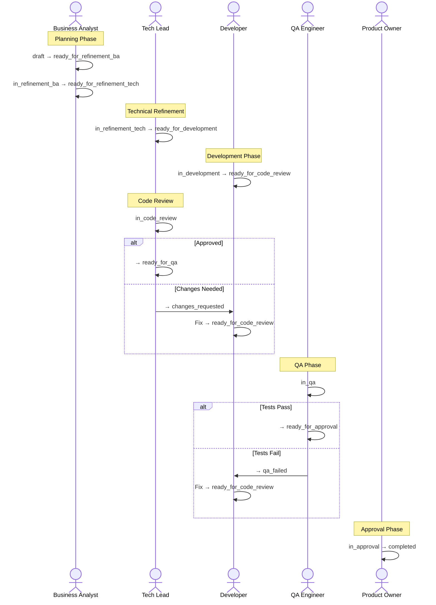

# Workflows

> Part of the Shark Task Manager Brownfield Analysis
<<<<<<< Updated upstream
> Generated: 2026-03-22
> Phase: 4 — Behavior Analysis

## Task Lifecycle (Basic Profile)

## Task Lifecycle (Advanced Profile)

## Entity Creation Workflow

## Status Transition Workflow

## Feature Completion Workflow

## Epic Cascade Workflow

## File Discovery & Sync Workflow

See also: [Business Logic](business-logic.md) | [Decision Logic](decision-logic.md) | [Error Handling](error-handling.md)
=======
> Generated: 2026-03-20
> Phase: 4 — Behavior Analysis

## End-to-End Workflows

### 1. Task Lifecycle (Basic Profile)

**Trigger**: Developer creates a task
**Participants**: CLI → TaskService → Repository → Database

### 2. Task Lifecycle (Advanced Profile — TDD Workflow)

**Trigger**: Task enters the advanced pipeline
**Participants**: Multiple agent types

### 3. Entity Status Transition (Generic)

**Trigger**: Any `shark status set` or `shark status advance` command
**Participants**: CLI → EntityService → WorkflowService → Repository

1. Parse entity key and target status
2. Look up entity by key (auto-detect type from key format)
3. Validate transition via WorkflowService
4. If backward transition and reason required: create rejection note
5. Update status in repository
6. Check if any blocked entities should be unblocked
7. Return updated entity + list of unblocked keys

### 4. Project Initialization

**Trigger**: `shark init`
**Steps**:
1. Auto-detect or create project root
2. Create `.sharkconfig.json` with default or selected profile
3. Initialize SQLite database (create tables, indexes, triggers)
4. Apply migrations if upgrading
5. Create `docs/plan/` directory structure

### 5. Resume Work Context Assembly

**Trigger**: `shark task resume E07-F01-001`
**Steps**:
1. Look up task by key
2. Look up parent feature
3. Look up parent epic
4. Retrieve task notes (sorted by creation date)
5. Retrieve recent status history
6. Retrieve context fields
7. Retrieve related documents
8. Assemble and format full context display

### 6. Idea Promotion

**Trigger**: `shark idea promote <id> --epic=E07`
**Steps**:
1. Look up idea by ID
2. Validate idea status (must be `new`)
3. Based on promotion target:
   - Epic: Create new epic from idea title
   - Feature: Create feature under specified epic
   - Task: Create task under specified feature
4. Update idea: status → `converted`, record conversion metadata
5. Return created entity

---

See also: [Business Logic](business-logic.md) | [Decision Logic](decision-logic.md) | [Sequence Diagrams](../diagrams/behavioral/sequence-diagrams.md)
>>>>>>> Stashed changes
