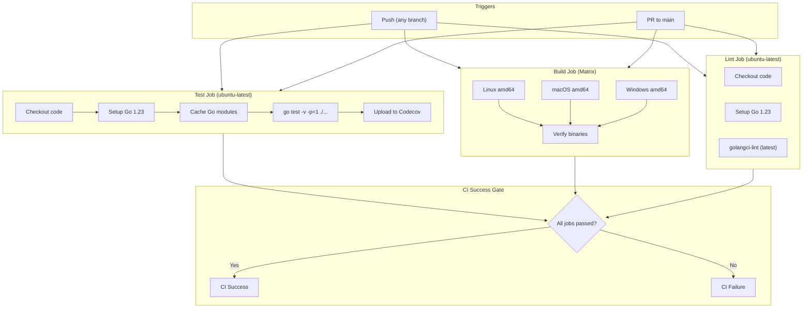
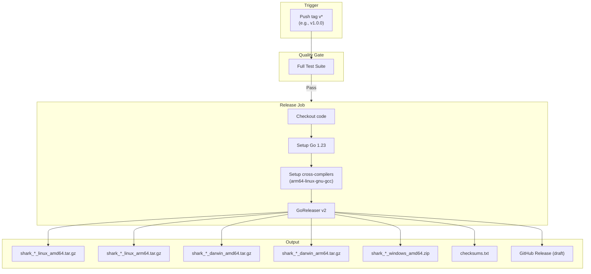
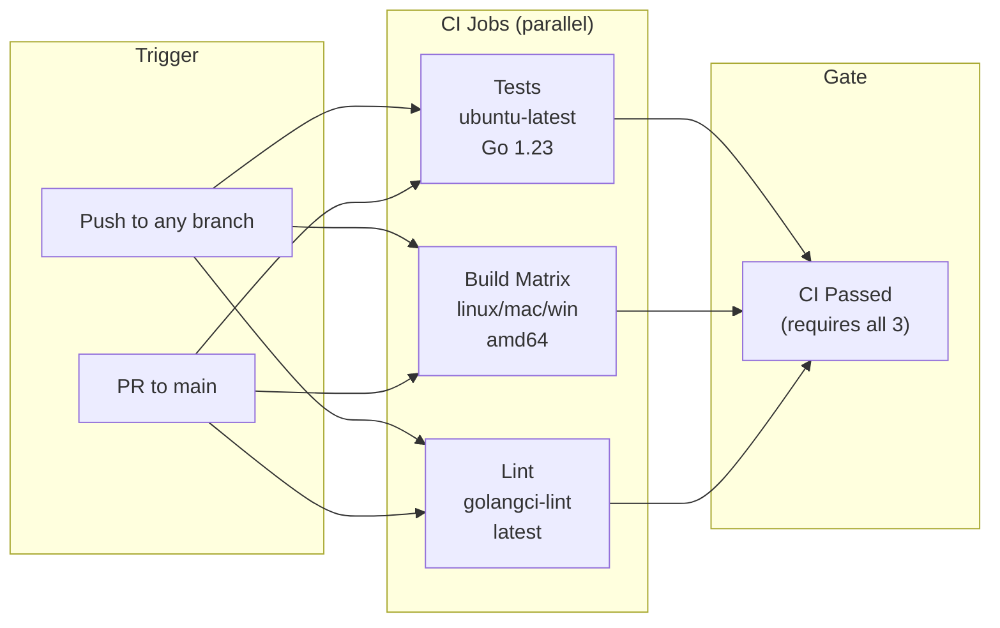
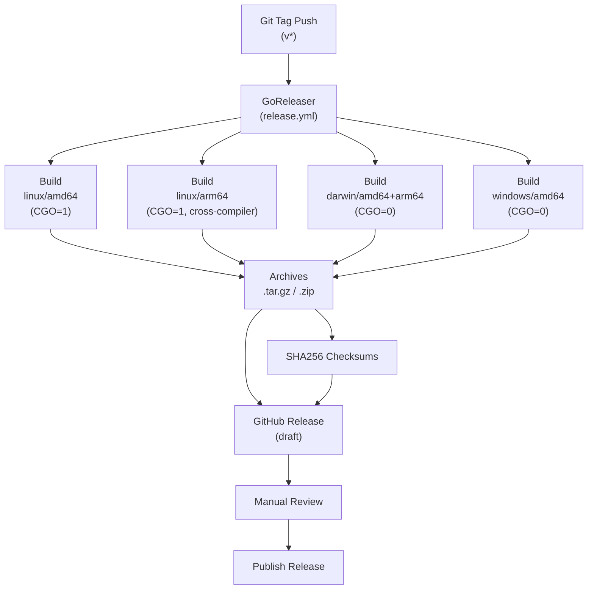

# CI/CD Pipeline

> Part of the Shark Task Manager Brownfield Analysis
<<<<<<< Updated upstream
> Generated: 2026-03-22
> Phase: 5 — Visual Documentation

## CI Pipeline (`.github/workflows/ci.yml`)



## Release Pipeline (`.github/workflows/release.yml`)



## Build Configuration Details

| Setting | Value |
|---------|-------|
| Go version | 1.23 |
| Test parallelism | `-p=1` (sequential for DB safety) |
| Build tags | `fts5` (SQLite full-text search) |
| LDFLAGS | `-s -w -X main.BuildDate -X main.GitCommit` |
| Linter | golangci-lint v2.9.0 |
| Release tool | GoReleaser v2.x |
| Release type | Draft (manual publish) |
=======
> Generated: 2026-03-20
> Phase: 5 — Visual Documentation

## GitHub Actions CI Pipeline



### CI Job Details

| Job | Runner | Go Version | Steps |
|-----|--------|------------|-------|
| **Test** | ubuntu-latest | 1.23 | checkout → setup-go → download deps → run tests → upload coverage (codecov) |
| **Build** | ubuntu/macOS/windows | 1.23 | checkout → setup-go → build shark binary → verify binary |
| **Lint** | ubuntu-latest | 1.23 | checkout → setup-go → golangci-lint |
| **CI Passed** | ubuntu-latest | — | Gate job: fails if any above fails |

Source: `.github/workflows/ci.yml`

## Release Pipeline



### Release Configuration

| Setting | Value | Source |
|---------|-------|--------|
| **Tool** | GoReleaser v2 | `.goreleaser.yml` |
| **Platforms** | linux, darwin, windows | amd64 + arm64 (except win/arm64) |
| **CGO** | Enabled for linux only | macOS/Windows: CGO=0 |
| **Binary name** | `shark` | |
| **Archive format** | .tar.gz (unix), .zip (windows) | GoReleaser default |
| **Includes** | LICENSE, README.md | |
| **Release type** | Draft (manual publish) | |
| **Homebrew** | Disabled (tap not set up) | |
| **Scoop** | Disabled (bucket not set up) | |

### Build Flags

```
-s -w                           # Strip debug symbols
-X main.Version={{.Version}}    # Inject version from git tag
-X main.BuildDate=YYYY-MM-DD   # Build date (Makefile only)
-X main.GitCommit=SHORT_HASH   # Git commit (Makefile only)
```

---
>>>>>>> Stashed changes

See also: [Deployment Diagram](deployment-diagram.md) | [Infrastructure](../../specialized/infrastructure/cicd-pipeline.md)
