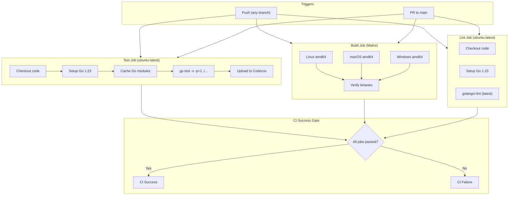
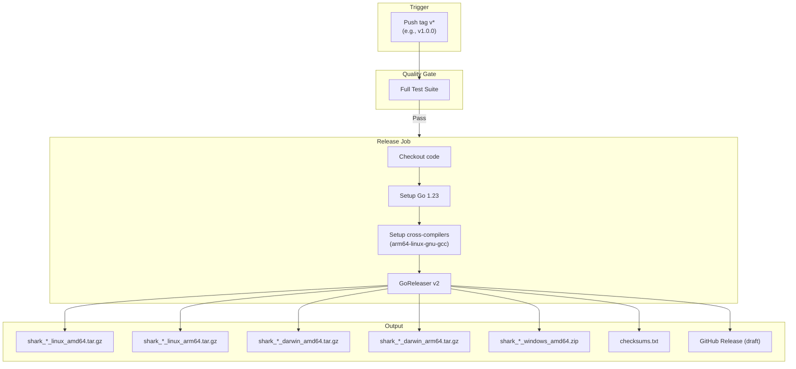

# CI/CD Pipeline

> Part of the Shark Task Manager Brownfield Analysis
> Generated: 2026-03-22
> Phase: 5 — Visual Documentation

## CI Pipeline (`.github/workflows/ci.yml`)

## Release Pipeline (`.github/workflows/release.yml`)

## Build Configuration Details

| Setting | Value |
|---------|-------|
| Go version | 1.23 |
| Test parallelism | `-p=1` (sequential for DB safety) |
| Build tags | `fts5` (SQLite full-text search) |
| LDFLAGS | `-s -w -X main.BuildDate -X main.GitCommit` |
| Linter | golangci-lint v2.9.0 |
| Release tool | GoReleaser v2.x |
| Release type | Draft (manual publish) |

See also: [Deployment Diagram](deployment-diagram.md) | [Infrastructure](../../specialized/infrastructure/cicd-pipeline.md)
