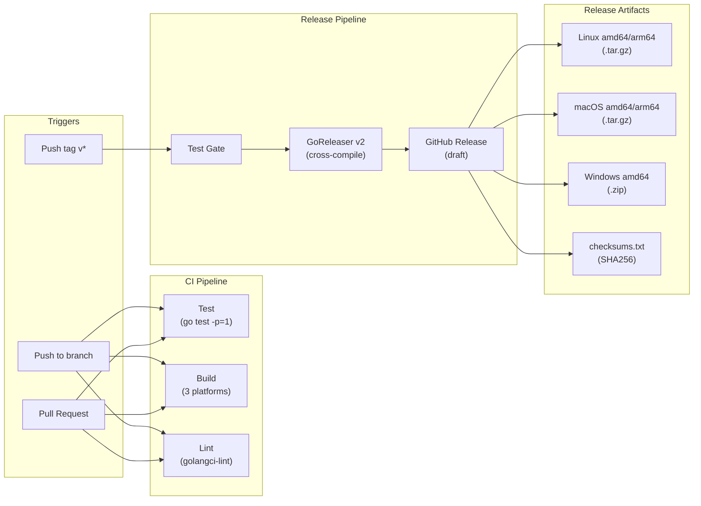

# Deployment Diagram

> Part of the Shark Task Manager Brownfield Analysis
<<<<<<< Updated upstream
> Generated: 2026-03-22
=======
> Generated: 2026-03-20
>>>>>>> Stashed changes
> Phase: 5 — Visual Documentation

## Deployment Topology

```mermaid
graph TB
<<<<<<< Updated upstream
    subgraph DevMachine["Developer Machine"]
        SHARK["shark binary<br/>(compiled Go, ~25MB)"]
        SQLDB["shark-tasks.db<br/>(SQLite + WAL)"]
        CONFIG[".sharkconfig.json"]
        DOCS["docs/plan/<br/>(Markdown files)"]
        TEMPLATES["shark-templates/<br/>(80+ .md templates)"]
    end

    subgraph GitHub["GitHub"]
        REPO["Repository<br/>(source code)"]
        ACTIONS["GitHub Actions<br/>(CI/CD)"]
        RELEASES["GitHub Releases<br/>(binaries)"]
    end

    subgraph TursoCloud["Turso Cloud (Optional)"]
        TURSO["libsql://shark-tasks-*.turso.io<br/>(cloud SQLite)"]
    end

    SHARK --> SQLDB
    SHARK --> CONFIG
    SHARK --> DOCS
    SHARK --> TEMPLATES
    SHARK -.->|"Optional<br/>(multi-machine sync)"| TURSO

    REPO --> ACTIONS
    ACTIONS -->|"GoReleaser"| RELEASES
    RELEASES -->|"Download"| SHARK
=======
    subgraph "Developer Machine"
        SHARK["shark CLI binary<br/>(~15-20MB Go binary)"]
        SQLITE[("shark-tasks.db<br/>SQLite + WAL")]
        CONFIG[".sharkconfig.json"]
        DOCS["docs/plan/**/*.md<br/>(entity files)"]
        TEMPLATES["shark-templates/<br/>(embedded in binary)"]
    end

    subgraph "Cloud (Optional)"
        TURSO[("Turso Cloud<br/>libsql://...turso.io")]
    end

    subgraph "GitHub"
        REPO["github.com/jwwelbor/<br/>shark-task-manager"]
        ACTIONS["GitHub Actions<br/>(CI + Release)"]
        RELEASES["GitHub Releases<br/>(multi-platform binaries)"]
    end

    SHARK --> SQLITE
    SHARK --> CONFIG
    SHARK --> DOCS
    SHARK -.->|optional| TURSO
    REPO --> ACTIONS
    ACTIONS --> RELEASES
>>>>>>> Stashed changes

    style TURSO stroke-dasharray: 5 5
```

<<<<<<< Updated upstream
## Build & Release Pipeline



## Platform Support Matrix

| Platform | Architecture | CGO | Build Status |
|----------|-------------|-----|-------------|
| Linux | amd64 | Yes (native) | Primary |
| Linux | arm64 | Yes (cross-compiler) | Supported |
| macOS | amd64 | No (CGO_ENABLED=0) | Supported |
| macOS | arm64 | No (CGO_ENABLED=0) | Supported |
| Windows | amd64 | No (CGO_ENABLED=0) | Supported |
| Windows | arm64 | - | Not supported |
=======
## Distribution Channels

| Channel | Status | Platform |
|---------|--------|----------|
| GitHub Releases | Active | All (linux/darwin/windows, amd64/arm64) |
| `make install-shark` | Active | Local (builds from source) |
| `go install` | Available | Any with Go toolchain |
| Homebrew | Planned (disabled) | macOS |
| Scoop | Planned (disabled) | Windows |

## Runtime Requirements

| Requirement | Local SQLite | Turso Cloud |
|-------------|-------------|-------------|
| Network | None | Internet access |
| Filesystem | Read/write to project dir | Read/write to project dir |
| C compiler | Linux only (CGO) | Linux only (CGO) |
| Memory | ~50MB typical | ~50MB typical |
| Disk | ~20MB binary + DB | ~20MB binary |

---
>>>>>>> Stashed changes

See also: [CI/CD Pipeline](cicd-pipeline.md) | [System Overview](../../architecture/system-overview.md)
