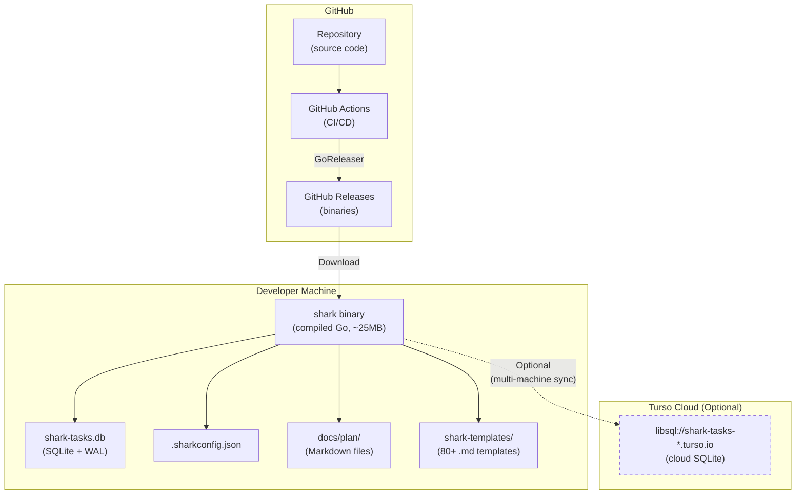
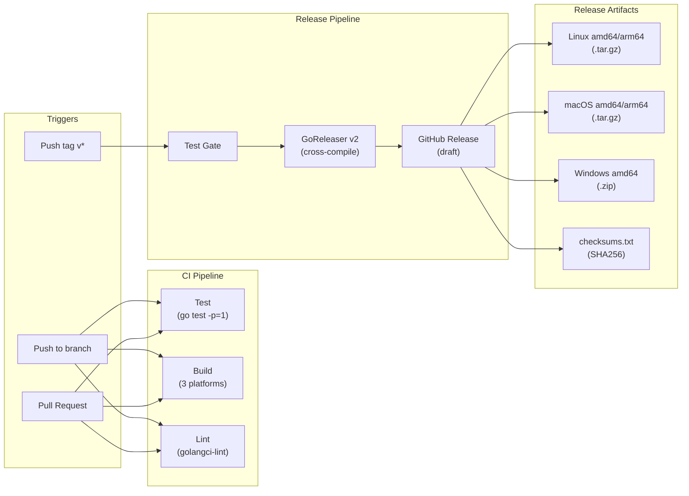

# Deployment Diagram

> Part of the Shark Task Manager Brownfield Analysis
> Generated: 2026-03-22
> Phase: 5 — Visual Documentation

## Deployment Topology

## Build & Release Pipeline

## Platform Support Matrix

| Platform | Architecture | CGO | Build Status |
|----------|-------------|-----|-------------|
| Linux | amd64 | Yes (native) | Primary |
| Linux | arm64 | Yes (cross-compiler) | Supported |
| macOS | amd64 | No (CGO_ENABLED=0) | Supported |
| macOS | arm64 | No (CGO_ENABLED=0) | Supported |
| Windows | amd64 | No (CGO_ENABLED=0) | Supported |
| Windows | arm64 | - | Not supported |

See also: [CI/CD Pipeline](cicd-pipeline.md) | [System Overview](../../architecture/system-overview.md)
