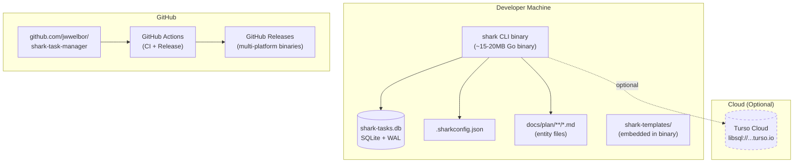

# Deployment Diagram

> Part of the Shark Task Manager Brownfield Analysis
> Generated: 2026-03-20
> Phase: 5 — Visual Documentation

## Deployment Topology

## Distribution Channels

| Channel | Status | Platform |
|---------|--------|----------|
| GitHub Releases | Active | All (linux/darwin/windows, amd64/arm64) |
| `make install-shark` | Active | Local (builds from source) |
| `go install` | Available | Any with Go toolchain |
| Homebrew | Planned (disabled) | macOS |
| Scoop | Planned (disabled) | Windows |

## Runtime Requirements

| Requirement | Local SQLite | Turso Cloud |
|-------------|-------------|-------------|
| Network | None | Internet access |
| Filesystem | Read/write to project dir | Read/write to project dir |
| C compiler | Linux only (CGO) | Linux only (CGO) |
| Memory | ~50MB typical | ~50MB typical |
| Disk | ~20MB binary + DB | ~20MB binary |

---

See also: [CI/CD Pipeline](cicd-pipeline.md) | [System Overview](../../architecture/system-overview.md)
