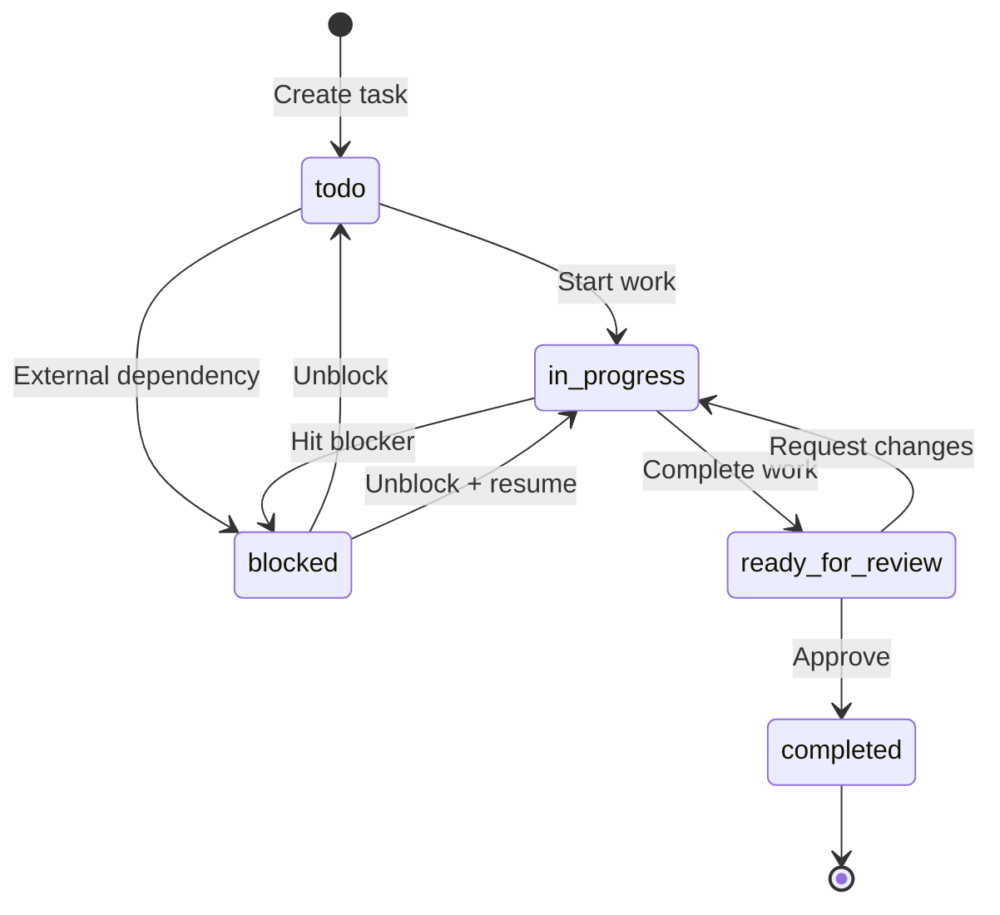
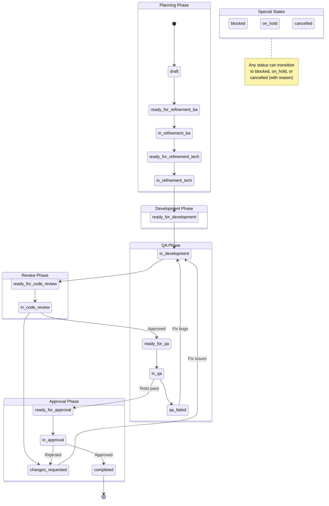
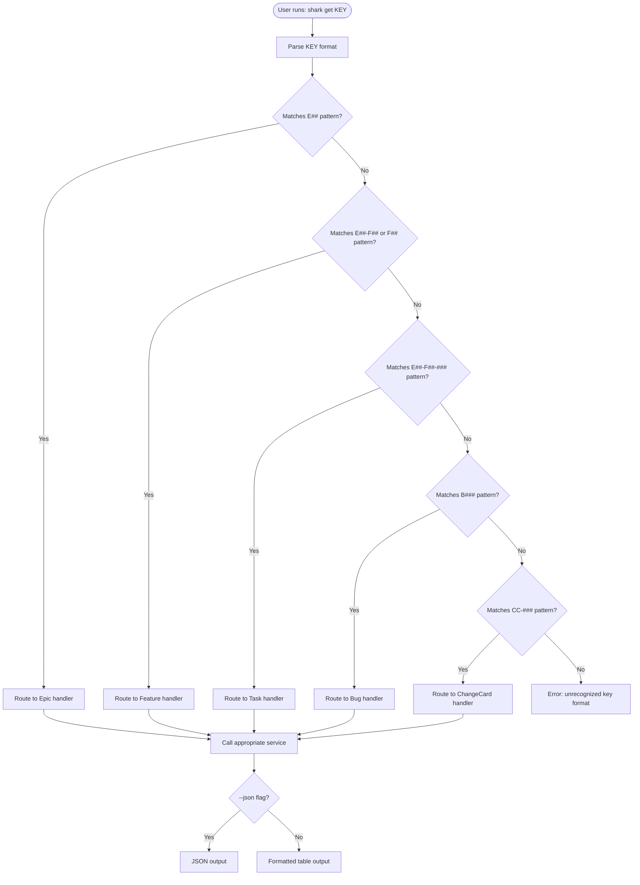
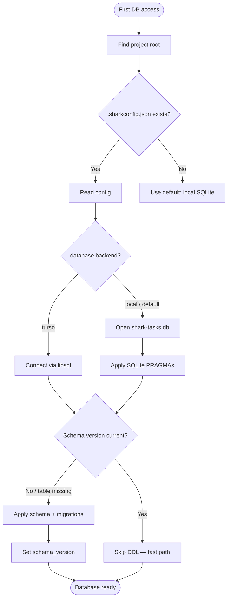
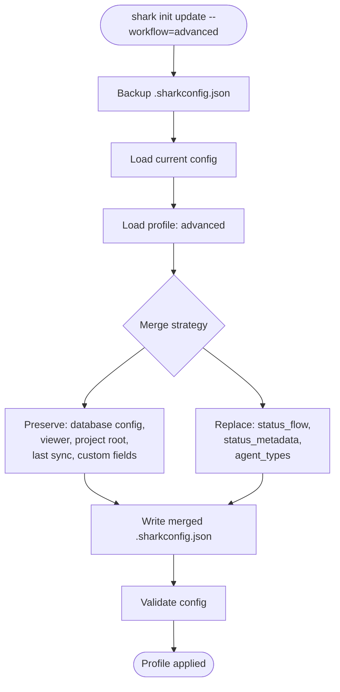

# Activity Diagrams

> Part of the Shark Task Manager Brownfield Analysis
> Generated: 2026-03-20
> Phase: 5 — Visual Documentation

## 1. Task Lifecycle (Basic Workflow)

## 2. Task Lifecycle (Advanced Workflow — 19 Statuses)

## 3. Entity Auto-Detection Flow

## 4. Database Initialization Decision Flow

## 5. Workflow Profile Application

---

See also: [Sequence Diagrams](sequence-diagrams.md) | [Business Logic](../../behavior/business-logic.md)
