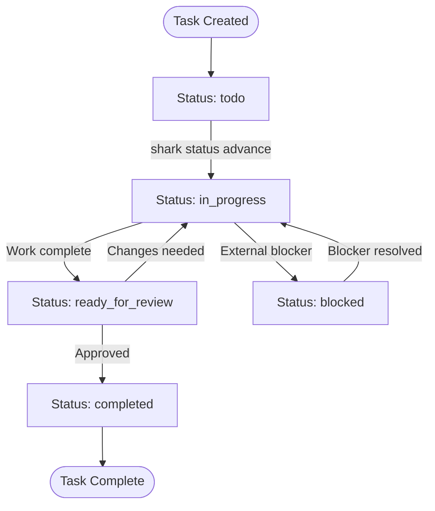
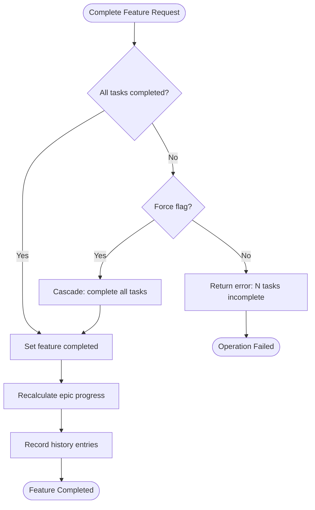
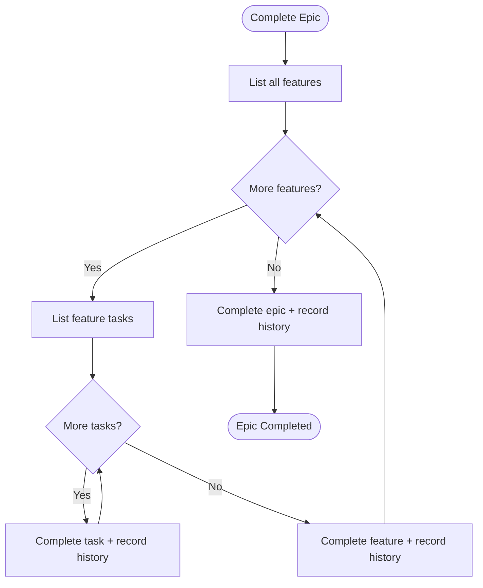
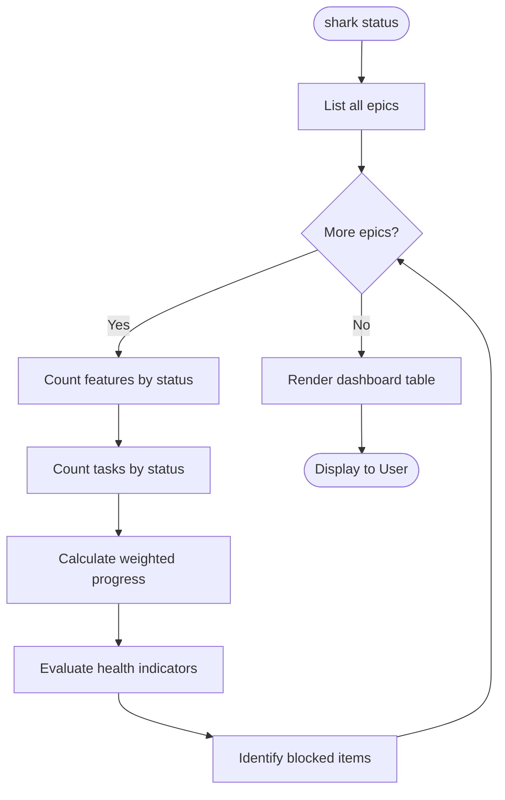

# Activity Diagrams

> Part of the Shark Task Manager Brownfield Analysis
> Generated: 2026-03-22
> Phase: 5 — Visual Documentation

## Task Lifecycle Activity

## Feature Completion Activity

## Epic Cascade Activity

## Project Dashboard Activity

See also: [Sequence Diagrams](sequence-diagrams.md) | [Workflows](../behavior/workflows.md)
