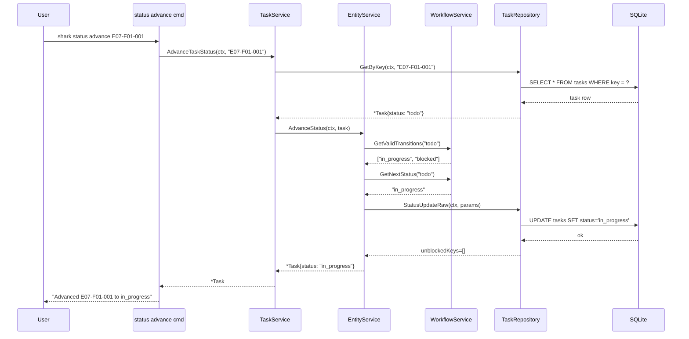
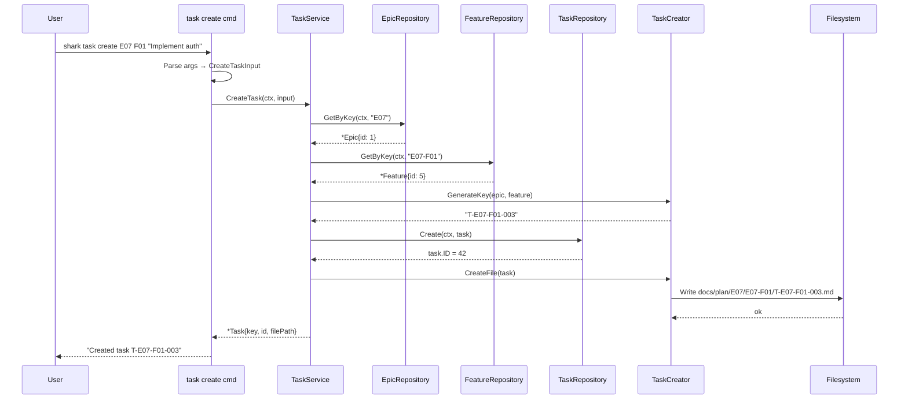
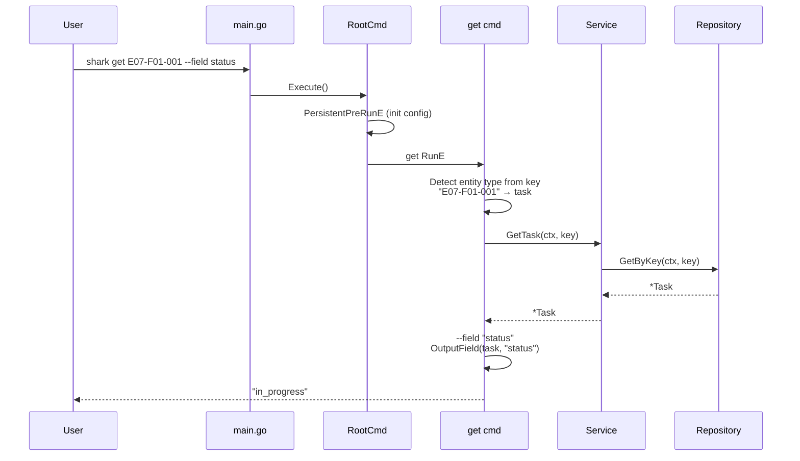
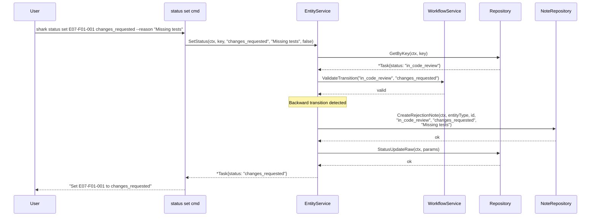
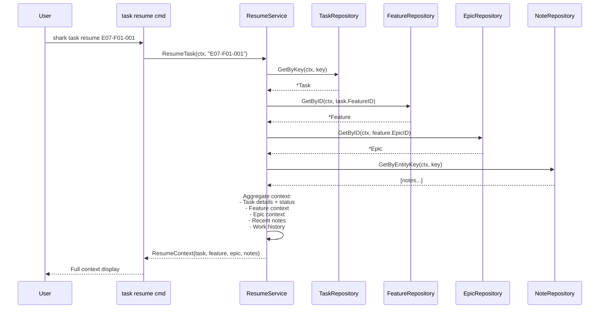

# Sequence Diagrams

> Part of the Shark Task Manager Brownfield Analysis
> Generated: 2026-03-20
> Phase: 5 — Visual Documentation

## 1. Task Status Advance (Happy Path)

## 2. Task Creation Flow

## 3. Entity Get with Field Extraction

## 4. Backward Transition with Rejection Note

## 5. Resume Task with Full Context

---

See also: [Request Flow](../data-flow/request-flow.md) | [Activity Diagrams](activity-diagrams.md)
