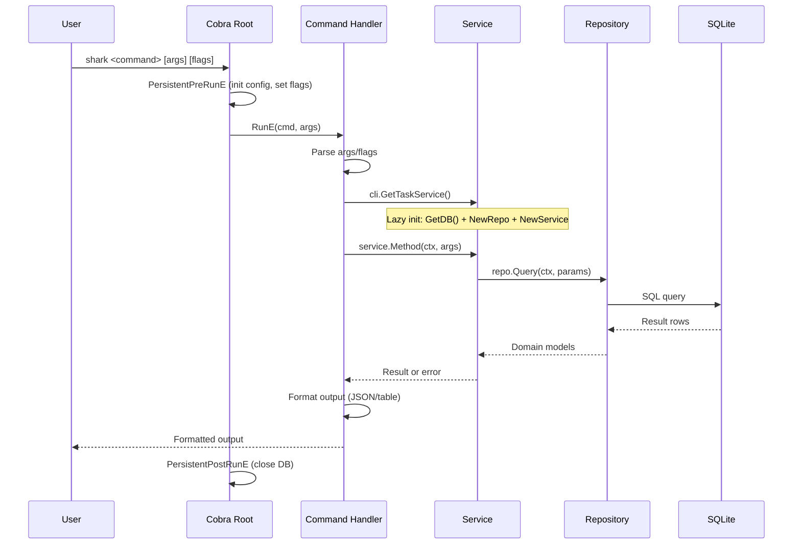
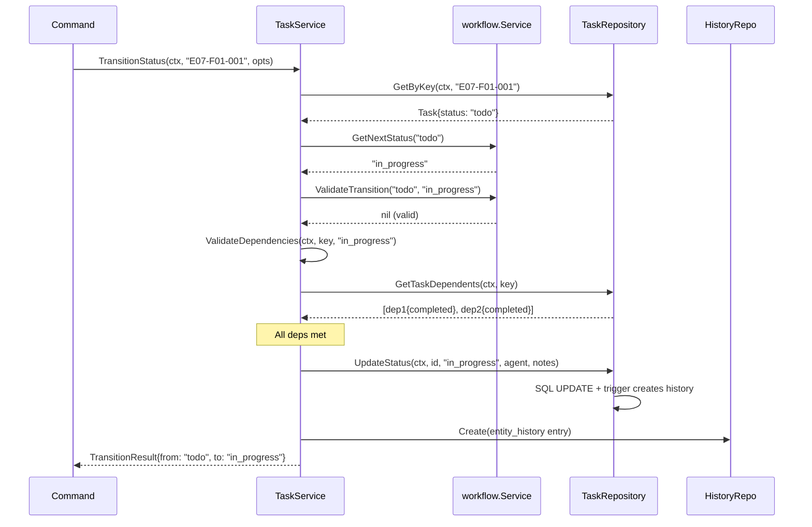
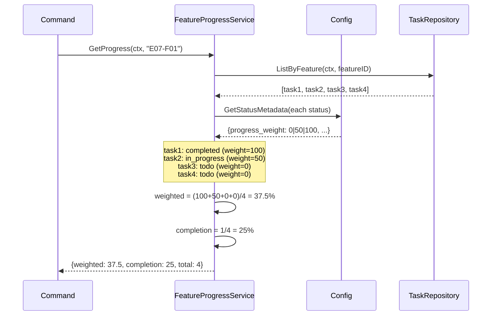
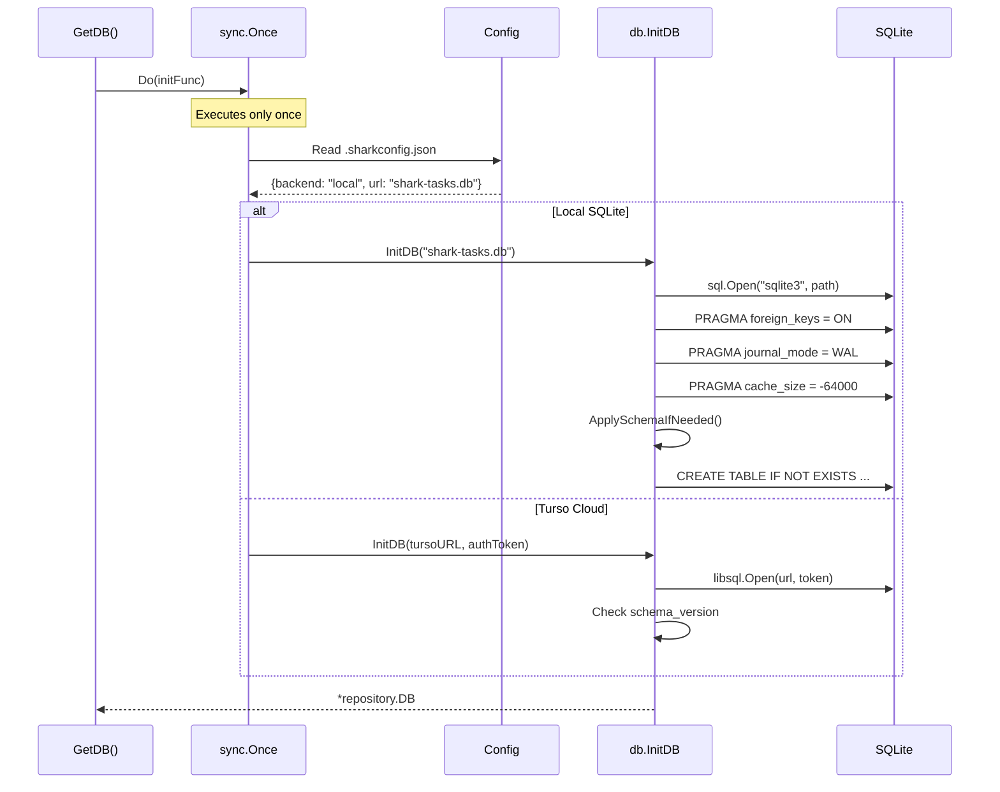
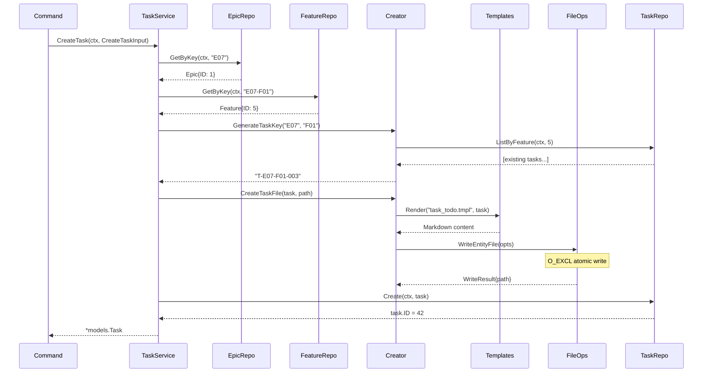

# Sequence Diagrams

> Part of the Shark Task Manager Brownfield Analysis
> Generated: 2026-03-22
> Phase: 5 — Visual Documentation

## 1. CLI Command Execution Flow

## 2. Status Advance with Dependency Check

## 3. Feature Progress Calculation

## 4. Database Initialization

## 5. Task Creation with File

See also: [Activity Diagrams](activity-diagrams.md) | [Workflows](../behavior/workflows.md)
