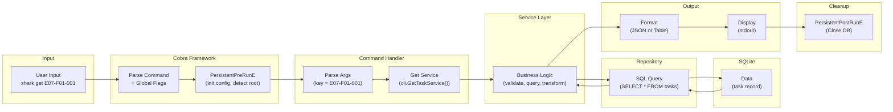
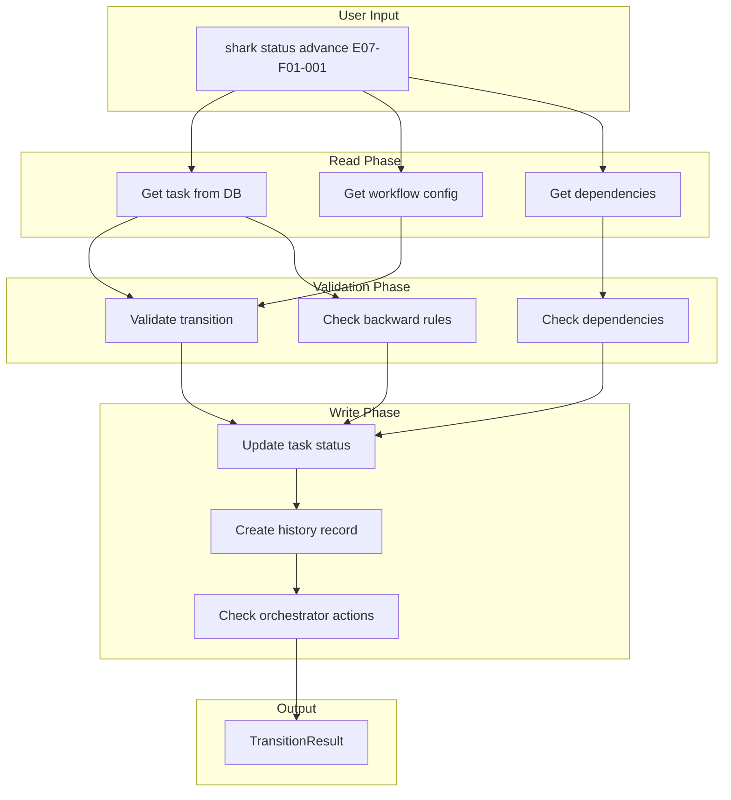
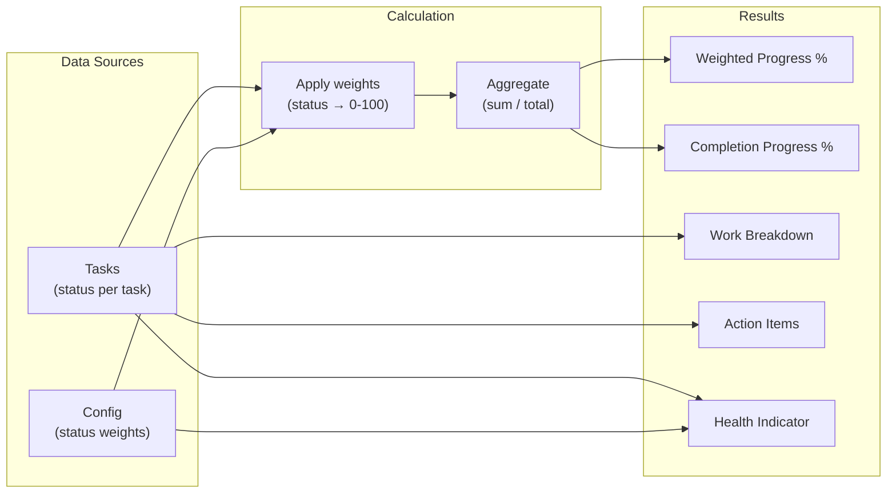

# Request Flow

> Part of the Shark Task Manager Brownfield Analysis
> Generated: 2026-03-22
> Phase: 5 — Visual Documentation

## CLI Request Flow

## Data Flow: Status Transition

## Data Flow: Progress Calculation

See also: [Sequence Diagrams](../behavioral/sequence-diagrams.md) | [Component Diagram](../structural/component-diagram.md)
