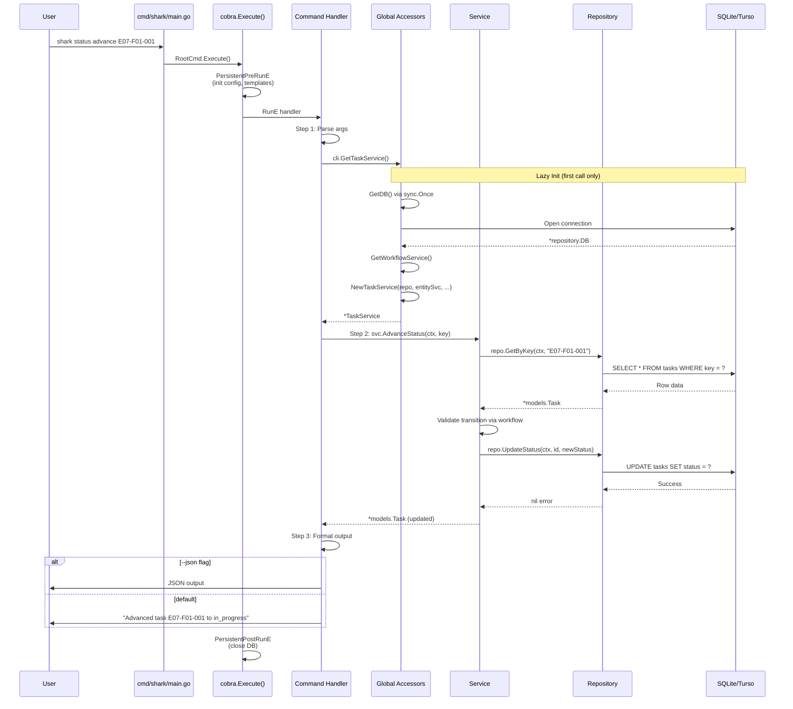
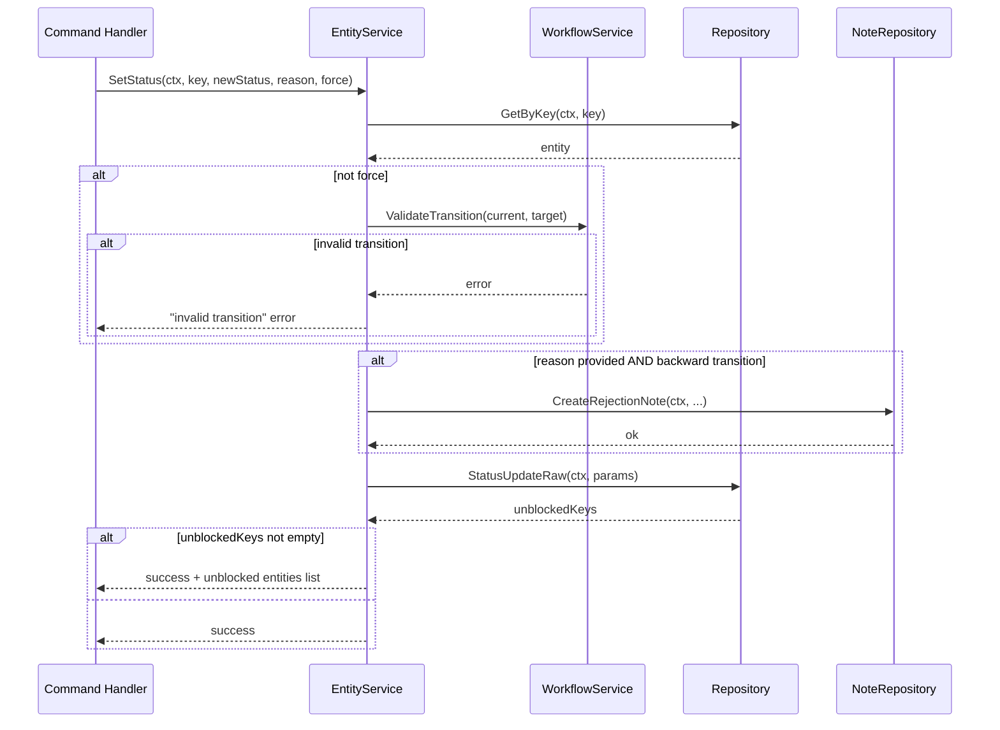
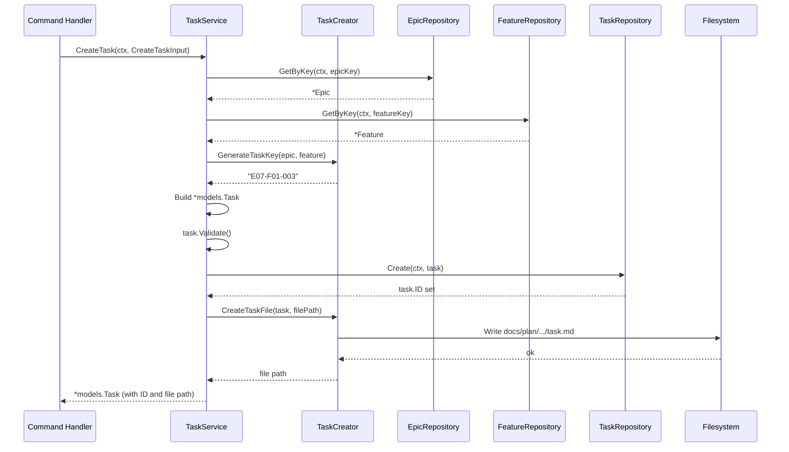
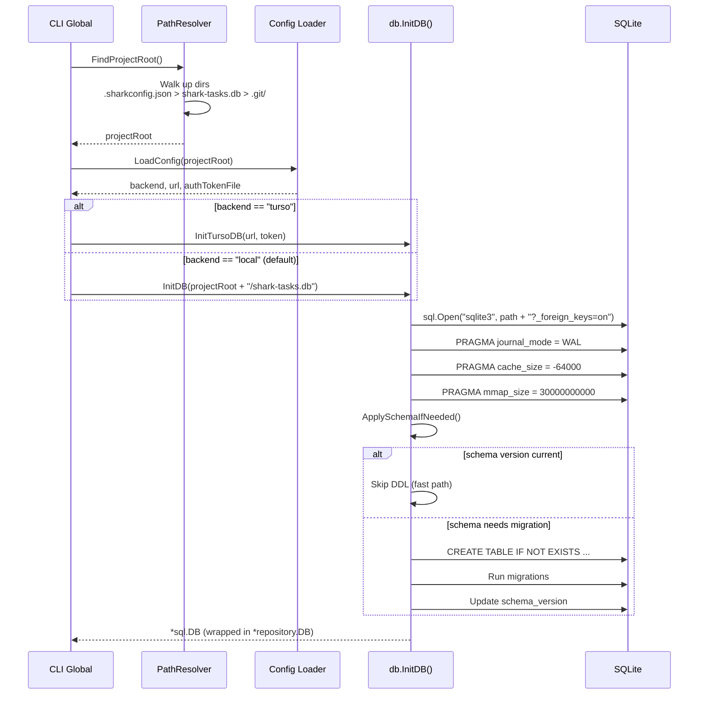

# Request Flow

> Part of the Shark Task Manager Brownfield Analysis
> Generated: 2026-03-20
> Phase: 5 — Visual Documentation

## CLI Command Request Flow

### General Flow (All Commands)

### Status Transition Flow (with Rejection Notes)

### Entity Creation Flow

## Database Initialization Flow

---

See also: [Component Diagram](../structural/component-diagram.md) | [Architecture Overview](../../architecture/system-overview.md)
