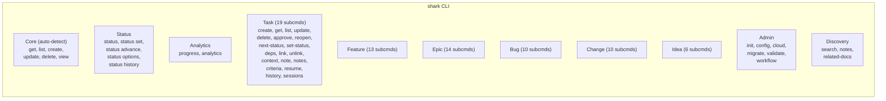

# Component Diagram

> Part of the Shark Task Manager Brownfield Analysis
> Generated: 2026-03-20
> Phase: 5 — Visual Documentation

## System Component Diagram

```mermaid
graph TB
    subgraph "User Interfaces"
        SHARK["shark CLI<br/>(cmd/shark/)"]
        SERVER["HTTP API Server<br/>(cmd/server/)"]
    end

    subgraph "CLI Framework Layer"
        direction TB
        ROOT["Root Command<br/>root.go"]
        CMD_INSPECT["Inspect Commands<br/>get, list, view, search"]
        CMD_MANAGE["Manage Commands<br/>create, update, delete,<br/>context, notes, history"]
        CMD_WORKFLOW["Workflow Commands<br/>status set/advance/options,<br/>progress, analytics"]
        CMD_ADVANCED["Advanced Commands<br/>task/feature/epic/bug/change<br/>subcommands, idea, admin"]
        GLOBALS["Global Accessors<br/>services_global.go<br/>db_global.go<br/>workflow_global.go"]
    end

    subgraph "Service Layer"
        ENTITY_SVC["EntityService<br/>(shared transitions)"]
        TASK_SVC["TaskService"]
        FEAT_SVC["FeatureService"]
        EPIC_SVC["EpicService"]
        BUG_SVC["BugService"]
        CC_SVC["ChangeCardService"]
        NOTE_SVC["NoteService"]
        CTX_SVC["ContextService"]
        RESUME_SVC["ResumeService"]
        DOC_SVC["EntityDocumentService"]
        DEP_SVC["TaskDependencyService"]
        REGISTRY["EntityRegistry"]
    end

    subgraph "Repository Layer"
        TASK_REPO["TaskRepository"]
        FEAT_REPO["FeatureRepository"]
        EPIC_REPO["EpicRepository"]
        BUG_REPO["BugRepository"]
        CC_REPO["ChangeCardRepository"]
        NOTE_REPO["EntityNoteRepository"]
        HIST_REPO["TaskHistoryRepository"]
        DOC_REPO["DocumentRepository"]
        IDEA_REPO["IdeaRepository"]
    end

    subgraph "Infrastructure"
        WF["Workflow Service<br/>(config-driven)"]
        STATUS["Status Calculator"]
        CONFIG["Config Manager<br/>(.sharkconfig.json)"]
        DB_INIT["DB Initializer<br/>(schema + migrations)"]
        TMPL["Template Engine<br/>(embedded templates)"]
    end

    subgraph "Storage"
        SQLITE[("SQLite<br/>shark-tasks.db")]
        TURSO[("Turso Cloud<br/>libsql://")]
        FS[("Filesystem<br/>docs/plan/**/*.md")]
    end

    SHARK --> ROOT
    SERVER --> GLOBALS
    ROOT --> CMD_INSPECT & CMD_MANAGE & CMD_WORKFLOW & CMD_ADVANCED
    CMD_INSPECT & CMD_MANAGE & CMD_WORKFLOW & CMD_ADVANCED --> GLOBALS

    GLOBALS --> TASK_SVC & FEAT_SVC & EPIC_SVC & NOTE_SVC & CTX_SVC & RESUME_SVC & REGISTRY

    TASK_SVC & FEAT_SVC & EPIC_SVC & BUG_SVC & CC_SVC --> ENTITY_SVC
    ENTITY_SVC --> WF

    TASK_SVC --> TASK_REPO
    FEAT_SVC --> FEAT_REPO
    EPIC_SVC --> EPIC_REPO
    BUG_SVC --> BUG_REPO
    CC_SVC --> CC_REPO
    NOTE_SVC --> NOTE_REPO
    DOC_SVC --> DOC_REPO
    DEP_SVC --> TASK_REPO

    REGISTRY --> TASK_REPO & FEAT_REPO & EPIC_REPO & BUG_REPO & CC_REPO

    TASK_REPO & FEAT_REPO & EPIC_REPO & BUG_REPO & CC_REPO & NOTE_REPO & HIST_REPO & DOC_REPO & IDEA_REPO --> DB_INIT
    DB_INIT --> SQLITE
    DB_INIT --> TURSO

    STATUS --> CONFIG
    WF --> CONFIG
    TMPL --> FS
```

## Command Group Breakdown

---

See also: [Package Dependencies](package-dependencies.md) | [Architecture Overview](../architecture/system-overview.md)
