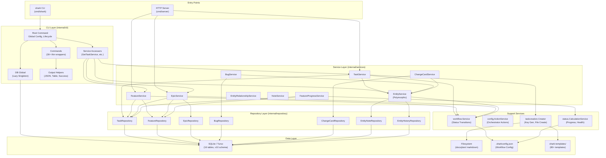

# Component Diagram

> Part of the Shark Task Manager Brownfield Analysis
> Generated: 2026-03-22
> Phase: 5 — Visual Documentation

## System-Level Component Relationships

See also: [Package Dependencies](package-dependencies.md) | [System Overview](../architecture/system-overview.md)
