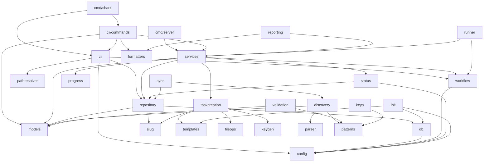

# Package Dependencies

> Part of the Shark Task Manager Brownfield Analysis
> Generated: 2026-03-22
> Phase: 5 — Visual Documentation

## Internal Package Dependency Graph

## External Dependency Graph

```mermaid
graph TD
    SHARK["shark-task-manager"] --> COBRA["spf13/cobra v1.10.2"]
    SHARK --> VIPER["spf13/viper v1.21.0"]
    SHARK --> SQLITE["mattn/go-sqlite3 v1.14.32"]
    SHARK --> TURSO["tursodatabase/libsql-client-go"]
    SHARK --> PTERM["pterm v0.12.82"]
    SHARK --> TESTIFY["stretchr/testify v1.11.1"]
    SHARK --> YAML["gopkg.in/yaml.v3"]
    SHARK --> XTERM["golang.org/x/term"]
    SHARK --> XTEXT["golang.org/x/text"]

    COBRA --> PFLAG["spf13/pflag"]
    COBRA --> MOUSETRAP["mousetrap"]
    VIPER --> AFERO["spf13/afero"]
    VIPER --> CAST["spf13/cast"]
    VIPER --> FSNOTIFY["fsnotify"]
    VIPER --> MAPSTRUCTURE["mapstructure/v2"]
    VIPER --> TOML["go-toml/v2"]
    VIPER --> GOTENV["gotenv"]
    TURSO --> ANTLR["antlr4-go"]
    TURSO --> WEBSOCKET["coder/websocket"]
    PTERM --> CURSOR["atomicgo.dev/cursor"]
    PTERM --> KEYBOARD["atomicgo.dev/keyboard"]
    PTERM --> COLOR["gookit/color"]
    PTERM --> RUNEWIDTH["go-runewidth"]
    TESTIFY --> SPEW["go-spew"]
    TESTIFY --> DIFFLIB["go-difflib"]
```

See also: [Component Diagram](component-diagram.md) | [Dependencies](../architecture/dependencies.md)
