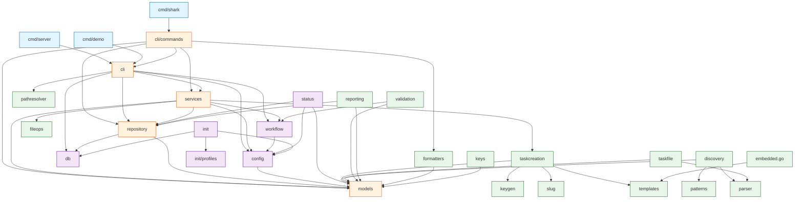

# Package Dependencies

> Part of the Shark Task Manager Brownfield Analysis
> Generated: 2026-03-20
> Phase: 5 — Visual Documentation

## Internal Package Dependency Graph



## Layer Isolation Analysis

| Layer | Can Import | Must Not Import |
|-------|-----------|-----------------|
| **cmd/** | cli, services, repository, models | (top-level, can import anything) |
| **cli/commands** | cli, services, models, repository*, config | db directly |
| **cli (framework)** | services, repository, workflow, config, db | commands |
| **services** | models, repository interfaces, workflow, config | cli, db directly |
| **repository** | models, db | services, cli, workflow |
| **models** | stdlib only | everything else |
| **workflow** | config | services, repository, models |
| **db** | stdlib, go-sqlite3 | models, services, repository |

*Note: CLI commands importing repository directly is the legacy "fat controller" anti-pattern being refactored in E15.

## Dependency Depth

```
cmd/shark (depth 0)
  └── cli/commands (depth 1)
        ├── cli (depth 2)
        │     ├── services (depth 3)
        │     │     ├── models (depth 4 — leaf)
        │     │     ├── repository interfaces (depth 4)
        │     │     └── workflow (depth 4)
        │     │           └── config (depth 5)
        │     ├── repository (depth 3)
        │     │     ├── models (depth 4 — leaf)
        │     │     └── db (depth 4 — leaf)
        │     └── workflow (depth 3)
        ├── services (depth 2 — shared)
        └── models (depth 2 — shared)
```

Maximum dependency depth: **5** (cmd → cli → services → workflow → config)

---

See also: [Component Diagram](component-diagram.md) | [Dependencies](../architecture/dependencies.md)
