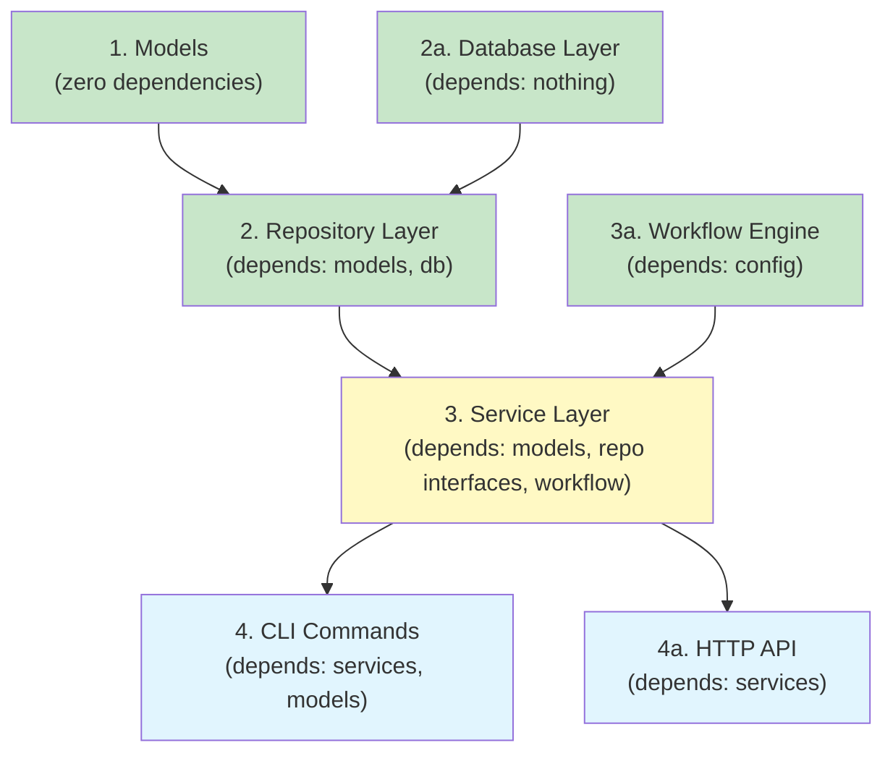

# Component Migration Order

> Part of the Shark Task Manager Brownfield Analysis
<<<<<<< Updated upstream
> Generated: 2026-03-22
> Phase: 8 — Migration Readiness

## Migration Context

The primary migration effort is the ongoing service layer refactoring (Epic E15): moving business logic from CLI commands into services. This document provides the dependency-ordered sequence for this and potential future migrations.

## Dependency-Ordered Migration Sequence

### Phase 1: Foundation (No Dependencies)

| Order | Component | Reason | Effort |
|-------|-----------|--------|--------|
| 1.1 | `models/` | Leaf node — no internal deps, stable interface | Done |
| 1.2 | `workflow/` | Depends only on config — stable interface | Done |
| 1.3 | `config/` | Foundation for workflow and status | Done |

### Phase 2: Data Access (Depends on Phase 1)

| Order | Component | Reason | Effort |
|-------|-----------|--------|--------|
| 2.1 | `db/` | Schema and migrations — depends on config | Done |
| 2.2 | `repository/` | Data access — depends on db, models | Done |

### Phase 3: Business Logic (Depends on Phase 2)

| Order | Component | Reason | Effort |
|-------|-----------|--------|--------|
| 3.1 | `services/entity_service.go` | Polymorphic base — used by all entity services | Done |
| 3.2 | `services/task_service.go` | Most commands; highest value | In Progress |
| 3.3 | `services/feature_service.go` | Feature lifecycle | Partial |
| 3.4 | `services/epic_service.go` | Epic lifecycle | Partial |
| 3.5 | `services/bug_service.go` | Bug tracking | Done |
| 3.6 | `services/change_card_service.go` | Change cards | Done |
| 3.7 | `services/note_service.go` | Notes management | Done |

### Phase 4: CLI Migration (Depends on Phase 3)

| Order | Component | Reason | Effort |
|-------|-----------|--------|--------|
| 4.1 | Simple get commands | Low complexity, high value | Small |
| 4.2 | List commands with filtering | Medium complexity | Medium |
| 4.3 | Status transition commands | High value | Medium |
| 4.4 | Create commands | Complex (file + DB) | Large |
| 4.5 | Analytics/progress commands | Report generation | Medium |

### Phase 5: HTTP API (Depends on Phase 3-4)

| Order | Component | Reason | Effort |
|-------|-----------|--------|--------|
| 5.1 | Handler infrastructure | Base patterns, middleware | Medium |
| 5.2 | Task API endpoints | Most used entity | Medium |
| 5.3 | Feature/Epic API endpoints | Hierarchy management | Medium |
| 5.4 | Bug/ChangeCard API endpoints | Standalone entities | Small |

## Components That Can Be Migrated Independently

- **Repository splitting** (TD-11): Can be done anytime, no service changes needed
- **Config splitting** (TD-06): Can be done anytime, internal refactoring only
- **History consolidation** (TD-07): Can switch queries independently
- **Structured logging** (TD-05): Additive change, no breaking changes

See also: [Test Specifications](test-specifications.md) | [Validation Criteria](validation-criteria.md)
=======
> Generated: 2026-03-20
> Phase: 8 — Migration Readiness

## Context

This document describes the dependency-ordered sequence for modernizing or migrating the Shark Task Manager codebase. The primary modernization efforts are:
1. Service layer completion (E15) — Move business logic from CLI to services
2. Entity polymorphism (E21) — Unify cross-cutting operations
3. Schema management improvement — Split and organize database code

## Component Dependency Chain

## Migration Phases

### Phase 1: Foundation (Complete)
- **Models** — Pure domain types, no changes needed
- **Database Layer** — Schema and migrations functional
- **Workflow Engine** — Config-driven, working correctly
- **Repository Layer** — Pure CRUD, well-tested

### Phase 2: Service Layer (In Progress — E15, E21)
Components that can be migrated independently:

| Component | Status | Dependencies | Notes |
|-----------|--------|-------------|-------|
| EntityService | Complete | workflow, models | Shared transition logic |
| TaskService | Mostly complete | repo, entity, workflow | Some methods still being extracted |
| FeatureService | Mostly complete | repo, entity, workflow | |
| EpicService | Mostly complete | repo, entity, workflow | |
| BugService | Complete | repo, entity | |
| ChangeCardService | Complete | repo, entity | |
| NoteService | Complete | repo, entity | |
| ContextService | Complete | repos | |
| ResumeService | Complete | repos | |
| EntityDocumentService | Complete | repo | |
| EntityRegistry | Complete | all repos (adapters) | |

### Phase 3: CLI Command Migration (Ongoing — E15)
Must wait for corresponding service methods to exist:

| Priority | Commands | Service Required |
|----------|---------|-----------------|
| High | get, list (all entities) | Get*, List* methods |
| Medium | start, complete, approve | Lifecycle methods |
| Medium | status set, status advance | EntityService.SetStatus |
| Low | create (all entities) | Create* methods |
| Low | deps, link, unlink | TaskDependencyService |

### Phase 4: HTTP API (Future)
- Requires service layer to be complete
- Handlers will be thin wrappers (same pattern as CLI)
- Can use same `ServiceContainer` pattern from `cmd/server/services.go`

## Independent Migration Candidates

These components can be modernized without affecting others:

1. **Split db.go** — Internal refactoring, no API changes
2. **Pin Turso dependency** — go.mod update only
3. **Pure-Go SQLite evaluation** — Swap driver behind DB interface
4. **Distribution channels** — GoReleaser config change only

---

See also: [Test Specifications](test-specifications.md) | [Validation Criteria](validation-criteria.md) | [Remediation Plan](../technical-debt/remediation-plan.md)
>>>>>>> Stashed changes
