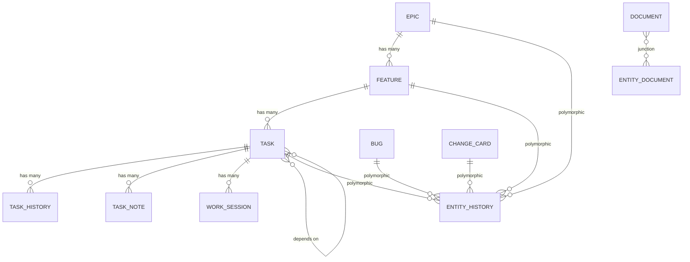

# Data Models

> Part of the Shark Task Manager Brownfield Analysis
<<<<<<< Updated upstream
> Generated: 2026-03-22
> Phase: 3 — Code Reference

## Entity Hierarchy



## Core Models

### Epic (`internal/models/epic.go`)

| Field | Type | DB Column | Constraints | Description |
|-------|------|-----------|-------------|-------------|
| ID | int64 | id | PK, AUTO | Database ID |
| Key | string | key | UNIQUE, NOT NULL | Format: `E##` (e.g., E07) |
| Title | string | title | NOT NULL | Epic name |
| Description | string | description | | Detailed description |
| Status | string | status | NOT NULL | Workflow status |
| Priority | string | priority | CHECK(high\|medium\|low) | Epic priority |
| BusinessValue | *int | business_value | | Business value score |
| FilePath | string | file_path | | Path to markdown file |
| Slug | *string | slug | | Human-readable key suffix |
| CreatedAt | time.Time | created_at | DEFAULT NOW | Creation timestamp |
| UpdatedAt | time.Time | updated_at | AUTO-UPDATE | Last modified |

### Feature (`internal/models/feature.go`)

| Field | Type | DB Column | Constraints | Description |
|-------|------|-----------|-------------|-------------|
| ID | int64 | id | PK, AUTO | Database ID |
| EpicID | int64 | epic_id | FK → epics, CASCADE | Parent epic |
| Key | string | key | UNIQUE, NOT NULL | Format: `E##-F##` |
| Title | string | title | NOT NULL | Feature name |
| Description | string | description | | Detailed description |
| Status | string | status | NOT NULL | Workflow status |
| ProgressPct | float64 | progress_pct | 0.0-100.0 | Calculated progress |
| ExecutionOrder | *int | execution_order | | Sequencing |
| FilePath | string | file_path | | Path to markdown file |
| Slug | *string | slug | | Human-readable suffix |
| StatusOverride | bool | status_override | | Manual status control |
| CreatedAt | time.Time | created_at | DEFAULT NOW | Creation timestamp |
| UpdatedAt | time.Time | updated_at | AUTO-UPDATE | Last modified |

### Task (`internal/models/task.go`)

| Field | Type | DB Column | Constraints | Description |
|-------|------|-----------|-------------|-------------|
| ID | int64 | id | PK, AUTO | Database ID |
| FeatureID | int64 | feature_id | FK → features, CASCADE | Parent feature |
| Key | string | key | UNIQUE, NOT NULL | Format: `T-E##-F##-###` |
| Title | string | title | NOT NULL | Task name |
| Description | string | description | | Detailed description |
| Status | TaskStatus | status | NOT NULL | Workflow status |
| AgentType | *string | agent_type | | Assigned agent role |
| Priority | int | priority | CHECK(1-10) | Priority level |
| DependsOn | *string | depends_on | | JSON array of task keys |
| AssignedAgent | *string | assigned_agent | | Specific agent ID |
| BlockedReason | *string | blocked_reason | | Why task is blocked |
| ExecutionOrder | *int | execution_order | | Sequencing within feature |
| FilePath | string | file_path | | Path to markdown file |
| Slug | *string | slug | | Human-readable suffix |
| StartedAt | *time.Time | started_at | | Work start timestamp |
| CompletedAt | *time.Time | completed_at | | Completion timestamp |
| BlockedAt | *time.Time | blocked_at | | Block timestamp |
| CompletedBy | *string | completed_by | | Who completed |
| CompletionNotes | *string | completion_notes | | Completion notes |
| FilesChanged | *string | files_changed | | JSON: changed files |
| TestsPassed | *bool | tests_passed | | Test result |
| VerificationStatus | *string | verification_status | CHECK(pending\|verified\|needs_rework) | QA status |
| CreatedAt | time.Time | created_at | DEFAULT NOW | Creation timestamp |
| UpdatedAt | time.Time | updated_at | AUTO-UPDATE | Last modified |

### Bug (`internal/models/bug.go`)

| Field | Type | Description |
|-------|------|-------------|
| ID | int64 | Database ID |
| Key | string | Format: `B###` (e.g., B001) |
| Title | string | Bug summary |
| Description | string | Bug details |
| Status | string | Workflow status |
| Priority | int | 1-10 priority |
| Severity | string | Bug severity |
| LinkedEntityType | *string | Optional: linked entity type |
| LinkedEntityKey | *string | Optional: linked entity key |
| ContextData | map[string]interface{} | JSON context |
| FilePath | string | Markdown file path |

### ChangeCard (`internal/models/change_card.go`)

| Field | Type | Description |
|-------|------|-------------|
| ID | int64 | Database ID |
| Key | string | Format: `CC-###` (e.g., CC-001) |
| Title | string | Change request summary |
| Description | string | Change details |
| Status | string | Workflow status |
| Priority | int | 1-10 priority |
| LinkedEntityType | *string | Optional: linked entity type |
| LinkedEntityKey | *string | Optional: linked entity key |
| ContextData | map[string]interface{} | JSON context |
| FilePath | string | Markdown file path |

## Supporting Models

### TaskHistory

| Field | Type | Description |
|-------|------|-------------|
| ID | int64 | Record ID |
| TaskID | int64 | FK → tasks |
| OldStatus | string | Previous status |
| NewStatus | string | New status |
| Agent | *string | Who changed |
| Notes | *string | Change notes |
| Forced | bool | Used --force |
| RejectionReason | *string | Why rejected |
| Timestamp | time.Time | When changed |

### EntityNote

| Field | Type | Description |
|-------|------|-------------|
| ID | int64 | Note ID |
| EntityType | string | epic\|feature\|task\|bug\|change_card |
| EntityID | int64 | FK to entity |
| NoteType | string | comment\|decision\|blocker\|solution\|rejection\|... |
| Content | string | Note text |
| CreatedBy | *string | Author |
| CreatedAt | time.Time | When created |

### Idea

| Field | Type | Description |
|-------|------|-------------|
| ID | int64 | Idea ID |
| Key | string | Format: `I-YYYY-MM-DD-##` |
| Title | string | Idea summary |
| Description | string | Idea details |
| Status | string | new\|on_hold\|converted\|archived |
| Priority | int | 1-10 |
| ConvertedToType | *string | epic\|feature\|task |
| ConvertedToKey | *string | Key of promoted entity |

### WorkSession

| Field | Type | Description |
|-------|------|-------------|
| ID | int64 | Session ID |
| TaskID | int64 | FK → tasks |
| Agent | string | Agent performing work |
| StartedAt | time.Time | Session start |
| EndedAt | *time.Time | Session end |
| Duration | *int64 | Duration in seconds |
| Notes | *string | Session notes |

## Service DTOs

### CreateTaskInput

```go
type CreateTaskInput struct {
    EpicKey        string
    FeatureKey     string
    Title          string
    AgentType      string
    Priority       int
    ExecutionOrder int
    DependsOn      []string
    FilePath       string
    CreateFile     bool
    Force          bool
}
```

### TaskFilters

```go
type TaskFilters struct {
    EpicKey    string
    FeatureKey string
    Status     string
    AgentType  string
    ShowAll    bool
}
```

### TransitionOptions

```go
type TransitionOptions struct {
    Force        bool
    Reason       string
    DocumentPath string
    Agent        string
}
```

### TransitionResult

```go
type TransitionResult struct {
    EntityType         models.EntityType
    EntityKey          string
    FromStatus         string
    ToStatus           string
    Transitioned       bool
    IsBackward         bool
    IsForced           bool
    Reason             string
    OrchestratorAction *config.PopulatedAction
    ChildCount         int
}
```

See also: [Program Structure](program-structure.md) | [Interfaces](interfaces.md) | [API Reference](api-reference.md)
=======
> Generated: 2026-03-20
> Phase: 3 — Code Reference

## Domain Entity Models

### Epic (`internal/models/epic.go`)

| Field | Type | Notes |
|-------|------|-------|
| ID | int64 | Primary key |
| Key | string | E.g., "E07" |
| Title | string | Required |
| Description | string | Optional |
| Status | string | Workflow-driven |
| Priority | string | "high", "medium", "low" |
| BusinessValue | string | "high", "medium", "low" |
| FilePath | string | Path to epic markdown file |
| Slug | string | Auto-generated from title |
| CreatedAt | time.Time | |
| UpdatedAt | time.Time | Auto-updated via trigger |

Implements: `Entity` interface

### Feature (`internal/models/feature.go`)

| Field | Type | Notes |
|-------|------|-------|
| ID | int64 | Primary key |
| EpicID | int64 | FK → epics |
| Key | string | E.g., "E07-F01" |
| Title | string | Required |
| Description | string | Optional |
| Status | string | Workflow-driven |
| ProgressPct | float64 | 0.0-100.0, calculated |
| ExecutionOrder | *int | Sorting order |
| FilePath | string | Path to feature markdown file |
| Slug | string | Auto-generated from title |
| CreatedAt | time.Time | |
| UpdatedAt | time.Time | |

Implements: `Entity` interface

### Task (`internal/models/task.go`)

| Field | Type | Notes |
|-------|------|-------|
| ID | int64 | Primary key |
| FeatureID | int64 | FK → features |
| Key | string | E.g., "T-E07-F01-001" |
| Title | string | Required |
| Description | string | Optional |
| Status | TaskStatus | Workflow-driven |
| AgentType | string | Agent responsible |
| Priority | int | 1-10 |
| DependsOn | string | Deprecated (use task_relationships) |
| AssignedAgent | string | Currently assigned agent |
| FilePath | string | Path to task markdown file |
| BlockedReason | string | Why task is blocked |
| ExecutionOrder | *int | Sorting order |
| Slug | string | Auto-generated from title |
| CreatedAt | time.Time | |
| StartedAt | *time.Time | When work began |
| CompletedAt | *time.Time | When completed |
| BlockedAt | *time.Time | When blocked |
| UpdatedAt | time.Time | |

Implements: `Entity` interface

### Bug (`internal/models/bug.go`)

| Field | Type | Notes |
|-------|------|-------|
| ID | int64 | Primary key |
| Key | string | E.g., "B001" |
| Title | string | Required |
| Description | string | Optional |
| Status | string | Workflow-driven |
| Severity | string | Bug severity level |
| LinkedEntityType | string | Optional link to epic/feature/task |
| LinkedEntityKey | string | Key of linked entity |
| FilePath | string | |
| CreatedAt | time.Time | |
| UpdatedAt | time.Time | |

Implements: `Entity` interface

### ChangeCard (`internal/models/change_card.go`)

| Field | Type | Notes |
|-------|------|-------|
| ID | int64 | Primary key |
| Key | string | E.g., "CC-001" |
| Title | string | Required |
| Description | string | Optional |
| Status | string | Workflow-driven |
| LinkedEntityType | string | Optional link |
| LinkedEntityKey | string | Key of linked entity |
| FilePath | string | |
| CreatedAt | time.Time | |
| UpdatedAt | time.Time | |

Implements: `Entity` interface

### Idea (`internal/models/idea.go`)

| Field | Type | Notes |
|-------|------|-------|
| ID | int64 | Primary key |
| Key | string | E.g., "I-2026-03-20-01" |
| Title | string | Required |
| Description | string | Optional |
| Status | string | new, on_hold, converted, archived |
| Priority | *int | 1-10, optional |
| ConvertedToType | string | epic, feature, or task |
| ConvertedToKey | string | Key of promoted entity |
| ConvertedAt | *time.Time | |

## Supporting Models

### EntityNote (`internal/models/entity_note.go`)

| Field | Type | Notes |
|-------|------|-------|
| ID | int64 | |
| EntityType | EntityType | epic, feature, task, bug, change |
| EntityID | int64 | FK to entity |
| NoteType | string | comment, decision, blocker, etc. |
| Content | string | Note text |
| CreatedBy | string | Agent or user ID |
| CreatedAt | time.Time | |

### TaskHistory (`internal/models/task_history.go`)

| Field | Type | Notes |
|-------|------|-------|
| ID | int64 | |
| TaskID | int64 | FK → tasks |
| OldStatus | string | Previous status |
| NewStatus | string | New status |
| Agent | string | Who made the change |
| Notes | string | Transition notes |
| Forced | bool | Whether force flag was used |
| Timestamp | time.Time | |

### TaskRelationship (`internal/models/task_relationship.go`)

| Field | Type | Notes |
|-------|------|-------|
| ID | int64 | |
| FromTaskID | int64 | FK → tasks |
| ToTaskID | int64 | FK → tasks |
| RelationshipType | string | depends_on, blocks, related_to, etc. |
| CreatedAt | time.Time | |

### StatusUpdateParams (`internal/models/status_update.go`)

| Field | Type | Notes |
|-------|------|-------|
| EntityType | EntityType | |
| EntityID | int64 | |
| NewStatus | string | Target status |
| OldStatus | string | Current status |
| Agent | *string | Who is making the change |
| Notes | *string | Transition notes |
| Force | bool | Skip validation |
| Reason | string | Rejection/transition reason |

### ContextData (`internal/models/context_data.go`)

Key-value context fields stored per entity for resuming work.

### CompletionMetadata (`internal/models/completion_metadata.go`)

Metadata about entity completion (timestamps, agent, notes).

### WorkSession (`internal/models/work_session.go`)

Tracks work sessions on entities (start time, duration, agent).

### Document (`internal/models/document.go`)

Related document tracking (title, file path, linked to entities via junction tables).

## Validation Rules (`internal/models/validation.go`)

| Rule | Applied To | Constraint |
|------|-----------|-----------|
| Title non-empty | All entities | `strings.TrimSpace(title) != ""` |
| Priority range | Tasks | 1 ≤ priority ≤ 10 |
| Status non-empty | All entities | `strings.TrimSpace(status) != ""` |

Note: Business validation (valid statuses, transitions) is in the service layer, not models.

## Entity Relationships

```
Epic (1) ──── (N) Feature
Feature (1) ──── (N) Task
Task (N) ──── (M) Task (via task_relationships)
Entity (1) ──── (N) EntityNote
Entity (N) ──── (M) Document (via junction tables)
Task (1) ──── (N) TaskHistory
Task (1) ──── (N) TaskNote (legacy, being replaced by EntityNote)
```

---

See also: [Interfaces](interfaces.md) | [Program Structure](program-structure.md) | [Database Schema](../specialized/database/sqlite-schema.md)
>>>>>>> Stashed changes
