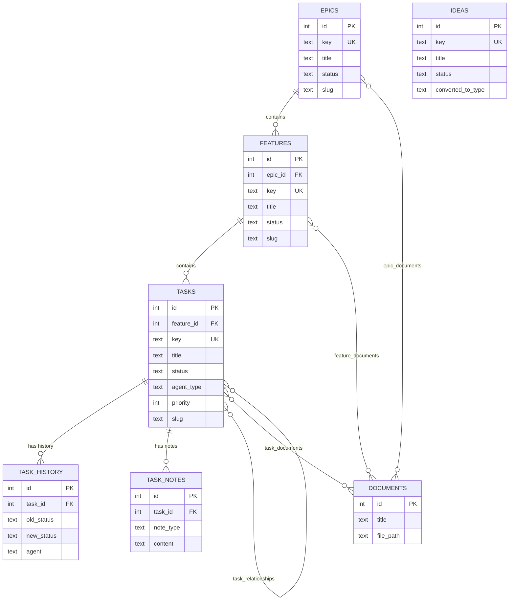

# SQLite Database Schema

> Part of the Shark Task Manager Brownfield Analysis
> Generated: 2026-03-20
> Phase: 9 — Specialized Documentation

## Overview

| Property | Value |
|----------|-------|
| **Engine** | SQLite (mattn/go-sqlite3 v1.14.32) |
| **Cloud Option** | Turso (libsql-client-go) |
| **File** | `shark-tasks.db` |
| **Mode** | WAL (Write-Ahead Logging) |
| **Schema Version** | 6 |
| **Foreign Keys** | Enabled |
| **Cache** | 64MB in-memory |
| **mmap** | 30GB |

## SQLite PRAGMA Configuration

```sql
PRAGMA foreign_keys = ON;
PRAGMA journal_mode = WAL;
PRAGMA busy_timeout = 5000;
PRAGMA synchronous = NORMAL;
PRAGMA cache_size = -64000;     -- 64MB
PRAGMA temp_store = MEMORY;
PRAGMA mmap_size = 30000000000; -- 30GB
```

Source: `internal/db/db.go:43-52`

## Table Schema

### Core Entity Tables

#### `epics`
```sql
CREATE TABLE epics (
    id              INTEGER PRIMARY KEY AUTOINCREMENT,
    key             TEXT NOT NULL UNIQUE,        -- E.g., "E07"
    title           TEXT NOT NULL,
    description     TEXT,
    status          TEXT NOT NULL,
    priority        TEXT NOT NULL CHECK (IN ('high', 'medium', 'low')),
    business_value  TEXT CHECK (IN ('high', 'medium', 'low')),
    file_path       TEXT,
    slug            TEXT,                        -- Added via migration
    created_at      TIMESTAMP NOT NULL DEFAULT CURRENT_TIMESTAMP,
    updated_at      TIMESTAMP NOT NULL DEFAULT CURRENT_TIMESTAMP
);
-- Trigger: auto-update updated_at on UPDATE
```

#### `features`
```sql
CREATE TABLE features (
    id              INTEGER PRIMARY KEY AUTOINCREMENT,
    epic_id         INTEGER NOT NULL REFERENCES epics(id) ON DELETE CASCADE,
    key             TEXT NOT NULL UNIQUE,        -- E.g., "E07-F01"
    title           TEXT NOT NULL,
    description     TEXT,
    status          TEXT NOT NULL,
    progress_pct    REAL NOT NULL DEFAULT 0.0 CHECK (>= 0.0 AND <= 100.0),
    execution_order INTEGER NULL,
    file_path       TEXT,
    slug            TEXT,                        -- Added via migration
    created_at      TIMESTAMP NOT NULL DEFAULT CURRENT_TIMESTAMP,
    updated_at      TIMESTAMP NOT NULL DEFAULT CURRENT_TIMESTAMP
);
-- Trigger: auto-update updated_at on UPDATE
```

#### `tasks`
```sql
CREATE TABLE tasks (
    id              INTEGER PRIMARY KEY AUTOINCREMENT,
    feature_id      INTEGER NOT NULL REFERENCES features(id) ON DELETE CASCADE,
    key             TEXT NOT NULL UNIQUE,        -- E.g., "T-E07-F01-001"
    title           TEXT NOT NULL,
    description     TEXT,
    status          TEXT NOT NULL,
    agent_type      TEXT,
    priority        INTEGER NOT NULL DEFAULT 5 CHECK (>= 1 AND <= 10),
    depends_on      TEXT,                       -- Deprecated: use task_relationships
    assigned_agent  TEXT,
    file_path       TEXT,
    blocked_reason  TEXT,
    execution_order INTEGER NULL,
    slug            TEXT,                        -- Added via migration
    created_at      TIMESTAMP NOT NULL DEFAULT CURRENT_TIMESTAMP,
    started_at      TIMESTAMP,
    completed_at    TIMESTAMP,
    blocked_at      TIMESTAMP,
    updated_at      TIMESTAMP NOT NULL DEFAULT CURRENT_TIMESTAMP
);
-- Trigger: auto-update updated_at on UPDATE
```

### Audit & History Tables

#### `task_history`
```sql
CREATE TABLE task_history (
    id          INTEGER PRIMARY KEY AUTOINCREMENT,
    task_id     INTEGER NOT NULL REFERENCES tasks(id) ON DELETE CASCADE,
    old_status  TEXT,
    new_status  TEXT NOT NULL,
    agent       TEXT,
    notes       TEXT,
    forced      BOOLEAN DEFAULT FALSE,
    timestamp   TIMESTAMP NOT NULL DEFAULT CURRENT_TIMESTAMP
);
```

#### `task_notes`
```sql
CREATE TABLE task_notes (
    id          INTEGER PRIMARY KEY AUTOINCREMENT,
    task_id     INTEGER NOT NULL REFERENCES tasks(id) ON DELETE CASCADE,
    note_type   TEXT NOT NULL CHECK (IN (
        'comment', 'decision', 'blocker', 'solution',
        'reference', 'implementation', 'testing',
        'future', 'question', 'rejection'
    )),
    content     TEXT NOT NULL,
    created_by  TEXT,
    created_at  TIMESTAMP NOT NULL DEFAULT CURRENT_TIMESTAMP
);
```

### Relationship Tables

#### `task_relationships`
```sql
CREATE TABLE task_relationships (
    id                  INTEGER PRIMARY KEY AUTOINCREMENT,
    from_task_id        INTEGER NOT NULL REFERENCES tasks(id) ON DELETE CASCADE,
    to_task_id          INTEGER NOT NULL REFERENCES tasks(id) ON DELETE CASCADE,
    relationship_type   TEXT NOT NULL CHECK (IN (
        'depends_on', 'blocks', 'related_to', 'follows',
        'spawned_from', 'duplicates', 'references'
    )),
    created_at          TIMESTAMP NOT NULL DEFAULT CURRENT_TIMESTAMP,
    UNIQUE(from_task_id, to_task_id, relationship_type)
);
```

### Document Tables

#### `documents`
```sql
CREATE TABLE documents (
    id          INTEGER PRIMARY KEY AUTOINCREMENT,
    title       TEXT NOT NULL,
    file_path   TEXT NOT NULL,
    created_at  TIMESTAMP NOT NULL DEFAULT CURRENT_TIMESTAMP,
    UNIQUE(title, file_path)
);
```

#### Junction Tables: `epic_documents`, `feature_documents`, `task_documents`
```sql
-- Same pattern for all three:
CREATE TABLE {entity}_documents (
    {entity}_id     INTEGER NOT NULL REFERENCES {entities}(id) ON DELETE CASCADE,
    document_id     INTEGER NOT NULL REFERENCES documents(id) ON DELETE CASCADE,
    created_at      TIMESTAMP NOT NULL DEFAULT CURRENT_TIMESTAMP,
    PRIMARY KEY ({entity}_id, document_id)
);
```

### Ideas Table

#### `ideas`
```sql
CREATE TABLE ideas (
    id                  INTEGER PRIMARY KEY AUTOINCREMENT,
    key                 TEXT NOT NULL UNIQUE,    -- Format: I-YYYY-MM-DD-xx
    title               TEXT NOT NULL,
    description         TEXT,
    created_date        TIMESTAMP NOT NULL,
    priority            INTEGER CHECK (>= 1 AND <= 10),
    display_order       INTEGER,
    notes               TEXT,
    related_docs        TEXT,                   -- JSON array
    dependencies        TEXT,                   -- JSON array
    status              TEXT NOT NULL DEFAULT 'new' CHECK (IN ('new','on_hold','converted','archived')),
    converted_to_type   TEXT CHECK (IN ('epic','feature','task')),
    converted_to_key    TEXT,
    converted_at        TIMESTAMP,
    created_at          TIMESTAMP NOT NULL DEFAULT CURRENT_TIMESTAMP,
    updated_at          TIMESTAMP NOT NULL DEFAULT CURRENT_TIMESTAMP
);
-- Trigger: auto-update updated_at on UPDATE
```

### Additional Tables (Added via Migrations)

- `entity_notes` — Polymorphic notes for any entity type
- `bugs` — Bug tracking entity
- `change_cards` — Change management entity
- `work_sessions` — Work session tracking
- `task_criteria` — Acceptance criteria
- `schema_version` — Migration version tracking

## Index Inventory

| Table | Index | Columns | Type |
|-------|-------|---------|------|
| epics | idx_epics_key | key | UNIQUE |
| epics | idx_epics_status | status | |
| epics | idx_epics_slug | slug | |
| features | idx_features_key | key | UNIQUE |
| features | idx_features_epic_id | epic_id | |
| features | idx_features_status | status | |
| features | idx_features_slug | slug | |
| tasks | idx_tasks_key | key | UNIQUE |
| tasks | idx_tasks_feature_id | feature_id | |
| tasks | idx_tasks_status | status | |
| tasks | idx_tasks_agent_type | agent_type | |
| tasks | idx_tasks_status_priority | status, priority | Composite |
| tasks | idx_tasks_priority | priority | |
| tasks | idx_tasks_file_path | file_path | |
| tasks | idx_tasks_slug | slug | |
| task_history | idx_task_history_task_id | task_id | |
| task_history | idx_task_history_timestamp | timestamp DESC | |
| task_notes | idx_task_notes_task_id | task_id | |
| task_notes | idx_task_notes_type | note_type | |
| task_notes | idx_task_notes_created_at | created_at | |
| task_notes | idx_task_notes_task_type | task_id, note_type | Composite |
| task_relationships | idx_...from | from_task_id | |
| task_relationships | idx_...to | to_task_id | |
| task_relationships | idx_...type | relationship_type | |
| task_relationships | idx_...from_type | from_task_id, relationship_type | Composite |
| task_relationships | idx_...to_type | to_task_id, relationship_type | Composite |

**Total indexes**: 25+ (including migration-added indexes)

## Triggers

| Trigger | Table | Event | Action |
|---------|-------|-------|--------|
| epics_updated_at | epics | AFTER UPDATE | Set updated_at = CURRENT_TIMESTAMP |
| features_updated_at | features | AFTER UPDATE | Set updated_at = CURRENT_TIMESTAMP |
| tasks_updated_at | tasks | AFTER UPDATE | Set updated_at = CURRENT_TIMESTAMP |
| ideas_updated_at | ideas | AFTER UPDATE | Set updated_at = CURRENT_TIMESTAMP |

## Entity-Relationship Diagram



## Migration History

Schema version 6 includes the following migration phases:
1. **Base schema** — Core tables (epics, features, tasks, task_history, task_notes, task_relationships, documents, ideas)
2. **Slug support** — Added `slug` column to epics, features, tasks
3. **Entity notes** — Added polymorphic `entity_notes` table
4. **Bugs & Change Cards** — Added `bugs` and `change_cards` tables
5. **Work sessions & Criteria** — Added `work_sessions` and `task_criteria` tables
6. **File path & execution order** — Added columns to various tables

Migrations are idempotent — safe to re-run. Version checking via `schema_version` table skips DDL when already current.

Source: `internal/db/db.go`, `internal/db/migrate.go`, `internal/db/migrate_slug_backfill.go`

---

See also: [Architecture Dependencies](../../architecture/dependencies.md) | [Data Models](../../reference/data-models.md)
