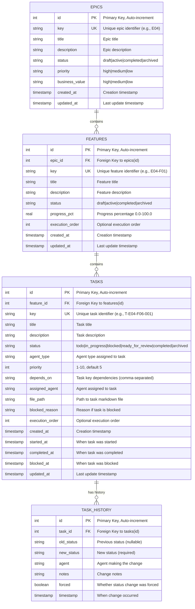
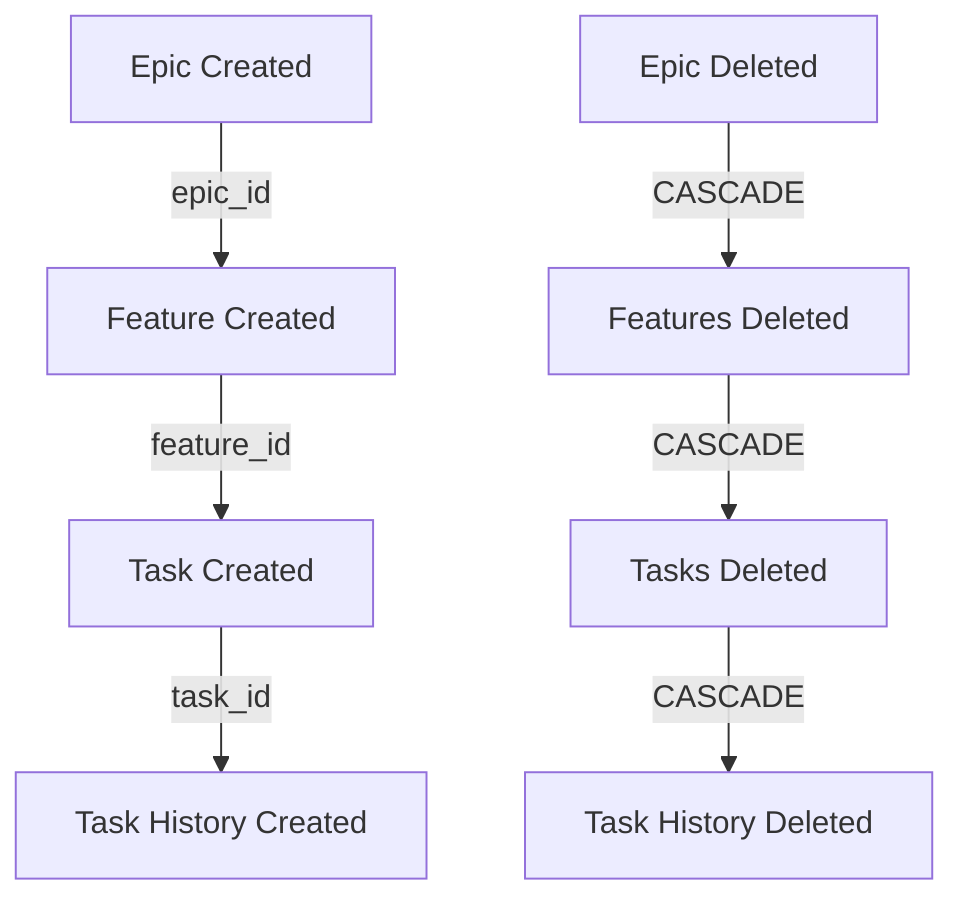

# Shark Task Manager - Database Schema ER Diagram

## Overview
The Shark Task Manager uses a relational SQLite database with four core tables: `epics`, `features`, `tasks`, and `task_history`. The schema enforces data integrity through foreign key constraints, CHECK constraints, and database-level triggers.

---

## Mermaid ER Diagram



---

## Detailed Table Schemas

### 1. EPICS Table

**Purpose**: Top-level organizational units for grouping features

**Location**: `internal/db/db.go` lines 71-93

| Column | Type | Constraints | Default | Description |
|--------|------|-------------|---------|-------------|
| `id` | INTEGER | PRIMARY KEY, AUTO-INCREMENT | - | Unique internal identifier |
| `key` | TEXT | NOT NULL, UNIQUE | - | Unique epic code (e.g., E04, E07) |
| `title` | TEXT | NOT NULL | - | Epic name/title |
| `description` | TEXT | - | NULL | Epic description/narrative |
| `status` | TEXT | NOT NULL, CHECK('draft'\|'active'\|'completed'\|'archived') | - | Current epic status |
| `priority` | TEXT | NOT NULL, CHECK('high'\|'medium'\|'low') | - | Epic priority level |
| `business_value` | TEXT | CHECK('high'\|'medium'\|'low') | NULL | Estimated business value |
| `created_at` | TIMESTAMP | NOT NULL | CURRENT_TIMESTAMP | Creation timestamp |
| `updated_at` | TIMESTAMP | NOT NULL | CURRENT_TIMESTAMP | Last update timestamp |

**Indexes**:
- `idx_epics_key`: UNIQUE on `(key)` - for fast key lookups
- `idx_epics_status`: on `(status)` - for filtering by status

**Relationships**:
- ONE epic → MANY features (via `features.epic_id`)
- Cascading delete: Deleting an epic deletes all associated features and tasks

**Triggers**:
- `epics_updated_at`: Auto-updates `updated_at` on any UPDATE

---

### 2. FEATURES Table

**Purpose**: Features within epics, representing deliverable functionality

**Location**: `internal/db/db.go` lines 98-124

| Column | Type | Constraints | Default | Description |
|--------|------|-------------|---------|-------------|
| `id` | INTEGER | PRIMARY KEY, AUTO-INCREMENT | - | Unique internal identifier |
| `epic_id` | INTEGER | NOT NULL, FOREIGN KEY | - | Reference to parent epic |
| `key` | TEXT | NOT NULL, UNIQUE | - | Unique feature code (e.g., E04-F01) |
| `title` | TEXT | NOT NULL | - | Feature name/title |
| `description` | TEXT | - | NULL | Feature description |
| `status` | TEXT | NOT NULL, CHECK('draft'\|'active'\|'completed'\|'archived') | - | Current feature status |
| `progress_pct` | REAL | NOT NULL, CHECK(0.0-100.0) | 0.0 | Completion percentage |
| `execution_order` | INTEGER | - | NULL | Optional execution sequence |
| `created_at` | TIMESTAMP | NOT NULL | CURRENT_TIMESTAMP | Creation timestamp |
| `updated_at` | TIMESTAMP | NOT NULL | CURRENT_TIMESTAMP | Last update timestamp |

**Indexes**:
- `idx_features_key`: UNIQUE on `(key)` - for fast key lookups
- `idx_features_epic_id`: on `(epic_id)` - for finding features by epic
- `idx_features_status`: on `(status)` - for filtering by status

**Relationships**:
- MANY → ONE: Each feature belongs to one epic
- ONE feature → MANY tasks (via `tasks.feature_id`)
- Cascading delete: Deleting a feature deletes all associated tasks and history

**Triggers**:
- `features_updated_at`: Auto-updates `updated_at` on any UPDATE

---

### 3. TASKS Table

**Purpose**: Atomic work items assigned to agents for execution

**Location**: `internal/db/db.go` lines 129-167

| Column | Type | Constraints | Default | Description |
|--------|------|-------------|---------|-------------|
| `id` | INTEGER | PRIMARY KEY, AUTO-INCREMENT | - | Unique internal identifier |
| `feature_id` | INTEGER | NOT NULL, FOREIGN KEY | - | Reference to parent feature |
| `key` | TEXT | NOT NULL, UNIQUE | - | Unique task key (e.g., T-E04-F06-001) |
| `title` | TEXT | NOT NULL | - | Task title |
| `description` | TEXT | - | NULL | Task description |
| `status` | TEXT | NOT NULL, CHECK(allowed values) | - | Current task status (see below) |
| `agent_type` | TEXT | - | NULL | Type of agent assigned (e.g., 'architect', 'developer') |
| `priority` | INTEGER | NOT NULL, CHECK(1-10) | 5 | Priority level 1 (lowest) to 10 (highest) |
| `depends_on` | TEXT | - | NULL | Comma-separated task key dependencies |
| `assigned_agent` | TEXT | - | NULL | Agent ID/name currently assigned |
| `file_path` | TEXT | - | NULL | Path to task's markdown file |
| `blocked_reason` | TEXT | - | NULL | Reason if task is blocked |
| `execution_order` | INTEGER | - | NULL | Optional execution sequence |
| `created_at` | TIMESTAMP | NOT NULL | CURRENT_TIMESTAMP | Creation timestamp |
| `started_at` | TIMESTAMP | - | NULL | When task transitioned to in_progress |
| `completed_at` | TIMESTAMP | - | NULL | When task was approved/completed |
| `blocked_at` | TIMESTAMP | - | NULL | When task was blocked |
| `updated_at` | TIMESTAMP | NOT NULL | CURRENT_TIMESTAMP | Last update timestamp |

**Status Values** (CHECK constraint):
- `todo`: Not started
- `in_progress`: Currently being worked on
- `blocked`: Blocked on dependency or issue
- `ready_for_review`: Completed, awaiting approval
- `completed`: Approved and done
- `archived`: No longer relevant

**Indexes**:
- `idx_tasks_key`: UNIQUE on `(key)` - for fast task lookup
- `idx_tasks_feature_id`: on `(feature_id)` - for finding tasks by feature
- `idx_tasks_status`: on `(status)` - for status filtering (e.g., `task next`)
- `idx_tasks_agent_type`: on `(agent_type)` - for filtering by agent type
- `idx_tasks_status_priority`: COMPOSITE on `(status, priority)` - for ordered task queries
- `idx_tasks_priority`: on `(priority)` - for priority filtering
- `idx_tasks_file_path`: on `(file_path)` - for file-to-task mapping

**Relationships**:
- MANY → ONE: Each task belongs to one feature
- ONE task → MANY history records (via `task_history.task_id`)
- Cascading delete: Deleting a task deletes all associated history

**Triggers**:
- `tasks_updated_at`: Auto-updates `updated_at` on any UPDATE

---

### 4. TASK_HISTORY Table

**Purpose**: Audit trail of task status transitions and changes

**Location**: `internal/db/db.go` lines 172-187

| Column | Type | Constraints | Default | Description |
|--------|------|-------------|---------|-------------|
| `id` | INTEGER | PRIMARY KEY, AUTO-INCREMENT | - | Unique history record identifier |
| `task_id` | INTEGER | NOT NULL, FOREIGN KEY | - | Reference to task |
| `old_status` | TEXT | - | NULL | Previous status (NULL for creation) |
| `new_status` | TEXT | NOT NULL | - | Status after change |
| `agent` | TEXT | - | NULL | Agent making the change |
| `notes` | TEXT | - | NULL | Change notes/comments |
| `forced` | BOOLEAN | - | FALSE | Whether change bypassed normal validation |
| `timestamp` | TIMESTAMP | NOT NULL | CURRENT_TIMESTAMP | When change occurred |

**Indexes**:
- `idx_task_history_task_id`: on `(task_id)` - for finding history by task
- `idx_task_history_timestamp`: on `(timestamp DESC)` - for chronological queries

**Relationships**:
- MANY → ONE: Each history record references one task
- No cascading delete from tasks (history records are preserved)

---

## Relationship Diagrams

### Hierarchy Flow
```
EPICS (E04, E07, etc.)
  ├── FEATURES (E04-F01, E04-F02, etc.)
  │   ├── TASKS (T-E04-F01-001, T-E04-F01-002, etc.)
  │   │   └── TASK_HISTORY (status change audit trail)
  │   └── TASKS
  │       └── TASK_HISTORY
  └── FEATURES
      └── TASKS
          └── TASK_HISTORY
```

### Foreign Key Constraints
```
features.epic_id → epics.id (ON DELETE CASCADE)
tasks.feature_id → features.id (ON DELETE CASCADE)
task_history.task_id → tasks.id (ON DELETE CASCADE)
```

**Cascading Behavior**:
- Deleting an epic cascades to all its features, then all tasks, then all history records
- Deleting a feature cascades to all its tasks, then all history records
- Deleting a task preserves history records (NOT CASCADE would be better for audit)

---

## Constraint Summary

### Primary Keys
- All tables use `INTEGER PRIMARY KEY AUTOINCREMENT` for internal IDs
- Enables fast joins and provides database-level uniqueness guarantees

### Unique Constraints
- `epics.key`: Ensures each epic code is unique (e.g., E04)
- `features.key`: Ensures each feature code is unique (e.g., E04-F01)
- `tasks.key`: Ensures each task code is unique (e.g., T-E04-F01-001)

### Check Constraints
- `epics.status`: Must be draft|active|completed|archived
- `epics.priority`: Must be high|medium|low
- `epics.business_value`: Must be high|medium|low (nullable)
- `features.status`: Must be draft|active|completed|archived
- `features.progress_pct`: Must be >= 0.0 AND <= 100.0
- `tasks.status`: Must be todo|in_progress|blocked|ready_for_review|completed|archived
- `tasks.priority`: Must be >= 1 AND <= 10

### Foreign Keys
- All enabled via `PRAGMA foreign_keys = ON`
- Enforced at database level; prevents orphaned records
- Cascading deletes maintain referential integrity

### Not Null Constraints
- Core identifying fields (`key`, `title`) required
- Status fields required (defaults not allowed)
- Timestamps required (auto-populated)

---

## Index Strategy

### Query Patterns and Optimization

**Task Lookup (Single Record)**
```sql
SELECT * FROM tasks WHERE key = 'T-E04-F06-001';
-- Uses: idx_tasks_key (UNIQUE, fastest)
```

**Find All Tasks by Status**
```sql
SELECT * FROM tasks WHERE status = 'todo' ORDER BY priority DESC;
-- Uses: idx_tasks_status (single filter)
```

**Get Next Available Task (Status + Priority)**
```sql
SELECT * FROM tasks
WHERE status IN ('todo', 'in_progress') AND agent_type = 'developer'
ORDER BY priority DESC, created_at ASC
LIMIT 1;
-- Uses: idx_tasks_status_priority (composite, highly optimized)
```

**Find Task by Feature**
```sql
SELECT * FROM tasks WHERE feature_id = 123;
-- Uses: idx_tasks_feature_id (single FK lookup)
```

**Filter by Agent Type**
```sql
SELECT * FROM tasks WHERE agent_type = 'architect';
-- Uses: idx_tasks_agent_type (quick type filtering)
```

**Map File to Task**
```sql
SELECT * FROM tasks WHERE file_path = 'docs/plan/E04/F06/T-E04-F06-001.md';
-- Uses: idx_tasks_file_path (for sync operations)
```

**History Timeline**
```sql
SELECT * FROM task_history WHERE task_id = 42 ORDER BY timestamp DESC;
-- Uses: idx_task_history_task_id + idx_task_history_timestamp
```

**Find Feature by Key**
```sql
SELECT * FROM features WHERE key = 'E04-F01';
-- Uses: idx_features_key (UNIQUE, fastest)
```

**Get Features by Epic**
```sql
SELECT * FROM features WHERE epic_id = 5 ORDER BY execution_order;
-- Uses: idx_features_epic_id (FK lookup)
```

---

## Performance Characteristics

### Index Types Used
- **UNIQUE indexes**: For primary key-like fields (key columns)
- **Single-column indexes**: For common filter conditions
- **Composite indexes**: For multi-column filtering (`status, priority`)

### Expected Query Performance
- Point lookups (single record by key): O(log n) via UNIQUE index
- Range scans (status, priority, agent_type): O(log n) via covering index
- Foreign key joins: O(log n) with indexed FK columns
- Aggregations (progress calculation): O(n) for feature tasks

### Missing Indexes (Considered)
- `(epic_id, status)` on features: Could optimize epic status queries
- `(task_id, timestamp)` on task_history: Already have both indexed separately
- Created_at ordering: Not indexed; tasks use priority + created_at ordering via application logic

---

## Data Integrity Features

### Foreign Key Enforcement
```sqlite
PRAGMA foreign_keys = ON;
```
- Prevents insertion of orphaned records
- Prevents deletion of parent records with children (unless CASCADE)
- Prevents invalid epic_id, feature_id references

### Check Constraints
- Database-level validation of status enums
- Priority range validation (1-10)
- Progress percentage bounds (0-100)
- Prevents invalid data at insertion/update time

### Unique Constraints
- Epic/feature/task keys must be globally unique
- Prevents duplicate identifiers
- Enables reliable key-based lookups

### Triggers
- Auto-timestamp updates on every record change
- Maintains consistent `updated_at` across all tables
- Enables audit trail creation (application handles history triggers)

---

## Referential Integrity Guarantees



**Orphan Prevention**:
- Cannot create feature without epic
- Cannot create task without feature
- Cannot create history without task
- Foreign key constraints prevent invalid references

**Cascade Semantics**:
- Deleting epic = deleting entire feature tree and task hierarchy
- Useful for cleanup; potential data loss if not careful
- Application should soft-delete (status='archived') instead of hard delete

