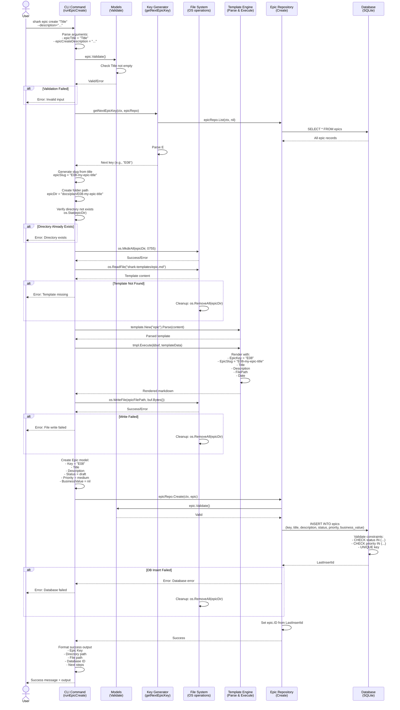

# Epic Creation Flow: CLI to Database

Comprehensive documentation of the epic creation workflow from CLI command entry through database persistence.

## Overview

The epic creation process follows a clean architecture pattern with clear separation of concerns across CLI, validation, repository, and database layers.

```
User Input
    ↓
CLI Argument Parsing
    ↓
Validation Layer
    ↓
Key Generation
    ↓
File System Operations
    ↓
Repository Layer
    ↓
Database Operations
    ↓
Success Response
```

---

## Detailed Flow Diagram: Sequence Diagram



---

## Detailed Flow Diagram: State Machine / Flowchart

```mermaid
flowchart TD
    Start([User: shark epic create]) --> Parse["Parse CLI Arguments<br/>- Title<br/>- Description optional"]
    Parse --> GetDB["Get Database Path<br/>cli.GetDBPath"]
    GetDB --> InitDB["Initialize Database<br/>db.InitDB"]
    InitDB --> CheckDB{DB Error?}
    CheckDB -->|Yes| ErrorDB["Return Database Error<br/>Exit Code 2"]
    CheckDB -->|No| CreateRepo["Create Repositories<br/>- EpicRepository"]

    CreateRepo --> ValidateInput["Validate Epic Input<br/>- Title not empty<br/>- Description optional"]
    ValidateInput --> CheckValid{Valid?}
    CheckValid -->|No| ErrorValid["Return Validation Error<br/>Exit Code 1"]
    CheckValid -->|Yes| GetNextKey["Get Next Epic Key<br/>getNextEpicKey()"]

    GetNextKey --> QueryList["Query Existing Epics<br/>SELECT * FROM epics<br/>ORDER BY created_at DESC"]
    QueryList --> ParseKeys["Parse E## Keys<br/>Extract numbers<br/>Find max number"]
    ParseKeys --> CalcNext["Calculate Next Key<br/>maxNum + 1<br/>Format as E##"]
    CalcNext --> GenSlug["Generate Slug<br/>utils.GenerateSlug<br/>Title -&gt; slug"]

    GenSlug --> BuildPath["Build Paths<br/>epicSlug = E##-slug<br/>epicDir = docs/plan/E##-slug"]
    BuildPath --> CheckDirExists{Directory<br/>Exists?}
    CheckDirExists -->|Yes| ErrorDirExists["Error: Dir already exists<br/>Exit Code 1"]
    CheckDirExists -->|No| CreateDir["Create Directory<br/>os.MkdirAll epicDir"]

    CreateDir --> CheckDirErr{Dir Create<br/>Error?}
    CheckDirErr -->|Yes| ErrorDirCreate["Error: Failed to create dir<br/>Exit Code 1"]
    CheckDirErr -->|No| ReadTemplate["Read Template<br/>os.ReadFile shark-templates/epic.md"]

    ReadTemplate --> CheckTemplate{Template<br/>Found?}
    CheckTemplate -->|No| ErrorTemplate["Error: Template missing<br/>Suggest shark init<br/>Exit Code 1"]
    CheckTemplate -->|Yes| ParseTemplate["Parse Template<br/>template.New.Parse"]

    ParseTemplate --> CheckParse{Parse<br/>Error?}
    CheckParse -->|Yes| ErrorParse["Error: Template parse failed<br/>Cleanup: RemoveAll dir<br/>Exit Code 1"]
    CheckParse -->|No| PrepareData["Prepare Template Data<br/>- EpicKey<br/>- EpicSlug<br/>- Title<br/>- Description<br/>- FilePath<br/>- Date"]

    PrepareData --> ExecuteTemplate["Execute Template<br/>tmpl.Execute buf"]
    ExecuteTemplate --> CheckExec{Exec<br/>Error?}
    CheckExec -->|Yes| ErrorExec["Error: Template execution failed<br/>Cleanup: RemoveAll dir<br/>Exit Code 1"]
    CheckExec -->|No| WriteFile["Write Epic File<br/>os.WriteFile epicFilePath"]

    WriteFile --> CheckWrite{Write<br/>Error?}
    CheckWrite -->|Yes| ErrorWrite["Error: File write failed<br/>Cleanup: RemoveAll dir<br/>Exit Code 1"]
    CheckWrite -->|No| BuildModel["Build Epic Model<br/>- Key = nextKey<br/>- Title<br/>- Description ptr<br/>- Status = draft<br/>- Priority = medium<br/>- BusinessValue = nil"]

    BuildModel --> ValidateModel["Validate Epic Model<br/>epic.Validate"]
    ValidateModel --> CheckModelValid{Valid?}
    CheckModelValid -->|No| ErrorModelValid["Error: Model validation failed<br/>Cleanup: RemoveAll dir<br/>Exit Code 1"]
    CheckModelValid -->|Yes| DBInsert["Insert into Database<br/>epicRepo.Create"]

    DBInsert --> DBConstraints["Database Enforces:<br/>- UNIQUE key<br/>- CHECK status<br/>- CHECK priority<br/>- NOT NULL title<br/>- Foreign keys"]
    DBConstraints --> CheckInsert{DB Insert<br/>Error?}
    CheckInsert -->|Yes| ErrorInsert["Error: Database insert failed<br/>Cleanup: RemoveAll dir<br/>Exit Code 2"]
    CheckInsert -->|No| GetID["Get LastInsertId<br/>Set epic.ID"]

    GetID --> CheckID{ID<br/>Valid?}
    CheckID -->|No| ErrorID["Error: Failed to get ID<br/>Cleanup: RemoveAll dir<br/>Exit Code 2"]
    CheckID -->|Yes| Success["Format Success Output<br/>- Epic Key<br/>- Directory<br/>- File path<br/>- Database ID<br/>- Next steps"]

    Success --> Output["Output to User<br/>Print Success + Info"]
    Output --> End([Success: Epic Created])

    style Start fill:#90EE90
    style End fill:#90EE90
    style ErrorDB fill:#FFB6C6
    style ErrorValid fill:#FFB6C6
    style ErrorDirExists fill:#FFB6C6
    style ErrorDirCreate fill:#FFB6C6
    style ErrorTemplate fill:#FFB6C6
    style ErrorParse fill:#FFB6C6
    style ErrorExec fill:#FFB6C6
    style ErrorWrite fill:#FFB6C6
    style ErrorModelValid fill:#FFB6C6
    style ErrorInsert fill:#FFB6C6
    style ErrorID fill:#FFB6C6

```



---

## Layer-by-Layer Breakdown

### 1. CLI Layer: `runEpicCreate` (internal/cli/commands/epic.go)

**Entry Point**: User executes `shark epic create "Title" --description="..."`

**Responsibility**: Orchestrate the creation workflow

**Key Operations**:
```go
// Extract arguments
epicTitle := args[0]  // Positional argument

// Extract flags
epicCreateDescription  // Optional --description flag

// Establish database connection
dbPath, err := cli.GetDBPath()
database, err := db.InitDB(dbPath)

// Create repositories
repoDb := repository.NewDB(database)
epicRepo := repository.NewEpicRepository(repoDb)

// Orchestrate workflow
nextKey, err := getNextEpicKey(ctx, epicRepo)
// ... additional steps ...
err := epicRepo.Create(ctx, epic)
```

**Error Handling**:
- Database path retrieval: Exit code 1
- Database initialization: Exit code 2
- Key generation: Exit code 1
- Directory operations: Exit code 1
- Template operations: Exit code 1
- Database creation: Exit code 2 (rolled back with cleanup)

### 2. Validation Layer: `Epic.Validate()` (internal/models/validation.go)

**Models**: `Epic` struct validation

**Constraints Enforced**:
- Title: Non-empty (implicit in model)
- Description: Optional string pointer
- Status: Must be one of {draft, active, completed, archived}
- Priority: Must be one of {high, medium, low}
- BusinessValue: Optional, must be one of {high, medium, low}

**Validation Points**:
1. Model creation (CLI layer): Basic type validation
2. Repository layer: Call `Validate()` before database insert
3. Database layer: Constraints enforced via CHECK conditions

### 3. Key Generation: `getNextEpicKey()` (internal/cli/commands/epic.go)

**Algorithm**:
```
1. Query all existing epics: SELECT * FROM epics
2. Parse each epic.Key using fmt.Sscanf(key, "E%d", &num)
3. Track maxNum (highest number found)
4. Return fmt.Sprintf("E%02d", maxNum+1)
5. Returns key like "E08" for next available
```

**Edge Cases**:
- No epics exist: Returns "E01"
- Non-standard keys in database: Ignored (fmt.Sscanf fails silently)
- Concurrent creation: Potential race condition (resolved by UNIQUE constraint)

### 4. File System Layer: Markdown File Creation

**Directory Structure Created**:
```
docs/plan/
  └── {epicSlug}/
      └── epic.md
```

Where `epicSlug = fmt.Sprintf("%s-%s", nextKey, slug)`

**Template Operations**:
1. Read: `os.ReadFile("shark-templates/epic.md")`
2. Parse: `template.New("epic").Parse(content)`
3. Render: `tmpl.Execute(&buf, templateData)`
4. Write: `os.WriteFile(epicFilePath, buf.Bytes())`

**Template Data**:
```go
type EpicTemplateData struct {
    EpicKey     string        // "E08"
    EpicSlug    string        // "E08-my-epic-title"
    Title       string        // User input
    Description string        // User input or empty
    FilePath    string        // Full path to epic.md
    Date        string        // time.Now().Format("2006-01-02")
}
```

**Cleanup on Failure**:
- All errors during file operations: `os.RemoveAll(epicDir)`
- Database insert fails: `os.RemoveAll(epicDir)` (already created files)

### 5. Repository Layer: `EpicRepository.Create()` (internal/repository/epic_repository.go)

**Operation**: Insert epic record into database

**Input**: `*models.Epic` (populated by CLI layer)

**Process**:
```go
// Validate model
err := epic.Validate()

// Build parameterized query
query := `
    INSERT INTO epics (key, title, description, status, priority, business_value)
    VALUES (?, ?, ?, ?, ?, ?)
`

// Execute with context timeout
result, err := r.db.ExecContext(ctx, query,
    epic.Key,
    epic.Title,
    epic.Description,
    epic.Status,
    epic.Priority,
    epic.BusinessValue,
)

// Get auto-generated ID
id, err := result.LastInsertId()
epic.ID = id  // Populate ID on success
```

**Error Wrapping**:
- Validation: `fmt.Errorf("validation failed: %w", err)`
- Execution: `fmt.Errorf("failed to create epic: %w", err)`
- ID retrieval: `fmt.Errorf("failed to get last insert id: %w", err)`

### 6. Database Layer: SQLite (internal/db/db.go)

**Table**: `epics`

**Schema**:
```sql
CREATE TABLE epics (
    id INTEGER PRIMARY KEY AUTOINCREMENT,
    key TEXT NOT NULL UNIQUE,
    title TEXT NOT NULL,
    description TEXT,
    status TEXT NOT NULL CHECK (status IN ('draft', 'active', 'completed', 'archived')),
    priority TEXT NOT NULL CHECK (priority IN ('high', 'medium', 'low')),
    business_value TEXT CHECK (business_value IN ('high', 'medium', 'low')),
    created_at TIMESTAMP NOT NULL DEFAULT CURRENT_TIMESTAMP,
    updated_at TIMESTAMP NOT NULL DEFAULT CURRENT_TIMESTAMP
);
```

**Constraints**:
- `UNIQUE key`: Prevents duplicate epic keys
- `NOT NULL title`: Requires title
- `NOT NULL status`: Requires status value
- `NOT NULL priority`: Requires priority value
- `CHECK status IN (...)`: Validates status enum
- `CHECK priority IN (...)`: Validates priority enum
- `CHECK business_value IN (...)`: Validates business_value enum

**Triggers**:
```sql
CREATE TRIGGER epics_updated_at
AFTER UPDATE ON epics
FOR EACH ROW
BEGIN
    UPDATE epics SET updated_at = CURRENT_TIMESTAMP WHERE id = NEW.id;
END;
```
Auto-updates timestamp on any update operation.

**Indexes**:
```sql
CREATE UNIQUE INDEX idx_epics_key ON epics(key);
CREATE INDEX idx_epics_status ON epics(status);
```

**PRAGMAs** (Performance & Safety):
- `PRAGMA foreign_keys = ON`: Enable referential integrity
- `PRAGMA journal_mode = WAL`: Write-Ahead Logging for concurrency
- `PRAGMA busy_timeout = 5000`: 5-second lock timeout
- `PRAGMA synchronous = NORMAL`: Balance safety/performance
- `PRAGMA cache_size = -64000`: 64MB cache
- `PRAGMA mmap_size = 30000000000`: Memory-mapped I/O

---

## Data Transformations by Layer

### Input → Model
```
CLI Arguments:
  epicTitle = "User Authentication System"
  epicCreateDescription = "OAuth and MFA support"

↓ Transform to:

models.Epic{
  Key:          "E08" (generated)
  Title:        "User Authentication System"
  Description:  &("OAuth and MFA support")
  Status:       "draft"
  Priority:     "medium"
  BusinessValue: nil
  CreatedAt:    <auto>
  UpdatedAt:    <auto>
}
```

### Model → SQL
```
models.Epic{
  Key: "E08"
  Title: "User Authentication System"
  Description: &("OAuth and MFA support")
  Status: "draft"
  Priority: "medium"
  BusinessValue: nil
}

↓ Transform to SQL:

INSERT INTO epics (
  key, title, description, status, priority, business_value
) VALUES (
  'E08',
  'User Authentication System',
  'OAuth and MFA support',
  'draft',
  'medium',
  NULL
)
```

### SQL Result → Response
```
Database Return:
  LastInsertId = 42
  RowsAffected = 1
  Error = nil

↓ Transform to:

Epic{
  ID: 42
  Key: "E08"
  Title: "User Authentication System"
  Description: &("OAuth and MFA support")
  Status: "draft"
  Priority: "medium"
  BusinessValue: nil
  CreatedAt: 2025-12-19T14:30:00Z
  UpdatedAt: 2025-12-19T14:30:00Z
}

↓ Format as:

Success message with:
  - Epic Key: E08
  - Directory: docs/plan/E08-user-authentication-system
  - File: docs/plan/E08-user-authentication-system/epic.md
  - Database: ✓ Epic record created (ID: 42)
  - Next steps: Create features, edit epic.md
```

---

## Error Handling Paths

### Scenario 1: Invalid Input
```
User Input: shark epic create ""  # Empty title
  ↓
CLI Parse: epicTitle = ""
  ↓
Validation: Title check (implicit, caught during validation)
  ↓
Error: "title cannot be empty"
  ↓
Exit Code: 1 (Invalid input)
  ↓
No cleanup: No files created yet
```

### Scenario 2: Database Connection Failure
```
CLI: db.InitDB(dbPath)
  ↓
DB: Failed to open/ping database
  ↓
Error: "Database error. Run with --verbose for details."
  ↓
Exit Code: 2 (Database error)
  ↓
No cleanup: No files created yet
```

### Scenario 3: Key Generation Failure
```
Key Generation: epicRepo.List() fails
  ↓
Error: "Failed to get next epic key: database error"
  ↓
Exit Code: 1 (Can't generate key)
  ↓
No cleanup: No files created yet
```

### Scenario 4: Directory Creation Failure
```
File Operations: os.MkdirAll(epicDir)
  ↓
Error: Permission denied
  ↓
Error Message: "Failed to create epic directory: permission denied"
  ↓
Exit Code: 1 (File system error)
  ↓
Cleanup: Potentially partial directory tree
```

### Scenario 5: Template Not Found
```
File Operations: os.ReadFile("shark-templates/epic.md")
  ↓
Error: File not found
  ↓
Error Message: "Failed to read epic template"
  ↓
Info Message: "Make sure you've run 'shark init' to create templates"
  ↓
Exit Code: 1 (Template error)
  ↓
Cleanup: os.RemoveAll(epicDir) to clean up created directory
```

### Scenario 6: Database Insert Failure
```
Repository: epicRepo.Create(ctx, epic)
  ↓
DB: INSERT fails (e.g., UNIQUE constraint on key)
  ↓
Error: "failed to create epic: UNIQUE constraint failed"
  ↓
Exit Code: 2 (Database error)
  ↓
Cleanup: os.RemoveAll(epicDir) - cleanup file created
```

---

## Concurrency Considerations

### Race Condition 1: Epic Key Generation
**Scenario**: Two concurrent `epic create` commands both call `getNextEpicKey()`

**Without Transaction**:
```
Command 1: MAX(number) = 7 → Next key = E08
Command 2: MAX(number) = 7 → Next key = E08

Both try to insert E08 → UNIQUE constraint violation
```

**Current Mitigation**: Database UNIQUE constraint prevents duplicate keys
- First insert succeeds with E08
- Second insert fails: "UNIQUE constraint failed: epics.key"
- User gets error and can retry

**Better Mitigation**: Not implemented - use transaction or lock

### Race Condition 2: File System Operations
**Scenario**: Two concurrent commands create same epic

**Current**:
1. Both check `os.Stat(epicDir)` → Not exists (both pass)
2. Both `os.MkdirAll(epicDir)` → Second succeeds (idempotent)
3. Both write `epic.md` → Second overwrites
4. First INSERT succeeds, second gets UNIQUE violation
5. Inconsistent state: Files created, DB error

**Mitigation**: None - potential data loss on concurrent creation

---

## Summary Table: Responsibilities by Layer

| Layer | Component | Responsibility | Error Handling |
|-------|-----------|-----------------|-----------------|
| CLI | `runEpicCreate` | Orchestration, argument parsing, user I/O | Exit codes, cleanup |
| Validation | `models.Epic.Validate()` | Type and enum validation | Error messages |
| Key Gen | `getNextEpicKey()` | Query and calculate next key | Error propagation |
| File Ops | `os` package | Create directories and files | Exception handling, cleanup |
| Template | `text/template` | Render markdown from template | Parse/execute errors |
| Repository | `EpicRepository.Create()` | Model validation + DB execute | Wrap DB errors |
| Database | SQLite | Persist data, enforce constraints | Constraint violations |

