# Feature Creation Flow: CLI to Database

Comprehensive documentation of the feature creation workflow from CLI command entry through database persistence.

## Overview

The feature creation process extends the epic creation pattern with additional dependencies on parent epic validation and hierarchical directory structure.

```
User Input
    ↓
CLI Argument Parsing
    ↓
Validation Layer (Epic + Feature)
    ↓
Key Generation
    ↓
File System Operations (Hierarchical)
    ↓
Repository Layer
    ↓
Database Operations
    ↓
Success Response
```

---

## Detailed Flow Diagram: Sequence Diagram

```mermaid
sequenceDiagram
    actor User
    participant CLI as CLI Command<br/>(runFeatureCreate)
    participant Validation as Models<br/>(Validate)
    participant EpicCheck as Epic Verification
    participant KeyGen as Key Generator<br/>(getNextFeatureKey)
    participant FileOps as File System<br/>(OS operations)
    participant Template as Template Engine
    participant Repo as Feature Repository<br/>(Create)
    participant DB as Database<br/>(SQLite)

    User->>CLI: shark feature create "Title"<br/>--epic=E01 --description="..."

    CLI->>CLI: Parse arguments:<br/>- featureTitle = "Title"<br/>- featureCreateEpic = "E01"<br/>- description = optional<br/>- execution-order = optional

    CLI->>CLI: Validate epic key format<br/>isValidEpicKey(featureCreateEpic)

    alt Invalid Epic Key Format
        CLI-->>User: Error: Invalid epic key format (E##)
    end

    CLI->>CLI: Get database path<br/>Establish connection
    CLI->>CLI: Create repositories

    CLI->>EpicCheck: epicRepo.GetByKey(ctx, featureCreateEpic)
    EpicCheck->>DB: SELECT * FROM epics WHERE key = ?
    DB-->>EpicCheck: Epic record
    EpicCheck-->>CLI: Epic with ID

    alt Epic Not Found
        CLI-->>User: Error: Epic not found
        CLI->>CLI: Suggest: shark epic list
    end

    CLI->>Validation: feature.Validate()
    Validation->>Validation: Check Title not empty
    Validation-->>CLI: Valid/Error

    alt Feature Validation Failed
        CLI-->>User: Error: Invalid feature input
    end

    CLI->>KeyGen: getNextFeatureKey(ctx, featureRepo, epic.ID)
    KeyGen->>Repo: featureRepo.ListByEpic(ctx, epic.ID)
    Repo->>DB: SELECT * FROM features<br/>WHERE epic_id = ?
    DB-->>Repo: Feature records for epic
    KeyGen->>KeyGen: Parse E##-F## format<br/>Extract F## numbers<br/>Find max feature number<br/>within this epic
    KeyGen-->>CLI: Next key (e.g., "F03")

    CLI->>CLI: Generate slug from title<br/>featureSlug = "E01-F03-feature-title"

    CLI->>CLI: Find epic directory<br/>using glob pattern:<br/>docs/plan/E01-*

    CLI->>FileOps: filepath.Glob("docs/plan/E01-*")
    FileOps-->>CLI: Epic directory path

    alt Epic Directory Not Found
        CLI-->>User: Error: Epic directory not found
        CLI->>CLI: Suggest: Epic exists in DB but dir missing
    end

    CLI->>CLI: Build feature directory path<br/>featureDir = epicDir/E01-F03-feature-title

    CLI->>CLI: Verify feature dir not exists<br/>os.Stat(featureDir)

    alt Feature Directory Already Exists
        CLI-->>User: Error: Feature directory exists
    end

    CLI->>FileOps: os.MkdirAll(featureDir, 0755)
    FileOps-->>CLI: Success/Error

    CLI->>FileOps: os.ReadFile("shark-templates/feature.md")
    FileOps-->>CLI: Template content

    alt Template Not Found
        CLI-->>User: Error: Template missing
        FileOps->>FileOps: Cleanup: os.RemoveAll(featureDir)
    end

    CLI->>Template: template.New("feature").Parse(content)
    Template-->>CLI: Parsed template

    CLI->>Template: tmpl.Execute(&buf, templateData)
    Template->>Template: Render with:<br/>- EpicKey = "E01"<br/>- FeatureKey = "F03"<br/>- FeatureSlug<br/>- Title<br/>- Description<br/>- ExecutionOrder<br/>- FilePath<br/>- Date
    Template-->>CLI: Rendered markdown

    CLI->>FileOps: os.WriteFile(featureFilePath, buf.Bytes())
    FileOps-->>CLI: Success/Error

    alt Write Failed
        CLI-->>User: Error: File write failed
        FileOps->>FileOps: Cleanup: os.RemoveAll(featureDir)
    end

    CLI->>CLI: Build Feature key<br/>featureKey = E01-F03

    CLI->>CLI: Create Feature model:<br/>- EpicID = epic.ID<br/>- Key = "E01-F03"<br/>- Title<br/>- Description<br/>- Status = draft<br/>- ProgressPct = 0.0<br/>- ExecutionOrder = optional

    CLI->>Repo: featureRepo.Create(ctx, feature)

    Repo->>Validation: feature.Validate()
    Validation-->>Repo: Valid

    Repo->>DB: INSERT INTO features<br/>(epic_id, key, title, description,<br/>status, progress_pct, execution_order)
    DB->>DB: Validate constraints:<br/>- FOREIGN KEY epic_id<br/>- UNIQUE key<br/>- CHECK status IN (...)<br/>- CHECK progress_pct

    DB-->>Repo: LastInsertId

    alt DB Insert Failed
        Repo-->>CLI: Error: Database error
        CLI-->>User: Error: Database failed
        FileOps->>FileOps: Cleanup: os.RemoveAll(featureDir)
    end

    Repo->>Repo: Set feature.ID from LastInsertId
    Repo-->>CLI: Success

    CLI->>CLI: Format success output<br/>- Feature Key<br/>- Epic reference<br/>- Directory path<br/>- File path<br/>- Next steps
    CLI-->>User: Success message + output

```



---

## Detailed Flow Diagram: State Machine / Flowchart

```mermaid
flowchart TD
    Start([User: shark feature create]) --> Parse["Parse CLI Arguments<br/>- Title<br/>- --epic=KEY required<br/>- --description optional<br/>- --execution-order optional"]

    Parse --> ValidateEpicKey["Validate Epic Key Format<br/>Must match E##"]
    ValidateEpicKey --> CheckKey{Valid Key<br/>Format?}
    CheckKey -->|No| ErrorKeyFormat["Error: Invalid key format<br/>Must be E## like E01<br/>Exit Code 1"]

    CheckKey -->|Yes| GetDB["Get Database Path<br/>cli.GetDBPath"]
    GetDB --> InitDB["Initialize Database<br/>db.InitDB"]
    InitDB --> CheckDB{DB Error?}
    CheckDB -->|Yes| ErrorDB["Error: Database error<br/>Exit Code 2"]
    CheckDB -->|No| CreateRepo["Create Repositories<br/>- EpicRepository<br/>- FeatureRepository"]

    CreateRepo --> VerifyEpic["Verify Epic Exists<br/>epicRepo.GetByKey<br/>Query: WHERE key = ?"]
    VerifyEpic --> CheckEpic{Epic<br/>Found?}
    CheckEpic -->|No| ErrorEpic["Error: Epic not found<br/>Suggest: shark epic list<br/>Exit Code 1"]

    CheckEpic -->|Yes| GetEpicID["Extract epic.ID<br/>from returned record"]
    GetEpicID --> ValidateInput["Validate Feature Input<br/>- Title not empty<br/>- Description optional"]
    ValidateInput --> CheckValid{Valid?}
    CheckValid -->|No| ErrorValid["Error: Validation failed<br/>Exit Code 1"]

    CheckValid -->|Yes| GetNextKey["Get Next Feature Key<br/>getNextFeatureKey(featureRepo, epic.ID)"]
    GetNextKey --> QueryFeatures["Query Features for Epic<br/>SELECT * FROM features<br/>WHERE epic_id = ?<br/>ORDER BY execution_order"]
    QueryFeatures --> ParseKeys["Parse E##-F## Keys<br/>Extract F## numbers<br/>Find max within epic"]
    ParseKeys --> CalcNext["Calculate Next Key<br/>maxFeatureNum + 1<br/>Format as F##"]
    CalcNext --> GenSlug["Generate Slug<br/>Title -&gt; slug"]

    GenSlug --> BuildEpicPath["Find Epic Directory<br/>filepath.Glob('docs/plan/E##-*')<br/>Get first match"]
    BuildEpicPath --> CheckEpicDir{Epic Dir<br/>Found?}
    CheckEpicDir -->|No| ErrorEpicDir["Error: Epic dir missing<br/>Exists in DB but not files<br/>Exit Code 1"]

    CheckEpicDir -->|Yes| BuildPaths["Build Feature Paths<br/>featureSlug = E##-F##-slug<br/>featureDir = epicDir/slug"]
    BuildPaths --> CheckDirExists{Feature Dir<br/>Exists?}
    CheckDirExists -->|Yes| ErrorDirExists["Error: Dir already exists<br/>Exit Code 1"]
    CheckDirExists -->|No| CreateDir["Create Directory<br/>os.MkdirAll featureDir"]

    CreateDir --> CheckDirErr{Dir Create<br/>Error?}
    CheckDirErr -->|Yes| ErrorDirCreate["Error: Failed to create dir<br/>Exit Code 1"]
    CheckDirErr -->|No| ReadTemplate["Read Template<br/>os.ReadFile shark-templates/feature.md"]

    ReadTemplate --> CheckTemplate{Template<br/>Found?}
    CheckTemplate -->|No| ErrorTemplate["Error: Template missing<br/>Cleanup: RemoveAll dir<br/>Exit Code 1"]
    CheckTemplate -->|Yes| ParseTemplate["Parse Template<br/>template.New.Parse"]

    ParseTemplate --> CheckParse{Parse<br/>Error?}
    CheckParse -->|Yes| ErrorParse["Error: Template parse failed<br/>Cleanup: RemoveAll dir<br/>Exit Code 1"]
    CheckParse -->|No| PrepareData["Prepare Template Data<br/>- EpicKey = E##<br/>- FeatureKey = F##<br/>- FeatureSlug<br/>- Title<br/>- Description<br/>- ExecutionOrder<br/>- FilePath<br/>- Date"]

    PrepareData --> ExecuteTemplate["Execute Template<br/>tmpl.Execute buf"]
    ExecuteTemplate --> CheckExec{Exec<br/>Error?}
    CheckExec -->|Yes| ErrorExec["Error: Template execution failed<br/>Cleanup: RemoveAll dir<br/>Exit Code 1"]
    CheckExec -->|No| WriteFile["Write Feature File<br/>os.WriteFile prd.md"]

    WriteFile --> CheckWrite{Write<br/>Error?}
    CheckWrite -->|Yes| ErrorWrite["Error: File write failed<br/>Cleanup: RemoveAll dir<br/>Exit Code 1"]
    CheckWrite -->|No| BuildModel["Build Feature Model<br/>- EpicID = epic.ID<br/>- Key = E##-F##<br/>- Title<br/>- Description ptr<br/>- Status = draft<br/>- ProgressPct = 0.0<br/>- ExecutionOrder = optional"]

    BuildModel --> ValidateModel["Validate Feature Model<br/>feature.Validate"]
    ValidateModel --> CheckModelValid{Valid?}
    CheckModelValid -->|No| ErrorModelValid["Error: Model validation failed<br/>Cleanup: RemoveAll dir<br/>Exit Code 1"]
    CheckModelValid -->|Yes| DBInsert["Insert into Database<br/>featureRepo.Create"]

    DBInsert --> DBConstraints["Database Enforces:<br/>- FOREIGN KEY epic_id<br/>- UNIQUE key<br/>- CHECK status<br/>- CHECK progress_pct<br/>- NOT NULL fields"]
    DBConstraints --> CheckInsert{DB Insert<br/>Error?}
    CheckInsert -->|Yes| ErrorInsert["Error: Database insert failed<br/>Cleanup: RemoveAll dir<br/>Exit Code 2"]
    CheckInsert -->|No| GetID["Get LastInsertId<br/>Set feature.ID"]

    GetID --> CheckID{ID<br/>Valid?}
    CheckID -->|No| ErrorID["Error: Failed to get ID<br/>Cleanup: RemoveAll dir<br/>Exit Code 2"]
    CheckID -->|Yes| Success["Format Success Output<br/>- Feature Key<br/>- Epic reference<br/>- Directory<br/>- File path<br/>- Next steps"]

    Success --> Output["Output to User<br/>Print Success + Info"]
    Output --> End([Success: Feature Created])

    style Start fill:#90EE90
    style End fill:#90EE90
    style ErrorDB fill:#FFB6C6
    style ErrorEpic fill:#FFB6C6
    style ErrorValid fill:#FFB6C6
    style ErrorDirExists fill:#FFB6C6
    style ErrorDirCreate fill:#FFB6C6
    style ErrorTemplate fill:#FFB6C6
    style ErrorParse fill:#FFB6C6
    style ErrorExec fill:#FFB6C6
    style ErrorWrite fill:#FFB6C6
    style ErrorModelValid fill:#FFB6C6
    style ErrorInsert fill:#FFB6C6
    style ErrorID fill:#FFB6C6

```



---

## Layer-by-Layer Breakdown

### 1. CLI Layer: `runFeatureCreate` (internal/cli/commands/feature.go)

**Entry Point**: User executes `shark feature create "Title" --epic=E01 --description="..." --execution-order=1`

**Responsibility**: Orchestrate feature creation with epic validation

**Key Operations**:
```go
// Extract arguments and flags
featureTitle := args[0]  // Positional argument
featureCreateEpic := "E01"  // --epic flag (required)
featureCreateDescription := ""  // --description flag
featureCreateExecutionOrder := 0  // --execution-order flag

// Validate epic key format
if !isValidEpicKey(featureCreateEpic) {
    return error
}

// Get database and repositories
epicRepo := repository.NewEpicRepository(repoDb)
featureRepo := repository.NewFeatureRepository(repoDb)

// Verify epic exists in database
epic, err := epicRepo.GetByKey(ctx, featureCreateEpic)

// Generate next feature key
nextKey, err := getNextFeatureKey(ctx, featureRepo, epic.ID)

// Create directory structure
featureDir := epicDir + "/" + featureSlug
os.MkdirAll(featureDir, 0755)

// Create feature record
featureRepo.Create(ctx, feature)
```

**Flags**:
- `--epic` (required): Epic key (e.g., E01)
- `--description` (optional): Feature description
- `--execution-order` (optional): Execution priority

### 2. Validation Layers

#### Epic Key Format Validation
```go
func isValidEpicKey(key string) bool {
    // Simple regex or pattern check
    return len(key) == 3 && key[0] == 'E' && isDigit(key[1]) && isDigit(key[2])
}
```

#### Epic Existence Verification
```go
epic, err := epicRepo.GetByKey(ctx, featureCreateEpic)
if err == sql.ErrNoRows {
    return "Epic not found"
}
```

#### Feature Model Validation
```go
func (f *Feature) Validate() error {
    // Check required fields
    if f.Title == "" {
        return ErrEmptyTitle
    }
    // Check enums
    if f.Status != FeatureStatusDraft && ... {
        return ErrInvalidFeatureStatus
    }
    // Check numeric ranges
    if f.ProgressPct < 0.0 || f.ProgressPct > 100.0 {
        return ErrInvalidProgressPct
    }
    return nil
}
```

### 3. Key Generation: `getNextFeatureKey()` (internal/cli/commands/feature.go)

**Algorithm**: Generate next feature key within a specific epic

```go
func getNextFeatureKey(ctx context.Context, featureRepo *repository.FeatureRepository, epicID int64) (string, error) {
    // Get all features for this epic
    features, err := featureRepo.ListByEpic(ctx, epicID)

    // Find maximum feature number
    maxNum := 0
    for _, feature := range features {
        // Feature key format: E##-F##
        var epicNum, featureNum int
        if _, err := fmt.Sscanf(feature.Key, "E%d-F%d", &epicNum, &featureNum); err == nil {
            if featureNum > maxNum {
                maxNum = featureNum
            }
        }
    }

    // Return next available number
    return fmt.Sprintf("F%02d", maxNum+1), nil
}
```

**Example Execution**:
- Epic E01 has features: E01-F01, E01-F02
- maxNum = 2
- Next key = F03 (final key becomes E01-F03)

### 4. File System Layer: Hierarchical Directory Structure

**Directory Structure Created**:
```
docs/plan/
  └── E01-user-auth-system/          ← Epic directory (pre-exists)
      └── E01-F03-oauth-login/       ← Feature directory
          ├── prd.md                 ← Feature PRD file
          └── tasks/                 ← Task directory (created later)
              ├── T-E01-F03-001.md
              └── T-E01-F03-002.md
```

**Operations**:
1. Find epic directory: `filepath.Glob("docs/plan/E##-*")`
2. Create feature directory: `os.MkdirAll(featureDir)`
3. Write PRD file: `os.WriteFile(featureFilePath)`

**Template Data**:
```go
type FeatureTemplateData struct {
    EpicKey      string   // "E01"
    FeatureKey   string   // "F03"
    FeatureSlug  string   // "E01-F03-oauth-login"
    Title        string   // User input
    Description  string   // User input or empty
    FilePath     string   // Full path to prd.md
    Date         string   // time.Now().Format("2006-01-02")
}
```

### 5. Repository Layer: `FeatureRepository.Create()` (internal/repository/feature_repository.go)

**Operation**: Insert feature record into database

**Input Validation**:
```go
func (r *FeatureRepository) Create(ctx context.Context, feature *models.Feature) error {
    // Validate model first
    if err := feature.Validate(); err != nil {
        return fmt.Errorf("validation failed: %w", err)
    }

    // Build parameterized query
    query := `
        INSERT INTO features (epic_id, key, title, description, status, progress_pct, execution_order)
        VALUES (?, ?, ?, ?, ?, ?, ?)
    `

    // Execute with context
    result, err := r.db.ExecContext(ctx, query,
        feature.EpicID,
        feature.Key,
        feature.Title,
        feature.Description,
        feature.Status,
        feature.ProgressPct,
        feature.ExecutionOrder,
    )

    // Get ID
    id, err := result.LastInsertId()
    feature.ID = id
    return nil
}
```

### 6. Database Layer: SQLite (internal/db/db.go)

**Table**: `features`

**Schema**:
```sql
CREATE TABLE IF NOT EXISTS features (
    id INTEGER PRIMARY KEY AUTOINCREMENT,
    epic_id INTEGER NOT NULL,
    key TEXT NOT NULL UNIQUE,
    title TEXT NOT NULL,
    description TEXT,
    status TEXT NOT NULL CHECK (status IN ('draft', 'active', 'completed', 'archived')),
    progress_pct REAL NOT NULL DEFAULT 0.0 CHECK (progress_pct >= 0.0 AND progress_pct <= 100.0),
    execution_order INTEGER NULL,
    created_at TIMESTAMP NOT NULL DEFAULT CURRENT_TIMESTAMP,
    updated_at TIMESTAMP NOT NULL DEFAULT CURRENT_TIMESTAMP,

    FOREIGN KEY (epic_id) REFERENCES epics(id) ON DELETE CASCADE
);
```

**Constraints**:
- `FOREIGN KEY epic_id`: Links to parent epic, CASCADE on delete
- `UNIQUE key`: Prevents duplicate feature keys
- `NOT NULL title`: Requires title
- `NOT NULL status`: Requires status value
- `NOT NULL progress_pct`: Always has progress value
- `CHECK status IN (...)`: Validates status enum
- `CHECK progress_pct >= 0.0 AND progress_pct <= 100.0`: Validates percentage range

**Indexes**:
```sql
CREATE UNIQUE INDEX idx_features_key ON features(key);
CREATE INDEX idx_features_epic_id ON features(epic_id);
CREATE INDEX idx_features_status ON features(status);
```

**Triggers**:
```sql
CREATE TRIGGER features_updated_at
AFTER UPDATE ON features
FOR EACH ROW
BEGIN
    UPDATE features SET updated_at = CURRENT_TIMESTAMP WHERE id = NEW.id;
END;
```

---

## Data Transformations by Layer

### Input → Model
```
CLI Arguments:
  featureTitle = "OAuth Login Integration"
  featureCreateEpic = "E01"
  featureCreateDescription = "Implement OAuth 2.0"
  featureCreateExecutionOrder = 1

↓ Verify Epic:
  epicRepo.GetByKey(ctx, "E01") → Epic{ID: 5}

↓ Generate Key:
  getNextFeatureKey(ctx, featureRepo, 5) → "F03"

↓ Transform to:

models.Feature{
  EpicID:         5
  Key:            "E01-F03"
  Title:          "OAuth Login Integration"
  Description:    &("Implement OAuth 2.0")
  Status:         "draft"
  ProgressPct:    0.0
  ExecutionOrder: &1
  CreatedAt:      <auto>
  UpdatedAt:      <auto>
}
```

### Model → SQL
```
models.Feature{
  EpicID: 5
  Key: "E01-F03"
  Title: "OAuth Login Integration"
  Description: &("Implement OAuth 2.0")
  Status: "draft"
  ProgressPct: 0.0
  ExecutionOrder: &1
}

↓ Transform to SQL:

INSERT INTO features (
  epic_id, key, title, description, status, progress_pct, execution_order
) VALUES (
  5,
  'E01-F03',
  'OAuth Login Integration',
  'Implement OAuth 2.0',
  'draft',
  0.0,
  1
)
```

### SQL Result → Response
```
Database Return:
  LastInsertId = 23
  RowsAffected = 1
  Error = nil

↓ Transform to:

Feature{
  ID: 23
  EpicID: 5
  Key: "E01-F03"
  Title: "OAuth Login Integration"
  Description: &("Implement OAuth 2.0")
  Status: "draft"
  ProgressPct: 0.0
  ExecutionOrder: &1
  CreatedAt: 2025-12-19T14:30:00Z
  UpdatedAt: 2025-12-19T14:30:00Z
}

↓ Format as:

Success message with:
  - Feature Key: E01-F03-oauth-login-integration
  - Epic: E01
  - Directory: docs/plan/E01-user-auth-system/E01-F03-oauth-login-integration
  - File: docs/plan/E01-user-auth-system/E01-F03-oauth-login-integration/prd.md
  - Next steps: Create tasks
```

---

## Key Differences from Epic Creation

### 1. Parent Dependency
- **Epic**: No parent verification needed
- **Feature**: Must verify parent epic exists with `epicRepo.GetByKey()`

### 2. Key Generation Scope
- **Epic**: Global - next E## across entire system
- **Feature**: Per-epic - next F## within specific epic

### 3. Directory Hierarchy
- **Epic**: Flat - `docs/plan/E##-slug/`
- **Feature**: Nested - `docs/plan/E##-slug/E##-F##-slug/`

### 4. Database Constraints
- **Epic**: No foreign keys (top-level)
- **Feature**: Foreign key to epic (ON DELETE CASCADE)

### 5. Required Flags
- **Epic**: Title only
- **Feature**: --epic (required), Title

---

## Error Handling Paths

### Scenario 1: Missing Epic Flag
```
CLI Parse: --epic not provided
  ↓
Cobra: MarkFlagRequired("epic") fails
  ↓
Error: "required flag \"--epic\" not provided"
  ↓
Exit Code: 1 (Cobra exit)
```

### Scenario 2: Invalid Epic Key Format
```
CLI: isValidEpicKey("INVALID")
  ↓
Check: Does not match E##
  ↓
Error: "Invalid epic key format. Must be E##"
  ↓
Exit Code: 1
```

### Scenario 3: Epic Not Found in Database
```
CLI: epicRepo.GetByKey(ctx, "E99")
  ↓
DB: SELECT * FROM epics WHERE key = "E99"
  ↓
Result: sql.ErrNoRows
  ↓
Error: "Epic E99 not found in database"
  ↓
Info: "Use 'shark epic list' to see available epics"
  ↓
Exit Code: 1
```

### Scenario 4: Epic Directory Not Found
```
File Ops: filepath.Glob("docs/plan/E01-*")
  ↓
Result: No matches
  ↓
Error: "Epic directory not found for E01"
  ↓
Info: "Epic exists in database but directory structure is missing"
  ↓
Exit Code: 1
```

### Scenario 5: Duplicate Feature Key
```
Database: INSERT fails
  ↓
Constraint: UNIQUE key violation
  ↓
Error: "UNIQUE constraint failed: features.key"
  ↓
Root Cause: Race condition or manual insertion
  ↓
Exit Code: 2
```

### Scenario 6: Invalid Foreign Key
```
Database: INSERT fails
  ↓
Constraint: FOREIGN KEY epic_id validation
  ↓
Error: "FOREIGN KEY constraint failed"
  ↓
Root Cause: Epic was deleted between GetByKey and Insert
  ↓
Cleanup: Rollback, RemoveAll directory
  ↓
Exit Code: 2
```

---

## Concurrency Considerations

### Race Condition 1: Feature Key Generation
**Scenario**: Two concurrent feature creates for same epic

```
Command 1: ListByEpic(epicID=5) → [F01, F02]
Command 2: ListByEpic(epicID=5) → [F01, F02]

Command 1: MAX = 2 → Key = F03
Command 2: MAX = 2 → Key = F03

Both try to INSERT F03 → UNIQUE constraint violation
```

**Mitigation**: UNIQUE constraint prevents duplicate keys

### Race Condition 2: Epic Directory Validation
**Scenario**: Epic directory moved between glob() and mkdir()

```
Both: filepath.Glob("docs/plan/E01-*") → Found
Command 1: os.MkdirAll(E01-F01-foo)
Epic admin: rm -rf docs/plan/E01-*
Command 2: os.MkdirAll(E01-F02-bar) → Creates E01-* directory

Inconsistent state: DB has feature, but parent dir structure questionable
```

**Mitigation**: None - potential inconsistency

---

## Summary Table: Responsibilities by Layer

| Layer | Component | Responsibility | Notes |
|-------|-----------|-----------------|-------|
| CLI | `runFeatureCreate` | Orchestration, epic validation, hierarchy | Requires parent epic |
| Validation | `Feature.Validate()` | Type and enum validation | Must have valid epic_id |
| Key Gen | `getNextFeatureKey()` | Per-epic key generation | Scoped to specific epic |
| File Ops | `os` + `filepath` | Nested directory creation | Must find parent epic dir |
| Template | `text/template` | Render feature PRD | Similar to epic template |
| Repository | `FeatureRepository.Create()` | Model validation + DB execute | Enforces foreign key |
| Database | SQLite | Persist data, enforce FK | CASCADE delete on epic delete |

