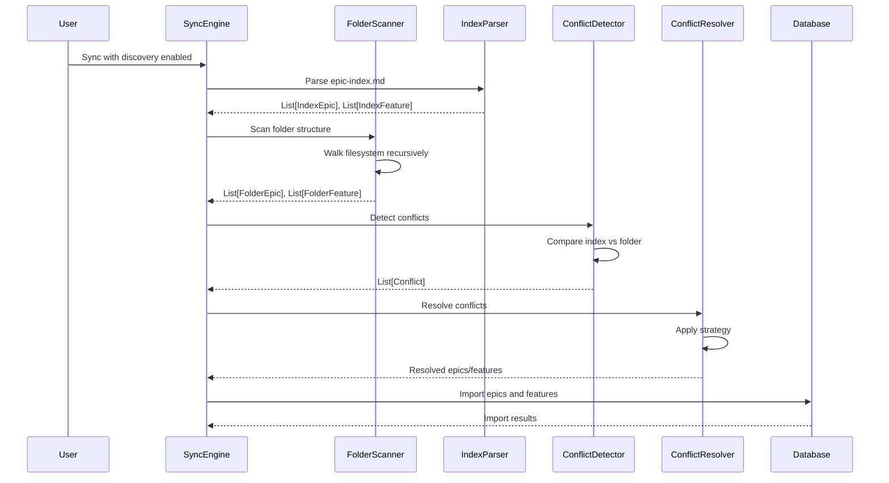
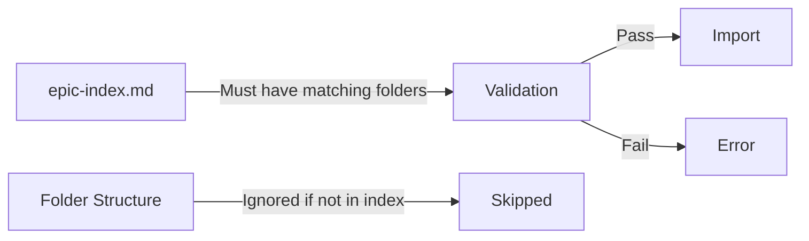
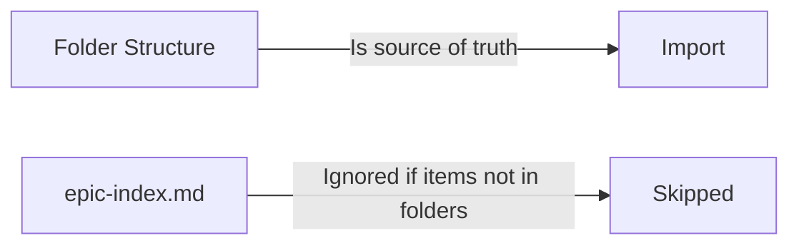
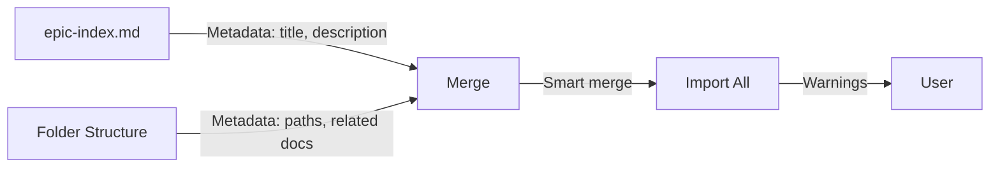
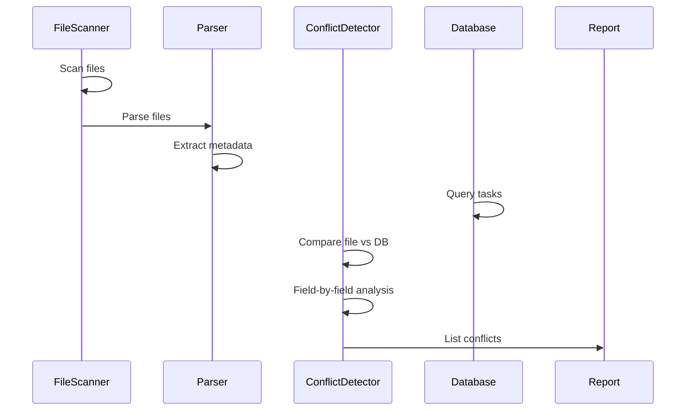
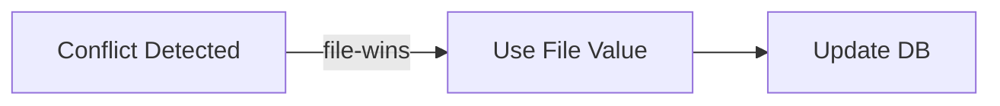
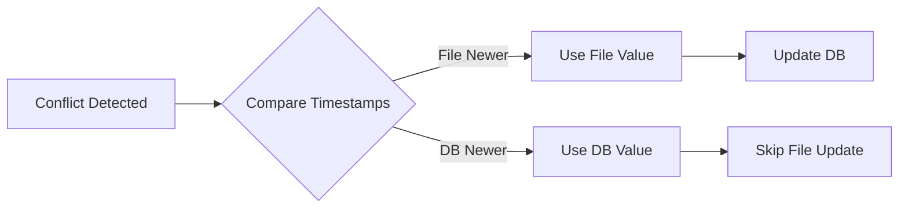
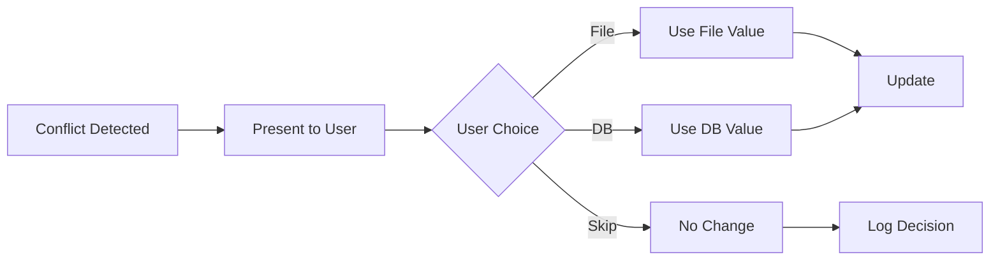
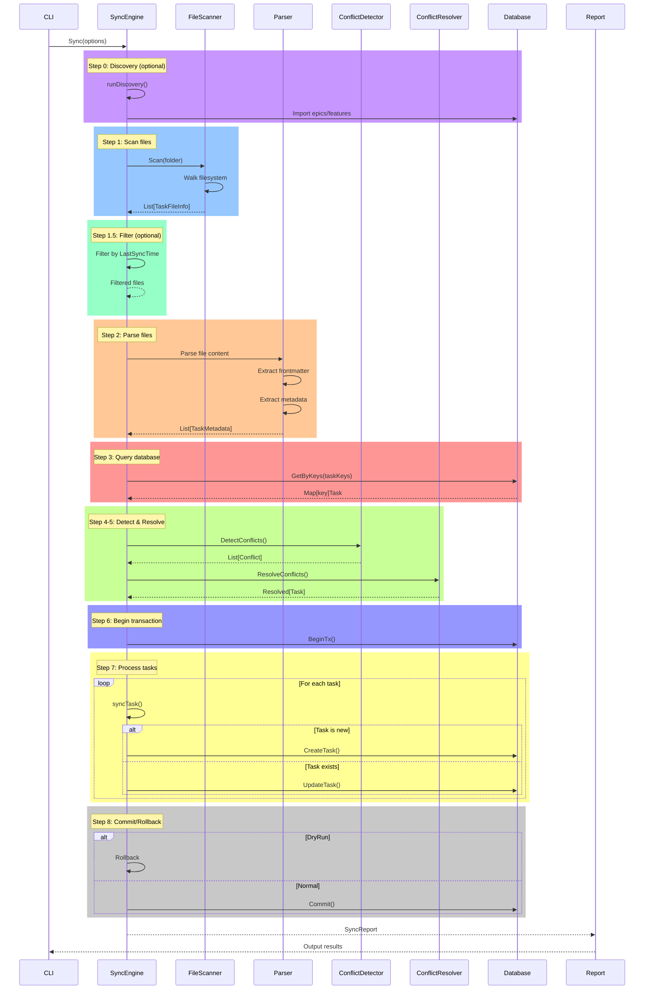

# Shark Task Manager: File-Database Synchronization Logic

## Table of Contents

1. [Overview](#overview)
2. [Discovery Process](#discovery-process)
3. [Folder Structure Interpretation](#folder-structure-interpretation)
4. [Conflict Detection](#conflict-detection)
5. [Conflict Resolution](#conflict-resolution)
6. [Sync Operations](#sync-operations)
7. [Edge Cases and Error Handling](#edge-cases-and-error-handling)
8. [Incremental Sync](#incremental-sync)
9. [Real-World Examples](#real-world-examples)

---

## Overview

The file-database synchronization system in Shark Task Manager ensures that markdown task files on the filesystem remain synchronized with the SQLite database. The sync system operates on these core principles:

- **File system is the primary source** for task metadata (title, description, file paths)
- **Database is the authoritative source** for task status and state (todo, in_progress, completed, blocked)
- **Status is NEVER synced from files** - it is managed exclusively in the database
- **Conflicts can occur** when file and database diverge, and multiple resolution strategies exist
- **Discovery mode** allows parsing of epic-index.md to discover epics and features in addition to folder scanning

### Key Components

```
SyncEngine
├── FileScanner          // Discovers task files by scanning filesystem
├── ConflictDetector     // Detects differences between file and database
├── ConflictResolver     // Applies resolution strategies
├── IncrementalFilter    // Filters files based on modification time
├── FolderScanner        // Discovers epics and features from folder structure
└── IndexParser          // Parses epic-index.md for discovery
```

---

## Discovery Process

### Purpose

The discovery process identifies and catalogs all epics, features, and their metadata from two sources:
1. **Folder structure** - Scans `docs/plan/` directory for epic and feature folders
2. **Index file** - Parses `epic-index.md` for documented hierarchy

### Discovery Workflow (Sequence Diagram)



### Folder Structure Scanning

#### Scanner: FolderScanner

Located in: `internal/discovery/folder_scanner.go`

The `FolderScanner` walks the filesystem starting from `docs/root` and discovers:

1. **Epic Folders** - Directories matching epic pattern (e.g., `E04-task-mgmt-cli-core`)
2. **Feature Folders** - Directories within epics matching feature pattern (e.g., `E04-F01-database-schema`)
3. **Epic Metadata** - `epic.md` files in epic root directories
4. **Feature Metadata** - `prd.md` or `PRD_F##-name.md` files in feature folders
5. **Related Documents** - Other `.md` files in feature folders (excludes PRD)

#### Scanning Algorithm

```
Scan(docsRoot):
    1. Validate docsRoot exists
    2. Walk filesystem starting from docsRoot
    3. For each directory:
        a. Skip hidden directories (starting with .)
        b. Try match as epic folder:
            - Match epic pattern: E##-slug
            - Check for epic.md
            - Record epic
            - Continue walking into epic
        c. Find epic ancestor:
            - Walk up directory tree
            - Match against recorded epic folders
        d. Try match as feature folder:
            - Pattern: E##-F##-slug or E##-P##-F##-slug (with optional project)
            - Check for prd.md or PRD_F##-name.md
            - Catalog related documents
            - Record feature
    4. Return collected epics and features
```

#### Pattern Matching

Patterns are defined in `internal/patterns/defaults.go`:

```go
// Epic pattern: E##-slug
// Matches: E04, E07-test-feature, etc.
epicPattern := regexp.MustCompile(`^(E\d{2})`)

// Feature pattern: E##-F##-slug or E##-P##-F##-slug
// Matches: E04-F01-database, E09-P02-F01-character-management
featurePattern := regexp.MustCompile(`^(E\d{2})(-P\d{2})?-(F\d{2})`)
```

#### Result Structures

```go
type FolderEpic struct {
    Key        string    // E04
    Slug       string    // task-mgmt-cli-core
    Path       string    // Full filesystem path
    EpicMdPath *string   // Path to epic.md (if exists)
}

type FolderFeature struct {
    Key         string    // E04-F01
    EpicKey     string    // E04
    Slug        string    // database-schema
    Path        string    // Full filesystem path
    PrdPath     *string   // Path to prd.md
    RelatedDocs []string  // Paths to other .md files
}
```

### Index File Parsing

#### Parser: IndexParser

Located in: `internal/discovery/index_parser.go`

The `IndexParser` extracts epic and feature information from `epic-index.md`:

```markdown
# Epic Index

## [E04: Task Management CLI Core](docs/plan/E04-task-mgmt-cli-core/epic.md)

### Features

- [E04-F01: Database Schema](docs/plan/E04-task-mgmt-cli-core/E04-F01-database-schema/prd.md)
- [E04-F02: CLI Infrastructure](docs/plan/E04-task-mgmt-cli-core/E04-F02-cli-infrastructure/prd.md)
- [E04-F03: Task Lifecycle](docs/plan/E04-task-mgmt-cli-core/E04-F03-task-lifecycle/prd.md)
```

#### Extraction Algorithm

```
Parse(indexPath):
    1. Read epic-index.md
    2. Parse markdown structure
    3. For each epic section:
        a. Extract epic key from heading/link text
        b. Extract epic path from link href
        c. Create IndexEpic
        d. For each feature under epic:
            - Extract feature key from link text
            - Extract feature path from link href
            - Create IndexFeature
    4. Return collected epics and features
```

#### Result Structures

```go
type IndexEpic struct {
    Key      string         // E04
    Title    string         // Task Management CLI Core
    Path     string         // docs/plan/E04-task-mgmt-cli-core/epic.md
    Features []IndexFeature // Features listed under this epic
}

type IndexFeature struct {
    Key     string // E04-F01
    EpicKey string // E04
    Title   string // Database Schema
    Path    string // docs/plan/.../prd.md
}
```

### Discovery Strategies

The sync engine supports three discovery strategies that determine how index and folder discoveries are combined:

#### 1. Index-Only Strategy

**Purpose**: Use epic-index.md as the source of truth

**Behavior**:
- Only imports epics/features that are documented in epic-index.md
- Fails if index references items without corresponding folders
- Warns about and skips folder-only items (undocumented)
- Enforces documentation discipline

**Use Case**: Mature projects with strict documentation requirements



#### 2. Folder-Only Strategy

**Purpose**: Use folder structure as the source of truth

**Behavior**:
- Only imports epics/features discovered in folder structure
- Warns about and skips index-only items
- No requirement for epic-index.md documentation
- Follows filesystem structure as single source of truth

**Use Case**: Projects in active development where folders are created before documentation



#### 3. Merge Strategy (Default)

**Purpose**: Combine both sources with smart metadata merging

**Behavior**:
- Imports all items from both index and folders
- Index metadata (title, description) wins when both sources have item
- Folder metadata (file paths, related docs) is preserved
- Warns about conflicts but doesn't fail
- Most flexible approach

**Use Case**: Projects transitioning documentation or coordinating across teams



---

## Folder Structure Interpretation

### Expected Directory Layout

```
docs/
└── plan/
    ├── epic-index.md                          # Optional: discovers epics/features
    ├── E04-task-mgmt-cli-core/                # Epic folder
    │   ├── epic.md                            # Epic metadata
    │   ├── E04-F01-database-schema/           # Feature folder
    │   │   ├── prd.md                         # Feature metadata (PRD)
    │   │   ├── ARCHITECTURE.md                # Related document
    │   │   ├── tasks/                         # Task files folder
    │   │   │   ├── T-E04-F01-001.md          # Task file
    │   │   │   ├── T-E04-F01-002.md
    │   │   │   └── ...
    │   │   └── [other-related-docs].md
    │   ├── E04-F02-cli-infrastructure/
    │   │   ├── prd.md
    │   │   └── tasks/
    │   │       └── ...
    │   └── ...
    ├── E07-enhancements/
    │   └── [similar structure]
    └── ...
```

### Path Resolution

When discovering folders, the system maintains relationships:

1. **Epic Path** - Resolved by matching `E##-*` pattern in `docs/plan/`
2. **Feature Path** - Resolved as direct child of epic OR in any nested subfolder of epic
3. **Task Path** - Resolved from file location within feature folder hierarchy

#### Example Path Resolution

```
Given file: docs/plan/E04-task-mgmt-cli-core/E04-F01-database-schema/tasks/T-E04-F01-001.md

1. Find epic ancestor:
   - Walk up: tasks/ → E04-F01-database-schema/ → E04-task-mgmt-cli-core/
   - Match: E04-task-mgmt-cli-core matches pattern E##-*
   - Result: Epic = E04

2. Infer feature from parent folder:
   - Parent: E04-F01-database-schema
   - Match: Matches pattern E##-F##-*
   - Result: Feature = E04-F01

3. Extract task key from filename:
   - Filename: T-E04-F01-001.md
   - Match pattern: T-E##-F##-###
   - Result: Task key = T-E04-F01-001
```

### Custom Folder Names

The system supports flexible folder naming while maintaining key extraction:

```
Valid structures:
✓ E04-task-mgmt-cli-core/
✓ E04-tmcc/  (minimal slug)
✓ E04/       (no slug)

✓ E04-F01-database-schema/
✓ E04-F01-db/
✓ E04-F01/

✓ E09-P02-F01-character-management/  (with project number)
✓ E09-P02-F01/
```

---

## Conflict Detection

### Purpose

Conflict detection identifies differences between file metadata and database records, determining if synchronization is needed.

### Conflict Detection Workflow



### Conflict Types (File vs Database)

#### 1. Title Conflict

**Trigger**: File has title AND differs from database

```
File: "Implement User Authentication"
DB:   "Setup authentication system"
```

**Resolution**: Depends on strategy (file-wins, database-wins, newer-wins, manual)

#### 2. Description Conflict

**Trigger**: Both file AND database have description AND they differ

```
File: "Implement OAuth2 integration with Google and GitHub"
DB:   "Add OAuth2 support"
```

**Resolution**: Field-level comparison; only conflicts if BOTH exist

#### 3. File Path Conflict

**Trigger**: Database path is nil OR differs from actual file location

```
DB record has old path: "docs/plan/E04-F01/tasks/old-name.md"
Actual file location:   "docs/plan/E04-F01/tasks/T-E04-F01-001.md"
```

**Resolution**: Always update database with actual file path

#### 4. Index vs Folder Conflicts (Discovery Mode)

**Epic Conflicts**:
- `ConflictTypeEpicIndexOnly` - In index but folder missing
- `ConflictTypeEpicFolderOnly` - In folder but not in index

**Feature Conflicts**:
- `ConflictTypeFeatureIndexOnly` - In index but folder missing
- `ConflictTypeFeatureFolderOnly` - In folder but not in index
- `ConflictTypeRelationshipMismatch` - Parent epic differs between index and folder

### Conflict Detection Algorithm

#### Basic Detection (Full Scan)

```go
DetectConflicts(fileData, dbTask):
    conflicts = []

    // Title: only if file has title AND differs
    if fileData.Title != "" AND fileData.Title != dbTask.Title:
        conflicts.append(Conflict{Field: "title", ...})

    // Description: only if both exist AND differ
    if fileData.Description != nil AND dbTask.Description != nil:
        if fileData.Description != dbTask.Description:
            conflicts.append(Conflict{Field: "description", ...})

    // File path: always check
    if dbTask.FilePath == nil OR fileData.FilePath != dbTask.FilePath:
        conflicts.append(Conflict{Field: "file_path", ...})

    return conflicts
```

#### Incremental Detection (With Last Sync Time)

For efficient incremental syncs, the system checks modification times:

```go
DetectConflictsWithSync(fileData, dbTask, lastSyncTime):
    // Check if file was modified since last sync (±60s buffer for clock skew)
    fileModified = fileData.ModifiedAt.After(lastSyncTime - 60s)

    // Check if database was modified since last sync (±60s buffer)
    dbModified = dbTask.UpdatedAt.After(lastSyncTime - 60s)

    // Decision matrix:
    if fileModified AND NOT dbModified:
        // File changed, DB hasn't: Not a conflict, regular update
        return detectFilePathConflict(fileData, dbTask)

    if dbModified AND NOT fileModified:
        // DB changed, file hasn't: No conflict, DB is current
        return []

    if NOT fileModified AND NOT dbModified:
        // Neither changed: No conflict
        return []

    if fileModified AND dbModified:
        // Both changed: Check actual metadata differences
        return detectBasicConflicts(fileData, dbTask)
```

### Detection Rules Summary

| Field | Conflict If | Notes |
|-------|------------|-------|
| Title | File has title AND differs | Empty file title = no conflict |
| Description | Both have it AND differ | Missing from one = no conflict |
| File Path | DB path null OR differs | Always checked, always conflict |
| Status | Never | Database-only, never conflicts |
| Priority | Never | Database-only, never conflicts |
| Agent Type | Never | Database-only, never conflicts |

### Clock Skew Handling

The system uses a 60-second buffer zone to handle clock differences between systems:

```go
clockSkewBuffer = 60 * time.Second

// File is "modified since sync" if:
fileData.ModifiedAt.After(lastSyncTime - 60s)

// DB is "modified since sync" if:
dbTask.UpdatedAt.After(lastSyncTime - 60s)
```

This prevents false conflict detection when timestamps are slightly out of sync.

---

## Conflict Resolution

### Available Strategies

#### 1. File-Wins Strategy (Default)

**Command**: `shark sync --strategy=file-wins`

**Behavior**:
- Uses file values for all conflicting fields
- Overwrites database with file values
- Useful when files are source of truth
- Risk: Overwrites intentional database changes

**Applied To**:
- Title: Uses file title
- Description: Uses file description
- File Path: Uses actual file location

**Use Case**: Fresh imports, file-centric workflows



#### 2. Database-Wins Strategy

**Command**: `shark sync --strategy=database-wins`

**Behavior**:
- Keeps database values for all conflicts
- Ignores file values, preserves database state
- Useful when database is authoritative for metadata
- Risk: Files remain out of sync

**Applied To**:
- Title: Keeps database title
- Description: Keeps database description
- File Path: Updates to actual location (always)

**Use Case**: Database-centric workflows, protecting curated metadata


#### 3. Newer-Wins Strategy

**Command**: `shark sync --strategy=newer-wins`

**Behavior**:
- Compares file.ModifiedAt with db.UpdatedAt
- Uses value from the most recently modified source
- Resolves conflicts based on timestamps
- Requires accurate system clocks

**Applied To**:
- All fields: Compares timestamps, uses newer source

**Use Case**: Collaborative workflows, last-write-wins semantics



#### 4. Manual Strategy (Interactive)

**Command**: `shark sync --strategy=manual`

**Behavior**:
- Prompts user for each conflict
- Displays both file and database values
- User chooses which to keep
- Time-intensive but explicit control

**Applied To**:
- User decides for each conflict

**Use Case**: Sensitive data reconciliation, audit trails



### Resolution Algorithm

```go
ResolveConflicts(conflicts, fileData, dbTask, strategy):
    resolved = copy(dbTask)  // Start with DB values

    // Determine source
    useFileValues = false
    if strategy == "file-wins":
        useFileValues = true
    else if strategy == "database-wins":
        useFileValues = false
    else if strategy == "newer-wins":
        useFileValues = fileData.ModifiedAt.After(dbTask.UpdatedAt)
    else if strategy == "manual":
        useFileValues = promptUser(conflicts)

    // Apply resolution
    if useFileValues:
        for each conflict:
            if conflict.Field == "title":
                resolved.Title = fileData.Title
            else if conflict.Field == "description":
                resolved.Description = fileData.Description
            else if conflict.Field == "file_path":
                resolved.FilePath = fileData.FilePath

    return resolved
```

### Discovery Conflict Resolution

For conflicts between index and folder discoveries:

#### Index-Precedence Strategy

Uses epic-index.md as source of truth:

```go
resolveIndexPrecedence(indexEpics, folderEpics, ...):
    // Fail if index references missing folders
    for conflict in conflicts:
        if conflict.Type == "epic_index_only":
            return error("Epic in index but folder missing")

    // Warn about folder-only items (skip them)
    warn about folder-only epics/features

    // Return only index items (filtered by folder presence)
    return indexEpics (filtered), indexFeatures (filtered)
```

#### Folder-Precedence Strategy

Uses folder structure as source of truth:

```go
resolveFolderPrecedence(indexEpics, folderEpics, ...):
    // Warn about index-only items
    warn about index-only epics/features

    // Return only folder items
    return folderEpics, folderFeatures
```

#### Merge Strategy

Combines both sources intelligently:

```go
resolveMerge(indexEpics, folderEpics, ...):
    // Start with folder items (structural truth)
    result = folderEpics + folderFeatures

    // Overlay with index metadata (title, description)
    for each indexEpic:
        if exists in folder:
            // Use index metadata, folder paths
            result[key] = merge(indexMetadata, folderPaths)
        else:
            // Include index-only with warning
            warn("Index-only epic")
            result[key] = indexEpic

    // Same for features
    ...

    return result
```

---

## Sync Operations

### Complete Sync Workflow



### Step-by-Step Process

#### Step 0: Discovery (Optional)

When `--index` flag is enabled:

```go
runDiscovery(opts):
    1. Parse epic-index.md (if exists)
    2. Scan folder structure for epics/features
    3. Detect conflicts between sources
    4. Resolve conflicts based on strategy
    5. Import discovered epics/features to database
    6. Return discovery report
```

#### Step 1: Scan Files

Discovers all task files matching enabled patterns:

```go
scanner.Scan(folderPath):
    1. Walk filesystem recursively
    2. For each file:
        a. Check filename against patterns
        b. Validate file is regular (not symlink)
        c. Validate file size <= 1MB
        d. Infer epic/feature from path
        e. Record with metadata (path, modtime, pattern type)
    3. Return list of TaskFileInfo
```

#### Step 1.5: Incremental Filtering (Optional)

For efficient syncs when `LastSyncTime` is set:

```go
filter.Filter(files, opts):
    1. If ForceFullScan: process all files
    2. Else if LastSyncTime is set:
        a. For each file:
            - Compare file.ModifiedAt with LastSyncTime
            - If file modified after sync: include
            - Else: skip
        b. Track filtered and skipped counts
    3. Return filtered files
```

#### Step 2: Parse Files

Extracts metadata from file content:

```go
parseFiles(files):
    1. For each file:
        a. Read file content
        b. Match against pattern registry
        c. Extract metadata using parser:
            - task_key: From frontmatter or filename
            - title: From frontmatter or heading
            - description: From frontmatter
        d. If task_key missing:
            - Generate using KeyGenerator (for PRP files)
            - Write back to file if needed
        e. Record TaskMetadata
    2. Return list of TaskMetadata with warnings
```

**Metadata Priority** (for title):
1. YAML frontmatter: `---\ntitle: Title\n---`
2. Markdown H1 heading: `# Title`
3. Default: Empty string

#### Step 3: Query Database

Retrieves existing tasks for comparison:

```go
GetByKeys(keys):
    1. Build comma-separated list of keys
    2. Execute: SELECT * FROM tasks WHERE key IN (?, ?, ...)
    3. Return map[key]*Task for fast lookup
```

#### Step 4: Begin Transaction

For atomic multi-statement operations (unless dry-run):

```go
BeginTx():
    1. Start SQL transaction
    2. Set isolation level: default
    3. Return transaction handle
    4. Defer rollback (will be no-op if commit succeeds)
```

#### Step 5: Process Each Task

For each parsed task:

```go
syncTask(taskData, dbTasks):
    1. Check if task exists in database:
        if NOT exists:
            → importTask()  // New task
        else:
            → updateTask()  // Existing task
```

**Import New Task**:

```go
importTask(taskData):
    1. Extract epic and feature from task key
    2. Verify/create feature exists
    3. Create task record:
        {
            key: taskData.Key,
            feature_id: feature.ID,
            title: taskData.Title,
            description: taskData.Description,
            file_path: taskData.FilePath,
            status: "todo",  // Default status
            created_at: now,
            updated_at: now
        }
    4. Increment report.TasksImported
```

**Update Existing Task**:

```go
updateTask(taskData, dbTask):
    1. Detect conflicts:
        conflicts = detector.DetectConflicts(taskData, dbTask)
    2. If no conflicts:
        → Update only file_path
    3. If conflicts exist:
        → Resolve using strategy
        → Apply resolved values to task
    4. Update task record
    5. Increment report.TasksUpdated or ConflictsResolved
```

#### Step 6: Commit or Rollback

```go
if DryRun:
    Rollback()  // Discard all changes
    report.DryRun = true
else:
    Commit()    // Apply all changes atomically
```

### Transaction Safety

All database modifications happen within transactions:

```
BEGIN TRANSACTION
    ├── CREATE/UPDATE tasks
    ├── CREATE/UPDATE epics (if discovery)
    ├── CREATE/UPDATE features (if discovery)
    └── Auto-triggers:
        ├── Update updated_at timestamps
        ├── Recalculate epic/feature progress
        └── Create task_history records (on status change)

COMMIT or ROLLBACK
```

### Error Handling

**Fatal Errors** (stop sync):
- Database connection fails
- File read error with important files
- Transaction begin fails

**Recoverable Errors** (log and continue):
- Individual file parse errors
- File permission issues (skip file)
- Missing epic/feature (create if --create-missing)

```go
Sync():
    1. Validate inputs
    2. Open database connection (fatal if fails)
    3. Scan files (fatal if fails)
    4. Parse files (recoverable: log warnings)
    5. Begin transaction (fatal if fails)
    6. Process tasks:
        for task:
            if error:
                log error
                return error (stops processing)
    7. Commit transaction (fatal if fails)
    8. Return report with errors/warnings
```

---

## Edge Cases and Error Handling

### Missing Files

**Scenario**: Database has task but file is deleted

**Detection**:
- Query database for tasks
- Compare with scanned files
- If cleanup flag enabled: missing files detected

**Resolution**:
- If `--cleanup` enabled: Delete task from database
- If `--cleanup` disabled: Warn and skip

```go
if opts.Cleanup:
    // Delete tasks whose files were removed
    for dbTask in database:
        if dbTask not in scannedFiles:
            DeleteTask(dbTask)
            report.TasksDeleted++
else:
    // Just warn
    warn("Task %s file missing, skipping", dbTask.Key)
```

### Orphaned Database Records

**Scenario**: Feature/Epic exists in database but not in filesystem

**Possible Causes**:
- Folders manually deleted
- Epic/Feature created in database but never added to filesystem
- Discovery previously imported entries

**Resolution**:
- If `--cleanup` enabled: Identify and optionally delete
- If `--cleanup` disabled: Warn user about orphaned records

### Missing Task Keys

**Scenario**: Task file has no explicit key

**Possible Causes**:
- File created manually without frontmatter
- Pattern doesn't extract key (PRP files)
- File corruption

**Resolution**:
1. Check if pattern expects embedded key:
   - If yes: Error, file must have key
   - If no: Generate key using `KeyGenerator`
2. Write generated key to frontmatter
3. Track in `report.KeysGenerated`
4. If write fails: Warn but continue

```go
if metadata.TaskKey == "":
    if pattern.ExpectsEmbeddedKey:
        error("Missing task_key")
    else:
        generated = keyGenerator.GenerateKeyForFile(filePath)
        metadata.TaskKey = generated.TaskKey
        if !generated.WrittenToFile:
            warn("Could not write key to file")
```

### Partial Sync Failures

**Scenario**: Sync fails mid-operation

**Protection**: All changes wrapped in transaction

```
Transaction started
    ├── Task 1: ✓ Success
    ├── Task 2: ✓ Success
    ├── Task 3: ✗ Error (invalid data)
    ├── ...
ROLLBACK: All changes discarded

Result: Database unchanged, user can fix and retry
```

**Recovery**:
1. Fix the problematic file
2. Re-run sync
3. Transaction applies only necessary changes

### Concurrent Modifications

**Scenario**: File and database modified simultaneously

**Protection**: Conflict detection and resolution strategies

**Resolution Depends on Strategy**:
- `file-wins`: Overwrite database changes
- `database-wins`: Discard file changes
- `newer-wins`: Use most recent modification
- `manual`: Prompt user to decide

### File Encoding Issues

**Scenario**: Non-UTF-8 file encoding

**Detection**:
- Files read as UTF-8
- Parse fails on invalid UTF-8

**Resolution**:
- Skip file with warning
- User must fix encoding to UTF-8

### Circular Dependencies

**Scenario**: Folder structure creates ambiguity

Example:
```
E04/
├── E04-F01/
│   └── E04-F01-nested/  (Nested feature folder)
│       └── T-E04-F01-001.md
```

**Resolution**: Use first matching epic ancestor
- Walk up directory tree
- Stop at first epic match
- Use that epic as parent

### Very Large Files

**Scenario**: Task file exceeds size limit (1MB)

**Detection**:
```go
if fileSize > 1MB:
    skip file
    warn("File too large")
```

**Resolution**:
- User must reduce file size
- Typically caused by embedded images/binaries
- Recommend: Reference external files instead

### Stale Last-Sync Time

**Scenario**: Clock goes backward or leap seconds

**Issue**: `LastSyncTime` > current time makes all files appear old

**Protection**: Clock skew buffer (±60 seconds)

```go
// If timestamp difference seems wrong:
if fileData.ModifiedAt.Before(lastSyncTime.Add(-clockSkewBuffer)):
    // Treat as not modified (file is old)
else if fileData.ModifiedAt.After(lastSyncTime.Add(clockSkewBuffer)):
    // Treat as modified
else:
    // In gray zone - do full comparison
```

**Recovery**: Force full scan with `--force-full-scan`

### Missing Epic/Feature

**Scenario**: Task file exists but epic/feature doesn't

**Causes**:
- Feature folder manually deleted
- Task key references non-existent epic/feature
- Database corruption

**Resolution**:
1. If `--create-missing` enabled: Create missing epic/feature
2. If `--create-missing` disabled:
   - Create task anyway (with null foreign key - will fail constraint)
   - Or skip task with error

```go
featureID, err := ensureFeature(epicKey, featureKey)
if err != nil:
    if opts.CreateMissing:
        // Create epic and feature
        featureID = createFeature(epicKey, featureKey)
    else:
        error("Feature does not exist, use --create-missing")
```

### Relationship Mismatches (Discovery)

**Scenario**: Feature exists in different epic folder than index says

Example:
```
epic-index.md: [E04-F01](docs/plan/E04/.../prd.md)
Folder:        docs/plan/E07-OTHER/E04-F01-database-schema/prd.md
```

**Detection**: `ConflictTypeRelationshipMismatch`

**Resolution** (by strategy):
- **Index-precedence**: Use index epic, warn about folder location
- **Folder-precedence**: Use folder epic, ignore index
- **Merge**: Use index epic, log warning about location mismatch

---

## Incremental Sync

### Purpose

Incremental sync reduces processing time for large projects by only examining files modified since last sync.

### How It Works

#### LastSyncTime Tracking

Stored in `.sharkconfig.json`:

```json
{
  "last_sync_time": "2025-12-19T14:30:45Z",
  "sync_history": [
    {
      "timestamp": "2025-12-19T14:30:45Z",
      "files_scanned": 245,
      "tasks_updated": 3,
      "status": "success"
    }
  ]
}
```

#### Filtering Algorithm

```go
Filter(files, opts):
    if opts.ForceFullScan:
        return all files  // Ignore LastSyncTime

    if opts.LastSyncTime == nil:
        return all files  // Full scan mode

    filtered = []
    skipped = []

    for file in files:
        // Compare with clock skew tolerance
        if file.ModifiedAt > (LastSyncTime - 60s):
            filtered.append(file)  // Include modified file
        else:
            skipped.append(file)   // Skip unchanged file

    return filtered, skipped
```

#### Performance Benefit

Given 500 tasks, typical scenario:
```
Full Scan:
  - Scan all 500 files: 50ms
  - Parse all 500 files: 500ms
  - Query DB for 500 keys: 100ms
  - Total: ~650ms

Incremental Scan (20 files changed):
  - Scan all 500 files: 50ms
  - Filter to 20: 5ms
  - Parse 20 files: 20ms
  - Query DB for 20 keys: 20ms
  - Total: ~95ms (85% faster!)
```

#### Updating LastSyncTime

After successful sync:

```go
if !opts.DryRun:
    syncTime := time.Now()
    configManager.UpdateLastSyncTime(syncTime)

    // Also log to history
    history.append({
        timestamp: syncTime,
        files_scanned: report.FilesScanned,
        tasks_updated: report.TasksUpdated,
        status: "success"
    })
```

---

## Real-World Examples

### Example 1: Simple Task Update

**Scenario**: User updates task description in file

**Files**:
```
Before: docs/plan/E04-F01/tasks/T-E04-F01-001.md
  ---
  title: Setup Database
  task_key: T-E04-F01-001
  ---

  Original description

After: docs/plan/E04-F01/tasks/T-E04-F01-001.md
  ---
  title: Setup Database
  task_key: T-E04-F01-001
  ---

  Updated description with more details
```

**Sync Process**:
```
1. Scan: Find T-E04-F01-001.md (modified)
2. Parse: Extract key=T-E04-F01-001, title=Setup Database, new description
3. Query DB: Found existing task with old description
4. Detect: Description conflict detected
5. Resolve (file-wins): Use new description from file
6. Update DB: Set description to new value
7. Report: 1 task updated, 1 conflict resolved
```

### Example 2: Discovery with Merge Strategy

**Scenario**: Adding new feature with epic-index.md

**epic-index.md**:
```markdown
## [E04: Task Management](docs/plan/E04-task-mgmt-cli-core/epic.md)

### Features
- [E04-F01: Database](docs/plan/E04/E04-F01/prd.md)
- [E04-F08: Testing](docs/plan/E04/E04-F08-testing/prd.md) ← NEW
```

**Folder Structure**:
```
docs/plan/E04-task-mgmt-cli-core/
├── E04-F01-database-schema/ (has prd.md)
├── E04-F08-testing/         (new, has prd.md)
└── [others]
```

**Sync Process**:
```
1. Parse index: Found E04-F08 with title "Testing"
2. Scan folders: Found E04-F08-testing/prd.md
3. Detect conflicts: None (both sources agree)
4. Resolve (merge): Combine index metadata with folder structure
5. Import: Create feature E04-F08 with index metadata and folder paths
6. Report: 1 feature imported, 0 conflicts
```

### Example 3: Handling Index vs Folder Mismatch

**Scenario**: Feature moved to different epic

**Before**:
- epic-index.md: Lists E04-F07 under E04
- Folder: docs/plan/E04-task-mgmt-cli-core/E04-F07/

**After**:
- epic-index.md: Lists E04-F07 under E04 (unchanged)
- Folder: Moved to docs/plan/E07-enhancements/E04-F07/

**Sync (Merge Strategy)**:
```
1. Parse index: E04-F07 under E04
2. Scan folders: Found E04-F07 under E07
3. Detect: ConflictTypeRelationshipMismatch
4. Resolve (merge): Use index epic (E04), warn about folder location
5. Import: Create/update E04-F07 as child of E04
6. Report: Relationship mismatch, warning about folder location
```

**User Action**: Move folder back or update index

### Example 4: File vs Database Title Conflict

**Scenario**: Both file and database modified

**File**: "Implement user authentication"
**Database**: "Setup authentication module"
**LastSyncTime**: 2 hours ago

**File Modified**: 1 hour ago
**DB Modified**: 30 minutes ago

**Sync (newer-wins)**:
```
1. Detect: File modified after sync ✓, DB modified after sync ✓
2. Conflict: Title differs
3. Compare: DB (30m ago) is newer than File (1h ago)
4. Resolve: Use database value "Setup authentication module"
5. Update DB: No change (already has newer value)
6. Report: Conflict resolved using newer database value
```

### Example 5: Cleanup Orphaned Tasks

**Scenario**: Task file deleted but database record remains

**Before**:
```
Database: T-E04-F01-001, T-E04-F01-002, T-E04-F01-003
Files: T-E04-F01-001.md, T-E04-F01-002.md
(T-E04-F01-003.md deleted manually)
```

**Command**: `shark sync --cleanup`

**Sync Process**:
```
1. Scan: Found 2 files (001, 002)
2. Query DB: Found 3 tasks (001, 002, 003)
3. Detect: 003 exists in DB but not in filesystem
4. Cleanup: Delete T-E04-F01-003 from database
5. Report: 1 task deleted (orphaned)
```

---

## Implementation Reference

### Key Files

| File | Purpose |
|------|---------|
| `internal/sync/engine.go` | Main sync orchestration |
| `internal/sync/scanner.go` | File scanning and discovery |
| `internal/sync/conflict.go` | Conflict detection |
| `internal/sync/resolver.go` | Conflict resolution |
| `internal/sync/incremental.go` | Incremental filtering |
| `internal/discovery/folder_scanner.go` | Epic/feature folder scanning |
| `internal/discovery/index_parser.go` | epic-index.md parsing |
| `internal/discovery/conflict_detector.go` | Discovery conflict detection |
| `internal/discovery/conflict_resolver.go` | Discovery conflict resolution |
| `internal/cli/commands/sync.go` | CLI sync command |

### Configuration

Pattern registry in `.sharkconfig.json`:

```json
{
  "patterns": {
    "task": {
      "enabled": true,
      "pattern": "^T-([A-Z]\\d{2})-([A-Z]\\d{2})-(\\d{3})\\.md$",
      "examples": ["T-E04-F01-001.md", "T-E07-F02-042.md"]
    },
    "prp": {
      "enabled": false,
      "pattern": "^([A-Z]\\d{2})-([A-Z]\\d{2})-(\\d{3})\\.md$",
      "examples": ["E04-F01-001.md"]
    }
  }
}
```

---

## Troubleshooting Guide

### Issue: Files Not Being Synced

**Check**:
1. File matches pattern: `T-E##-F##-###.md`
2. File is in `docs/plan/` (or specified folder)
3. File size < 1MB
4. File has valid UTF-8 encoding

**Debug**: `shark sync --verbose --force-full-scan`

### Issue: Title Keeps Reverting

**Likely Cause**: Database-wins strategy active

**Fix**: Use `--strategy=file-wins` or `--strategy=newer-wins`

### Issue: Discovery Not Finding All Epics

**Check**:
1. epic-index.md exists and is valid markdown
2. Folder structure matches links in index
3. Using correct discovery strategy

**Debug**: `shark sync --index --verbose`

### Issue: Conflicts Not Being Resolved

**Check**:
1. Strategy is correctly specified
2. Conflict type is supported by strategy
3. File has required metadata

**Debug**: `shark sync --dry-run` to preview without changes

---

## Performance Characteristics

| Operation | Time | Notes |
|-----------|------|-------|
| Full scan (500 files) | ~600ms | Includes parse, DB query |
| Incremental (10 files) | ~100ms | 10% of full scan |
| Parse one task file | ~1ms | Depends on file size |
| Conflict detection | <1ms | Per conflict |
| DB transaction | <10ms | For 10 tasks |
| Discovery + scan | ~1-2s | Includes parsing |

