# Task Creation Flow: CLI to Database

Comprehensive documentation of the task creation workflow - the most complex creation process with dependency validation, custom templates, and orchestrated components.

## Overview

The task creation process is the most sophisticated, involving multiple validation layers, a dedicated Creator component, and complex business logic for task key generation and template selection.

```
User Input
    ↓
CLI Argument Parsing
    ↓
Component Orchestration (Creator)
    ↓
Validation Layer (Epic + Feature + Dependencies)
    ↓
Key Generation (with collision detection)
    ↓
Transaction Management
    ↓
File System Operations
    ↓
Template Selection & Rendering
    ↓
Database Operations
    ↓
Success Response
```

---

## Detailed Flow Diagram: Sequence Diagram

```mermaid
sequenceDiagram
    actor User
    participant CLI as CLI Command<br/>(runTaskCreate)
    participant Creator as Task Creator<br/>(taskcreation.Creator)
    participant Validator as Task Validator<br/>(taskcreation.Validator)
    participant KeyGen as Key Generator<br/>(taskcreation.KeyGenerator)
    participant FileOps as File System<br/>(OS operations)
    participant TxMgr as Transaction<br/>(sql.Tx)
    participant Template as Template Engine<br/>(Renderer)
    participant TaskRepo as Task Repository<br/>(Create)
    participant HistoryRepo as History Repository<br/>(Create)
    participant DB as Database<br/>(SQLite)

    User->>CLI: shark task create "Title"<br/>--epic=E01 --feature=F01<br/>--agent=backend --priority=5<br/>--depends-on=T-E01-F01-001

    CLI->>CLI: Parse arguments<br/>- title from args[0]<br/>- epic, feature, agent, priority flags<br/>- depends-on, execution-order<br/>- custom template, filename options

    CLI->>CLI: Validate required flags<br/>epic, feature, title present?

    alt Missing Required Flags
        CLI-->>User: Error: Missing required<br/>exit code 1
    end

    CLI->>CLI: Get database and repositories<br/>Create Creator component

    CLI->>Creator: creator.CreateTask(ctx, input)

    Creator->>Validator: ValidateTaskInput(ctx, input)

    Validator->>Validator: Validate epic key format<br/>Validate feature key format<br/>Normalize feature key

    Validator->>Validator: Verify epic exists<br/>epicRepo.GetByKey(epicKey)

    alt Epic Not Found
        Validator-->>Creator: Error: Epic not found
    end

    Validator->>Validator: Verify feature exists<br/>featureRepo.GetByKey(featureKey)

    alt Feature Not Found
        Validator-->>Creator: Error: Feature not found
    end

    Validator->>Validator: Validate priority (1-10)<br/>Validate agent type<br/>Validate description length

    Validator->>Validator: Parse and validate dependencies<br/>json.Unmarshal(dependsOn)<br/>Validate each dep is valid task key<br/>Verify each dep exists<br/>Check for circular deps

    alt Dependency Validation Fails
        Validator-->>Creator: Error: Invalid dependency
    end

    Validator->>Validator: Normalize agent type<br/>Default to "general" if empty

    Validator-->>Creator: ValidatedInput{<br/>FeatureID,<br/>NormalizedFeatureKey,<br/>AgentType,<br/>ValidatedDependencies}

    Creator->>KeyGen: GenerateTaskKey(ctx, epicKey,<br/>normalizedFeatureKey)

    KeyGen->>TaskRepo: GetMaxSequenceForFeature<br/>Parse keys and find max ###

    KeyGen->>KeyGen: Extract max sequence<br/>from task keys in feature

    KeyGen->>KeyGen: Calculate next sequence<br/>maxSeq + 1<br/>Format as T-E##-F##-###

    KeyGen-->>Creator: Task key<br/>e.g. T-E01-F01-042

    Creator->>TxMgr: db.BeginTxContext(ctx)

    TxMgr-->>Creator: Transaction handle

    alt Filename Provided
        Creator->>Creator: ValidateCustomFilename<br/>- Check not absolute<br/>- Validate .md extension<br/>- Check within project<br/>- Prevent path traversal
        Creator->>FileOps: Check if custom file exists<br/>os.Stat(fullFilePath)
    else Default Filename
        Creator->>Creator: Build hierarchical path<br/>- Fetch epic and feature<br/>- Generate slugs<br/>- docs/plan/E##-*/E##-F##-*/tasks/
        Creator->>FileOps: Create tasks directory<br/>os.MkdirAll(tasksDir)
    end

    Creator->>TaskRepo: GetByFilePath(ctx, filePath)

    alt File Already Claimed
        Creator->>Creator: Check force flag
        alt Force Not Set
            Creator-->>TxMgr: Error: File claimed
            TxMgr->>TxMgr: Rollback
            Creator-->>CLI: Error: File collision
        else Force Set
            Creator->>TaskRepo: UpdateFilePath(oldTaskKey, nil)<br/>Clear old file path
        end
    end

    Creator->>Creator: Build Task Model<br/>- FeatureID<br/>- Key<br/>- Title<br/>- Description<br/>- Status = todo<br/>- AgentType<br/>- Priority<br/>- DependsOn JSON<br/>- FilePath<br/>- ExecutionOrder<br/>- CreatedAt, UpdatedAt

    Creator->>TaskRepo: Create(ctx, task)

    TaskRepo->>TaskRepo: Validate task model<br/>task.Validate()

    TaskRepo->>DB: INSERT INTO tasks<br/>(feature_id, key, title,<br/>description, status, agent_type,<br/>priority, depends_on,<br/>assigned_agent, file_path,<br/>blocked_reason, execution_order)

    DB->>DB: Validate constraints:<br/>- FOREIGN KEY feature_id<br/>- UNIQUE key<br/>- CHECK status<br/>- CHECK priority IN (1-10)<br/>- NOT NULL fields

    DB-->>TaskRepo: LastInsertId

    TaskRepo->>TaskRepo: Set task.ID<br/>from LastInsertId

    TaskRepo-->>Creator: Success, task.ID set

    Creator->>HistoryRepo: Create task_history record<br/>INSERT INTO task_history<br/>(task_id, old_status, new_status,<br/>agent, notes)

    HistoryRepo->>DB: INSERT task_history<br/>Status: NULL → todo

    DB-->>HistoryRepo: Success

    Creator->>Template: RenderWithSelection<br/>(agentType, customTemplate, data)

    Template->>Template: Selection priority:<br/>1. custom template if provided<br/>2. agent-specific template<br/>3. general template<br/>4. default

    Template->>Template: Render markdown<br/>with task metadata

    Template-->>Creator: Rendered content

    Creator->>FileOps: os.WriteFile(fullFilePath)<br/>only if file doesn't exist

    FileOps-->>Creator: Success/Error

    alt Write Failed
        Creator-->>TxMgr: Error
        TxMgr->>TxMgr: Rollback
        Creator-->>CLI: Error: File write failed
    end

    Creator->>TxMgr: tx.Commit()

    TxMgr->>DB: COMMIT transaction<br/>All changes atomic

    alt Commit Failed
        TxMgr->>FileOps: Cleanup: os.Remove(file)<br/>if we created it
        Creator-->>CLI: Error: Commit failed
    end

    TxMgr-->>Creator: Success

    Creator-->>CLI: CreateTaskResult{<br/>Task,<br/>FilePath}

    CLI->>CLI: Format success output<br/>- Task Key<br/>- File path<br/>- Next steps

    CLI-->>User: Success message

```



---

## Detailed Flow Diagram: State Machine / Flowchart

```mermaid
flowchart TD
    Start([User: shark task create]) --> Parse["Parse CLI Arguments<br/>- Title from args[0]<br/>- --epic=KEY required<br/>- --feature=KEY required<br/>- --agent optional<br/>- --priority optional<br/>- --depends-on optional<br/>- --template optional<br/>- --filename optional<br/>- --force optional"]

    Parse --> ValidateReq["Validate Required Flags<br/>epic, feature, title?"]
    ValidateReq --> CheckReq{All<br/>Required?}
    CheckReq -->|No| ErrorReq["Error: Missing required flags<br/>Show examples<br/>Exit Code 1"]
    CheckReq -->|Yes| GetDB["Get Database & Repos<br/>Create Creator instance"]

    GetDB --> CreatorStart["Creator: CreateTask()"]

    CreatorStart --> ValidateInput["Validator: ValidateTaskInput"]

    ValidateInput --> ValidFormat["Validate Key Formats<br/>- Epic: E##<br/>- Feature: E##-F##<br/>- Normalize feature key"]
    ValidFormat --> CheckFormat{Valid<br/>Format?}
    CheckFormat -->|No| ErrorFormat["Error: Invalid key format<br/>Exit Code 1"]

    CheckFormat -->|Yes| VerifyEpic["Verify Epic Exists<br/>epicRepo.GetByKey(epicKey)"]
    VerifyEpic --> CheckEpic{Epic<br/>Found?}
    CheckEpic -->|No| ErrorEpic["Error: Epic not found<br/>Exit Code 1"]

    CheckEpic -->|Yes| VerifyFeature["Verify Feature Exists<br/>featureRepo.GetByKey(featureKey)"]
    VerifyFeature --> CheckFeature{Feature<br/>Found?}
    CheckFeature -->|No| ErrorFeature["Error: Feature not found<br/>Exit Code 1"]

    CheckFeature -->|Yes| ValidatePriority["Validate Priority<br/>Must be 1-10<br/>Default: 5 if not specified"]
    ValidatePriority --> CheckPriority{Valid?}
    CheckPriority -->|No| ErrorPriority["Error: Invalid priority<br/>Exit Code 1"]

    CheckPriority -->|Yes| ValidateAgent["Validate Agent Type<br/>Accept any non-empty string<br/>Default: general"]
    ValidateAgent --> CheckAgent{Valid?}
    CheckAgent -->|No| ErrorAgent["Error: Invalid agent<br/>Exit Code 1"]

    CheckAgent -->|Yes| ParseDeps["Parse Dependencies<br/>json.Unmarshal(depends-on)<br/>Split by comma"]
    ParseDeps --> CheckDepJSON{Valid<br/>JSON?}
    CheckDepJSON -->|No| ErrorDepJSON["Error: Invalid dependency JSON<br/>Exit Code 1"]

    CheckDepJSON -->|Yes| ValidateDeps["Validate Each Dependency<br/>- Check key format<br/>- Verify task exists<br/>- Check not circular<br/>- Check accessible"]
    ValidateDeps --> CheckDeps{All<br/>Valid?}
    CheckDeps -->|No| ErrorDeps["Error: Invalid dependency<br/>Exit Code 1"]

    CheckDeps -->|Yes| ReturnValidated["Return ValidatedInput<br/>FeatureID, AgentType,<br/>Dependencies"]

    ReturnValidated --> KeyGen["KeyGenerator: GenerateTaskKey"]

    KeyGen --> QueryTasks["Query Feature Tasks<br/>GetMaxSequenceForFeature<br/>SELECT task keys from feature"]
    QueryTasks --> ParseSeq["Parse Task Keys<br/>Extract ### sequence<br/>Find max"]
    ParseSeq --> CalcSeq["Calculate Next Sequence<br/>maxSeq + 1<br/>Pad to 3 digits"]
    CalcSeq --> GenKey["Build Task Key<br/>T-E##-F##-###<br/>e.g. T-E01-F01-042"]

    GenKey --> StartTx["Begin Database Transaction<br/>db.BeginTxContext(ctx)"]

    StartTx --> DeterminePath["Determine File Path"]

    DeterminePath --> CheckFilename{Custom<br/>Filename?}

    CheckFilename -->|Yes| ValidateCustom["Validate Custom Filename<br/>- Not absolute path<br/>- Must be .md file<br/>- Within project boundary<br/>- No path traversal (..)<br/>- Not empty"]
    ValidateCustom --> CheckCustomValid{Valid?}
    CheckCustomValid -->|No| ErrorCustom["Error: Invalid filename<br/>Exit Code 1"]
    CheckCustomValid -->|Yes| BuildCustomPath["Build Custom Paths<br/>absPath for file ops<br/>relPath for database"]

    CheckFilename -->|No| BuildDefaultPath["Build Default Path<br/>1. Fetch epic & feature<br/>2. Generate slugs<br/>3. docs/plan/E##-*/E##-F##-*/tasks/<br/>4. Create tasks dir<br/>os.MkdirAll"]

    BuildCustomPath --> BuildDefaultPath

    BuildDefaultPath --> FullPath["Have fullFilePath<br/>and relPath for DB"]

    FullPath --> CheckFileExists["Check File Collision<br/>taskRepo.GetByFilePath"]
    CheckFileExists --> FileExists{Another<br/>Task Claims<br/>File?}

    FileExists -->|No| Ready["File path ready"]

    FileExists -->|Yes| CheckForce{Force<br/>Flag?}
    CheckForce -->|No| ErrorCollision["Error: File claimed<br/>Show which task<br/>Suggest --force<br/>Exit Code 1"]
    CheckForce -->|Yes| ClearOld["Clear Old Assignment<br/>taskRepo.UpdateFilePath<br/>(oldTaskKey, nil)"]

    ClearOld --> Ready

    Ready --> BuildTask["Build Task Model<br/>- FeatureID<br/>- Key = task key<br/>- Title<br/>- Description ptr<br/>- Status = todo<br/>- AgentType<br/>- Priority<br/>- DependsOn JSON<br/>- FilePath<br/>- ExecutionOrder<br/>- CreatedAt, UpdatedAt"]

    BuildTask --> ValidateModel["Validate Task Model<br/>task.Validate()"]
    ValidateModel --> CheckModelValid{Valid?}
    CheckModelValid -->|No| ErrorModel["Error: Model invalid<br/>Exit Code 1"]

    CheckModelValid -->|Yes| InsertTask["Insert Task<br/>taskRepo.Create(ctx, task)"]

    InsertTask --> CheckInsert{DB<br/>Error?}
    CheckInsert -->|Yes| ErrorInsert["Error: DB insert failed<br/>Rollback tx<br/>Exit Code 2"]

    CheckInsert -->|No| GetID["Get LastInsertId<br/>task.ID = id"]

    GetID --> InsertHistory["Insert Task History<br/>taskHistory.Create<br/>Status: NULL → todo"]

    InsertHistory --> CheckHistory{History<br/>Error?}
    CheckHistory -->|Yes| ErrorHistory["Error: History failed<br/>Rollback tx<br/>Exit Code 2"]

    CheckHistory -->|No| SelectTemplate["Select Template<br/>renderer.RenderWithSelection<br/>Priority:<br/>1. custom<br/>2. agent-specific<br/>3. general<br/>4. default"]

    SelectTemplate --> RenderTemplate["Render Template<br/>Execute with task data"]

    RenderTemplate --> CheckRender{Render<br/>Error?}
    CheckRender -->|Yes| ErrorRender["Error: Render failed<br/>Rollback tx<br/>Exit Code 1"]

    CheckRender -->|No| WriteFile["Write File<br/>os.WriteFile(fullPath)<br/>Only if not exists"]

    WriteFile --> CheckWrite{Write<br/>Error?}
    CheckWrite -->|Yes| ErrorWrite["Error: Write failed<br/>Rollback tx<br/>Cleanup: Remove file<br/>Exit Code 1"]

    CheckWrite -->|No| CommitTx["Commit Transaction<br/>tx.Commit()"]

    CommitTx --> CheckCommit{Commit<br/>Error?}
    CheckCommit -->|Yes| ErrorCommit["Error: Commit failed<br/>Cleanup: Remove file<br/>Exit Code 2"]

    CheckCommit -->|No| FormatOutput["Format Success Output<br/>- Task Key<br/>- File path<br/>- Next steps"]

    FormatOutput --> OutputUser["Output to User<br/>Print Success"]

    OutputUser --> End([Success: Task Created])

    style Start fill:#90EE90
    style End fill:#90EE90
    style ErrorReq fill:#FFB6C6
    style ErrorEpic fill:#FFB6C6
    style ErrorFeature fill:#FFB6C6
    style ErrorDeps fill:#FFB6C6
    style ErrorCollision fill:#FFB6C6
    style ErrorInsert fill:#FFB6C6
    style ErrorWrite fill:#FFB6C6
    style ErrorCommit fill:#FFB6C6

```



---

## Component Architecture

### 1. Task Creator Orchestrator (internal/taskcreation/creator.go)

**Responsibility**: Coordinate all task creation operations atomically

**Components Used**:
- `KeyGenerator`: Generate unique task keys
- `Validator`: Validate all inputs
- `Renderer`: Render markdown templates
- `TaskRepository`: Create task record
- `TaskHistoryRepository`: Create history record

**Key Methods**:
```go
func (c *Creator) CreateTask(ctx context.Context, input CreateTaskInput) (*CreateTaskResult, error) {
    // 1. Validate inputs
    // 2. Generate key
    // 3. Begin transaction
    // 4. Determine file path
    // 5. Check file collision
    // 6. Create task record
    // 7. Create history record
    // 8. Render template
    // 9. Write file
    // 10. Commit transaction
}

func (c *Creator) ValidateCustomFilename(filename string, projectRoot string) (absPath, relPath string, err error) {
    // Validate and resolve custom filename
    // Prevent path traversal attacks
    // Ensure within project boundary
}

func (c *Creator) writeFileExclusive(path string, data []byte) error {
    // Create file only if doesn't exist
    // Prevents overwriting existing files
}
```

### 2. Task Key Generator (internal/taskcreation/creator.go)

**Algorithm**: Generate unique task key within feature

```go
type KeyGenerator struct {
    taskRepo    *repository.TaskRepository
    featureRepo *repository.FeatureRepository
}

func (kg *KeyGenerator) GenerateTaskKey(ctx context.Context, epicKey, featureKey string) (string, error) {
    // 1. Query max sequence for feature: "T-E##-F##-###"
    // 2. Parse all keys to extract sequence number (last 3 digits)
    // 3. Find maximum sequence
    // 4. Calculate next: maxSeq + 1
    // 5. Format: fmt.Sprintf("T-%s-%s-%03d", epicKey, featureKey, nextSeq)
}
```

**Example**:
```
Feature has tasks:
  T-E01-F01-001
  T-E01-F01-002
  T-E01-F01-003

Max sequence: 003 (3)
Next sequence: 004
Key: T-E01-F01-004
```

### 3. Task Validator (internal/taskcreation/creator.go)

**Validates**:
- Epic key format (E##)
- Feature key format (E##-F## or F##)
- Epic exists in database
- Feature exists in database
- Priority in range (1-10)
- Agent type not empty
- Dependencies are valid task keys
- Dependencies are circular-free
- Each dependency exists

**Returns**: `ValidatedTaskInput` with normalized values

### 4. Template Renderer (internal/templates/renderer.go)

**Selection Priority**:
1. Custom template (if provided)
2. Agent-specific template (`templates/{agentType}.md`)
3. General template (`templates/general.md`)
4. Default fallback template

**Template Data**:
```go
type TemplateData struct {
    Key         string
    Title       string
    Description string
    Epic        string     // "E01"
    Feature     string     // "F01"
    AgentType   string
    Priority    int
    DependsOn   []string
    CreatedAt   time.Time
}
```

---

## Layer-by-Layer Breakdown

### 1. CLI Layer: `runTaskCreate` (internal/cli/commands/task.go)

**Entry Point**: `shark task create "Build auth service" --epic=E01 --feature=F01 --agent=backend --priority=8`

**Responsibility**: Parse arguments, create Creator component, invoke creation

```go
func runTaskCreate(cmd *cobra.Command, args []string) error {
    // 1. Extract positional and flag arguments
    title := args[0]
    epicKey, _ := cmd.Flags().GetString("epic")
    featureKey, _ := cmd.Flags().GetString("feature")
    agentType, _ := cmd.Flags().GetString("agent")
    priority, _ := cmd.Flags().GetInt("priority")
    // ... more flags ...

    // 2. Validate required flags
    if epicKey == "" || featureKey == "" || title == "" {
        return error
    }

    // 3. Create components
    database, err := db.InitDB(dbPath)
    keygen := taskcreation.NewKeyGenerator(taskRepo, featureRepo)
    validator := taskcreation.NewValidator(epicRepo, featureRepo, taskRepo)
    renderer := templates.NewRenderer(loader)
    creator := taskcreation.NewCreator(...)

    // 4. Create task
    result, err := creator.CreateTask(ctx, CreateTaskInput{...})

    // 5. Output result
    return cli.OutputJSON(result.Task)
}
```

**Flags**:
- `--epic` (required): Epic key
- `--feature` (required): Feature key
- `--agent` (optional): Agent type
- `--priority` (optional): Priority 1-10, default 5
- `--depends-on` (optional): Comma-separated task keys
- `--template` (optional): Custom template path
- `--filename` (optional): Custom file path
- `--force` (optional): Force file reassignment
- `--execution-order` (optional): Execution priority

### 2. Validation Layer: Multi-Step Validation

**Step 1: Format Validation**
```go
func ValidateEpicKey(key string) error {
    // Check matches E\d{2} format
}

func ValidateFeatureKey(key string) error {
    // Check matches E\d{2}-F\d{2} format or F\d{2}
}

func ValidateTaskKey(key string) error {
    // Check matches T-E\d{2}-F\d{2}-\d{3} format
}
```

**Step 2: Existence Verification**
```go
epic, err := epicRepo.GetByKey(ctx, epicKey)
if err == sql.ErrNoRows {
    return "Epic not found"
}

feature, err := featureRepo.GetByKey(ctx, normalizedFeatureKey)
if err == sql.ErrNoRows {
    return "Feature not found"
}
```

**Step 3: Field Validation**
```go
func ValidatePriority(priority int) error {
    if priority < 1 || priority > 10 {
        return "Priority must be 1-10"
    }
    return nil
}

func ValidateAgentType(agentType string) error {
    if agentType == "" {
        return "Agent type cannot be empty"
    }
    return nil
}
```

**Step 4: Dependency Validation**
```go
// Parse JSON array
var deps []string
json.Unmarshal([]byte(dependsOn), &deps)

// Validate each dependency
for _, dep := range deps {
    // Check format
    ValidateTaskKey(dep)

    // Check exists
    depTask, err := taskRepo.GetByKey(ctx, dep)

    // Check not circular (recursive)
    isCircular(dep, targetTask)
}
```

### 3. Key Generation

**Query**: Extract maximum sequence for feature
```sql
SELECT COALESCE(MAX(CAST(SUBSTR(t.key, -3) AS INTEGER)), 0) as max_sequence
FROM tasks t
INNER JOIN features f ON t.feature_id = f.id
WHERE f.key = ? AND t.key LIKE 'T-' || ? || '-%'
```

**Calculation**:
```go
maxSeq := 3  // From query
nextSeq := maxSeq + 1  // = 4
key := fmt.Sprintf("T-%s-%s-%03d", epicKey, featureKey, nextSeq)
// T-E01-F01-004
```

### 4. File System Layer

#### Default Path (Hierarchical)
```
docs/plan/
  └── E01-user-auth-system/
      └── E01-F01-login-forms/
          └── tasks/
              └── T-E01-F01-004.md
```

#### Custom Path (Validated)
- User provides: `custom-tasks/my-task.md`
- Validation: Not absolute, has .md, within project, no ..
- Stored: `custom-tasks/my-task.md`

#### File Collision Detection
```go
existingTask, err := taskRepo.GetByFilePath(ctx, filePath)

if existingTask != nil {
    if !force {
        return "File already claimed by T-E01-F01-001"
    }
    // Clear old assignment
    taskRepo.UpdateFilePath(ctx, existingTask.Key, nil)
}
```

### 5. Repository Layer: TaskRepository.Create()

**Operation**: Insert task into database within transaction

```go
func (r *TaskRepository) Create(ctx context.Context, task *models.Task) error {
    // Validate model
    if err := task.Validate(); err != nil {
        return fmt.Errorf("validation failed: %w", err)
    }

    // Parameterized insert
    query := `
        INSERT INTO tasks (
            feature_id, key, title, description, status, agent_type, priority,
            depends_on, assigned_agent, file_path, blocked_reason, execution_order
        ) VALUES (?, ?, ?, ?, ?, ?, ?, ?, ?, ?, ?, ?)
    `

    result, err := r.db.ExecContext(ctx, query,
        task.FeatureID,
        task.Key,
        task.Title,
        task.Description,
        task.Status,
        task.AgentType,
        task.Priority,
        task.DependsOn,
        task.AssignedAgent,
        task.FilePath,
        task.BlockedReason,
        task.ExecutionOrder,
    )

    task.ID, _ = result.LastInsertId()
    return nil
}
```

### 6. Database Layer: SQLite

**Table**: `tasks`

**Schema**:
```sql
CREATE TABLE IF NOT EXISTS tasks (
    id INTEGER PRIMARY KEY AUTOINCREMENT,
    feature_id INTEGER NOT NULL,
    key TEXT NOT NULL UNIQUE,
    title TEXT NOT NULL,
    description TEXT,
    status TEXT NOT NULL CHECK (status IN ('todo', 'in_progress', 'blocked', 'ready_for_review', 'completed', 'archived')),
    agent_type TEXT,
    priority INTEGER NOT NULL DEFAULT 5 CHECK (priority >= 1 AND priority <= 10),
    depends_on TEXT,
    assigned_agent TEXT,
    file_path TEXT,
    blocked_reason TEXT,
    execution_order INTEGER NULL,
    created_at TIMESTAMP NOT NULL DEFAULT CURRENT_TIMESTAMP,
    started_at TIMESTAMP,
    completed_at TIMESTAMP,
    blocked_at TIMESTAMP,
    updated_at TIMESTAMP NOT NULL DEFAULT CURRENT_TIMESTAMP,

    FOREIGN KEY (feature_id) REFERENCES features(id) ON DELETE CASCADE
);
```

**Constraints**:
- `FOREIGN KEY feature_id`: Links to feature, CASCADE on delete
- `UNIQUE key`: Prevents duplicate task keys
- `NOT NULL title`: Requires title
- `NOT NULL status`: Requires status value
- `NOT NULL priority`: Requires priority value
- `CHECK priority >= 1 AND priority <= 10`: Validates range
- `CHECK status IN (...)`: Validates status enum

**Task History Table**:
```sql
CREATE TABLE IF NOT EXISTS task_history (
    id INTEGER PRIMARY KEY AUTOINCREMENT,
    task_id INTEGER NOT NULL,
    old_status TEXT,
    new_status TEXT NOT NULL,
    agent TEXT,
    notes TEXT,
    forced BOOLEAN DEFAULT FALSE,
    timestamp TIMESTAMP NOT NULL DEFAULT CURRENT_TIMESTAMP,

    FOREIGN KEY (task_id) REFERENCES tasks(id) ON DELETE CASCADE
);
```

---

## Data Transformations by Layer

### Input → Model
```
CLI Arguments:
  title = "Implement OAuth 2.0"
  epicKey = "E01"
  featureKey = "F01"
  agentType = "backend"
  priority = 8
  dependsOn = "T-E01-F01-001,T-E01-F01-002"

↓ Validation & Normalization:
  - Verify epic E01 exists (ID: 5)
  - Verify feature F01 exists (ID: 12)
  - Validate priority 8 ✓
  - Parse dependencies to ["T-E01-F01-001", "T-E01-F01-002"]
  - Verify each dependency exists

↓ Key Generation:
  - Query max sequence for feature F01
  - Found: T-E01-F01-003
  - Next: T-E01-F01-004

↓ Transform to:

models.Task{
  FeatureID:     12
  Key:           "T-E01-F01-004"
  Title:         "Implement OAuth 2.0"
  Description:   nil
  Status:        "todo"
  AgentType:     &"backend"
  Priority:      8
  DependsOn:     &"[\"T-E01-F01-001\", \"T-E01-F01-002\"]"
  AssignedAgent: nil
  FilePath:      &"docs/plan/E01-.../E01-F01-.../tasks/T-E01-F01-004.md"
  BlockedReason: nil
  ExecutionOrder: nil
  CreatedAt:     now
  UpdatedAt:     now
}
```

### Model → SQL
```
models.Task{
  FeatureID: 12
  Key: "T-E01-F01-004"
  Title: "Implement OAuth 2.0"
  Status: "todo"
  AgentType: &"backend"
  Priority: 8
  DependsOn: &"[\"T-E01-F01-001\", \"T-E01-F01-002\"]"
  FilePath: &"docs/plan/E01-.../E01-F01-.../tasks/T-E01-F01-004.md"
}

↓ Transform to SQL:

INSERT INTO tasks (
  feature_id, key, title, description, status, agent_type, priority,
  depends_on, assigned_agent, file_path, blocked_reason, execution_order
) VALUES (
  12,
  'T-E01-F01-004',
  'Implement OAuth 2.0',
  NULL,
  'todo',
  'backend',
  8,
  '[\"T-E01-F01-001\", \"T-E01-F01-002\"]',
  NULL,
  'docs/plan/E01-.../E01-F01-.../tasks/T-E01-F01-004.md',
  NULL,
  NULL
)

INSERT INTO task_history (task_id, old_status, new_status, agent, notes) VALUES (
  42,
  NULL,
  'todo',
  'currentuser',
  'Task created'
)
```

---

## Complex Validation Scenarios

### Scenario 1: Feature Key Normalization
```
Input: --feature=F01  (short form)
       OR --feature=E01-F01 (full form)

Normalization:
  - If matches F\d{2}, look up epic context
  - Normalize to E##-F##
  - Verify in context of provided epic
```

### Scenario 2: Dependency Resolution
```
Input: --depends-on="T-E01-F01-001, T-E01-F01-002"

Parse:
  1. json.Unmarshal as ["T-E01-F01-001", "T-E01-F01-002"]
  2. Trim whitespace from each
  3. Validate each key format
  4. Query each task to verify exists
  5. Check not circular:
     - Does T-E01-F01-001 depend on current task? (No)
     - Does T-E01-F01-001 depend on anything that depends on current? (No)
  6. Return validated array
```

### Scenario 3: File Collision with Force
```
Scenario: File already claimed by T-E01-F01-001
         User specifies --force

Flow:
  1. Query GetByFilePath(filePath)
  2. Find: Task T-E01-F01-001
  3. Check force flag
  4. UpdateFilePath(T-E01-F01-001.Key, nil)  // Clear old
  5. Continue with new task

Result: File reassigned to new task, old task has NULL file_path
```

---

## Transaction Atomicity

**Why Transaction?**: Ensure consistency between database and file system

```
Without Transaction:
1. Insert task (succeeds)
2. Insert history (fails) → Inconsistent state
3. Write file (not reached)

With Transaction:
1. BEGIN
2. Insert task
3. Insert history
4. ... all operations ...
5. COMMIT (all succeed) or ROLLBACK (all fail)

Cleanup on Error:
- If transaction fails after file written, delete file
- Maintains consistency
```

---

## Error Handling Paths

### Scenario 1: Dependency Validation Fails
```
Validator: Parse depends-on
  ↓
json.Unmarshal fails
  ↓
Error: "Invalid depends_on JSON format"
  ↓
No rollback: Transaction never started
  ↓
Exit Code: 1
```

### Scenario 2: File Collision (No Force)
```
Creator: Check file collision
  ↓
GetByFilePath returns existing task
  ↓
force flag not set
  ↓
Error: "File already claimed by T-E01-F01-001"
  ↓
Transaction: Rollback (nothing to rollback yet)
  ↓
Exit Code: 1
```

### Scenario 3: Key Generation Fails
```
KeyGenerator: Query max sequence
  ↓
Database error (feature_id constraint?)
  ↓
Error: "Failed to generate task key"
  ↓
No transaction started yet
  ↓
Exit Code: 2
```

### Scenario 4: Template Render Fails
```
Creator: Render template
  ↓
Template syntax error
  ↓
Error: "Failed to render template"
  ↓
Transaction: In progress → Rollback
  ↓
Database changes: Reverted
  ↓
File: Not written
  ↓
Exit Code: 1
```

### Scenario 5: Transaction Commit Fails
```
Creator: All operations complete
  ↓
tx.Commit() error (e.g., constraint violation)
  ↓
Error: "Failed to commit transaction"
  ↓
Cleanup: os.Remove(filePath) if we created it
  ↓
Exit Code: 2
```

---

## Summary Table: Task Creation Responsibilities

| Component | Responsibility | Error Handling |
|-----------|-----------------|-----------------|
| CLI | Argument parsing, component creation | Exit codes, show examples |
| Validator | Format, existence, range checks | Error messages, prevent DB ops |
| KeyGenerator | Generate unique sequential keys | Handle query errors |
| Creator | Orchestrate workflow, atomicity | Transaction rollback, cleanup |
| FileOps | Directory and file creation | Cleanup on error |
| Template | Render markdown | Parse/execution errors |
| Repository | Validate model, insert DB | Wrap database errors |
| Database | Persist data, enforce constraints | Constraint violations |
| History | Track status transitions | Create audit trail |

