# Shark Task Manager — Architectural Overview

How Shark facilitates AI-driven development lifecycle (DLC) workflows through workflow state machines, prompt templates, the web viewer, and integration with external AI skills and agents.

---

## Table of Contents

1. [System Overview](#system-overview)
2. [Entity Hierarchy & Key Formats](#entity-hierarchy--key-formats)
3. [Workflow State Machines](#workflow-state-machines)
4. [Orchestrator Action System](#orchestrator-action-system)
5. [Prompt Template System](#prompt-template-system)
6. [Context & Resume System](#context--resume-system)
7. [Agent Handoff Flow](#agent-handoff-flow)
8. [Web Viewer & HTTP API](#web-viewer--http-api)
9. [External Skills & Agent Integration](#external-skills--agent-integration)
10. [Internal Service Architecture](#internal-service-architecture)
11. [End-to-End DLC Flow](#end-to-end-dlc-flow)

---

## System Overview

Shark is a **workflow orchestration layer** that sits between a human or AI orchestrator and a codebase. It manages three types of entities (epics, features, tasks), tracks which AI agent is responsible at each workflow step, generates populated prompt instructions from templates, and exposes context through a CLI and HTTP API.

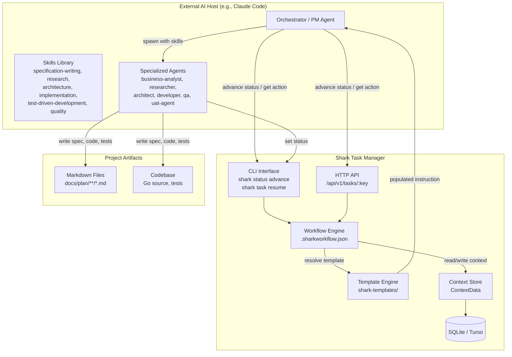

---

## Entity Hierarchy & Key Formats

Shark organizes work in three levels. All entity types share the same workflow state machine pattern.

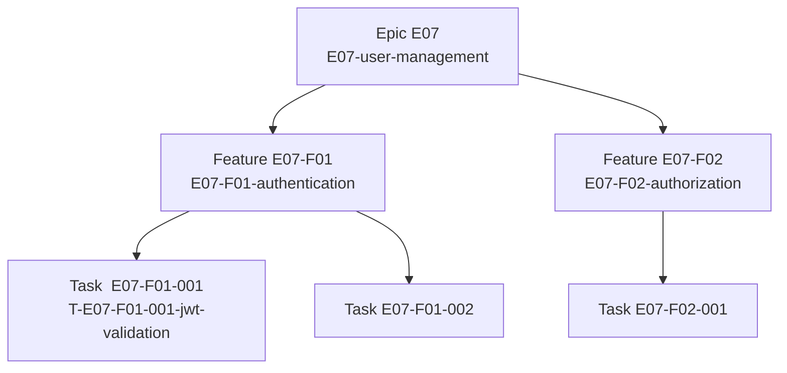

**Key auto-detection** — entity type is derived from the key pattern:

| Pattern | Entity | Example |
|---------|--------|---------|
| `E##` | Epic | `E07` |
| `E##-F##` | Feature | `E07-F01` |
| `E##-F##-###` | Task | `E07-F01-001` |

All keys are case-insensitive. Slugged variants (`E07-user-management`) work everywhere.

---

## Workflow State Machines

Each entity level has its own state machine defined in `.sharkworkflow-short.json`. The state machine drives which agent is invoked, with which skills, using which prompt template.

### Epic Workflow

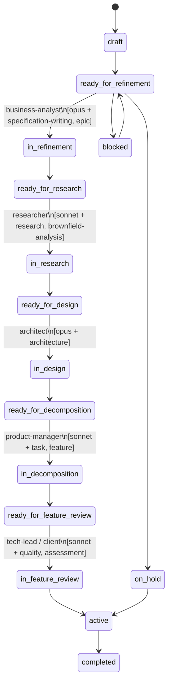

### Feature Workflow

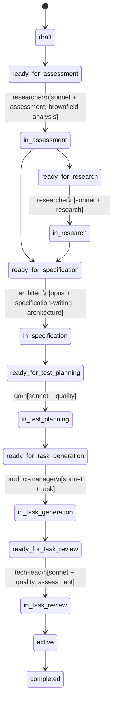

### Task Workflow

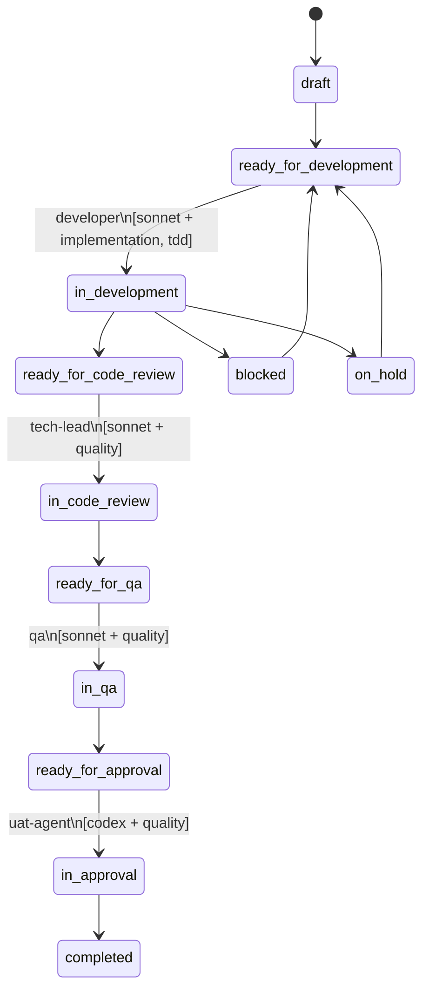

---

## Orchestrator Action System

Every status in the workflow has an `orchestrator_action` defined in the workflow JSON. When an entity enters a `ready_for_*` status, the orchestrator reads the action and routes work accordingly.

### Action Types

| Action | Behavior |
|--------|----------|
| `spawn_agent` | Create a new agent session with the specified type, model, skills, and populated instruction |
| `check_or_resume` | Resume an existing in-progress agent session; spawn new if none found |
| `cascade` | Propagate status change to all child entities (e.g., epic → features) |
| `advance_status` | Auto-advance without agent intervention (draft states) |
| `pause` | Hold for manual human intervention |
| `archive` | Finalize and close the entity |
| `wait_for_triage` | Queue for human review before routing |

### Action Resolution Flow

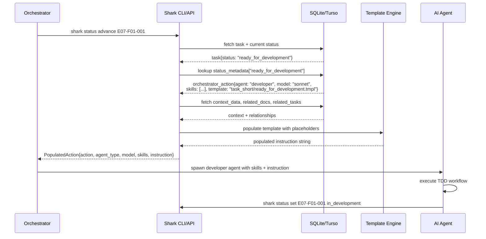

### PopulatedAction Structure

```json
{
  "action": "spawn_agent",
  "agent_type": "developer",
  "model": "claude-sonnet-4-20250514",
  "skills": ["implementation", "test-driven-development"],
  "instruction": "Develop task E07-F01-001: \"Implement JWT token validation\".\n\nCheck for existing implementation...\n\nTDD IMPLEMENTATION\n..."
}
```

---

## Prompt Template System

Shark uses a Go `text/template`-based system with Jinja2-style syntax. Templates live in `shark-templates/` organized by entity type and status.

### Template Directory Structure

```
shark-templates/
├── partials/                    ← Shared template fragments
│   ├── _resume_preamble.tmpl    ← "Previous session was interrupted, check for existing work"
│   ├── _tdd_process.tmpl        ← Standard TDD workflow steps
│   ├── _code_review_process.tmpl← Code review checklist
│   ├── _qa_process.tmpl         ← QA execution steps
│   ├── _exit_gate.tmpl          ← Completion criteria validation
│   ├── _read_section.tmpl       ← Standard document reading order
│   ├── _commands.tmpl           ← Shark CLI command hints
│   └── _client.tmpl             ← Client/stakeholder review instructions
│
├── epic_short/                  ← Epic prompts (short workflow)
│   ├── ready_for_refinement.tmpl    → BA: write epic PRD
│   ├── ready_for_research.tmpl      → Researcher: brownfield analysis
│   ├── ready_for_design.tmpl        → Architect: tech design
│   ├── ready_for_decomposition.tmpl → PM: decompose into features
│   └── ready_for_feature_review.tmpl→ Tech lead: review features
│
├── feature_short/               ← Feature prompts
│   ├── ready_for_assessment.tmpl    → Researcher: assess complexity
│   ├── ready_for_specification.tmpl → Architect: write feature spec
│   ├── ready_for_test_planning.tmpl → QA: write test plan
│   └── ready_for_task_generation.tmpl→ PM: generate tasks
│
└── task_short/                  ← Task prompts
    ├── ready_for_development.tmpl   → Developer: TDD implementation
    ├── ready_for_code_review.tmpl   → Tech lead: review code
    ├── ready_for_qa.tmpl            → QA: execute test plan
    └── ready_for_approval.tmpl      → UAT agent: acceptance criteria
```

### Template Placeholder Variables

Templates are auto-populated with entity context before being sent to an agent:

| Category | Placeholders |
|----------|-------------|
| **Entity** | `{{.id}}`, `{{.key}}`, `{{.title}}`, `{{.status}}`, `{{.file_path}}`, `{{.created_at}}`, `{{.updated_at}}` |
| **Task-specific** | `{{.task_key}}`, `{{.priority}}`, `{{.agent_type}}`, `{{.execution_order}}` |
| **Relationships** | `{{.related_docs}}` (CSV paths), `{{.related_tasks}}` (CSV keys) |
| **Feature-specific** | `{{.feature_key}}`, `{{.epic_key}}`, `{{.related_features}}` |
| **Epic-specific** | `{{.epic_key}}`, `{{.business_value}}`, `{{.related_epics}}` |
| **Resume context** | `{{.is_resume}}`, `{{.current_step}}`, `{{.completed_steps}}`, `{{.remaining_steps}}` |
| **Decisions/Blockers** | `{{.implementation_decisions}}`, `{{.open_questions}}`, `{{.blockers}}` |

### Template Rendering Flow

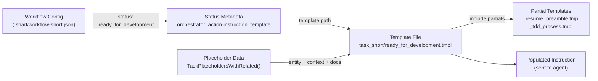

---

## Context & Resume System

Shark maintains structured context data per entity so agents can resume interrupted work without losing state.

### ContextData Model

```mermaid
classDiagram
    class ContextData {
        +Progress ProgressContext
        +ImplementationDecisions map[string]string
        +OpenQuestions []string
        +Blockers []BlockerContext
        +Metadata map[string]interface{}
    }

    class ProgressContext {
        +CurrentStep string
        +CompletedSteps []string
        +RemainingSteps []string
    }

    class BlockerContext {
        +Description string
        +CreatedAt time.Time
        +ResolvedAt *time.Time
    }

    ContextData --> ProgressContext
    ContextData --> BlockerContext
```

### Resume Context Aggregation

The `ResumeService` assembles a complete picture for agents resuming work:

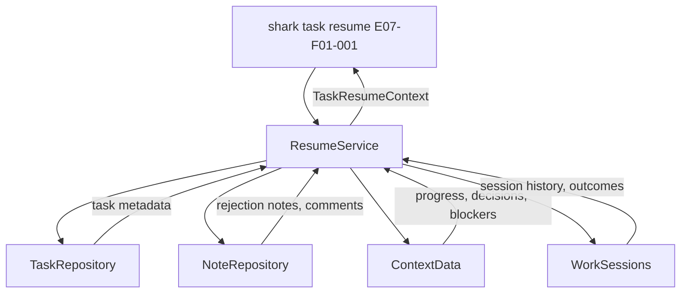

**CLI commands for context management:**

```bash
# Read current context
shark task resume E07-F01-001

# Update progress after partial work
shark context set E07-F01-001 --field current_step --value "Step 2: writing tests"
shark context set E07-F01-001 --field completed_steps --value '["Step 1: read specs"]'

# Clear context on fresh start
shark context clear E07-F01-001
```

---

## Agent Handoff Flow

This is the core loop: each `ready_for_*` status triggers an agent, each agent completes work and sets the next status, which triggers the next agent.

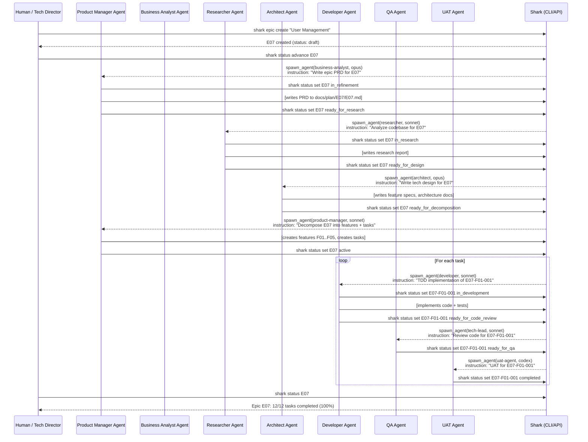

---

## Web Viewer & HTTP API

The `cmd/server` package exposes an HTTP API that the web viewer and orchestrators use to inspect entity state, relationships, and resolved orchestrator actions.

### Viewer Architecture

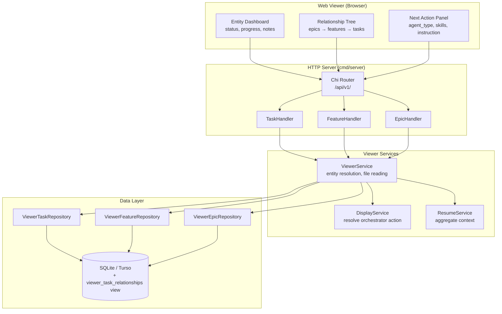

### Key API Endpoints

| Method | Path | Description |
|--------|------|-------------|
| `GET` | `/api/v1/epics/:key` | Epic with feature rollups, orchestrator action |
| `GET` | `/api/v1/features/:key` | Feature with task summaries, spec file content |
| `GET` | `/api/v1/tasks/:key` | Task with context, related docs, next action |
| `PATCH` | `/api/v1/tasks/:key/advance` | Advance to next status |
| `PATCH` | `/api/v1/tasks/:key/status` | Set status directly |
| `GET` | `/api/v1/tasks/:key/resume` | Full resume context for agents |

### Viewer Response for a Task

```json
{
  "key": "E07-F01-001",
  "title": "Implement JWT token validation",
  "status": "ready_for_development",
  "file_path": "docs/plan/E07/E07-F01/T-E07-F01-001.md",
  "valid_transitions": ["in_development", "blocked", "on_hold"],
  "orchestrator_action": {
    "action": "spawn_agent",
    "agent_type": "developer",
    "model": "claude-sonnet-4-20250514",
    "skills": ["implementation", "test-driven-development"],
    "instruction": "Develop task E07-F01-001: \"Implement JWT token validation\".\n..."
  },
  "context_data": {
    "current_step": null,
    "completed_steps": [],
    "implementation_decisions": {},
    "blockers": []
  },
  "notes": [],
  "related_docs": ["docs/plan/E07/E07-F01/spec.md", "docs/plan/E07/E07-F01/test-plan.md"]
}
```

---

## External Skills & Agent Integration

Shark does not implement the agents — it delegates to the **host AI CLI** (e.g., Claude Code). The `orchestrator_action` tells the host CLI what agent type, model, and skills to load.

### Skills Referenced in Workflow

| Skill | Used By | Purpose |
|-------|---------|---------|
| `specification-writing` | BA, Architect | Write PRDs, feature specs, task specs |
| `epic` | BA | Epic creation and PRD workflow |
| `research` | Researcher | Codebase analysis, brownfield review |
| `brownfield-analysis` | Researcher | Legacy code assessment |
| `architecture` | Architect | System design, tech decisions |
| `implementation` | Developer | Code implementation patterns |
| `test-driven-development` | Developer | TDD workflow (red-green-refactor) |
| `quality` | Tech Lead, QA, UAT | Code review, validation, acceptance |
| `assessment` | Researcher, Tech Lead | Scope and complexity estimation |
| `task` | PM | Task decomposition and sequencing |
| `feature` | PM | Feature definition and breakdown |

### Agent Type Mapping

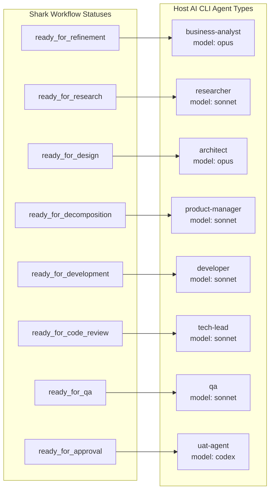

### Host CLI Integration Points

Shark assumes the host AI CLI provides:

1. **Agent spawning** — ability to create agents by type with specified skills
2. **Skill loading** — named skills that configure agent behavior (e.g., `implementation` skill loads TDD patterns)
3. **Model selection** — route to `opus`, `sonnet`, `haiku`, or external models (`codex`, `o3`)
4. **Session management** — resume interrupted agent sessions (used by `check_or_resume` action)

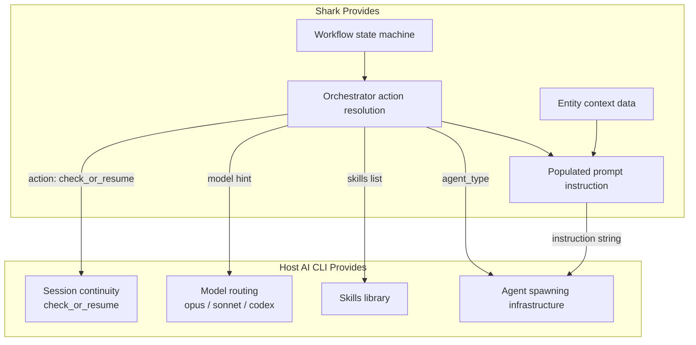

---

## Internal Service Architecture

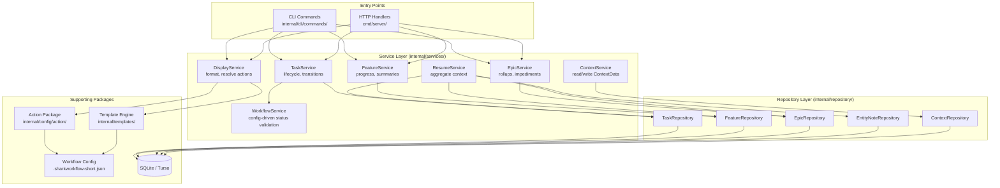

**Layering rules (enforced):**
- CLI commands are thin wrappers: parse → call service → format output. No business logic.
- Services own all business logic, workflow validation, transactions.
- Repositories contain only data access (CRUD). No progress calculation, no workflow logic.

---

## End-to-End DLC Flow

The complete development lifecycle from idea to shipped feature:

```mermaid
flowchart TD
    START([Human: shark epic create]) --> EPIC_DRAFT[Epic: draft]

    EPIC_DRAFT --> |shark status advance| BA_SPAWN[BA Agent spawned\nopus + specification-writing, epic]
    BA_SPAWN --> PRD[PRD written to E07.md\ngoals, scope, criteria, constraints]
    PRD --> RESEARCH_Q[Epic: ready_for_research]

    RESEARCH_Q --> |shark status advance| RE_SPAWN[Researcher spawned\nsonnet + research, brownfield-analysis]
    RE_SPAWN --> ANALYSIS[Codebase analysis written\ntech constraints, dependencies]
    ANALYSIS --> DESIGN_Q[Epic: ready_for_design]

    DESIGN_Q --> |shark status advance| AR_SPAWN[Architect spawned\nopus + architecture]
    AR_SPAWN --> ARCH[Architecture docs written\nfeature specs scaffolded]
    ARCH --> DECOMP_Q[Epic: ready_for_decomposition]

    DECOMP_Q --> |shark status advance| PM_SPAWN[PM Agent spawned\nsonnet + task, feature]
    PM_SPAWN --> TASKS[Features + Tasks created\nE07-F01 through E07-F05\nT-E07-F01-001 through ...N]
    TASKS --> EPIC_ACTIVE[Epic: active\nFeatures: active]

    EPIC_ACTIVE --> FEATURE_LOOP

    subgraph FEATURE_LOOP[Feature Lifecycle - repeated per feature]
        FA[Feature: ready_for_assessment] --> |researcher| FASSESS[Complexity assessed]
        FASSESS --> FS_Q[Feature: ready_for_specification]
        FS_Q --> |architect| FSPEC[Feature spec.md written\nArchitecture, patterns, scope]
        FSPEC --> FT_Q[Feature: ready_for_test_planning]
        FT_Q --> |qa| FTEST[test-plan.md written\nTest cases, edge cases, fixtures]
        FTEST --> FTG_Q[Feature: ready_for_task_generation]
        FTG_Q --> |product-manager| FTASKS[Tasks generated\nsequenced, scoped, ordered]
        FTASKS --> FACTIVE[Feature: active]
    end

    FACTIVE --> TASK_LOOP

    subgraph TASK_LOOP[Task Lifecycle - repeated per task]
        TD[Task: ready_for_development] --> |developer\nsonnet + implementation, tdd| TIMPL[TDD implementation\nfailing tests → code → refactor\nmake fmt && make lint && make test]
        TIMPL --> TCR_Q[Task: ready_for_code_review]
        TCR_Q --> |tech-lead\nsonnet + quality| TCR[Code review report\npatterns, security, quality]
        TCR --> TQA_Q[Task: ready_for_qa]
        TQA_Q --> |qa\nsonnet + quality| TQA[QA execution\ntest plan scenarios executed]
        TQA --> TUAT_Q[Task: ready_for_approval]
        TUAT_Q --> |uat-agent\ncodex + quality| TUAT[UAT red-team review\nacceptance criteria checked]
        TUAT --> TDONE[Task: completed ✓]
    end

    TDONE --> CHECK{All tasks\ncompleted?}
    CHECK -->|No| TASK_LOOP
    CHECK -->|Yes| FDONE[Feature: completed ✓]
    FDONE --> ECHECK{All features\ncompleted?}
    ECHECK -->|No| FEATURE_LOOP
    ECHECK -->|Yes| EPIC_DONE([Epic: completed ✓])
```

---

## Configuration Reference

The workflow and agent routing are fully configurable via `.sharkworkflow-short.json`:

```json
{
  "task_workflow": {
    "status_flow": {
      "ready_for_development": ["in_development", "blocked", "on_hold"],
      "in_development": ["ready_for_code_review", "blocked", "on_hold"]
    },
    "status_metadata": {
      "ready_for_development": {
        "description": "Ready for developer to implement",
        "phase": "development",
        "color": "yellow",
        "progress_weight": 0.10,
        "responsibility": "agent",
        "agent_types": ["developer"],
        "orchestrator_action": {
          "action": "spawn_agent",
          "agent_type": "developer",
          "model": "claude-sonnet-4-20250514",
          "skills": ["implementation", "test-driven-development"],
          "instruction_template": "task_short/ready_for_development.tmpl"
        }
      }
    }
  }
}
```

**To customize the workflow:**
1. Copy `shark-templates/.sharkworkflow-short.json` to a custom path
2. Edit statuses, transitions, agent types, skills, or templates
3. Update `workflow_config` in `.sharkconfig.json` to point at your file
4. `shark admin init` leaves custom files outside `shark-templates/` untouched

---

## DLC Flow — Slide Version

Three diagrams sized to sit side by side on one slide. Each covers one phase of the lifecycle.

### Phase 1 of 3 — Epic Planning

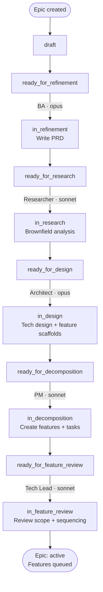

### Phase 2 of 3 — Feature Specification

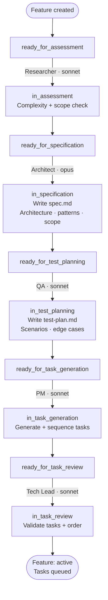

### Phase 3 of 3 — Task Execution

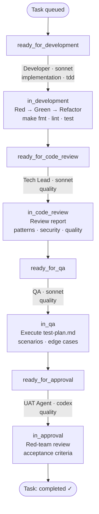

---

## Summary

Shark's DLC facilitation rests on four pillars:

| Pillar | Mechanism | Files |
|--------|-----------|-------|
| **Workflow** | JSON state machine with per-status metadata | `.sharkworkflow-short.json` |
| **Prompts** | Template system auto-populated with entity context | `shark-templates/**/*.tmpl` |
| **Context** | Structured ContextData with progress, decisions, blockers | `internal/models/context_data.go` |
| **Integration** | `orchestrator_action` tells host CLI which agent/model/skills to use | `internal/config/action/`, `internal/services/display_service.go` |

The host AI CLI (Claude Code or equivalent) provides the agent spawning infrastructure, skills library, and model routing. Shark provides the workflow definition, state persistence, context aggregation, and populated prompt instructions.
