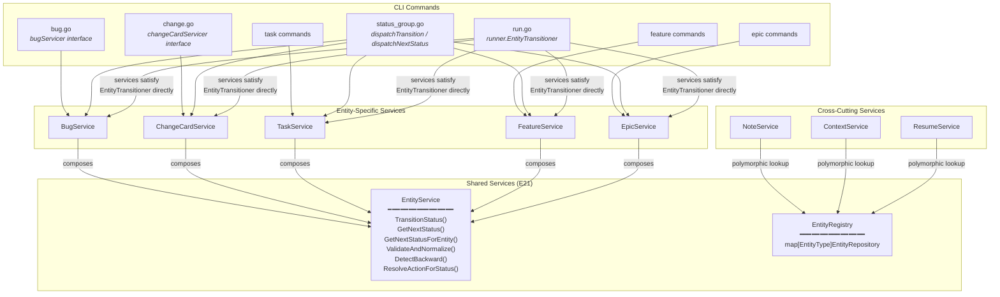
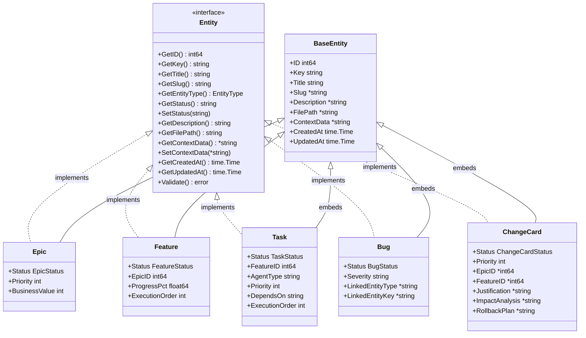
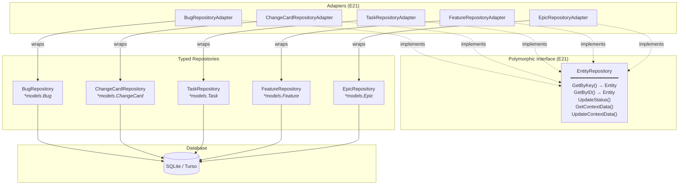
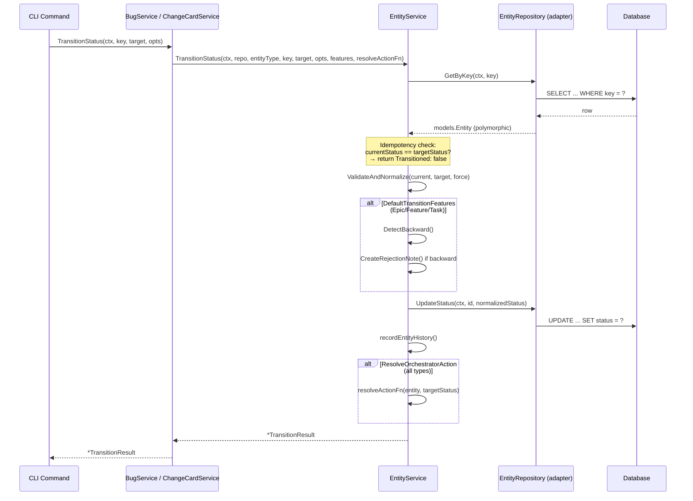

# Entity Polymorphism Architecture (E21)

How the five entity types share infrastructure through the Entity interface and EntityService.

## Service Layer

## Model Layer

## Repository Layer

## TransitionStatus Flow

## What's Shared vs Entity-Specific

| Concern | Shared (EntityService) | Entity-Specific |
|---------|----------------------|-----------------|
| **Status transitions** | TransitionStatus, ValidateAndNormalize, DetectBackward | Feature flags: DefaultTransitionFeatures vs SimpleTransitionFeatures |
| **Next status** | GetNextStatus, GetNextStatusForEntity | Service wrappers pass entity type + resolveActionFn |
| **Notes** | NoteService via EntityRegistry | — |
| **Context data** | ContextService via EntityRegistry | — |
| **Resume** | ResumeService via EntityRegistry | — |
| **Documents** | EntityDocumentService (link/unlink/list) | SetWritableDocRepo wiring per service |
| **Orchestrator actions** | ResolveActionForStatus | makeResolveActionFn (entity-specific placeholders) |
| **CRUD** | — | Per-entity service methods (Create, Get, List, Update, Delete) |
| **Markdown generation** | — | Per-entity template building |
| **Triage** | — | BugService.TriageBug only |
| **Progress rollup** | — | FeatureService, EpicService only |
| **Dependencies** | — | TaskService only |

## Remaining Duplication (Post-E21)

~370 lines of structural duplication remain across entity services:

| Pattern | Where | Lines | Why Not Unified |
|---------|-------|-------|-----------------|
| CRUD service methods | All 5 services | ~300 | Type safety — each returns typed model (*Bug vs *ChangeCard) |
| Orchestrator placeholder callbacks | All 5 services | ~50 | Different placeholder maps per entity type |

Spec file generation (`generateMarkdown`) is per-entity by design — each entity type has different sections (bugs have "Steps to Reproduce"; change-cards have "Justification" / "Rollback Plan"). This is domain-specific content, not structural duplication.

The CRUD duplication is an acceptable trade-off: unifying it would require generics or runtime type assertions that sacrifice compile-time safety.
