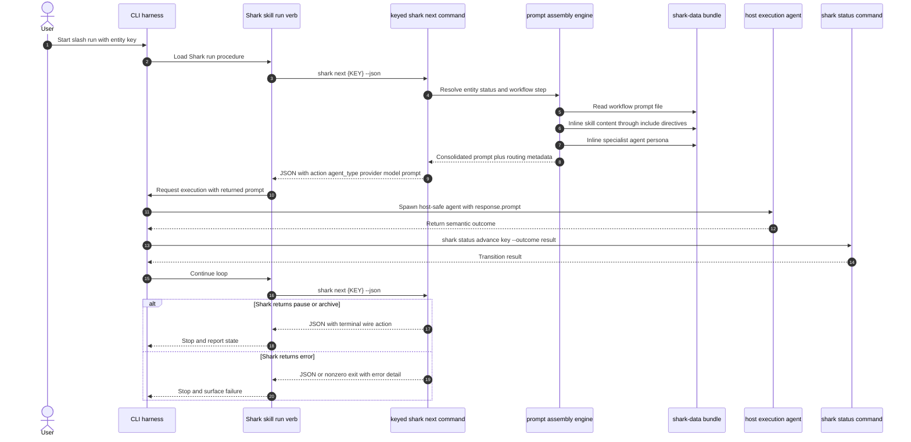

# Shark Dispatch Prompt Assembly

This document covers keyed workflow dispatch. Shark owns keyed routing and
prompt assembly. The host harness owns only the outer loop and the execution
primitive that runs the returned prompt.

The canonical dispatch contract is `shark next <key> --json`. Harnesses should
not build prompts from `shark get ... orchestrator_action`, and they should not
load Shark skills or Shark specialist agents from their own filesystem.

## Command modes

This wire contract applies only to keyed `shark next <key> --json`. It requires
an entity key — bare `shark next` (no key) is invalid and errors, pointing the
operator at `shark plan`. `shark plan [root|collection]` is the separate,
read-only work-selection surface: bare `shark plan` returns one selected epic
(or an epic-only `parallel_candidates` tie); `shark plan <epic|feature>`
evaluates one hierarchy edge and returns direct children as a
`hierarchy_selection` envelope; `shark plan bugs|change-cards|tech-debt`
selects the next claimable standalone tier. None of `shark plan`'s selection
responses assemble a specialist dispatch prompt or claim, advance, or
normalize workflow state — only a leaf entity, or a parent already at its own
agent step, returns a rendered dispatch prompt from `shark plan`, identical to
what `shark next` would return for that same entity.

## Contract

- `shark next <key> --json` returns the harness-facing wire shape:
  `action`, `agent_type`, `provider`, `model`, and `prompt`.
- `prompt` is the execution payload. It must already contain the rendered
  workflow prompt, included skill content, and the Shark specialist persona.
- `agent_type` is Shark metadata for routing, logs, and prompt provenance. It is
  not necessarily a native host subagent type.
- The harness may choose the host execution primitive, such as a built-in
  `general-purpose` subagent, but it must pass `response.prompt` unchanged.
- `shark get ... orchestrator_action` remains an inspection surface. It is not
  the dispatch prompt assembly API.

## Failure Mode Captured 2026-07-04

The failed `~/projects/wwgm` session used `shark get E01 --json` and attempted
to spawn `orchestrator_action.agent_type` directly as a Claude Code subagent.
That bypassed the keyed `shark next <key>` assembly path and failed because
Shark specialist personas live in `shark-data/agents/`, not in the host's
native agent registry.

The remediation is to repoint the run harness to `shark next <key> --json`,
dispatch the returned `prompt`, and treat native host agent selection as an
adapter concern.
