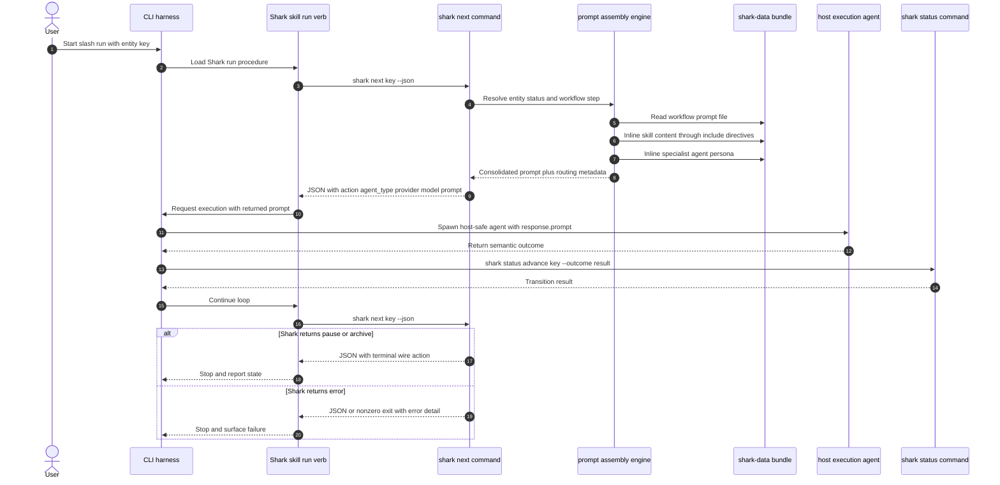

# Shark Dispatch Prompt Assembly

Shark owns workflow routing and prompt assembly. The host harness owns only the
outer loop and the execution primitive that runs the returned prompt.

The canonical dispatch contract is `shark next <key> --json`. Harnesses should
not build prompts from `shark get ... orchestrator_action`, and they should not
load Shark skills or Shark specialist agents from their own filesystem.

## Contract

- `shark next` returns the harness-facing wire shape:
  `action`, `agent_type`, `provider`, `model`, and `prompt`.
- `prompt` is the execution payload. It must already contain the rendered
  workflow prompt, included skill content, and the Shark specialist persona.
- `agent_type` is Shark metadata for routing, logs, and prompt provenance. It is
  not necessarily a native host subagent type.
- The harness may choose the host execution primitive, such as a built-in
  `general-purpose` subagent, but it must pass `response.prompt` unchanged.
- `shark get ... orchestrator_action` remains an inspection surface. It is not
  the dispatch prompt assembly API.

## Failure Mode Captured 2026-07-04

The failed `~/projects/wwgm` session used `shark get E01 --json` and attempted
to spawn `orchestrator_action.agent_type` directly as a Claude Code subagent.
That bypassed the `shark next` assembly path and failed because Shark specialist
personas live in `shark-data/agents/`, not in the host's native agent registry.

The remediation is to repoint the run harness to `shark next`, dispatch the
returned `prompt`, and treat native host agent selection as an adapter concern.
