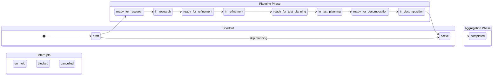
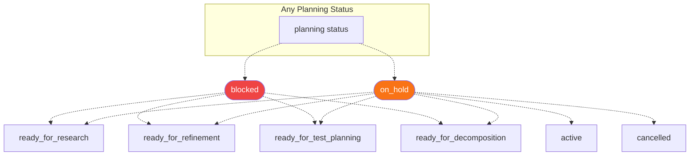
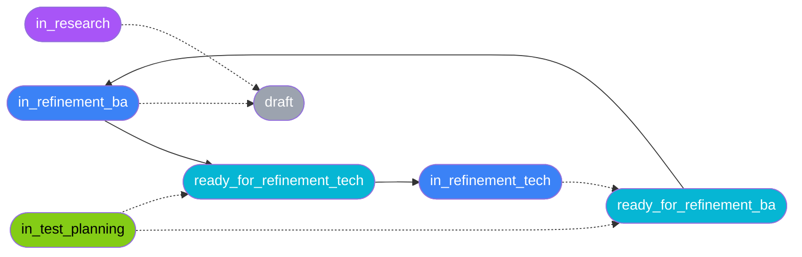
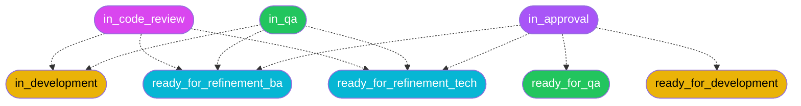
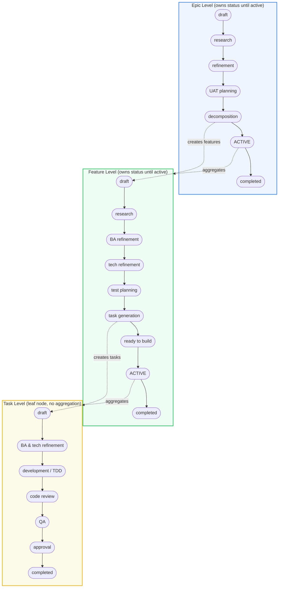

# Multi-Level Workflow System

Shark uses a three-tier workflow system where epics, features, and tasks each have independent, configurable status flows. Each tier has a **planning phase** (entity owns its own status) and an **aggregation phase** (entity derives progress from its children).

## Architecture Overview

```
Epic Workflow          Feature Workflow         Task Workflow
(planning → active)    (planning → active)      (planning → execution → done)
      │                      │                        │
      │ aggregates from      │ aggregates from        │ leaf node
      ▼                      ▼                        │
   features               tasks                  (no children)
```

### The Aggregation Threshold

The `active` status is the **aggregation threshold** at the epic and feature levels:

- **Before `active`** (`is_planning: true`): The entity has its own workflow. Progress is measured by `progress_weight` of its current status.
- **At/after `active`** (`is_planning: false`): The entity aggregates progress from children. Epics aggregate from features, features aggregate from tasks.

This means the `draft → active` shortcut is always valid -- you can skip the entire planning workflow and go straight to child-driven progress tracking.

### Research Information Cascade

Research cascades downward through the three tiers, becoming more specific at each level:

```
Epic Research (STRATEGIC)
│  Market landscape, feasibility, system-wide impact,
│  epic interactions, capability overlap, risks
│
├──▶ Feature Research (TACTICAL)
│    Codebase patterns, existing implementations, integration
│    points, extension vs new code, inter-feature dependencies
│
└──▶ Task Level (ABSORBED)
     No separate research step. Feature research context is
     incorporated into BA and tech refinement templates.
     Agents read feature research report as input artifact.
```

**Why this design**: Epic research produces strategic context tokens that focus feature research on the right codebase areas. By the task level, sufficient context exists from feature research that a separate research step adds overhead without new insight. Task BA and tech refinement templates explicitly absorb research verification duties (codebase standards, contract consistency).

### Test Planning Cascade

Test planning cascades downward through the three tiers, with tests authored from the user's perspective at each level:

```
Epic UAT Plan (STRATEGIC)
│  Acceptance scenarios from user journeys, success metrics
│  validation, cross-epic integration scenarios, persona
│  acceptance matrix. "How do we know this epic delivers value?"
│
├──▶ Feature Test Plan (TACTICAL)
│    Breaks down epic UAT scenarios into locally testable
│    strategies: component tests, API contract tests, integration
│    tests, acceptance criteria matrix. Tests trace to user goals.
│
└──▶ Task Level (ABSORBED into TDD)
     No separate test planning step. Developer reads feature test
     plan, writes tests FIRST (TDD), implements to pass. QA
     validates against the already-existing feature test plan.
```

**Why this design**: Tests should be written with user goals in mind, not just technical correctness. The epic UAT plan defines "what does success look like?" from the user's perspective. Feature test plans decompose those acceptance scenarios into testable strategies. At the task level, developers practice TDD guided by the feature test plan -- tests are written first, then implementation makes them pass. This is true shift-left: QA catches requirement gaps and spec drift at the feature level, before any code exists.

---

## Epic Workflow (14 statuses)

The epic workflow covers strategic research, refinement into a PRD, UAT acceptance planning, and decomposition into features.



### Epic Status Flow (Primary Path)

```mermaid
flowchart LR
    draft([draft]):::gray --> ready_for_research([ready_for_research]):::purple
    ready_for_research --> in_research([in_research]):::purple
    in_research --> ready_for_refinement([ready_for_refinement]):::orange
    ready_for_refinement --> in_refinement([in_refinement]):::orange
    in_refinement --> rftp([ready_for_test_planning]):::lime
    rftp --> itp([in_test_planning]):::lime
    itp --> ready_for_decomposition([ready_for_decomposition]):::yellow
    ready_for_decomposition --> in_decomposition([in_decomposition]):::yellow
    in_decomposition --> active([ACTIVE]):::blue
    active --> completed([completed]):::green

    draft -.-> active
    draft -.-> cancelled([cancelled]):::gray

    classDef gray fill:#9ca3af,color:#fff
    classDef purple fill:#a855f7,color:#fff
    classDef orange fill:#f97316,color:#fff
    classDef lime fill:#84cc16,color:#000
    classDef yellow fill:#eab308,color:#000
    classDef blue fill:#3b82f6,color:#fff
    classDef green fill:#22c55e,color:#fff
    classDef red fill:#ef4444,color:#fff
```



### Epic Interrupt Flows



### Epic Agent Routing

| Status | Agent | Skills | Weight |
|--------|-------|--------|--------|
| draft | (wait for triage) | - | 0% |
| ready_for_research | researcher | discovery, research | 5% |
| in_research | (in progress) | - | 15% |
| ready_for_refinement | business-analyst | specification-writing | 25% |
| in_refinement | (in progress) | - | 40% |
| ready_for_test_planning | qa | quality, shark-task-management | 45% |
| in_test_planning | (in progress) | - | 50% |
| ready_for_decomposition | product-manager | specification-writing | 55% |
| in_decomposition | (in progress) | - | 70% |
| **active** | **aggregates from features** | - | **100%** |
| completed | (archive) | - | 100% |

---

## Feature Workflow (17 statuses)

The feature workflow covers tactical research, BA refinement, technical architecture, test planning, task generation, and build handoff. Features include both a research phase (codebase analysis informed by epic research) and a test planning phase (breaking down epic UAT scenarios into feature-specific test strategies).

### Feature Status Flow (Primary Path)

```mermaid
flowchart LR
    draft([draft]):::gray --> rfr([ready_for_research]):::purple
    rfr --> ir([in_research]):::purple
    ir --> rfba([ready_for_refinement_ba]):::cyan
    rfba --> irba([in_refinement_ba]):::blue
    irba --> rfrt([ready_for_refinement_tech]):::cyan
    rfrt --> irrt([in_refinement_tech]):::blue
    irrt --> rftp([ready_for_test_planning]):::lime
    rftp --> itp([in_test_planning]):::lime
    itp --> rftg([ready_for_task_generation]):::yellow
    rftg --> itg([in_task_generation]):::yellow
    itg --> rtb([ready_to_build]):::green
    rtb --> active([ACTIVE]):::blue2
    active --> completed([completed]):::green2

    draft -.-> rfba
    draft -.-> active
    draft -.-> cancelled([cancelled]):::gray

    classDef gray fill:#9ca3af,color:#fff
    classDef purple fill:#a855f7,color:#fff
    classDef cyan fill:#06b6d4,color:#fff
    classDef blue fill:#3b82f6,color:#fff
    classDef lime fill:#84cc16,color:#000
    classDef yellow fill:#eab308,color:#000
    classDef green fill:#22c55e,color:#fff
    classDef blue2 fill:#2563eb,color:#fff
    classDef green2 fill:#16a34a,color:#fff
    classDef red fill:#ef4444,color:#fff
```



Note: `draft → ready_for_refinement_ba` is the skip-research shortcut for features where codebase research is unnecessary.

### Feature Rework Loops



### Feature Agent Routing

| Status | Agent | Skills | Weight |
|--------|-------|--------|--------|
| draft | (wait for triage) | - | 0% |
| ready_for_research | researcher | research, shark-task-management | 3% |
| in_research | (in progress) | - | 8% |
| ready_for_refinement_ba | business-analyst | specification-writing, shark-task-management | 12% |
| in_refinement_ba | (in progress) | - | 18% |
| ready_for_refinement_tech | architect | architecture, specification-writing, shark-task-management | 25% |
| in_refinement_tech | (in progress) | - | 40% |
| ready_for_test_planning | qa | quality, shark-task-management | 45% |
| in_test_planning | (in progress) | - | 50% |
| ready_for_task_generation | product-manager | specification-writing, shark-task-management | 55% |
| in_task_generation | (in progress) | - | 70% |
| ready_to_build | tech-director | build, shark-task-management | 85% |
| **active** | **aggregates from tasks** | - | **100%** |
| completed | (archive) | - | 100% |

---

## Task Workflow (15 statuses)

Tasks are leaf nodes with no children -- their progress is tracked by their own `progress_weight`. Both research and test planning are absorbed from higher tiers: research context flows down from the feature level into BA/tech refinement, and the feature test plan drives TDD at the task level.

### Task Status Flow (Primary Path)


### Task Rework Loops



### Task Agent Routing

| Status | Agent | Skills | Weight |
|--------|-------|--------|--------|
| draft | (wait for triage) | - | 0% |
| todo | (wait for triage) | - | 0% |
| ready_for_refinement_ba | business-analyst | specification-writing, shark-task-management | 5% |
| in_refinement_ba | (in progress) | - | 12% |
| ready_for_refinement_tech | architect | architecture, specification-writing, shark-task-management | 10% |
| in_refinement_tech | (in progress) | - | 20% |
| ready_for_development | developer | test-driven-development, implementation | 32% |
| in_development | (in progress) | - | 50% |
| ready_for_code_review | tech-lead | quality | 75% |
| in_code_review | (in progress) | - | 80% |
| ready_for_qa | qa | quality, shark-task-management | 80% |
| in_qa | (in progress) | - | 85% |
| ready_for_approval | uat | shark-task-management, uat | 90% |
| in_approval | (human review) | - | 95% |
| completed | (archive) | - | 100% |

---

## End-to-End Flow

The full PDLC lifecycle driven by the three-tier workflow:



## Progress Calculation

### Planning Phase (Before Active)

When an entity is in a planning status (`is_planning: true`), its progress is determined by the `progress_weight` of its current status:

```
epic_planning_progress = epic_workflow.status_metadata[current_status].progress_weight
```

For example, an epic at `in_refinement` has weight `0.40` = **40% through planning**.

### Aggregation Phase (At/After Active)

When an entity is in an aggregation status (`is_planning: false`, `aggregates_from` set):

**Feature progress** (aggregates from tasks):
```
weighted_progress = sum(task.progress_weight for each task) / total_tasks
completion_progress = completed_tasks / total_tasks
```

**Epic progress** (aggregates from features):
```
For each feature:
  if feature.is_planning: feature_progress = feature.progress_weight
  else: feature_progress = feature.weighted_task_progress

epic_progress = sum(feature_progress) / total_features
```

### Progress Weight Reference

| Phase | Epic Weight | Feature Weight | Task Weights |
|-------|------------|----------------|-------------|
| Start | 0% (draft) | 0% (draft) | 0% (draft/todo) |
| Research | 5-15% | 3-8% | - |
| BA Refinement | 25-40% | 12-18% | 5-12% |
| Tech Refinement | - | 25-40% | 10-20% |
| Test Planning | 45-50% | 45-50% | - |
| Decomposition | 55-70% | 55-70% | - |
| Build/Dev | - | 85% | 32-50% |
| Code Review | - | - | 75-80% |
| QA | - | - | 80-85% |
| Approval | - | - | 90-95% |
| **Aggregation** | **100%** | **100%** | - |
| Done | 100% | 100% | 100% |

## Configuration Structure

The `.sharkconfig.json` file contains three workflow sections:

```
.sharkconfig.json
├── epic_workflow          # Epic-level workflow definition
│   ├── version
│   ├── status_flow        # Valid transitions
│   ├── status_metadata    # Status properties (color, weight, agent, etc.)
│   └── special_statuses   # _start_, _complete_, _aggregation_
│
├── feature_workflow       # Feature-level workflow definition
│   ├── version
│   ├── status_flow
│   ├── status_metadata
│   └── special_statuses
│
├── status_flow            # Task-level workflow (top-level, backward compatible)
├── status_metadata        # Task-level status metadata
├── special_statuses       # Task-level special statuses
└── status_flow_version
```

The task workflow remains at the top level for backward compatibility. Existing configs without `epic_workflow` or `feature_workflow` fall back to the legacy hardcoded statuses (`draft`, `active`, `completed`, `archived`).
