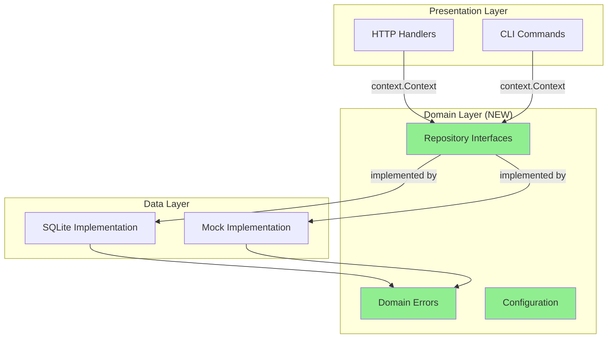

# Feature PRD: Architecture Improvements

**Feature**: E04-F09 - Recommended Architecture Improvements
**Epic**: E04 - Task Management CLI Core
**Status**: Draft
**Priority**: High
**Created**: 2025-12-16

---

## Executive Summary

This feature implements four critical architectural improvements identified during the architecture review to make the Shark Task Manager codebase more idiomatic, testable, and maintainable while maintaining its simplicity and clarity.

### Goals

1. **Add Context Support** - Implement `context.Context` across all I/O operations for cancellation, timeouts, and trace propagation
2. **Define Repository Interfaces** - Create explicit interfaces for all repositories to enable mocking and multiple implementations
3. **Domain-Specific Errors** - Replace generic error strings with typed domain errors for better error handling
4. **Configuration Management** - Extract hardcoded values to environment variables and configuration files

### Success Criteria

- ✅ All repository methods accept `context.Context` as first parameter
- ✅ Repository interfaces defined in `internal/domain/` package
- ✅ Domain errors defined and used consistently
- ✅ Configuration loaded from environment variables with sensible defaults
- ✅ All existing tests pass with new interfaces
- ✅ Mock implementations available for testing
- ✅ Zero breaking changes to CLI or HTTP API behavior
- ✅ Documentation updated to reflect new patterns

### Non-Goals

- Rewriting the entire architecture (it's already good!)
- Adding heavyweight DI frameworks
- Switching to PostgreSQL (SQLite is appropriate)
- Adding ORM (manual SQL is better for this use case)
- Implementing service layer (not needed yet)

---

## Background

### Current State

The Shark Task Manager demonstrates solid Go architecture with:
- Clean separation of concerns (Repository pattern)
- Proper error handling
- Good test coverage
- Standard project layout

### Problems

1. **No Context Support**
   - Cannot cancel long-running operations
   - No timeout management
   - Missing standard Go I/O pattern
   - HTTP handlers can't propagate request context

2. **Concrete Dependencies**
   - Repositories depend on concrete `*DB` type
   - Hard to mock for testing
   - Cannot swap implementations (SQLite → PostgreSQL)
   - Tight coupling

3. **Generic Errors**
   - Errors are just strings: `"task not found with id %d"`
   - Cannot distinguish error types programmatically
   - CLI can't provide context-specific help
   - No error wrapping chain

4. **Hardcoded Configuration**
   - Database path: `"shark-tasks.db"`
   - Server port: `"8080"`
   - Cannot change without recompiling
   - No environment-specific configuration

### Why Now?

- Architecture review completed and identified these as high-value improvements
- Still early enough to make changes without major breaking changes
- Foundation for future enhancements (PostgreSQL support, distributed tracing)
- Makes testing significantly easier

---

## Requirements

### Functional Requirements

#### FR-1: Context Support

**Description**: All repository methods must accept `context.Context` as the first parameter.

**Acceptance Criteria**:
- All repository CRUD methods have `context.Context` as first parameter
- All database operations use `*Context()` variants: `QueryContext()`, `QueryRowContext()`, `ExecContext()`
- Context cancellation is respected (operations abort on cancelled context)
- HTTP handlers create context from request: `r.Context()`
- CLI commands create context with timeout: `context.WithTimeout()`

**Affected Components**:
- `internal/repository/epic_repository.go`
- `internal/repository/feature_repository.go`
- `internal/repository/task_repository.go`
- `internal/repository/task_history_repository.go`
- `cmd/server/main.go` (HTTP handlers)
- `internal/cli/commands/` (CLI commands)
- All tests

**Example**:
```go
// Before
func (r *TaskRepository) GetByID(id int64) (*models.Task, error)

// After
func (r *TaskRepository) GetByID(ctx context.Context, id int64) (*models.Task, error) {
    if ctx.Err() != nil {
        return nil, ctx.Err()
    }
    err := r.db.QueryRowContext(ctx, query, id).Scan(...)
    // ...
}
```

#### FR-2: Repository Interfaces

**Description**: Define explicit interfaces for all repositories to enable dependency inversion.

**Acceptance Criteria**:
- New package `internal/domain/` created
- Interfaces defined for: `TaskRepository`, `EpicRepository`, `FeatureRepository`, `TaskHistoryRepository`
- All repository constructors return interfaces, not concrete types
- Concrete implementations moved to `internal/repository/sqlite/` package (optional)
- Mock implementations created in `internal/repository/mock/` for testing
- All existing code uses interfaces instead of concrete types

**Package Structure**:
```
internal/
├── domain/
│   ├── repositories.go      # Interface definitions
│   └── errors.go            # Domain errors
├── repository/
│   ├── sqlite/              # SQLite implementations
│   │   ├── task.go
│   │   ├── epic.go
│   │   ├── feature.go
│   │   └── task_history.go
│   └── mock/                # Mock implementations
│       ├── task.go
│       ├── epic.go
│       ├── feature.go
│       └── task_history.go
```

**Example**:
```go
// internal/domain/repositories.go
package domain

type TaskRepository interface {
    Create(ctx context.Context, task *models.Task) error
    GetByID(ctx context.Context, id int64) (*models.Task, error)
    GetByKey(ctx context.Context, key string) (*models.Task, error)
    Update(ctx context.Context, task *models.Task) error
    Delete(ctx context.Context, id int64) error
    // ... all existing methods
}

// internal/repository/sqlite/task.go
type taskRepository struct {
    db Database
}

func NewTaskRepository(db Database) domain.TaskRepository {
    return &taskRepository{db: db}
}
```

#### FR-3: Domain-Specific Errors

**Description**: Replace generic error strings with typed domain errors.

**Acceptance Criteria**:
- Domain errors defined in `internal/domain/errors.go`
- All "not found" errors return domain error types
- Validation errors return domain error types
- Repositories return domain errors instead of `fmt.Errorf("not found")`
- CLI commands check specific error types with `errors.Is()`
- Error messages provide helpful context to users

**Error Types**:
```go
var (
    // Not Found Errors
    ErrTaskNotFound     = errors.New("task not found")
    ErrEpicNotFound     = errors.New("epic not found")
    ErrFeatureNotFound  = errors.New("feature not found")

    // Validation Errors
    ErrInvalidTaskKey   = errors.New("invalid task key format")
    ErrInvalidEpicKey   = errors.New("invalid epic key format")
    ErrInvalidStatus    = errors.New("invalid status transition")
    ErrEmptyTitle       = errors.New("title cannot be empty")
    ErrInvalidPriority  = errors.New("priority must be between 1 and 10")

    // Business Logic Errors
    ErrDependencyNotMet = errors.New("task dependency not satisfied")
    ErrCannotBlock      = errors.New("cannot block task in current status")
    ErrAlreadyCompleted = errors.New("task is already completed")

    // Database Errors
    ErrDuplicateKey     = errors.New("duplicate key constraint violation")
    ErrForeignKey       = errors.New("foreign key constraint violation")
)
```

**Usage Example**:
```go
// Repository
func (r *taskRepository) GetByID(ctx context.Context, id int64) (*models.Task, error) {
    err := r.db.QueryRowContext(ctx, query, id).Scan(...)
    if err == sql.ErrNoRows {
        return nil, domain.ErrTaskNotFound  // ← Domain error
    }
    if err != nil {
        return nil, fmt.Errorf("database error: %w", err)
    }
    return task, nil
}

// CLI Command
task, err := taskRepo.GetByID(ctx, taskID)
if errors.Is(err, domain.ErrTaskNotFound) {
    fmt.Fprintf(os.Stderr, "Error: Task %s not found.\n", taskKey)
    fmt.Fprintf(os.Stderr, "Use 'shark task list' to see available tasks.\n")
    return nil
}
if err != nil {
    return fmt.Errorf("failed to get task: %w", err)
}
```

#### FR-4: Configuration Management

**Description**: Extract hardcoded values to environment variables with configuration file support.

**Acceptance Criteria**:
- Configuration struct defined in `internal/config/config.go`
- Loads from environment variables (e.g., `SHARK_DB_PATH`, `SHARK_PORT`)
- Falls back to sensible defaults
- Optionally loads from config file (`.shark.yaml`)
- Configuration validated on load
- All hardcoded values removed from code

**Configuration Structure**:
```go
type Config struct {
    Database DatabaseConfig
    Server   ServerConfig
    CLI      CLIConfig
}

type DatabaseConfig struct {
    Path         string        // DB file path
    MaxOpenConns int           // Connection pool size
    MaxIdleConns int           // Idle connections
    Timeout      time.Duration // Query timeout
}

type ServerConfig struct {
    Port         string        // HTTP server port
    ReadTimeout  time.Duration
    WriteTimeout time.Duration
}

type CLIConfig struct {
    DefaultFormat string // json, table, text
    ColorOutput   bool   // Enable colored output
}
```

**Environment Variables**:
```bash
# Database
SHARK_DB_PATH=./shark-tasks.db
SHARK_DB_MAX_OPEN_CONNS=25
SHARK_DB_MAX_IDLE_CONNS=5
SHARK_DB_TIMEOUT=30s

# Server
SHARK_SERVER_PORT=8080
SHARK_SERVER_READ_TIMEOUT=5s
SHARK_SERVER_WRITE_TIMEOUT=10s

# CLI
SHARK_CLI_FORMAT=table
SHARK_CLI_COLOR=true
```

**Config File** (`.shark.yaml`):
```yaml
database:
  path: ./shark-tasks.db
  max_open_conns: 25
  max_idle_conns: 5
  timeout: 30s

server:
  port: 8080
  read_timeout: 5s
  write_timeout: 10s

cli:
  default_format: table
  color_output: true
```

### Non-Functional Requirements

#### NFR-1: Backward Compatibility

**Requirement**: All changes must maintain backward compatibility for CLI and HTTP API.

**Impact**:
- CLI commands work exactly as before
- HTTP endpoints return same responses
- Database schema unchanged
- Existing tests pass (after updates)

#### NFR-2: Performance

**Requirement**: Changes must not degrade performance.

**Targets**:
- Context overhead: < 5% (negligible)
- Interface calls: No overhead (compiler optimizes)
- Configuration loading: < 10ms at startup
- All existing performance benchmarks pass

#### NFR-3: Test Coverage

**Requirement**: Maintain or improve test coverage.

**Targets**:
- Repository tests: Use mock implementations
- Integration tests: Pass with context support
- New tests for error handling
- Coverage: Maintain > 70% for repositories

#### NFR-4: Documentation

**Requirement**: Update all documentation to reflect new patterns.

**Deliverables**:
- Architecture documentation updated
- Code examples updated
- README updated (if needed)
- Inline code comments for interfaces

---

## Design Overview

### Architecture Diagram



### Package Dependencies

```
cmd/
  ├── server/     → internal/domain (interfaces)
  └── pm/         → internal/domain (interfaces)

internal/
  ├── domain/           ← NEW PACKAGE (no dependencies)
  │   ├── repositories.go
  │   └── errors.go
  ├── config/           ← NEW PACKAGE
  │   └── config.go
  ├── models/           (unchanged)
  ├── repository/
  │   ├── sqlite/       → internal/domain
  │   └── mock/         → internal/domain
  └── cli/              → internal/domain
```

**Key Principle**: `internal/domain` has zero dependencies (pure interfaces and errors).

### Migration Strategy

#### Phase 1: Add Context (No Breaking Changes)

1. Add `context.Context` parameter to all repository methods
2. Update all callers to pass `context.Background()` initially
3. Update database calls to use `*Context()` variants
4. Update tests to pass context

**Timeline**: 1-2 days
**Risk**: Low (additive change)

#### Phase 2: Define Interfaces (Refactoring)

1. Create `internal/domain/` package
2. Define repository interfaces
3. Move implementations to `internal/repository/sqlite/`
4. Create mock implementations
5. Update all imports

**Timeline**: 2-3 days
**Risk**: Medium (large refactoring, but mechanical)

#### Phase 3: Domain Errors (Enhancement)

1. Define domain errors in `internal/domain/errors.go`
2. Update repositories to return domain errors
3. Update CLI commands to handle specific errors
4. Add helpful error messages

**Timeline**: 1-2 days
**Risk**: Low (additive change)

#### Phase 4: Configuration (Infrastructure)

1. Create `internal/config/` package
2. Define configuration structs
3. Implement environment variable loading
4. Update `main.go` to load config
5. Remove hardcoded values

**Timeline**: 1-2 days
**Risk**: Low (isolated change)

**Total Timeline**: 5-9 days

---

## Implementation Tasks

### Task Breakdown

| Task ID | Title | Priority | Estimated Effort |
|---------|-------|----------|------------------|
| E04-F09-T001 | Add context.Context to repository interfaces | P0 | 4h |
| E04-F09-T002 | Update TaskRepository to use context | P0 | 2h |
| E04-F09-T003 | Update EpicRepository to use context | P0 | 2h |
| E04-F09-T004 | Update FeatureRepository to use context | P0 | 2h |
| E04-F09-T005 | Update TaskHistoryRepository to use context | P0 | 1h |
| E04-F09-T006 | Update HTTP handlers to use request context | P0 | 1h |
| E04-F09-T007 | Update CLI commands to use context with timeout | P0 | 2h |
| E04-F09-T008 | Update all repository tests to use context | P0 | 3h |
| E04-F09-T009 | Create internal/domain package structure | P1 | 1h |
| E04-F09-T010 | Define repository interfaces in domain package | P1 | 2h |
| E04-F09-T011 | Move SQLite implementations to repository/sqlite | P1 | 3h |
| E04-F09-T012 | Create mock repository implementations | P1 | 4h |
| E04-F09-T013 | Update all imports to use interfaces | P1 | 2h |
| E04-F09-T014 | Update tests to use mock implementations | P1 | 3h |
| E04-F09-T015 | Define domain errors in domain/errors.go | P2 | 2h |
| E04-F09-T016 | Update repositories to return domain errors | P2 | 3h |
| E04-F09-T017 | Update CLI commands to handle domain errors | P2 | 3h |
| E04-F09-T018 | Add helpful error messages for common failures | P2 | 2h |
| E04-F09-T019 | Create internal/config package | P3 | 2h |
| E04-F09-T020 | Implement config loading from environment | P3 | 3h |
| E04-F09-T021 | Add Viper support for config files | P3 | 2h |
| E04-F09-T022 | Update server main.go to use config | P3 | 1h |
| E04-F09-T023 | Update CLI to use config | P3 | 1h |
| E04-F09-T024 | Update architecture documentation | P3 | 2h |
| E04-F09-T025 | Update code examples in README | P3 | 1h |

**Total Estimated Effort**: 53 hours (~7 working days)

### Dependencies

```
T001-T008 (Context) → T009-T014 (Interfaces) → T015-T018 (Errors) → T019-T023 (Config)
                                                                    → T024-T025 (Docs)
```

---

## Testing Strategy

### Unit Tests

**Scope**: Test repositories with mock database

**Approach**:
```go
// internal/repository/sqlite/task_test.go
func TestTaskRepository_GetByID(t *testing.T) {
    mockDB := mock.NewDatabase()
    repo := sqlite.NewTaskRepository(mockDB)

    ctx := context.Background()
    task, err := repo.GetByID(ctx, 1)

    assert.NoError(t, err)
    assert.NotNil(t, task)
}
```

**Coverage Target**: > 80% for new interfaces

### Integration Tests

**Scope**: Test with real SQLite database

**Approach**:
```go
// internal/repository/integration_test.go
func TestTaskLifecycle_WithContext(t *testing.T) {
    db := testdb.NewTestDB(t)
    defer db.Close()

    repo := sqlite.NewTaskRepository(db)

    ctx, cancel := context.WithTimeout(context.Background(), 5*time.Second)
    defer cancel()

    // Test full lifecycle with context
    task := &models.Task{...}
    err := repo.Create(ctx, task)
    require.NoError(t, err)

    retrieved, err := repo.GetByID(ctx, task.ID)
    require.NoError(t, err)
    assert.Equal(t, task.Title, retrieved.Title)
}
```

### Error Handling Tests

**Scope**: Test domain error behavior

**Approach**:
```go
func TestTaskRepository_GetByID_NotFound(t *testing.T) {
    db := testdb.NewTestDB(t)
    defer db.Close()

    repo := sqlite.NewTaskRepository(db)
    ctx := context.Background()

    task, err := repo.GetByID(ctx, 99999)

    assert.Nil(t, task)
    assert.True(t, errors.Is(err, domain.ErrTaskNotFound))
}
```

### Context Cancellation Tests

**Scope**: Test context cancellation behavior

**Approach**:
```go
func TestTaskRepository_GetByID_ContextCancelled(t *testing.T) {
    db := testdb.NewTestDB(t)
    defer db.Close()

    repo := sqlite.NewTaskRepository(db)

    ctx, cancel := context.WithCancel(context.Background())
    cancel() // Cancel immediately

    task, err := repo.GetByID(ctx, 1)

    assert.Nil(t, task)
    assert.Equal(t, context.Canceled, err)
}
```

### Configuration Tests

**Scope**: Test config loading and defaults

**Approach**:
```go
func TestConfig_LoadFromEnv(t *testing.T) {
    os.Setenv("SHARK_DB_PATH", "/custom/path.db")
    defer os.Unsetenv("SHARK_DB_PATH")

    cfg := config.Load()

    assert.Equal(t, "/custom/path.db", cfg.Database.Path)
}

func TestConfig_Defaults(t *testing.T) {
    cfg := config.Load()

    assert.Equal(t, "shark-tasks.db", cfg.Database.Path)
    assert.Equal(t, "8080", cfg.Server.Port)
}
```

---

## Risks & Mitigations

### Risk 1: Breaking Changes

**Likelihood**: Medium
**Impact**: High

**Mitigation**:
- Phased rollout (context → interfaces → errors → config)
- Comprehensive test suite runs after each phase
- All existing CLI commands tested manually
- HTTP API tested with curl/Postman

### Risk 2: Performance Regression

**Likelihood**: Low
**Impact**: Medium

**Mitigation**:
- Run existing performance benchmarks after changes
- Context overhead is negligible (< 5%)
- Interface calls optimized away by compiler
- Monitor query execution times

### Risk 3: Test Complexity

**Likelihood**: Medium
**Impact**: Low

**Mitigation**:
- Provide mock implementations for easy testing
- Document testing patterns
- Create test utilities in `internal/test/`
- Examples in architecture documentation

### Risk 4: Incomplete Migration

**Likelihood**: Low
**Impact**: Medium

**Mitigation**:
- Comprehensive task list with all affected files
- Compiler errors catch missing conversions
- Grep for hardcoded values before completion
- Code review checklist

---

## Success Metrics

### Quantitative Metrics

| Metric | Current | Target | Measurement |
|--------|---------|--------|-------------|
| **Context Usage** | 0% | 100% | All repository methods have context |
| **Interface Definition** | 0% | 100% | All repositories have interfaces |
| **Domain Errors** | 0 | 10+ | Error types defined and used |
| **Hardcoded Values** | 5+ | 0 | No magic strings in code |
| **Test Coverage** | ~70% | >75% | go test -cover |
| **Build Time** | ~2s | <3s | No significant increase |

### Qualitative Metrics

- ✅ Code is more idiomatic Go
- ✅ Easier to write unit tests
- ✅ Better error messages in CLI
- ✅ Configuration is flexible
- ✅ Ready for PostgreSQL migration (future)

---

## Documentation

### Documents to Create/Update

1. **Architecture Documentation** (Update)
   - Update diagrams to show domain layer
   - Document interface-based design
   - Add configuration section

2. **Developer Guide** (New)
   - How to add new repositories
   - How to use mock implementations
   - Testing patterns

3. **Configuration Guide** (New)
   - Environment variables
   - Config file format
   - Default values

4. **Migration Guide** (New)
   - For external users (if any)
   - Breaking changes (none expected)
   - Upgrade path

---

## Appendix

### A. Interface Definitions

Full interface definitions for all repositories (see task specifications for details).

### B. Error Type Catalog

Complete list of domain errors with descriptions and usage examples.

### C. Configuration Reference

Complete configuration reference with all options and defaults.

### D. Code Examples

Before/after examples for all major changes.

---

## Approval & Sign-off

**Product Owner**: _Pending_
**Tech Lead**: _Pending_
**Date**: 2025-12-16

---

**Next Steps**:
1. Review and approve PRD
2. Create detailed task specifications (E04-F09-T001 through T025)
3. Prioritize tasks and assign to sprint
4. Begin implementation with Phase 1 (Context support)
