# E04-F09: Recommended Architecture Improvements

**Status**: Draft
**Priority**: High
**Estimated Effort**: 53 hours (~7 working days)
**Epic**: E04 - Task Management CLI Core

---

## Quick Links

- **[Feature PRD](01-feature-prd.md)** - Complete feature specification
- **[Architecture Review](../../../architecture/ARCHITECTURE_REVIEW.md)** - Detailed architecture analysis
- **[System Design](../../../architecture/SYSTEM_DESIGN.md)** - Current system architecture
- **[Go Best Practices](../../../architecture/GO_BEST_PRACTICES.md)** - Go idioms and patterns

---

## Overview

This feature implements four critical architectural improvements identified during the comprehensive architecture review to make the Shark Task Manager more idiomatic, testable, and maintainable.

### The Four Improvements

| # | Improvement | Priority | Effort | Impact |
|---|-------------|----------|--------|--------|
| 1 | **Context Support** | P0 | 14h | Enable cancellation, timeouts, tracing |
| 2 | **Repository Interfaces** | P1 | 15h | Better testability, dependency inversion |
| 3 | **Domain Errors** | P2 | 10h | Better error handling, helpful messages |
| 4 | **Configuration Management** | P3 | 10h | Environment-based config, 12-factor app |

### Why These Improvements?

**Current State**: The codebase is already good (8.5/10) following Go best practices.

**Goal**: Make it **excellent** (9.5/10) by addressing the few areas for enhancement.

**Benefits**:
- ✅ More idiomatic Go (context pattern is standard)
- ✅ Easier testing (mock implementations)
- ✅ Better user experience (helpful error messages)
- ✅ More flexible (environment-based configuration)
- ✅ Ready for future enhancements (PostgreSQL, distributed tracing)

---

## Task Overview

### Phase 1: Context Support (Priority 0)

**Goal**: Add `context.Context` to all I/O operations

| Task | Title | Effort | Files |
|------|-------|--------|-------|
| [T001](tasks/T001-add-context-to-repository-interfaces.md) | Add context.Context to repository interfaces | 4h | All repositories |
| [T002](tasks/T002-update-task-repository-context.md) | Update TaskRepository to use context | 2h | task_repository.go |
| T003 | Update EpicRepository to use context | 2h | epic_repository.go |
| T004 | Update FeatureRepository to use context | 2h | feature_repository.go |
| T005 | Update TaskHistoryRepository to use context | 1h | task_history_repository.go |
| T006 | Update HTTP handlers to use request context | 1h | cmd/server/main.go |
| T007 | Update CLI commands to use context with timeout | 2h | internal/cli/commands/* |
| T008 | Update all repository tests to use context | 3h | *_test.go |

**Total**: 17 hours

**Outcome**: All database operations support cancellation, timeouts, and tracing.

### Phase 2: Repository Interfaces (Priority 1)

**Goal**: Define explicit interfaces for dependency inversion

| Task | Title | Effort | Output |
|------|-------|--------|--------|
| [T009](tasks/T009-create-domain-package.md) | Create internal/domain package structure | 1h | domain/ package |
| T010 | Define repository interfaces in domain package | 2h | repositories.go |
| T011 | Move SQLite implementations to repository/sqlite | 3h | repository/sqlite/* |
| T012 | Create mock repository implementations | 4h | repository/mock/* |
| T013 | Update all imports to use interfaces | 2h | All imports |
| T014 | Update tests to use mock implementations | 3h | *_test.go |

**Total**: 15 hours

**Outcome**: Clean architecture with interfaces, multiple implementations supported.

### Phase 3: Domain Errors (Priority 2)

**Goal**: Replace generic error strings with typed domain errors

| Task | Title | Effort | Output |
|------|-------|--------|--------|
| [T015](tasks/T015-define-domain-errors.md) | Define domain errors in domain/errors.go | 2h | errors.go |
| T016 | Update repositories to return domain errors | 3h | All repositories |
| T017 | Update CLI commands to handle domain errors | 3h | internal/cli/commands/* |
| T018 | Add helpful error messages for common failures | 2h | CLI commands |

**Total**: 10 hours

**Outcome**: Better error handling, helpful user messages, type-safe errors.

### Phase 4: Configuration Management (Priority 3)

**Goal**: Extract hardcoded values to environment-based config

| Task | Title | Effort | Output |
|------|-------|--------|--------|
| [T019](tasks/T019-create-config-package.md) | Create internal/config package | 2h | config/ package |
| T020 | Implement config loading from environment | 3h | config.go |
| T021 | Add Viper support for config files | 2h | config.go |
| T022 | Update server main.go to use config | 1h | cmd/server/main.go |
| T023 | Update CLI to use config | 1h | cmd/pm/main.go |

**Total**: 9 hours

**Outcome**: Flexible configuration, 12-factor app compliance, no hardcoded values.

### Phase 5: Documentation (Priority 3)

**Goal**: Update documentation to reflect new patterns

| Task | Title | Effort |
|------|-------|--------|
| T024 | Update architecture documentation | 2h |
| T025 | Update code examples in README | 1h |

**Total**: 3 hours

---

## Implementation Sequence

### Day 1-2: Context Support


**Deliverable**: All I/O operations use context

### Day 3-4: Repository Interfaces


**Deliverable**: Clean architecture with interfaces

### Day 5: Domain Errors


**Deliverable**: Type-safe error handling

### Day 6: Configuration


**Deliverable**: Flexible configuration

### Day 7: Documentation & Review

```mermaid
graph LR
    T024[T024: Arch Docs] --> T025[T025: README]
    T025 --> Review[Code Review]
    Review --> Done[✅ Complete]
```



**Deliverable**: Updated documentation

---

## Quick Start Guide

### For Developers

1. **Read the PRD**: [01-feature-prd.md](01-feature-prd.md)
2. **Review Architecture**: [ARCHITECTURE_REVIEW.md](../../../architecture/ARCHITECTURE_REVIEW.md)
3. **Start with Phase 1**: Context support (T001-T008)
4. **Follow task order**: Each task links to dependencies

### For Reviewers

1. **Architecture justification**: See [ARCHITECTURE_REVIEW.md](../../../architecture/ARCHITECTURE_REVIEW.md)
2. **Go best practices**: See [GO_BEST_PRACTICES.md](../../../architecture/GO_BEST_PRACTICES.md)
3. **Expected outcomes**: See Success Criteria in PRD

---

## Key Design Decisions

### 1. Why Add Context?

**Decision**: Add `context.Context` to all repository methods

**Rationale**:
- Standard Go idiom for I/O operations
- Enables request cancellation (HTTP handlers)
- Enables timeout management (CLI commands)
- Prepares for distributed tracing
- Required by `database/sql` best practices

**Trade-offs**:
- ✅ More idiomatic Go
- ✅ Better control over long-running operations
- 🔸 Slightly more boilerplate (one extra parameter)

**Alternative Considered**: Keep status quo
**Why Rejected**: Missing standard Go practice, harder to add later

---

### 2. Why Repository Interfaces?

**Decision**: Define explicit interfaces in `internal/domain/` package

**Rationale**:
- Dependency Inversion Principle (SOLID)
- Easy mocking for unit tests
- Can swap implementations (SQLite → PostgreSQL)
- Clear API contracts
- Testable without real database

**Trade-offs**:
- ✅ Much better testability
- ✅ Flexible implementation swapping
- ✅ Clear contracts
- 🔸 More files and packages
- 🔸 Interface + implementation to maintain

**Alternative Considered**: Keep concrete types
**Why Rejected**: Hard to test, tight coupling, difficult to extend

---

### 3. Why Domain Errors?

**Decision**: Define typed errors in `internal/domain/errors.go`

**Rationale**:
- Type-safe error checking with `errors.Is()`
- CLI can provide helpful, context-specific messages
- Better error categorization
- Standardized error handling

**Trade-offs**:
- ✅ Better error handling
- ✅ Helpful user messages
- ✅ Type safety
- 🔸 More error definitions to maintain

**Alternative Considered**: Keep string errors
**Why Rejected**: Cannot distinguish error types, generic messages

---

### 4. Why Configuration Package?

**Decision**: Extract config to environment variables + config files

**Rationale**:
- 12-factor app compliance
- Environment-specific configuration
- Docker/container friendly
- No recompilation needed
- User customization

**Trade-offs**:
- ✅ Very flexible
- ✅ Industry standard
- ✅ Better for deployment
- 🔸 One more package

**Alternative Considered**: Keep hardcoded values
**Why Rejected**: Inflexible, not production-ready

---

## Testing Strategy

### Unit Tests

```bash
# Test individual packages
go test ./internal/domain/
go test ./internal/config/
go test ./internal/repository/sqlite/
go test ./internal/repository/mock/
```

### Integration Tests

```bash
# Test with real database
go test ./internal/repository/... -tags=integration
```

### Coverage

```bash
# Generate coverage report
go test -coverprofile=coverage.out ./...
go tool cover -html=coverage.out
```

**Target**: Maintain >70% coverage for repositories

---

## Success Metrics

### Quantitative

| Metric | Before | After | Status |
|--------|--------|-------|--------|
| Context usage | 0% | 100% | 🎯 Target |
| Interface definitions | 0 | 4 | 🎯 Target |
| Domain errors | 0 | 15+ | 🎯 Target |
| Hardcoded values | 5+ | 0 | 🎯 Target |
| Test coverage | ~70% | >75% | 🎯 Target |

### Qualitative

- ✅ More idiomatic Go
- ✅ Easier to write tests
- ✅ Better error messages
- ✅ Flexible configuration
- ✅ Ready for PostgreSQL (future)
- ✅ Ready for distributed tracing (future)

---

## Risk Management

### Risk Matrix

| Risk | Likelihood | Impact | Mitigation |
|------|------------|--------|------------|
| Breaking changes | Low | High | Phased rollout, comprehensive tests |
| Performance regression | Low | Medium | Benchmark tests, context overhead negligible |
| Test complexity | Medium | Low | Provide mock implementations, examples |
| Incomplete migration | Low | Medium | Compiler catches missing updates |
| Developer confusion | Medium | Low | Comprehensive documentation |

### Mitigation Strategies

1. **Phased Rollout**
   - Complete one phase before starting next
   - Test after each phase
   - Can stop at any phase if needed

2. **Comprehensive Testing**
   - Unit tests for each package
   - Integration tests with real database
   - Manual CLI testing
   - Performance benchmarks

3. **Clear Documentation**
   - Task specifications with examples
   - Architecture documentation updated
   - Code examples provided
   - Team review before implementation

---

## Dependencies

### External Dependencies

Already in `go.mod`:
- ✅ `github.com/spf13/viper` - Configuration
- ✅ `github.com/spf13/cobra` - CLI
- ✅ `github.com/stretchr/testify` - Testing

No new dependencies required!

### Internal Dependencies

```
Phase 1 (Context) → Phase 2 (Interfaces) → Phase 3 (Errors) → Phase 4 (Config)
                                                             → Phase 5 (Docs)
```

Each phase depends on previous phase completing.

---

## Frequently Asked Questions

### Q: Is this necessary? The code works fine now.

**A**: The current code is already good (8.5/10). These improvements make it excellent (9.5/10) and prepare for future growth. Context support is a standard Go practice we're currently missing.

### Q: Will this break existing functionality?

**A**: No. All changes maintain backward compatibility. CLI commands work exactly the same. HTTP API returns same responses.

### Q: How long will this take?

**A**: ~7 working days for one developer. Can be parallelized across team.

### Q: Can we do just some of these?

**A**: Yes! Each phase is independent. Recommended minimum: Phase 1 (Context).

### Q: What if we need to stop mid-implementation?

**A**: Each phase is a natural stopping point. Partially completed phases can be discarded without impact.

### Q: Will tests still pass?

**A**: Yes. Tests are updated in each phase to ensure everything passes.

### Q: Is this just for "purity" or is there real benefit?

**A**: Real benefits:
- Context: Cancellation and timeouts for HTTP handlers
- Interfaces: Much easier testing with mocks
- Errors: Better user experience with helpful messages
- Config: Required for Docker/container deployment

---

## Next Steps

### Immediate

1. ✅ Review and approve PRD
2. ✅ Review architecture documentation
3. 📋 Assign tasks to sprint
4. 🚀 Begin Phase 1 (Context support)

### After Completion

1. Code review all changes
2. Update team knowledge base
3. Share learnings in team meeting
4. Consider additional improvements:
   - Service layer (if business logic grows)
   - PostgreSQL support (if multi-user needed)
   - Distributed tracing (if observability needed)

---

## Additional Resources

### Documentation

- [Feature PRD](01-feature-prd.md) - Complete specification
- [Architecture Review](../../../architecture/ARCHITECTURE_REVIEW.md) - Why these improvements
- [System Design](../../../architecture/SYSTEM_DESIGN.md) - Current architecture
- [Go Best Practices](../../../architecture/GO_BEST_PRACTICES.md) - Go patterns and idioms

### Code Examples

- [T001](tasks/T001-add-context-to-repository-interfaces.md) - Context signatures
- [T002](tasks/T002-update-task-repository-context.md) - Context implementation
- [T009](tasks/T009-create-domain-package.md) - Domain package structure
- [T015](tasks/T015-define-domain-errors.md) - Domain errors
- [T019](tasks/T019-create-config-package.md) - Configuration

### External References

- [Go Blog: Context](https://go.dev/blog/context) - Official context guide
- [Go Wiki: SOLID](https://dave.cheney.net/2016/08/20/solid-go-design) - SOLID in Go
- [12-Factor App](https://12factor.net/) - Configuration best practices

---

## Approval

**Product Owner**: _Pending_
**Tech Lead**: _Pending_
**Architecture Review**: ✅ Completed (2025-12-16)

**Status**: Ready for implementation

---

Last Updated: 2025-12-16
