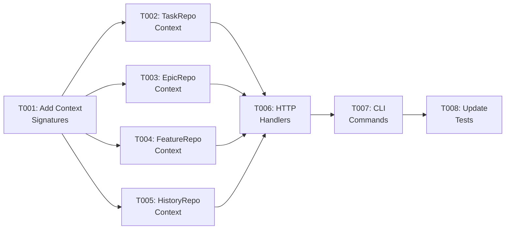
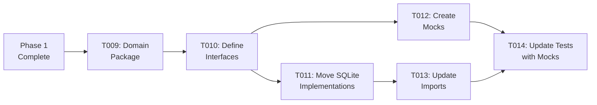
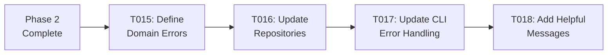
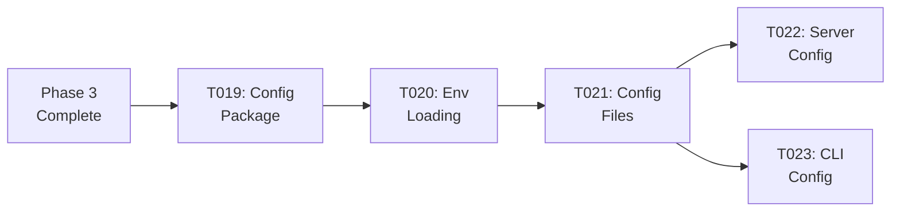
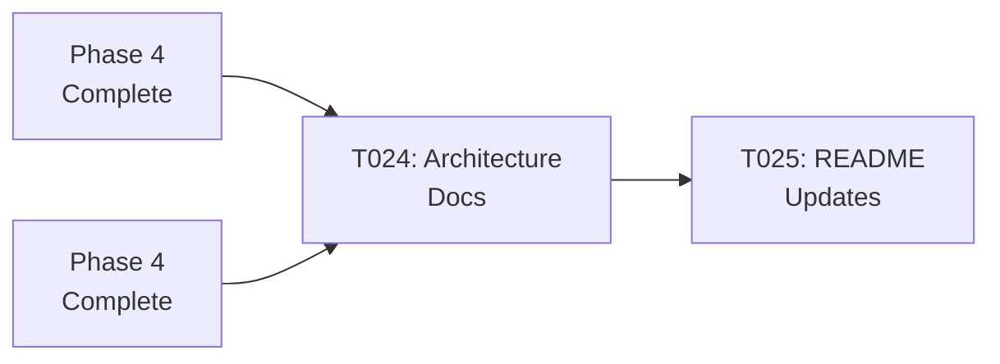

# Implementation Tasks: Architecture Improvements

## Overview

This directory contains agent-executable tasks that implement the E04-F09 Architecture Improvements feature in phases. These tasks refactor the Shark Task Manager codebase to be more idiomatic, testable, and maintainable.

## Active Tasks

| Task | Title | Status | Assigned Agent | Dependencies | Est. Time |
|------|-------|--------|----------------|--------------|-----------|
| [T001](./T001-add-context-to-repository-interfaces.md) | Add context.Context to repository interfaces | created | api-developer | None | 4h |
| [T002](./T002-update-task-repository-context.md) | Update TaskRepository to use context | created | api-developer | T001 | 2h |
| [T003](./T003-update-epic-repository-context.md) | Update EpicRepository to use context | created | api-developer | T001 | 2h |
| [T004](./T004-update-feature-repository-context.md) | Update FeatureRepository to use context | created | api-developer | T001 | 2h |
| [T005](./T005-update-taskhistory-repository-context.md) | Update TaskHistoryRepository to use context | created | api-developer | T001 | 1h |
| [T006](./T006-update-http-handlers-request-context.md) | Update HTTP handlers to use request context | created | api-developer | T002-T005 | 1h |
| [T007](./T007-update-cli-commands-timeout-context.md) | Update CLI commands to use context with timeout | created | api-developer | T002-T005 | 2h |
| [T008](./T008-update-repository-tests-context.md) | Update all repository tests to use context | created | api-developer | T002-T007 | 3h |
| [T009](./T009-create-domain-package.md) | Create internal/domain package structure | created | backend-architect | T008 | 1h |
| [T010](./T010-define-repository-interfaces.md) | Define repository interfaces in domain package | created | backend-architect | T009 | 2h |
| [T011](./T011-move-sqlite-implementations.md) | Move SQLite implementations to repository/sqlite | created | api-developer | T010 | 3h |
| [T012](./T012-create-mock-repository-implementations.md) | Create mock repository implementations | created | api-developer | T010 | 4h |
| [T013](./T013-update-imports-use-interfaces.md) | Update all imports to use interfaces | created | api-developer | T011 | 2h |
| [T014](./T014-update-tests-use-mock-implementations.md) | Update tests to use mock implementations | created | api-developer | T012, T013 | 3h |
| [T015](./T015-define-domain-errors.md) | Define domain errors in domain/errors.go | created | backend-architect | T014 | 2h |
| [T016](./T016-update-repositories-return-domain-errors.md) | Update repositories to return domain errors | created | api-developer | T015 | 3h |
| [T017](./T017-update-cli-commands-handle-domain-errors.md) | Update CLI commands to handle domain errors | created | api-developer | T016 | 3h |
| [T018](./T018-add-helpful-error-messages.md) | Add helpful error messages for common failures | created | api-developer | T017 | 2h |
| [T019](./T019-create-config-package.md) | Create internal/config package | created | api-developer | T018 | 2h |
| [T020](./T020-implement-config-loading-environment.md) | Implement config loading from environment | created | api-developer | T019 | 3h |
| [T021](./T021-add-viper-support-config-files.md) | Add Viper support for config files | created | api-developer | T020 | 2h |
| [T022](./T022-update-server-use-config.md) | Update server main.go to use config | created | api-developer | T021 | 1h |
| [T023](./T023-update-cli-use-config.md) | Update CLI to use config | created | api-developer | T021 | 1h |
| [T024](./T024-update-architecture-documentation.md) | Update architecture documentation | created | general-purpose | T023 | 2h |
| [T025](./T025-update-code-examples-readme.md) | Update code examples in README | created | general-purpose | T024 | 1h |

**Total Estimated Effort**: 53 hours (~7 working days)

## Workflow

### Phase 1: Context Support (17 hours)

**Goal**: Add `context.Context` to all I/O operations



**Execution Order**:
1. T001: Add context parameter signatures (4h)
2. T002-T005: Update each repository (parallel, 7h total)
3. T006: Update HTTP handlers (1h)
4. T007: Update CLI commands (2h)
5. T008: Update all tests (3h)

**Deliverable**: All I/O operations use context.Context

### Phase 2: Repository Interfaces (15 hours)

**Goal**: Define explicit interfaces for dependency inversion



**Execution Order**:
1. T009: Create domain package structure (1h)
2. T010: Define repository interfaces (2h)
3. T011: Move SQLite implementations (3h)
4. T012: Create mock implementations (4h, parallel with T011)
5. T013: Update all imports (2h)
6. T014: Update tests to use mocks (3h)

**Deliverable**: Clean architecture with interfaces, multiple implementations supported

### Phase 3: Domain Errors (10 hours)

**Goal**: Replace generic error strings with typed domain errors



**Execution Order**:
1. T015: Define domain errors (2h)
2. T016: Update repositories to return domain errors (3h)
3. T017: Update CLI commands to handle domain errors (3h)
4. T018: Add helpful error messages (2h)

**Deliverable**: Better error handling, helpful user messages, type-safe errors

### Phase 4: Configuration Management (9 hours)

**Goal**: Extract hardcoded values to environment-based config



**Execution Order**:
1. T019: Create config package (2h)
2. T020: Implement environment variable loading (3h)
3. T021: Add config file support (2h)
4. T022: Update server to use config (1h, parallel with T023)
5. T023: Update CLI to use config (1h, parallel with T022)

**Deliverable**: Flexible configuration, 12-factor app compliance, no hardcoded values

### Phase 5: Documentation (3 hours)

**Goal**: Update documentation to reflect new patterns



**Execution Order**:
1. T024: Update architecture documentation (2h)
2. T025: Update README examples (1h)

**Deliverable**: Updated documentation reflecting all improvements

## Status Management

Task status is tracked in the database via the `shark` CLI tool. Task files remain in this directory regardless of status.

### Status Definitions

- **created**: Task has been defined, ready to be started
- **todo**: Task is in the backlog (use `pm task start <key>`)
- **in_progress**: Currently being worked on
- **blocked**: Cannot proceed due to dependency or issue
- **ready_for_review**: Implementation complete, awaiting review
- **completed**: Reviewed and approved
- **archived**: Completed and no longer active

### CLI Commands

```bash
# List tasks by status
pm task list --status=created
pm task list --status=in_progress

# Start a task
pm task start T-E04-F09-001

# Complete a task (ready for review)
pm task complete T-E04-F09-001

# Approve a reviewed task
pm task approve T-E04-F09-001

# Block a task
pm task block T-E04-F09-001 --reason="Waiting for design decision"

# Unblock a task
pm task unblock T-E04-F09-001
```

## Design Documentation

All tasks reference these documents in the feature directory:

- **[Feature PRD](../01-feature-prd.md)** - Complete product requirements
- **[Feature README](../README.md)** - Feature overview and task summary
- **[Architecture Review](../../../../architecture/ARCHITECTURE_REVIEW.md)** - Justification for improvements
- **[System Design](../../../../architecture/SYSTEM_DESIGN.md)** - Current system architecture
- **[Go Best Practices](../../../../architecture/GO_BEST_PRACTICES.md)** - Go patterns and idioms

## Task Naming Convention

Tasks follow this naming pattern:
- **T001-T008**: Phase 1 (Context Support)
- **T009-T014**: Phase 2 (Repository Interfaces)
- **T015-T018**: Phase 3 (Domain Errors)
- **T019-T023**: Phase 4 (Configuration Management)
- **T024-T025**: Phase 5 (Documentation)

Full key format: `T-E04-F09-XXX` where XXX is the task number (e.g., `T-E04-F09-001`)

## Dependencies

### External Dependencies

All dependencies are already in `go.mod`:
- ✅ `github.com/spf13/viper` - Configuration management
- ✅ `github.com/spf13/cobra` - CLI framework
- ✅ `github.com/stretchr/testify` - Testing utilities

**No new dependencies required!**

### Phase Dependencies

```
Phase 1 (Context) → Phase 2 (Interfaces) → Phase 3 (Errors) → Phase 4 (Config)
                                                            → Phase 5 (Docs)
```

Each phase must complete before the next begins. Phase 5 depends on Phase 4 completing.

## Validation Gates

Each phase has validation gates to ensure quality:

### Phase 1 (Context)
- [ ] All repository methods accept context as first parameter
- [ ] All database operations use `*Context()` variants
- [ ] HTTP handlers use request context
- [ ] CLI commands use timeout context
- [ ] All tests pass with context

### Phase 2 (Interfaces)
- [ ] Repository interfaces defined in domain package
- [ ] SQLite implementations moved to repository/sqlite
- [ ] Mock implementations created
- [ ] All code uses interfaces, not concrete types
- [ ] All tests pass with new structure

### Phase 3 (Errors)
- [ ] Domain errors defined
- [ ] Repositories return typed errors
- [ ] CLI provides helpful error messages
- [ ] Error handling is consistent
- [ ] All tests check for domain errors

### Phase 4 (Config)
- [ ] Config package created
- [ ] Environment variable loading works
- [ ] Config file support works
- [ ] Server and CLI use config
- [ ] No hardcoded values remain

### Phase 5 (Documentation)
- [ ] Architecture docs updated
- [ ] README updated
- [ ] Code examples current
- [ ] No outdated information

## Success Metrics

### Quantitative

| Metric | Before | After | Status |
|--------|--------|-------|--------|
| Context usage | 0% | 100% | 🎯 Target |
| Interface definitions | 0 | 4 | 🎯 Target |
| Domain errors | 0 | 15+ | 🎯 Target |
| Hardcoded values | 5+ | 0 | 🎯 Target |
| Test coverage | ~70% | >75% | 🎯 Target |

### Qualitative

- ✅ More idiomatic Go (context pattern)
- ✅ Easier to write tests (mock implementations)
- ✅ Better error messages (domain errors)
- ✅ Flexible configuration (environment-based)
- ✅ Ready for PostgreSQL migration (future)
- ✅ Ready for distributed tracing (future)

## Getting Started

### For Developers

1. **Read the PRD**: [Feature PRD](../01-feature-prd.md)
2. **Review Architecture**: [Architecture Review](../../../../architecture/ARCHITECTURE_REVIEW.md)
3. **Start with Phase 1**: Begin with T001 (Context Support)
4. **Follow Dependencies**: Complete tasks in dependency order
5. **Run Tests**: Test after each task to verify correctness

### For Reviewers

1. **Understand Justification**: [Architecture Review](../../../../architecture/ARCHITECTURE_REVIEW.md)
2. **Review Go Patterns**: [Go Best Practices](../../../../architecture/GO_BEST_PRACTICES.md)
3. **Check Success Criteria**: Each task has clear validation gates
4. **Verify Tests**: All tests should pass after each phase

## Notes

- **Each task is focused**: Single, clear objective that can be completed independently
- **Tasks reference design docs**: Don't duplicate content, link to PRD and architecture docs
- **Context first**: Phase 1 (Context) is foundational for all other phases
- **Testing is critical**: Each phase includes comprehensive testing
- **Documentation completes the work**: Phase 5 ensures future maintainability

---

**Feature**: E04-F09 - Recommended Architecture Improvements
**Epic**: E04 - Task Management CLI Core
**Total Effort**: 53 hours (~7 working days)
**Last Updated**: 2025-12-16
