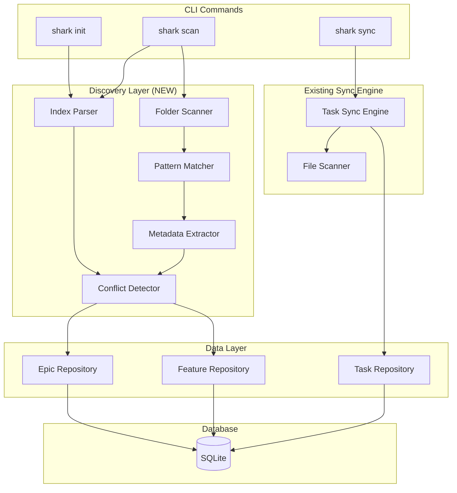
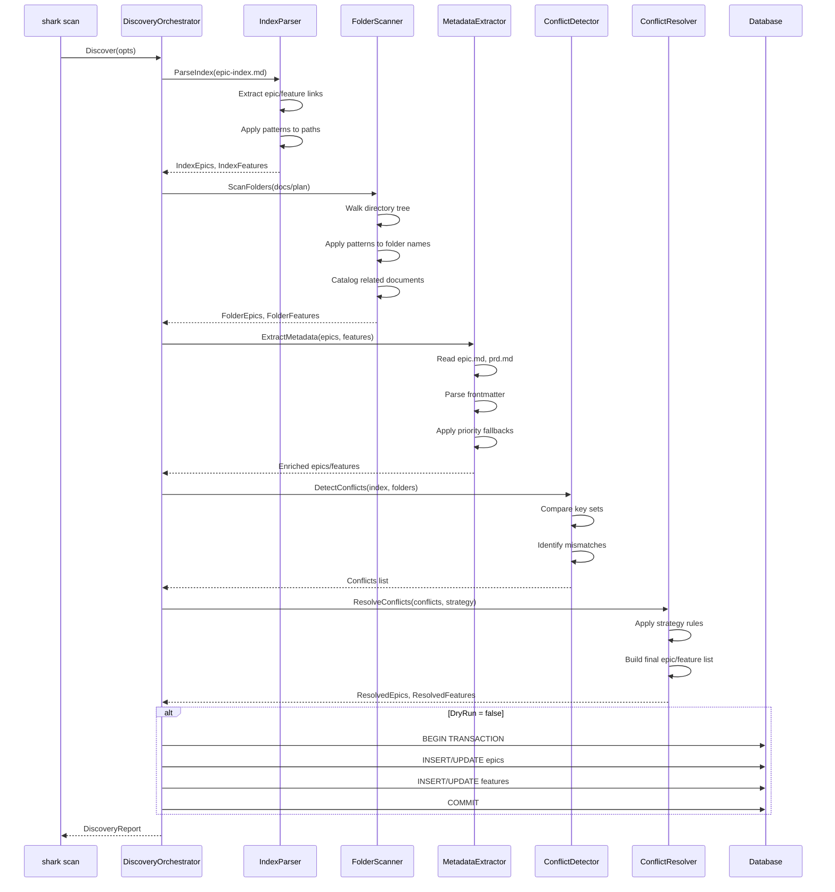
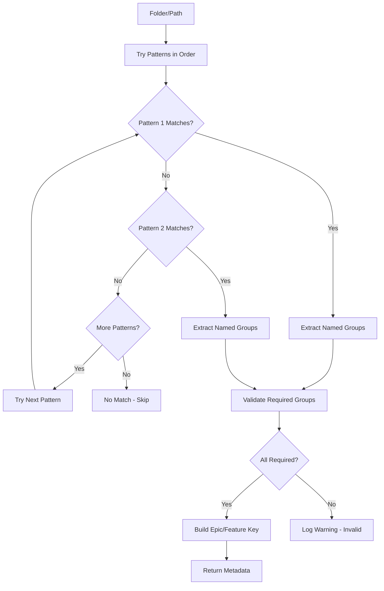

# Architecture: Epic & Feature Discovery Engine

**Feature**: E06-F02 Epic & Feature Discovery Engine
**Epic**: E06 Intelligent Documentation Scanning
**Status**: POC Design
**Last Updated**: 2025-12-17

---

## Overview

This document describes the architecture for the Epic & Feature Discovery Engine, a component that intelligently discovers and imports epic and feature structures from existing documentation into the shark database. The design extends the existing task-level sync engine (`internal/sync/`) to handle higher-level project structure discovery.

### Design Philosophy (POC)

This is a **POC-level design** focused on:
- **Minimal complexity**: Extend existing sync patterns rather than creating new frameworks
- **Practical implementation**: Focus on working code over perfect abstractions
- **Iteration-ready**: Simple enough to refactor as we learn from usage

### Architectural Principles

1. **Extend, Don't Replace**: Build on existing `internal/sync/` patterns
2. **Pattern-Driven**: Use configurable regex patterns (similar to task sync)
3. **Dual-Source Discovery**: Parse epic-index.md AND scan folder structure
4. **Transactional Safety**: Atomic all-or-nothing database operations
5. **Clear Reporting**: Detailed reports showing what was found and what conflicts occurred

---

## System Context

### Where This Fits



### Dependencies

**Depends On**:
- `internal/repository` - Epic, Feature repositories (existing)
- `internal/models` - Epic, Feature models (existing)
- `.sharkconfig.json` - Pattern configuration (from E06-F01)

**Used By**:
- `shark init` command - Initial project discovery
- `shark scan` command - Ad-hoc epic/feature discovery
- `shark sync` command - Combined epic/feature/task sync

---

## Component Design

### 1. Discovery Orchestrator

**Purpose**: Coordinates epic and feature discovery from multiple sources

**Responsibilities**:
- Orchestrate index parsing and folder scanning
- Merge results from both sources
- Apply conflict resolution strategy
- Execute transactional database updates
- Generate discovery report

**Interface** (Go):
```go
type DiscoveryOrchestrator struct {
    indexParser      *IndexParser
    folderScanner    *FolderScanner
    conflictDetector *ConflictDetector
    epicRepo         *repository.EpicRepository
    featureRepo      *repository.FeatureRepository
}

type DiscoveryOptions struct {
    DocsRoot         string           // Root directory (e.g., "docs/plan")
    IndexPath        string           // Path to epic-index.md (optional)
    Strategy         ConflictStrategy // index-precedence, folder-precedence, merge
    DryRun           bool             // Preview without database changes
    ValidationLevel  string           // strict, balanced, permissive
}

type DiscoveryReport struct {
    FoldersScanned       int
    FilesAnalyzed        int
    EpicsDiscovered      int
    EpicsFromIndex       int
    EpicsFromFolders     int
    FeaturesDiscovered   int
    FeaturesFromIndex    int
    FeaturesFromFolders  int
    RelatedDocsCataloged int
    ConflictsDetected    int
    Conflicts            []Conflict
    Warnings             []string
    Errors               []string
}

func (o *DiscoveryOrchestrator) Discover(ctx context.Context, opts DiscoveryOptions) (*DiscoveryReport, error)
```

**Key Operations**:
1. Parse epic-index.md if present
2. Scan folder structure
3. Detect conflicts between sources
4. Apply conflict resolution strategy
5. Begin database transaction
6. Insert/update epics and features
7. Commit transaction (or rollback on error)
8. Return detailed report

---

### 2. Index Parser

**Purpose**: Parse epic-index.md to extract explicit project structure

**Responsibilities**:
- Read and parse epic-index.md markdown
- Extract epic links: `[Epic Name](./E##-epic-slug/)`
- Extract feature links: `[Feature Name](./E##-epic-slug/E##-F##-feature-slug/)`
- Build epic/feature hierarchy from link structure
- Validate link paths against filesystem

**Data Structures**:
```go
type IndexEpic struct {
    Key      string   // Extracted from path (e.g., "E04")
    Title    string   // Extracted from link text
    Path     string   // Relative path from link
    Features []IndexFeature
}

type IndexFeature struct {
    Key      string   // Extracted from path (e.g., "E04-F07")
    EpicKey  string   // Parent epic key
    Title    string   // Extracted from link text
    Path     string   // Relative path from link
}
```

**Algorithm**:
1. Read epic-index.md line by line
2. Parse markdown links using regex: `\[([^\]]+)\]\(([^)]+)\)`
3. Classify links as epic or feature based on path depth
4. Extract epic/feature keys from path using configured patterns
5. Extract titles from link text
6. Build parent-child relationships
7. Validate paths exist on filesystem (log warnings for broken links)

**Pattern Matching**:
- Use patterns from `.sharkconfig.json` (`patterns.epic.folder`, `patterns.feature.folder`)
- Apply patterns to link paths to extract keys
- Default patterns:
  - Epic: `(?P<epic_id>E\d{2})-(?P<epic_slug>[a-z0-9-]+)` or `(?P<epic_id>tech-debt|bugs|change-cards)`
  - Feature: `(?P<epic_id>E\d{2})-(?P<feature_id>F\d{2})-(?P<feature_slug>[a-z0-9-]+)`

---

### 3. Folder Scanner

**Purpose**: Discover epics and features by scanning directory structure

**Responsibilities**:
- Recursively scan configured docs root
- Apply regex patterns to folder names
- Extract epic/feature keys from matched patterns
- Build epic/feature hierarchy from file paths
- Catalog related documents within feature folders

**Data Structures**:
```go
type FolderEpic struct {
    Key         string   // Extracted from pattern (e.g., "E04")
    Slug        string   // Extracted from pattern
    Path        string   // Full folder path
    EpicMdPath  *string  // Path to epic.md if exists
    Features    []FolderFeature
}

type FolderFeature struct {
    Key          string   // Extracted from pattern (e.g., "E04-F07")
    EpicKey      string   // Parent epic key (from path)
    Slug         string   // Extracted from pattern
    Path         string   // Full folder path
    PrdPath      *string  // Path to prd.md (or PRD_F##-name.md)
    RelatedDocs  []string // Paths to related documents
}
```

**Algorithm**:
1. Walk docs root directory recursively
2. For each directory:
   - Try to match against epic patterns
   - If matched, extract epic key and add to results
   - Scan subdirectories for features
3. For each subdirectory within epic:
   - Try to match against feature patterns
   - If matched, extract feature key and epic relationship
   - Scan for PRD file using feature file patterns
   - Catalog related documents (exclude tasks/ subfolder)
4. Build epic → feature relationships from path hierarchy

**Pattern Application**:
- Try patterns in configured order
- First match wins
- Extract components using named capture groups
- Required epic captures: `epic_id` OR `epic_slug`
- Required feature captures: `feature_id` OR `feature_slug`, AND `epic_id`/`epic_num`

**Related Document Discovery**:
- Scan all `.md` files in feature folder
- Exclude: PRD file, task files (in `tasks/` or `prps/` subfolder)
- Include: Numbered docs (`02-*.md`, `03-*.md`), named docs (`architecture.md`, etc.)
- Store relative paths in feature metadata

---

### 4. Metadata Extractor

**Purpose**: Extract epic/feature metadata from multiple sources with fallback priority

**Responsibilities**:
- Extract titles and descriptions from epic-index.md, epic.md, prd.md, frontmatter
- Apply fallback priority rules
- Generate titles from folder names when no metadata source available
- Validate extracted metadata

**Extraction Priority** (Epic):
1. **Priority 1**: Title from epic-index.md link text
2. **Priority 2**: Title/description from epic.md frontmatter
3. **Priority 3**: Title from first H1 in epic.md
4. **Priority 4**: Generate from folder name (e.g., "task-mgmt-cli-core" → "Task Mgmt CLI Core")

**Extraction Priority** (Feature):
1. **Priority 1**: Title from epic-index.md link text
2. **Priority 2**: Title/description from prd.md frontmatter
3. **Priority 3**: Title from first H1 in prd.md
4. **Priority 4**: Generate from folder name

**Frontmatter Parsing**:
- Parse YAML frontmatter between `---` delimiters
- Extract fields: `title`, `description`
- Handle missing frontmatter gracefully (try next priority)

**Title Generation** (Fallback):
- Convert kebab-case to Title Case: `initialization-sync` → `Initialization Sync`
- Expand abbreviations: `cli` → `CLI`, `api` → `API`
- Prefix auto-generated titles: `Auto: {title}` for transparency

---

### 5. Conflict Detector

**Purpose**: Detect conflicts between epic-index.md and folder structure

**Responsibilities**:
- Compare index-discovered epics with folder-discovered epics
- Compare index-discovered features with folder-discovered features
- Detect broken references (in index but folder missing)
- Detect undocumented folders (in folders but not in index)
- Detect relationship mismatches (feature in wrong epic folder)

**Conflict Types**:
```go
type ConflictType string

const (
    ConflictEpicIndexOnly      ConflictType = "epic_index_only"       // In index, folder missing
    ConflictEpicFolderOnly     ConflictType = "epic_folder_only"      // In folder, not in index
    ConflictFeatureIndexOnly   ConflictType = "feature_index_only"    // In index, folder missing
    ConflictFeatureFolderOnly  ConflictType = "feature_folder_only"   // In folder, not in index
    ConflictRelationshipMismatch ConflictType = "relationship_mismatch" // Feature in wrong epic
)

type Conflict struct {
    Type       ConflictType
    Key        string   // Epic or feature key
    Path       string   // File path involved
    Resolution string   // How conflict was resolved
    Strategy   string   // Strategy applied (index-precedence, etc.)
    Suggestion string   // Actionable suggestion for user
}
```

**Detection Algorithm**:
1. Build set of epic keys from index
2. Build set of epic keys from folders
3. Detect index-only epics: `indexKeys - folderKeys`
4. Detect folder-only epics: `folderKeys - indexKeys`
5. For features:
   - Compare keys within each epic
   - Detect index-only features
   - Detect folder-only features
   - Check parent epic matches folder path

---

### 6. Conflict Resolver

**Purpose**: Apply conflict resolution strategy to determine which epics/features to import

**Responsibilities**:
- Apply configured resolution strategy
- Determine final list of epics/features to import
- Merge metadata from index and folders when appropriate
- Log resolution decisions

**Resolution Strategies**:

**Strategy: index-precedence** (default)
- Index is source of truth for which epics/features exist
- Ignore folders not mentioned in index (log warnings)
- Fail on broken index references (epic in index but folder missing)
- Use index-provided titles for matching items

**Strategy: folder-precedence**
- Folder structure is source of truth
- Ignore index entries without matching folders
- Import all discovered folders even if not in index
- Use folder-based metadata when no index metadata available

**Strategy: merge**
- Import epics/features from BOTH index and folders
- Use index metadata (titles from link text) when available
- Fall back to folder-based metadata for items not in index
- Resolve metadata conflicts: index wins

**Resolution Algorithm**:
```go
func (r *ConflictResolver) Resolve(
    indexEpics []IndexEpic,
    folderEpics []FolderEpic,
    conflicts []Conflict,
    strategy ConflictStrategy,
) ([]ResolvedEpic, []string, error) {
    // Returns: final epic list, warnings, error

    switch strategy {
    case "index-precedence":
        // Only include epics from index
        // Validate folder exists for each
        // Fail on broken references

    case "folder-precedence":
        // Only include epics from folders
        // Ignore index entries without folders

    case "merge":
        // Include epics from both sources
        // Merge metadata (index title wins)
    }
}
```

---

## Data Flow

### Epic/Feature Discovery Flow



### Pattern Matching Flow



---

## Database Integration

### Schema Requirements

**Epic Table** (existing, may need extension):
```sql
CREATE TABLE epics (
    id INTEGER PRIMARY KEY AUTOINCREMENT,
    key TEXT NOT NULL UNIQUE,              -- e.g., "E04" or "tech-debt"
    title TEXT NOT NULL,
    description TEXT,
    status TEXT NOT NULL DEFAULT 'draft',
    file_path TEXT,                        -- Path to epic.md (if exists)
    created_at TIMESTAMP DEFAULT CURRENT_TIMESTAMP,
    updated_at TIMESTAMP DEFAULT CURRENT_TIMESTAMP
);
```

**Feature Table** (existing, may need extension):
```sql
CREATE TABLE features (
    id INTEGER PRIMARY KEY AUTOINCREMENT,
    epic_key TEXT NOT NULL,                -- Foreign key to epics.key
    key TEXT NOT NULL UNIQUE,              -- e.g., "E04-F07"
    title TEXT NOT NULL,
    description TEXT,
    status TEXT NOT NULL DEFAULT 'planning',
    file_path TEXT,                        -- Path to prd.md
    related_docs TEXT,                     -- JSON array of related doc paths
    created_at TIMESTAMP DEFAULT CURRENT_TIMESTAMP,
    updated_at TIMESTAMP DEFAULT CURRENT_TIMESTAMP,
    FOREIGN KEY (epic_key) REFERENCES epics(key) ON DELETE CASCADE
);
```

**Schema Extensions Needed**:
- Add `file_path` column to epics table (if not exists)
- Add `related_docs` column to features table (JSON type)
- Ensure foreign key: `features.epic_key` → `epics.key`

### Transaction Safety

**All discovery operations must be atomic**:

```go
func (o *DiscoveryOrchestrator) executeImport(
    ctx context.Context,
    epics []ResolvedEpic,
    features []ResolvedFeature,
) error {
    // Begin transaction
    tx, err := o.db.BeginTx(ctx, nil)
    if err != nil {
        return fmt.Errorf("failed to begin transaction: %w", err)
    }
    defer tx.Rollback() // Rollback if not committed

    // Insert/update epics
    for _, epic := range epics {
        if err := o.epicRepo.UpsertTx(ctx, tx, epic); err != nil {
            return fmt.Errorf("failed to upsert epic %s: %w", epic.Key, err)
        }
    }

    // Insert/update features
    for _, feature := range features {
        if err := o.featureRepo.UpsertTx(ctx, tx, feature); err != nil {
            return fmt.Errorf("failed to upsert feature %s: %w", feature.Key, err)
        }
    }

    // Commit transaction
    if err := tx.Commit(); err != nil {
        return fmt.Errorf("failed to commit transaction: %w", err)
    }

    return nil
}
```

**Upsert Logic**:
- Use `INSERT OR REPLACE` for idempotent operations
- Compare existing record metadata before updating
- Only update `updated_at` if metadata changed

---

## Configuration

### Pattern Configuration (.sharkconfig.json)

```json
{
  "docs_root": "docs/plan",
  "validation_level": "balanced",
  "conflict_strategy": "index-precedence",
  "patterns": {
    "epic": {
      "folder": [
        "(?P<epic_id>E\\d{2})-(?P<epic_slug>[a-z0-9-]+)",
        "(?P<epic_id>tech-debt|bugs|change-cards)"
      ]
    },
    "feature": {
      "folder": [
        "(?P<epic_id>E(?P<epic_num>\\d{2}))-(?P<feature_id>F(?P<feature_num>\\d{2}))-(?P<feature_slug>[a-z0-9-]+)",
        "(?P<feature_id>F(?P<feature_num>\\d{2}))-(?P<feature_slug>[a-z0-9-]+)"
      ],
      "file": [
        "^prd\\.md$",
        "^PRD_(?P<feature_id>F\\d{2})-(?P<feature_slug>[a-z0-9-]+)\\.md$"
      ]
    }
  }
}
```

**Configuration Loading**:
- Read from `.sharkconfig.json` in project root
- Fall back to defaults if config missing
- Validate regex patterns on load (catch syntax errors early)

---

## Error Handling

### Error Categories

**Parse Errors** (non-fatal):
- Frontmatter parse failure → Use next priority metadata source
- Invalid markdown link → Log warning, skip link
- Broken path reference → Log warning, fail if index-precedence

**Validation Errors** (fatal in strict mode):
- Invalid epic key format → Skip epic or fail (depends on validation level)
- Missing required capture groups → Skip pattern, try next
- Orphaned feature (epic doesn't exist) → Skip feature or fail

**Database Errors** (always fatal):
- Foreign key violation → Rollback transaction, report error
- Constraint violation → Rollback transaction, report error
- Connection failure → Fail immediately

**Filesystem Errors** (fatal):
- docs_root doesn't exist → Fail immediately
- Permission denied → Fail immediately

### Error Recovery Strategy

1. **Graceful Degradation**: Parse errors on individual files don't halt entire discovery
2. **Detailed Logging**: Every error includes file path, line number (if applicable), suggested fix
3. **Transaction Rollback**: Any database error rolls back entire import
4. **Actionable Messages**: Errors include suggestions for resolution

---

## Performance Considerations

### POC Performance Targets

- **Small projects** (1-20 epics/features): <2 seconds
- **Medium projects** (100 epics/features): <5 seconds
- **Large projects** (500+ epics/features): <15 seconds

### Optimization Strategies (POC)

**Keep it simple for POC**:
- No premature optimization
- Single-threaded sequential processing
- In-memory data structures (scale to thousands of epics/features)
- Batch database inserts (not one-by-one)

**Future Optimizations** (post-POC):
- Parallel file scanning (goroutines)
- Database connection pooling
- Incremental discovery (mtime-based filtering)
- Caching parsed metadata

---

## Testing Strategy

### POC Testing Focus

**Unit Tests** (core logic):
- Pattern matching extraction
- Conflict detection logic
- Metadata fallback priority
- Title generation from folder names

**Integration Tests** (end-to-end):
- Full discovery with sample documentation structure
- Conflict resolution strategies
- Transaction rollback on errors
- Dry-run mode (no database changes)

**Test Data**:
- Sample epic-index.md with varied link formats
- Sample folder structure with E## and special types (tech-debt, bugs)
- Sample epic.md and prd.md files with frontmatter
- Conflict scenarios (index vs. folder mismatches)

---

## Deployment

### POC Deployment

**No special deployment needed**:
- Code lives in `internal/discovery/` package
- Integrated into existing `shark init` and `shark scan` commands
- Uses existing database schema (with minor extensions)
- Configuration via `.sharkconfig.json` (already exists)

**Database Migration**:
```go
// Add columns if not exist
ALTER TABLE epics ADD COLUMN file_path TEXT;
ALTER TABLE features ADD COLUMN related_docs TEXT;
```

Run migration during `shark init` or first `shark scan`.

---

## Future Enhancements

### Post-POC Improvements

1. **Incremental Discovery**: Track `last_discovery_time`, only scan modified folders
2. **Parallel Scanning**: Use goroutines for faster large project scans
3. **Interactive Conflict Resolution**: Prompt user for each conflict during scan
4. **Epic-Index.md Generation**: Generate index from folder structure (reverse operation)
5. **Multi-Root Support**: Scan multiple documentation roots in single project
6. **Pattern Validation UI**: CLI command to test patterns against sample paths

---

## Open Questions

### For POC Resolution

1. **Epic Status**: Auto-set to "draft" or "active" during discovery?
   - **POC Decision**: Use "draft" for safety, user can update manually

2. **Feature Status**: Auto-set to "planning" or infer from folder contents?
   - **POC Decision**: Use "planning" for all discovered features

3. **Related Docs**: Store as JSON array or separate table?
   - **POC Decision**: JSON array in `related_docs` column (simpler for POC)

4. **Epic-Index.md Format**: Support only unordered lists or also ordered lists and headings?
   - **POC Decision**: Support both unordered/ordered lists (minimal parser complexity)

---

## References

- **PRD**: [prd.md](./prd.md)
- **Epic**: [E06 Intelligent Scanning](../epic.md)
- **Existing Sync Engine**: `internal/sync/engine.go`
- **Configuration Schema**: E06-F01 (Configuration & Pattern Management)
