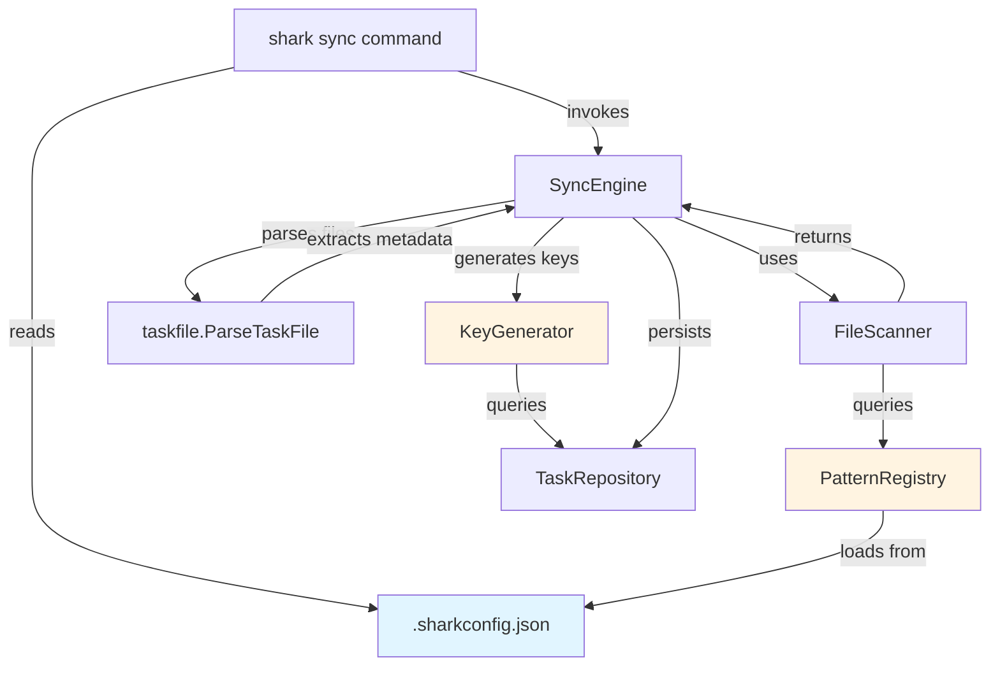
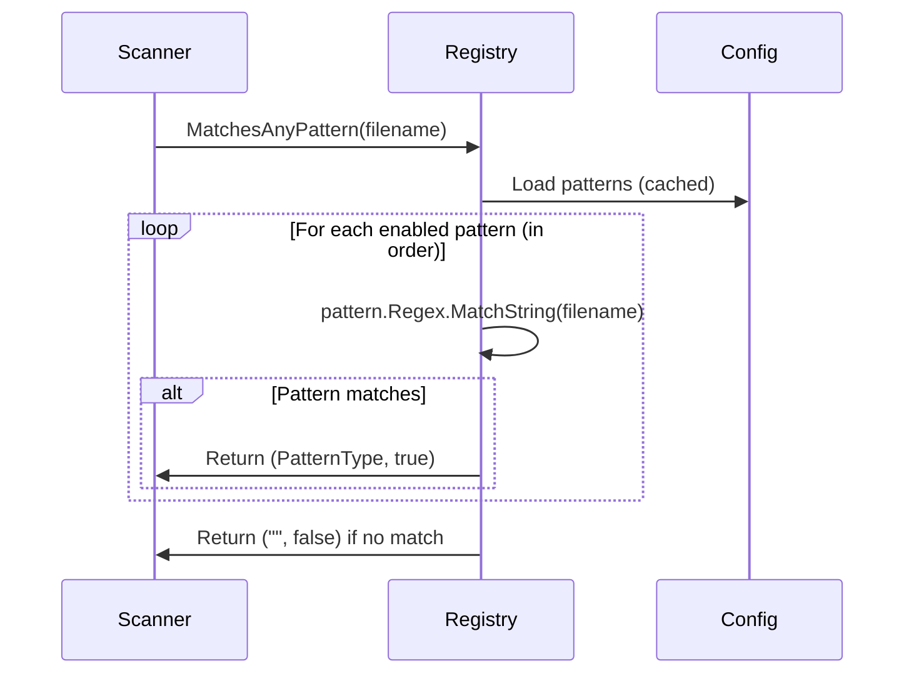
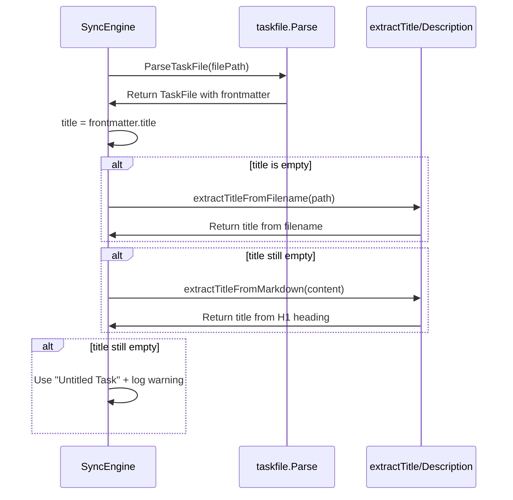
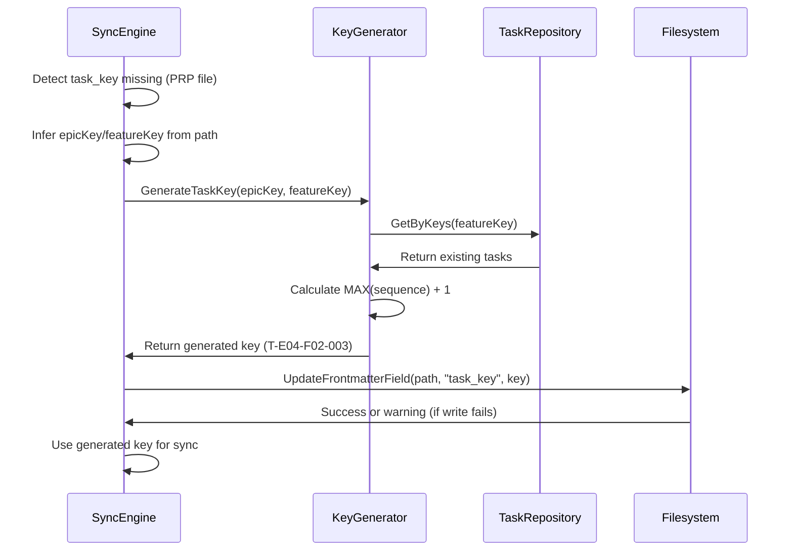
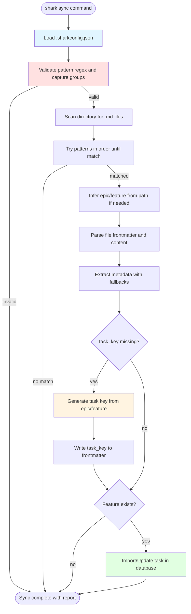

# Architecture: Task File Recognition & Import

**Feature**: E06-F03-task-recognition-import
**Status**: POC Design
**Last Updated**: 2025-12-17

---

## Overview

This feature extends the existing sync engine to support configurable task file pattern matching through regex patterns defined in `.sharkconfig.json`. The architecture enables flexible recognition of multiple task file naming conventions while maintaining backward compatibility with the current `T-E##-F##-###.md` standard format.

### Design Philosophy (POC Level)

This is a POC-level design focused on:
- **Minimal Scope**: Extend existing patterns.go and sync engine, avoid creating new layers
- **Practical Implementation**: Use Go's standard regex package, no external libraries
- **Quick Validation**: Enable rapid testing of configurable patterns hypothesis
- **Low Risk**: Changes isolated to pattern matching logic, preserve existing transaction boundaries

### Core Capabilities

1. **Configurable Pattern Matching**: User-defined regex patterns with named capture groups
2. **Multi-Source Metadata Extraction**: Fallback chain for title/description (frontmatter → filename → H1)
3. **Automatic Task Key Generation**: Generate keys for PRP files missing frontmatter
4. **Path-Based Inference**: Extract epic/feature from directory structure for non-standard patterns

---

## System Context

### Integration Points



### Component Responsibilities

| Component | Current State | Changes Needed |
|-----------|--------------|----------------|
| **PatternRegistry** | Hardcoded task/PRP patterns | Load patterns from config, validate regex and capture groups |
| **FileScanner** | Uses PatternRegistry.MatchesAnyPattern() | No changes (pattern matching abstracted) |
| **SyncEngine.parseFiles()** | Calls KeyGenerator for PRP files | Extend to extract metadata with fallbacks |
| **taskfile.ParseTaskFile()** | Parses frontmatter YAML | No changes (already extracts metadata) |
| **KeyGenerator** | Generates keys for PRP files | No changes (already implements required logic) |
| **Config** | Stores default_epic, json_output, etc. | Add `patterns.task.file` array field |

---

## Configuration Schema

### .sharkconfig.json Structure

```json
{
  "default_epic": "E04-task-mgmt-cli-core",
  "default_agent": null,
  "color_enabled": true,
  "json_output": false,
  "patterns": {
    "task": {
      "file": [
        {
          "name": "standard",
          "regex": "^(?P<task_key>T-E\\d{2}-F\\d{2}-\\d{3})(?:-(?P<slug>[a-z0-9-]+))?\\.md$",
          "enabled": true,
          "description": "Standard task format: T-E04-F02-001.md or T-E04-F02-001-slug.md"
        },
        {
          "name": "numbered-prefix",
          "regex": "^(?P<number>\\d{2,3})-.*\\.md$",
          "enabled": true,
          "description": "Numbered prefix: 01-research.md, 123-implementation.md"
        },
        {
          "name": "prp-suffix",
          "regex": "^(?P<slug>[a-z0-9-]+)\\.prp\\.md$",
          "enabled": true,
          "description": "PRP suffix: implement-caching.prp.md"
        }
      ]
    }
  }
}
```

### Pattern Object Schema

| Field | Type | Required | Description |
|-------|------|----------|-------------|
| name | string | Yes | Unique identifier for pattern (e.g., "standard", "numbered-prefix") |
| regex | string | Yes | Go regex with named capture groups |
| enabled | boolean | Yes | Whether pattern is active (false = skip during matching) |
| description | string | No | Human-readable explanation of pattern for documentation |

### Named Capture Groups

Patterns must include at least ONE of these capture groups:

| Capture Group | Purpose | Example | Required By |
|---------------|---------|---------|-------------|
| `(?P<task_key>...)` | Full task key including epic/feature | `T-E04-F02-001` | Standard pattern |
| `(?P<number>...)` | Task sequence number only | `01`, `123` | Numbered pattern |
| `(?P<slug>...)` | Descriptive name/identifier | `implement-caching` | PRP pattern |

**Validation Rules**:
- Pattern with `task_key` capture: Epic/feature extracted from task_key itself
- Pattern with `number` or `slug` capture: Epic/feature must be inferred from file path
- Pattern with no valid capture groups: Rejected during config load with clear error

---

## Architecture Patterns

### Pattern Matching Flow



### Metadata Extraction Flow



### Task Key Generation Flow



---

## Component Design

### 1. PatternRegistry (Extended)

**Location**: `internal/sync/patterns.go`

**New Methods**:

```go
// LoadFromConfig populates patterns from .sharkconfig.json
// Validates regex syntax and required capture groups
func (r *PatternRegistry) LoadFromConfig(config *Config) error

// ValidatePattern checks pattern has valid regex and required capture groups
func (r *PatternRegistry) ValidatePattern(pattern *FilePattern) error

// GetMatchedGroups returns captured group values for a filename
func (r *PatternRegistry) GetMatchedGroups(filename string, patternType PatternType) (map[string]string, error)
```

**Validation Logic**:

1. Compile regex using `regexp.Compile()` - catch syntax errors
2. Check for at least one required capture group: `task_key`, `number`, or `slug`
3. Validate capture group names follow conventions (alphanumeric + underscore only)
4. Return detailed error with pattern name, regex, and specific issue

**Error Handling**:
- Invalid regex syntax: Log pattern name and regex, suggest fix, exit with code 1
- Missing capture groups: Log pattern name and expected groups, exit with code 1
- Unknown capture groups: Log warning but allow (forward compatibility)

### 2. Config Package (New)

**Location**: `internal/config/config.go`

**Purpose**: Centralize configuration loading and validation

**Structure**:

```go
type Config struct {
    DefaultEpic   *string               `json:"default_epic"`
    DefaultAgent  *string               `json:"default_agent"`
    ColorEnabled  bool                  `json:"color_enabled"`
    JSONOutput    bool                  `json:"json_output"`
    Patterns      PatternsConfig        `json:"patterns"`
}

type PatternsConfig struct {
    Task TaskPatternsConfig `json:"task"`
}

type TaskPatternsConfig struct {
    File []PatternDefinition `json:"file"`
}

type PatternDefinition struct {
    Name        string `json:"name"`
    Regex       string `json:"regex"`
    Enabled     bool   `json:"enabled"`
    Description string `json:"description,omitempty"`
}
```

**Key Methods**:

```go
// LoadConfig reads and parses .sharkconfig.json
func LoadConfig(path string) (*Config, error)

// GetDefaultPatterns returns built-in pattern definitions if config missing
func GetDefaultPatterns() []PatternDefinition

// ValidateConfig checks config schema and pattern definitions
func (c *Config) Validate() error
```

### 3. Metadata Extraction (Extended)

**Location**: `internal/sync/engine.go`

**Enhanced extractTitleFromFilename()**:

```go
// extractTitleFromFilename extracts title from filename with pattern awareness
// Handles multiple formats:
// - "T-E04-F02-001-implement-caching.md" -> "Implement Caching"
// - "01-research-phase.md" -> "Research Phase"
// - "implement-auth.prp.md" -> "Implement Auth"
func extractTitleFromFilename(filePath string, patternType PatternType) string {
    // Get base filename
    filename := filepath.Base(filePath)
    filename = strings.TrimSuffix(filename, ".md")

    // Remove pattern-specific prefix based on type
    switch patternType {
    case PatternTypeTask:
        // Remove T-E##-F##-###- prefix (14 chars)
        if len(filename) > 14 && filename[13] == '-' {
            filename = filename[14:]
        }
    case PatternTypeNumbered:
        // Remove ##- or ###- prefix
        if matches := regexp.MustCompile(`^\d{2,3}-`).FindString(filename); matches != "" {
            filename = strings.TrimPrefix(filename, matches)
        }
    case PatternTypePRP:
        // Remove .prp suffix
        filename = strings.TrimSuffix(filename, ".prp")
    }

    // Convert hyphens to spaces and title-case
    filename = strings.ReplaceAll(filename, "-", " ")
    return strings.Title(filename)
}
```

**New extractDescriptionFromMarkdown()**:

```go
// extractDescriptionFromMarkdown extracts first paragraph after frontmatter/H1
// Limits to 500 characters, preserves line breaks within paragraph
func extractDescriptionFromMarkdown(content string) string {
    lines := strings.Split(content, "\n")
    inFrontmatter := false
    foundH1 := false
    var paragraph strings.Builder

    for _, line := range lines {
        trimmed := strings.TrimSpace(line)

        // Skip frontmatter
        if trimmed == "---" {
            inFrontmatter = !inFrontmatter
            continue
        }
        if inFrontmatter {
            continue
        }

        // Skip H1
        if strings.HasPrefix(trimmed, "# ") {
            foundH1 = true
            continue
        }

        // After H1, collect first paragraph
        if foundH1 && trimmed != "" {
            if strings.HasPrefix(trimmed, "#") {
                // Stop at next heading
                break
            }
            paragraph.WriteString(line)
            paragraph.WriteString("\n")

            // Stop if we hit 500 chars
            if paragraph.Len() >= 500 {
                break
            }
        }
    }

    result := strings.TrimSpace(paragraph.String())
    if len(result) > 500 {
        result = result[:500]
    }
    return result
}
```

### 4. Path-Based Inference (Extended)

**Location**: `internal/sync/scanner.go`

**Current Implementation**: Already supports epic/feature inference from path

**Enhancement Needed**: Add validation that inferred epic/feature exist in database before proceeding

```go
// inferEpicFeature (existing method - no changes needed)
// Already extracts epic/feature from path structure
// Supports both E##-F##-* and E##-P##-F##-* patterns

// New validation in SyncEngine.parseFiles():
// After inference, validate epic/feature exist in database
if file.EpicKey != "" && file.FeatureKey != "" {
    _, err := e.featureRepo.GetByKey(ctx, file.FeatureKey)
    if err != nil {
        warnings = append(warnings,
            fmt.Sprintf("Inferred feature %s from path %s does not exist in database",
                file.FeatureKey, file.FilePath))
        continue
    }
}
```

---

## Data Flow

### End-to-End Sync Flow with Configurable Patterns



---

## Error Handling Strategy

### POC Error Handling Principles

1. **Fail Fast on Config Errors**: Invalid patterns prevent sync from starting
2. **Isolate File-Level Errors**: Skip individual files, continue with others
3. **Detailed Warnings**: Log specific reason for each skipped file
4. **Transaction Safety**: Rollback entire sync if any database operation fails

### Error Categories

| Error Type | Handling Strategy | Example |
|------------|------------------|---------|
| **Config Validation** | Exit immediately, don't start sync | Invalid regex syntax in pattern |
| **Pattern Mismatch** | Log warning, skip file | File doesn't match any pattern |
| **Path Inference Failure** | Log warning, skip file | File not in valid epic/feature folder |
| **Missing Feature** | Log warning, skip file | Inferred feature doesn't exist in DB |
| **Frontmatter Parse Error** | Log warning, use fallbacks | Invalid YAML in frontmatter |
| **Key Generation Failure** | Log warning, skip file | Cannot query database for next sequence |
| **Frontmatter Write Failure** | Log warning, continue with sync | File permissions prevent write |
| **Database Insert Failure** | Rollback transaction, abort sync | Foreign key constraint violation |

### Warning Message Format

```
[WARN] Pattern mismatch: File 'docs/plan/E04-task-mgmt-cli-core/E04-F02-cli-infrastructure/tasks/random-notes.txt' did not match any enabled patterns.
       Attempted patterns: standard, numbered-prefix, prp-suffix
       Suggestion: Ensure filename matches one of the configured patterns or add custom pattern to .sharkconfig.json
```

---

## Performance Considerations

### POC Performance Targets

| Operation | Target | Notes |
|-----------|--------|-------|
| Pattern compilation | Once at startup | Cache compiled regexes in PatternRegistry |
| Pattern matching per file | <1ms | Regex matching is fast for simple patterns |
| Metadata extraction per file | <5ms | File already read for frontmatter parsing |
| Task key generation | <20ms | Single database query for MAX(sequence) |
| Total sync for 1000 files | <30 seconds | Acceptable for POC, optimize later if needed |

### Optimization Strategies (POC Level)

1. **Regex Compilation Caching**: Compile all patterns once in LoadFromConfig(), store in PatternRegistry
2. **Short-Circuit Pattern Matching**: Return immediately on first match (don't evaluate remaining patterns)
3. **Batch Key Generation**: Query MAX(sequence) once per feature, generate multiple keys without re-querying
4. **Stream Markdown Parsing**: Don't load entire file into memory for title/description extraction

### Known Limitations (Acceptable for POC)

- No parallel file processing (sequential scan is fine for 1000 files)
- No incremental pattern validation (validate all patterns at startup, not just enabled ones)
- No pattern match caching (re-evaluate patterns for each file, even if filename seen before)

---

## Testing Strategy

### Unit Test Coverage

| Component | Test Cases | Priority |
|-----------|-----------|----------|
| PatternRegistry.LoadFromConfig | Valid config, invalid regex, missing capture groups, empty config | Must Have |
| PatternRegistry.ValidatePattern | Each required capture group, unknown groups, regex syntax errors | Must Have |
| PatternRegistry.MatchesAnyPattern | Standard pattern, numbered pattern, PRP pattern, no match, precedence | Must Have |
| extractTitleFromFilename | Standard format, numbered format, PRP format, no descriptive part | Must Have |
| extractDescriptionFromMarkdown | With frontmatter, without frontmatter, no paragraph, long content | Should Have |
| SyncEngine.parseFiles | Missing task_key, PRP key generation, metadata fallbacks, warnings | Must Have |

### Integration Test Scenarios

1. **Standard Pattern Only**: Sync with only standard pattern enabled, verify PRP files skipped
2. **Multiple Patterns**: Enable all three patterns, verify precedence order (standard → numbered → PRP)
3. **Custom Pattern**: Add custom pattern via config, verify files matched correctly
4. **Key Generation**: Sync PRP file without task_key, verify key generated and written to frontmatter
5. **Metadata Fallbacks**: Files with missing frontmatter fields, verify fallback extraction
6. **Invalid Config**: Malformed regex, verify sync exits with error before scanning files

### Manual Testing Checklist

- [ ] Create `.sharkconfig.json` with custom pattern, run `shark sync --dry-run`
- [ ] Verify pattern validation catches invalid regex on config load
- [ ] Create task file matching numbered pattern, verify imported with correct epic/feature
- [ ] Create PRP file without task_key, verify key generated and written to frontmatter
- [ ] Run sync twice on same PRP file, verify key not regenerated (stable)
- [ ] Delete epic from database, sync task file, verify clear error message
- [ ] Create file with no frontmatter, verify title extracted from filename
- [ ] Run verbose mode, verify pattern matching details logged

---

## Migration Path

### Backward Compatibility

**Existing Projects** (no `.sharkconfig.json` with patterns field):
- PatternRegistry uses default patterns (task enabled, PRP disabled)
- Behavior identical to current implementation
- No breaking changes

**Existing Configs** (have `.sharkconfig.json` without patterns field):
- Config loading succeeds, patterns field defaults to built-in defaults
- Behavior identical to current implementation

**Migration to Configurable Patterns**:

1. User adds `patterns.task.file` array to existing `.sharkconfig.json`
2. Run `shark sync --dry-run --verbose` to test pattern matching
3. Adjust patterns based on dry-run output
4. Run `shark sync` to import with new patterns

### Default Pattern Preset

If `patterns.task.file` is missing or empty, use these defaults:

```json
{
  "patterns": {
    "task": {
      "file": [
        {
          "name": "standard",
          "regex": "^T-E\\d{2}-F\\d{2}-\\d{3}(?:-[a-z0-9-]+)?\\.md$",
          "enabled": true
        }
      ]
    }
  }
}
```

---

## Security Considerations

### POC Security Measures

1. **Path Traversal Prevention**: Already implemented in FileScanner.validateFilePath()
2. **Regex DoS Prevention**: Limit pattern complexity (max 200 chars, no catastrophic backtracking)
3. **File Size Limits**: Already enforced (1MB max per file)
4. **Symlink Rejection**: Already implemented in FileScanner.validateFileIsRegular()
5. **SQL Injection Prevention**: Using parameterized queries in TaskRepository
6. **Frontmatter Injection**: YAML parser handles untrusted input safely (go-yaml library)

### Regex Validation Rules

To prevent ReDoS (Regular Expression Denial of Service):

- Max regex length: 200 characters
- Reject patterns with excessive quantifiers (e.g., `(.*)*`, `(.+)+`)
- Reject patterns with nested quantifiers (e.g., `(a*)*`)
- Timeout regex compilation after 100ms

**Implementation**:

```go
func (r *PatternRegistry) ValidatePattern(pattern *FilePattern) error {
    // Check length
    if len(pattern.Regex) > 200 {
        return fmt.Errorf("regex too long (max 200 chars): %s", pattern.Name)
    }

    // Check for dangerous patterns (basic check)
    dangerous := []string{"(.*)*", "(.+)+", "(.*+)+"}
    for _, d := range dangerous {
        if strings.Contains(pattern.Regex, d) {
            return fmt.Errorf("potentially dangerous regex pattern: %s", pattern.Name)
        }
    }

    // Compile with timeout
    compiled, err := regexp.Compile(pattern.Regex)
    if err != nil {
        return fmt.Errorf("invalid regex syntax: %w", err)
    }

    pattern.CompiledRegex = compiled
    return nil
}
```

---

## Open Questions & Decisions

### Resolved

1. **Q**: Should we support multiple patterns matching the same file?
   **A**: No. Use first-match-wins precedence based on array order in config. Simpler logic, clearer to users.

2. **Q**: Should pattern validation happen at config load or at runtime?
   **A**: At config load (startup). Fail fast to prevent invalid syncs. User gets immediate feedback.

3. **Q**: Should we write generated task_key back to frontmatter immediately?
   **A**: Yes. Ensures stable keys across syncs. Warning if write fails, but sync continues.

4. **Q**: Should we support pattern testing via CLI command?
   **A**: Defer to "Could Have" (AC-12). Focus POC on core sync functionality first.

### Open (For Implementation)

1. **Q**: Should we cache pattern match results for subsequent syncs?
   **A**: POC decision: No caching. Re-evaluate patterns each sync. Simpler implementation, acceptable performance.

2. **Q**: Should we support regex flags (case-insensitive, multiline)?
   **A**: POC decision: No flags. Patterns are case-sensitive by default. Add `(?i)` inline if needed.

3. **Q**: Should we validate epic/feature exist in database during path inference?
   **A**: POC decision: Yes. Fail early with clear error if orphaned task file detected.

4. **Q**: Should dry-run mode show which metadata source was used (frontmatter vs filename vs H1)?
   **A**: POC decision: No. Too verbose for POC. Add in verbose mode if users request it.

---

## Implementation Phases

### Phase 1: Config & Pattern Validation (Must Have)

**Goal**: Load patterns from config, validate regex and capture groups

**Tasks**:
1. Create `internal/config/config.go` package with Config struct
2. Implement `LoadConfig()` to read `.sharkconfig.json`
3. Implement `PatternRegistry.LoadFromConfig()` to populate patterns
4. Implement `PatternRegistry.ValidatePattern()` with regex and capture group checks
5. Add unit tests for config loading and pattern validation
6. Update `shark sync` command to load config and validate patterns before scanning

**Acceptance**: `shark sync` exits with clear error if pattern regex invalid or missing capture groups

### Phase 2: Pattern Matching & Inference (Must Have)

**Goal**: Match files against configured patterns, infer epic/feature from path

**Tasks**:
1. Extend `PatternRegistry.GetMatchedGroups()` to return captured group values
2. Update `FileScanner.Scan()` to use configured patterns from registry
3. Enhance `inferEpicFeature()` to validate epic/feature exist in database
4. Add integration tests for pattern matching with multiple patterns
5. Add logging for pattern match warnings (file skipped if no match)

**Acceptance**: Files matching numbered or PRP patterns are recognized and epic/feature inferred correctly

### Phase 3: Metadata Extraction (Must Have)

**Goal**: Extract title/description with fallbacks (frontmatter → filename → H1)

**Tasks**:
1. Enhance `extractTitleFromFilename()` to handle multiple pattern types
2. Implement `extractDescriptionFromMarkdown()` with paragraph extraction
3. Update `SyncEngine.parseFiles()` to use fallback chain for title/description
4. Add unit tests for metadata extraction with various file formats
5. Add warning logs when title/description cannot be extracted

**Acceptance**: Tasks imported with title from filename or H1 when frontmatter missing

### Phase 4: Task Key Generation (Must Have)

**Goal**: Generate keys for PRP files, write to frontmatter

**Tasks**:
1. Extend `SyncEngine.parseFiles()` to detect missing task_key for PRP files
2. Integrate `KeyGenerator.GenerateTaskKey()` for PRP pattern files
3. Implement frontmatter write-back using `taskfile.UpdateFrontmatterField()`
4. Add error handling for frontmatter write failures (log warning, continue)
5. Add integration tests for key generation and frontmatter updates

**Acceptance**: PRP files without task_key get generated key written to frontmatter and imported successfully

### Phase 5: Testing & Documentation (Should Have)

**Goal**: Comprehensive testing and user documentation

**Tasks**:
1. Write integration tests for end-to-end sync with custom patterns
2. Test dry-run mode with pattern matching
3. Create example `.sharkconfig.json` with pattern presets
4. Update CLI documentation with pattern configuration examples
5. Create troubleshooting guide for pattern validation errors

**Acceptance**: 90% test coverage, clear documentation for pattern configuration

---

## Success Criteria

### POC Success Metrics

1. **Import Success Rate**: 90% of existing task files imported without manual renaming (measured on 3 real projects with 100+ files)
2. **Pattern Flexibility**: Support 3+ common naming conventions out-of-box (standard, numbered, PRP)
3. **Error Clarity**: 100% of pattern validation errors include actionable suggestions
4. **Performance**: Sync 1000 files in <30 seconds on standard laptop
5. **Backward Compatibility**: Zero breaking changes for projects using standard pattern only

### Validation Approach

1. Test with real project migration (E04 task files with mixed conventions)
2. Measure import success rate before/after configurable patterns
3. Test pattern validation with intentionally broken configs
4. Performance benchmark with 1000 generated task files
5. Test existing projects without `.sharkconfig.json` to verify no regression

---

**Document Version**: 1.0
**Next Review**: After Phase 1 implementation
