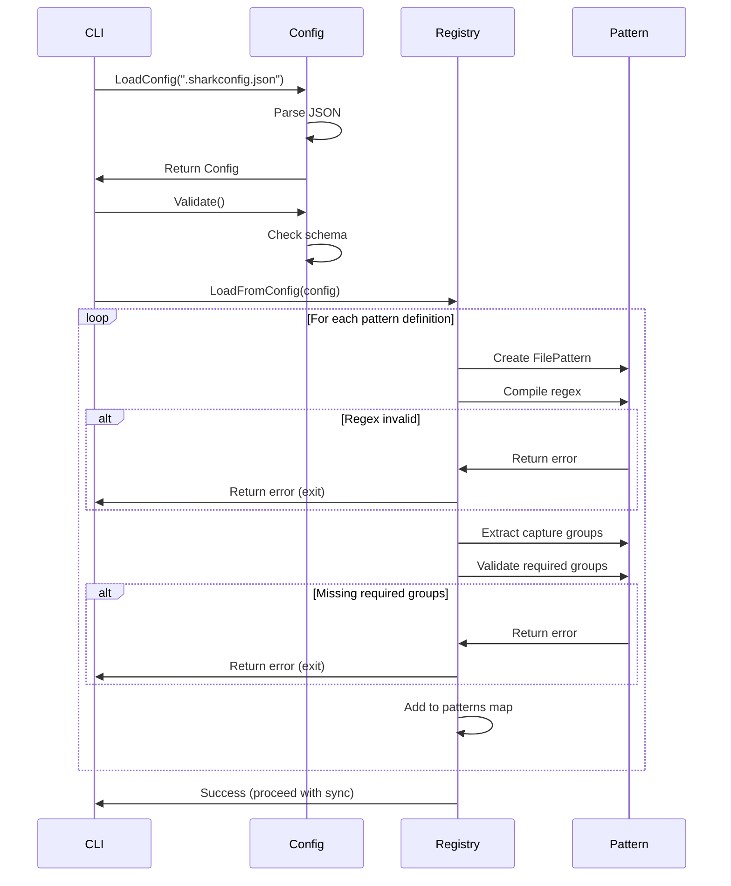
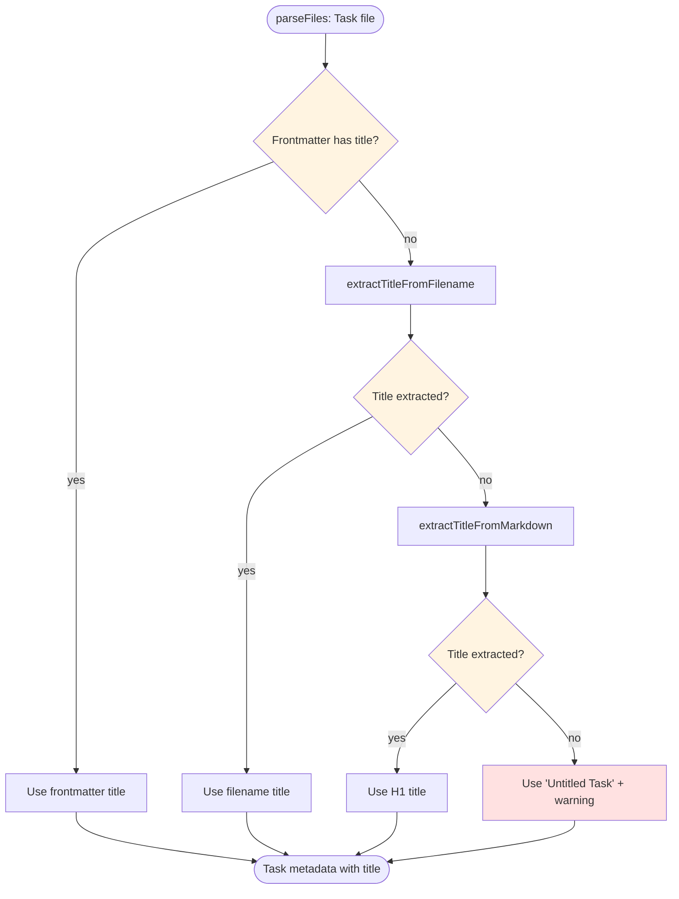
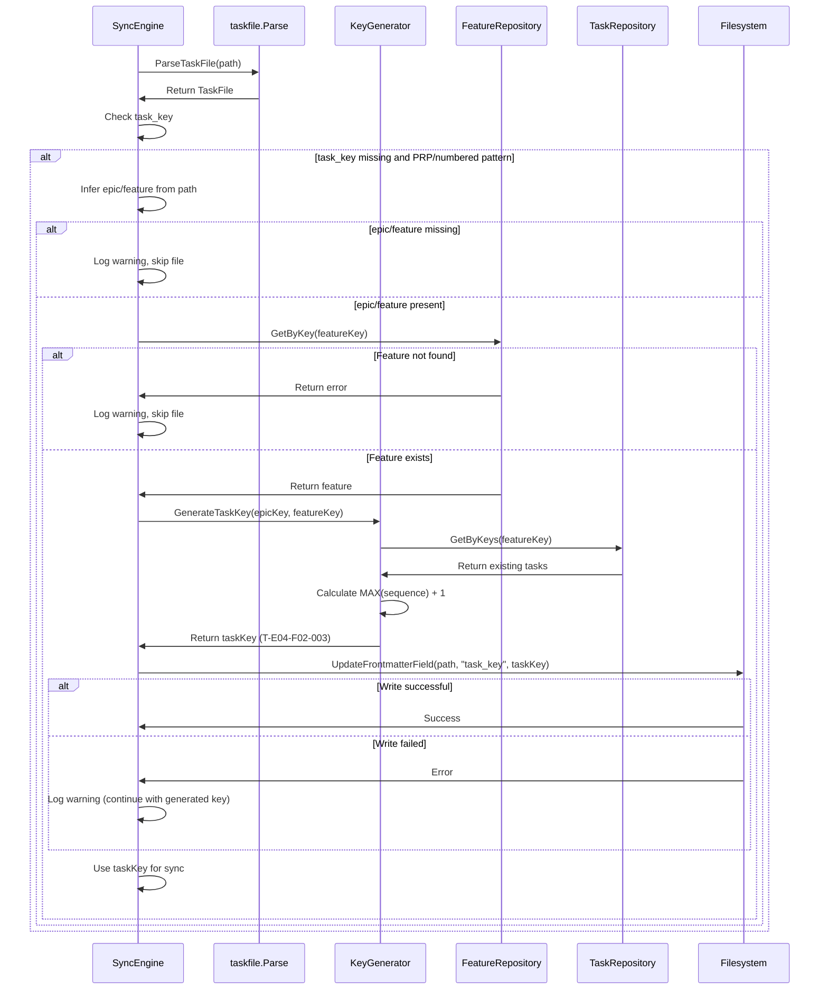

# Backend Design: Task File Recognition & Import

**Feature**: E06-F03-task-recognition-import
**Status**: POC Design
**Last Updated**: 2025-12-17

---

## Overview

This document specifies the backend implementation details for configurable task file pattern matching, metadata extraction, and automatic key generation. The design extends existing components (`PatternRegistry`, `SyncEngine`, `FileScanner`) rather than creating new layers.

---

## Component Specifications

### 1. Config Package

**Location**: `internal/config/config.go` (new package)

#### Data Structures

```go
// Config represents the application configuration from .sharkconfig.json
type Config struct {
    DefaultEpic   *string        `json:"default_epic"`
    DefaultAgent  *string        `json:"default_agent"`
    ColorEnabled  bool           `json:"color_enabled"`
    JSONOutput    bool           `json:"json_output"`
    Patterns      PatternsConfig `json:"patterns"`
}

// PatternsConfig contains all pattern configurations
type PatternsConfig struct {
    Task TaskPatternsConfig `json:"task"`
    // Future: Epic, Feature patterns would go here
}

// TaskPatternsConfig contains task file pattern definitions
type TaskPatternsConfig struct {
    File []PatternDefinition `json:"file"`
}

// PatternDefinition defines a single pattern with regex and metadata
type PatternDefinition struct {
    Name        string `json:"name"`
    Regex       string `json:"regex"`
    Enabled     bool   `json:"enabled"`
    Description string `json:"description,omitempty"`
}
```

#### Methods

**LoadConfig**

```go
// LoadConfig reads and parses .sharkconfig.json from specified path
// Returns Config with defaults if file doesn't exist
// Returns error if file exists but has invalid JSON
func LoadConfig(path string) (*Config, error)
```

**Implementation Notes**:
- Use `os.ReadFile()` to read file contents
- Use `json.Unmarshal()` to parse JSON
- If file doesn't exist, return config with default patterns (no error)
- If file exists but JSON invalid, return error with line number
- Validate config schema after parsing

**GetDefaultPatterns**

```go
// GetDefaultPatterns returns built-in pattern definitions
// Used when config file missing or patterns.task.file is empty
func GetDefaultPatterns() []PatternDefinition
```

**Returns**:
```go
[]PatternDefinition{
    {
        Name:        "standard",
        Regex:       `^T-E\d{2}-F\d{2}-\d{3}(?:-[a-z0-9-]+)?\.md$`,
        Enabled:     true,
        Description: "Standard task format: T-E04-F02-001.md or T-E04-F02-001-slug.md",
    },
}
```

**Validate**

```go
// Validate checks config schema and pattern definitions
// Returns error if any pattern has invalid regex or missing required fields
func (c *Config) Validate() error
```

**Validation Checks**:
1. At least one pattern is enabled
2. All pattern names are unique
3. All pattern names are non-empty alphanumeric strings (no spaces)
4. All patterns have non-empty regex
5. Each regex compiles successfully (syntax validation)

**Error Examples**:
```
Pattern validation failed: duplicate pattern name 'standard'
Pattern validation failed: pattern name 'my pattern' contains invalid characters (use alphanumeric and hyphens only)
Pattern validation failed: 'numbered' has empty regex field
```

---

### 2. PatternRegistry (Extended)

**Location**: `internal/sync/patterns.go`

#### Extended Data Structures

```go
// FilePattern defines a pattern for matching task files (UPDATED)
type FilePattern struct {
    Name           PatternType
    Regex          *regexp.Regexp
    RawRegex       string            // Store original regex for error messages
    CaptureGroups  []string          // List of capture group names
    Enabled        bool
    Description    string
}

// Add new pattern types
const (
    PatternTypeTask      PatternType = "task"
    PatternTypePRP       PatternType = "prp"
    PatternTypeNumbered  PatternType = "numbered"  // NEW
)
```

#### New Methods

**LoadFromConfig**

```go
// LoadFromConfig populates patterns from Config
// Validates each pattern and compiles regexes
// Returns error if any enabled pattern fails validation
func (r *PatternRegistry) LoadFromConfig(config *config.Config) error
```

**Implementation Flow**:
1. Clear existing patterns map
2. If `config.Patterns.Task.File` is empty, use `GetDefaultPatterns()`
3. For each pattern definition:
   - Create `FilePattern` with compiled regex
   - Validate pattern (see ValidatePattern below)
   - Add to patterns map keyed by name
4. Return error if any enabled pattern fails validation
5. Return error if no enabled patterns found

**Error Handling**:
- Accumulate all validation errors before returning
- Return formatted error with all issues listed
- Example: "Pattern validation failed for 3 patterns:\n  - 'standard': invalid regex...\n  - 'numbered': missing capture group...\n  - 'custom': ..."

**ValidatePattern**

```go
// ValidatePattern checks pattern has valid regex and required capture groups
// Returns error with specific issue (regex syntax, missing groups, etc.)
func (r *PatternRegistry) ValidatePattern(pattern *FilePattern) error
```

**Validation Steps**:

1. **Regex Syntax Validation**:
   ```go
   compiled, err := regexp.Compile(pattern.RawRegex)
   if err != nil {
       return fmt.Errorf("invalid regex syntax: %w", err)
   }
   pattern.Regex = compiled
   ```

2. **Length Validation** (prevent ReDoS):
   ```go
   if len(pattern.RawRegex) > 200 {
       return fmt.Errorf("regex too long (max 200 chars)")
   }
   ```

3. **Dangerous Pattern Detection** (prevent ReDoS):
   ```go
   dangerous := []string{"(.*)*", "(.+)+", "(.*+)+", "(.{0,})*"}
   for _, d := range dangerous {
       if strings.Contains(pattern.RawRegex, d) {
           return fmt.Errorf("potentially dangerous regex: contains nested quantifier %s", d)
       }
   }
   ```

4. **Capture Group Extraction**:
   ```go
   // Extract all named capture groups using SubexpNames()
   pattern.CaptureGroups = extractCaptureGroups(compiled)
   ```

5. **Required Capture Group Validation**:
   ```go
   requiredGroups := []string{"task_key", "number", "slug"}
   hasRequired := false
   for _, cg := range pattern.CaptureGroups {
       for _, required := range requiredGroups {
           if cg == required {
               hasRequired = true
               break
           }
       }
   }
   if !hasRequired {
       return fmt.Errorf("missing required capture group (must have one of: task_key, number, slug)")
   }
   ```

**GetMatchedGroups**

```go
// GetMatchedGroups returns captured group values for a filename
// Returns map of group name -> captured value
// Returns error if pattern doesn't match filename
func (r *PatternRegistry) GetMatchedGroups(filename string, patternType PatternType) (map[string]string, error)
```

**Implementation**:

```go
func (r *PatternRegistry) GetMatchedGroups(filename string, patternType PatternType) (map[string]string, error) {
    pattern, err := r.GetPattern(patternType)
    if err != nil {
        return nil, err
    }

    // Find matches
    matches := pattern.Regex.FindStringSubmatch(filename)
    if matches == nil {
        return nil, fmt.Errorf("filename does not match pattern %s", patternType)
    }

    // Build map of group name -> value
    groups := make(map[string]string)
    for i, name := range pattern.Regex.SubexpNames() {
        if i > 0 && name != "" { // Skip full match (index 0) and unnamed groups
            groups[name] = matches[i]
        }
    }

    return groups, nil
}
```

**Usage Example**:
```go
// Filename: "01-research-phase.md"
// Pattern: "^(?P<number>\d{2})-(?P<description>.*?)\.md$"
groups, err := registry.GetMatchedGroups("01-research-phase.md", PatternTypeNumbered)
// groups = {"number": "01", "description": "research-phase"}
```

**Helper: extractCaptureGroups**

```go
// extractCaptureGroups extracts named capture group names from compiled regex
func extractCaptureGroups(compiled *regexp.Regexp) []string {
    names := compiled.SubexpNames()
    groups := make([]string, 0, len(names))
    for _, name := range names {
        if name != "" { // Skip unnamed groups
            groups = append(groups, name)
        }
    }
    return groups
}
```

---

### 3. Metadata Extraction (Enhanced)

**Location**: `internal/sync/engine.go`

#### Enhanced: extractTitleFromFilename

```go
// extractTitleFromFilename extracts title from filename with pattern awareness
// Handles multiple formats based on pattern type
func extractTitleFromFilename(filePath string, patternType PatternType, registry *PatternRegistry) string
```

**Implementation**:

```go
func extractTitleFromFilename(filePath string, patternType PatternType, registry *PatternRegistry) string {
    filename := filepath.Base(filePath)
    filename = strings.TrimSuffix(filename, ".md")

    // Get matched groups for this pattern
    groups, err := registry.GetMatchedGroups(filepath.Base(filePath), patternType)
    if err != nil {
        // Pattern doesn't match (shouldn't happen, but handle gracefully)
        return ""
    }

    // Extract descriptive part based on capture groups
    var descriptive string

    if slug, ok := groups["slug"]; ok {
        // PRP pattern: use slug directly
        descriptive = slug
    } else if taskKey, ok := groups["task_key"]; ok {
        // Standard pattern: remove task key prefix
        // "T-E04-F02-001-implement-caching" -> "implement-caching"
        if len(filename) > len(taskKey) && filename[:len(taskKey)] == taskKey {
            if len(filename) > len(taskKey)+1 && filename[len(taskKey)] == '-' {
                descriptive = filename[len(taskKey)+1:]
            }
        }
    } else if number, ok := groups["number"]; ok {
        // Numbered pattern: remove number prefix
        // "01-research-phase" -> "research-phase"
        prefix := number + "-"
        descriptive = strings.TrimPrefix(filename, prefix)
    }

    // If no descriptive part found, return empty
    if descriptive == "" {
        return ""
    }

    // Convert hyphens to spaces and title-case
    descriptive = strings.ReplaceAll(descriptive, "-", " ")
    words := strings.Fields(descriptive)
    for i, word := range words {
        if len(word) > 0 {
            words[i] = strings.ToUpper(string(word[0])) + strings.ToLower(word[1:])
        }
    }

    return strings.Join(words, " ")
}
```

**Test Cases**:

| Pattern Type | Filename | Expected Title |
|-------------|----------|----------------|
| task | `T-E04-F02-001-implement-caching.md` | "Implement Caching" |
| task | `T-E04-F02-001.md` | "" (no descriptive part) |
| numbered | `01-research-phase.md` | "Research Phase" |
| numbered | `123-authentication-system.md` | "Authentication System" |
| prp | `implement-auth.prp.md` | "Implement Auth" |
| prp | `user-management-api.prp.md` | "User Management Api" |

#### New: extractDescriptionFromMarkdown

```go
// extractDescriptionFromMarkdown extracts first paragraph after frontmatter/H1
// Limits to 500 characters, preserves line breaks within paragraph
func extractDescriptionFromMarkdown(content string) string
```

**Implementation**:

```go
func extractDescriptionFromMarkdown(content string) string {
    lines := strings.Split(content, "\n")
    inFrontmatter := false
    pastFrontmatter := false
    pastFirstHeading := false
    var paragraph strings.Builder

    for _, line := range lines {
        trimmed := strings.TrimSpace(line)

        // Track frontmatter boundaries
        if trimmed == "---" {
            if !pastFrontmatter {
                inFrontmatter = !inFrontmatter
                if !inFrontmatter {
                    pastFrontmatter = true
                }
            }
            continue
        }

        // Skip frontmatter content
        if inFrontmatter {
            continue
        }

        // Skip first H1 heading
        if strings.HasPrefix(trimmed, "# ") && !pastFirstHeading {
            pastFirstHeading = true
            continue
        }

        // After frontmatter and H1, collect first paragraph
        if pastFrontmatter && pastFirstHeading {
            // Stop at blank line (end of paragraph)
            if trimmed == "" && paragraph.Len() > 0 {
                break
            }

            // Stop at next heading
            if strings.HasPrefix(trimmed, "#") {
                break
            }

            // Add line to paragraph (skip blank lines at start)
            if trimmed != "" || paragraph.Len() > 0 {
                paragraph.WriteString(line)
                paragraph.WriteString("\n")
            }

            // Stop if we hit 500 chars
            if paragraph.Len() >= 500 {
                break
            }
        }
    }

    result := strings.TrimSpace(paragraph.String())
    if len(result) > 500 {
        result = result[:500]
    }

    return result
}
```

**Test Cases**:

**Input 1** (with frontmatter):
```markdown
---
title: My Task
---

# Task: Implementation

This is the first paragraph describing the task.
It can span multiple lines.

This is the second paragraph.
```
**Output 1**: `"This is the first paragraph describing the task.\nIt can span multiple lines."`

**Input 2** (without frontmatter):
```markdown
# PRP: User Authentication

Implement JWT-based authentication for the API. This includes login, logout, and token refresh endpoints.

## Requirements

...
```
**Output 2**: `"Implement JWT-based authentication for the API. This includes login, logout, and token refresh endpoints."`

**Input 3** (no paragraph):
```markdown
# Task

## Acceptance Criteria

...
```
**Output 3**: `""` (empty string)

#### Enhanced: SyncEngine.parseFiles

**Changes to parseFiles method**:

```go
func (e *SyncEngine) parseFiles(files []TaskFileInfo) ([]*TaskMetadata, []string) {
    var taskDataList []*TaskMetadata
    var warnings []string

    keyGen := taskcreation.NewKeyGenerator(e.taskRepo, e.featureRepo)

    for _, file := range files {
        // Parse task file
        taskFile, err := taskfile.ParseTaskFile(file.FilePath)
        if err != nil {
            warnings = append(warnings, fmt.Sprintf("Failed to parse %s: %v", file.FilePath, err))
            continue
        }

        // Handle missing task_key
        if taskFile.Metadata.TaskKey == "" {
            // Generate key for PRP/numbered patterns
            if file.PatternType == PatternTypePRP || file.PatternType == PatternTypeNumbered {
                // Validate epic/feature were inferred
                if file.EpicKey == "" || file.FeatureKey == "" {
                    warnings = append(warnings, fmt.Sprintf(
                        "Cannot generate task_key for %s: missing epic/feature in path. "+
                        "Expected path structure: docs/plan/{epic}/{feature}/tasks/{file}",
                        file.FilePath))
                    continue
                }

                // Validate feature exists in database
                ctx := context.Background()
                _, err := e.featureRepo.GetByKey(ctx, file.FeatureKey)
                if err != nil {
                    warnings = append(warnings, fmt.Sprintf(
                        "Cannot generate task_key for %s: feature %s not found in database",
                        file.FilePath, file.FeatureKey))
                    continue
                }

                // Generate task key
                taskKey, err := keyGen.GenerateTaskKey(ctx, file.EpicKey, file.FeatureKey)
                if err != nil {
                    warnings = append(warnings, fmt.Sprintf(
                        "Failed to generate task_key for %s: %v",
                        file.FilePath, err))
                    continue
                }

                // Update file frontmatter with generated key
                if err := taskfile.UpdateFrontmatterField(file.FilePath, "task_key", taskKey); err != nil {
                    warnings = append(warnings, fmt.Sprintf(
                        "Generated key %s but couldn't write to %s: %v. "+
                        "Future syncs will regenerate key.",
                        taskKey, file.FilePath, err))
                    // Continue - we can still use the generated key for this sync
                }

                taskFile.Metadata.TaskKey = taskKey
            } else {
                // For task pattern files, task_key is required in frontmatter or filename
                warnings = append(warnings, fmt.Sprintf(
                    "Missing task_key in %s. For task pattern files, task_key must be in frontmatter or filename.",
                    file.FilePath))
                continue
            }
        }

        // Extract title with fallbacks
        title := taskFile.Metadata.Title
        if title == "" {
            // Try filename first
            title = extractTitleFromFilename(file.FilePath, file.PatternType, e.scanner.patternRegistry)
        }
        if title == "" {
            // Fall back to H1 heading
            title = extractTitleFromMarkdown(taskFile.Content)
        }
        if title == "" {
            // Use placeholder and log warning
            title = "Untitled Task"
            warnings = append(warnings, fmt.Sprintf(
                "No title found for %s. Using default title. "+
                "Suggestion: Add title to frontmatter, filename, or H1 heading.",
                file.FilePath))
        }

        // Extract description with fallbacks
        description := taskFile.Metadata.Description
        if description == "" {
            // Try extracting from markdown body
            description = extractDescriptionFromMarkdown(taskFile.Content)
        }

        // Build task metadata
        taskData := &TaskMetadata{
            Key:        taskFile.Metadata.TaskKey,
            Title:      title,
            FilePath:   file.FilePath,
            ModifiedAt: file.ModifiedAt,
        }

        // Add description if present (optional field)
        if description != "" {
            taskData.Description = &description
        }

        taskDataList = append(taskDataList, taskData)
    }

    return taskDataList, warnings
}
```

---

### 4. Path-Based Validation

**Location**: `internal/sync/scanner.go`

#### Enhanced: inferEpicFeature

**Current implementation is sufficient**. No changes needed to path inference logic.

**New validation added in SyncEngine.parseFiles()** (see above):

```go
// Validate feature exists in database before key generation
_, err := e.featureRepo.GetByKey(ctx, file.FeatureKey)
if err != nil {
    warnings = append(warnings, fmt.Sprintf(
        "Cannot generate task_key for %s: feature %s not found in database",
        file.FilePath, file.FeatureKey))
    continue
}
```

---

### 5. Integration with Existing Components

#### SyncEngine Initialization

**Update NewSyncEngine to load config**:

```go
func NewSyncEngine(dbPath string) (*SyncEngine, error) {
    return NewSyncEngineWithConfig(dbPath, nil)
}

func NewSyncEngineWithConfig(dbPath string, cfg *config.Config) (*SyncEngine, error) {
    // Open database connection
    db, err := sql.Open("sqlite3", dbPath+"?_foreign_keys=on")
    if err != nil {
        return nil, fmt.Errorf("failed to open database: %w", err)
    }

    // Test connection
    if err := db.Ping(); err != nil {
        db.Close()
        return nil, fmt.Errorf("failed to ping database: %w", err)
    }

    // Load config if not provided
    if cfg == nil {
        cfg, err = config.LoadConfig(".sharkconfig.json")
        if err != nil {
            db.Close()
            return nil, fmt.Errorf("failed to load config: %w", err)
        }
    }

    // Validate config
    if err := cfg.Validate(); err != nil {
        db.Close()
        return nil, fmt.Errorf("config validation failed: %w", err)
    }

    // Create repository wrapper
    repoDb := repository.NewDB(db)

    // Create scanner with config-loaded patterns
    scanner := NewFileScanner()
    if err := scanner.patternRegistry.LoadFromConfig(cfg); err != nil {
        db.Close()
        return nil, fmt.Errorf("failed to load patterns from config: %w", err)
    }

    return &SyncEngine{
        db:          db,
        taskRepo:    repository.NewTaskRepository(repoDb),
        epicRepo:    repository.NewEpicRepository(repoDb),
        featureRepo: repository.NewFeatureRepository(repoDb),
        scanner:     scanner,
        detector:    NewConflictDetector(),
        resolver:    NewConflictResolver(),
    }, nil
}
```

#### CLI Integration

**Update cmd/shark/sync.go**:

```go
func runSync(cmd *cobra.Command, args []string) error {
    // Load configuration
    cfg, err := config.LoadConfig(".sharkconfig.json")
    if err != nil {
        return fmt.Errorf("failed to load config: %w", err)
    }

    // Validate configuration (includes pattern validation)
    if err := cfg.Validate(); err != nil {
        fmt.Fprintf(os.Stderr, "Configuration validation failed:\n%v\n", err)
        return err
    }

    // Create sync engine with validated config
    dbPath := viper.GetString("database")
    engine, err := sync.NewSyncEngineWithConfig(dbPath, cfg)
    if err != nil {
        return fmt.Errorf("failed to create sync engine: %w", err)
    }
    defer engine.Close()

    // Get folder path from flag or use current directory
    folderPath, err := cmd.Flags().GetString("folder")
    if err != nil || folderPath == "" {
        folderPath = "docs/plan"
    }

    // Build sync options
    opts := sync.SyncOptions{
        FolderPath:    folderPath,
        DryRun:        viper.GetBool("dry-run"),
        CreateMissing: viper.GetBool("create-missing"),
        Strategy:      sync.StrategyFileWins, // Default strategy
    }

    // Run sync
    report, err := engine.Sync(context.Background(), opts)
    if err != nil {
        return fmt.Errorf("sync failed: %w", err)
    }

    // Display report
    displaySyncReport(report)

    return nil
}
```

---

## Data Flow Diagrams

### Pattern Validation Flow



### Title Extraction Flow



### Key Generation and Frontmatter Update Flow



---

## Error Messages & Warnings

### Config Validation Errors

**Invalid Regex Syntax**:
```
Configuration validation failed:
  Pattern 'custom-format' has invalid regex syntax: error parsing regexp: missing closing ): `^(?P<task_key>T-E\d{2}-F\d{2}-\d{3`
  Suggestion: Fix regex syntax or disable pattern by setting "enabled": false
```

**Missing Required Capture Group**:
```
Configuration validation failed:
  Pattern 'numbered-prefix' missing required capture group.
  Found capture groups: []
  Required: At least one of [task_key, number, slug]
  Suggestion: Add named capture group like (?P<number>\d{2,3}) to extract task identifier
```

**Dangerous Regex Pattern**:
```
Configuration validation failed:
  Pattern 'complex-matcher' contains potentially dangerous regex: nested quantifier (.*)*.
  This could cause catastrophic backtracking (ReDoS).
  Suggestion: Simplify regex or use non-greedy quantifiers
```

**No Enabled Patterns**:
```
Configuration validation failed:
  No enabled patterns found in patterns.task.file
  Suggestion: Enable at least one pattern by setting "enabled": true
```

### Runtime Warnings

**Pattern Mismatch**:
```
[WARN] Pattern mismatch: File 'docs/plan/E04-task-mgmt-cli-core/E04-F02-cli-infrastructure/tasks/random-notes.txt' did not match any enabled patterns.
       Attempted patterns: standard, numbered-prefix, prp-suffix
       Suggestion: Ensure filename matches one of the configured patterns or add custom pattern to .sharkconfig.json
```

**Path Inference Failure**:
```
[WARN] Cannot generate task_key for 'docs/random/implement-auth.prp.md': missing epic/feature in path.
       Expected path structure: docs/plan/{epic}/{feature}/tasks/{file}
       Actual path: docs/random/implement-auth.prp.md
       Suggestion: Move file to valid epic/feature folder or add task_key to frontmatter
```

**Feature Not Found**:
```
[WARN] Cannot generate task_key for 'docs/plan/E99-unknown/E99-F01-feature/tasks/01-task.md': feature E99-F01 not found in database
       Suggestion: Create feature E99-F01 first using 'shark feature create' or ensure epic/feature exist
```

**Frontmatter Write Failure**:
```
[WARN] Generated key T-E04-F02-003 but couldn't write to 'docs/plan/E04-task-mgmt-cli-core/E04-F02-cli-infrastructure/tasks/implement-auth.prp.md': permission denied
       Future syncs will regenerate key. Fix file permissions to persist generated key.
```

**No Title Found**:
```
[WARN] No title found for 'docs/plan/E04-task-mgmt-cli-core/E04-F02-cli-infrastructure/tasks/T-E04-F02-001.md'. Using default title.
       Suggestion: Add title to frontmatter, filename (T-E04-F02-001-descriptive-name.md), or H1 heading
```

### Success Messages

**Key Generation Success**:
```
[INFO] Generated task key T-E04-F02-003 for file: implement-auth.prp.md
[INFO] Updated frontmatter with task_key: T-E04-F02-003
```

**Sync Report**:
```
Sync completed successfully

Files scanned: 150
Tasks imported: 120
Tasks updated: 25
Tasks skipped: 5

Pattern statistics:
  standard: 100 files (67%)
  numbered-prefix: 30 files (20%)
  prp-suffix: 20 files (13%)

Generated task keys: 15
  Feature E04-F02: 8 keys
  Feature E04-F07: 7 keys

Warnings: 5 (see above for details)
Conflicts resolved: 10
```

---

## Testing Specifications

### Unit Tests

#### Config Package Tests

**TestLoadConfig**:
- Valid config file with patterns
- Missing config file (should return defaults)
- Invalid JSON syntax
- Empty patterns.task.file array
- Missing patterns section entirely

**TestConfigValidate**:
- Valid config passes validation
- No enabled patterns returns error
- Duplicate pattern names returns error
- Invalid pattern name (with spaces) returns error

#### PatternRegistry Tests

**TestLoadFromConfig**:
- Load valid config with multiple patterns
- Load config with empty patterns (uses defaults)
- Load config with disabled patterns (should skip)
- Load config with invalid regex (should return error)
- Load config with missing capture groups (should return error)

**TestValidatePattern**:
- Valid pattern with task_key capture group
- Valid pattern with number capture group
- Valid pattern with slug capture group
- Invalid regex syntax returns error
- Missing all required capture groups returns error
- Regex too long (>200 chars) returns error
- Dangerous pattern (nested quantifiers) returns error

**TestGetMatchedGroups**:
- Standard pattern matches T-E04-F02-001.md
- Standard pattern with slug matches T-E04-F02-001-implement-auth.md
- Numbered pattern matches 01-research.md
- Numbered pattern matches 123-implementation.md
- PRP pattern matches implement-auth.prp.md
- Non-matching filename returns error

#### Metadata Extraction Tests

**TestExtractTitleFromFilename**:
- Standard format with slug: "T-E04-F02-001-implement-caching.md" → "Implement Caching"
- Standard format without slug: "T-E04-F02-001.md" → ""
- Numbered format: "01-research-phase.md" → "Research Phase"
- PRP format: "implement-auth.prp.md" → "Implement Auth"
- Multiple hyphens: "user-management-api.prp.md" → "User Management Api"

**TestExtractDescriptionFromMarkdown**:
- With frontmatter and paragraph
- Without frontmatter, with paragraph
- No paragraph (empty string)
- Paragraph longer than 500 chars (truncated)
- Multiple paragraphs (only first extracted)
- Paragraph with blank lines (preserves breaks)

### Integration Tests

**TestEndToEndSyncWithCustomPatterns**:
1. Create `.sharkconfig.json` with custom numbered pattern
2. Create test files matching numbered pattern
3. Run sync
4. Verify tasks imported with correct epic/feature
5. Verify titles extracted from filenames
6. Verify generated task keys written to frontmatter

**TestKeyGenerationAndFrontmatterUpdate**:
1. Create PRP file without task_key in valid epic/feature folder
2. Run sync
3. Verify task key generated
4. Verify frontmatter updated with task_key
5. Run sync again
6. Verify task key not regenerated (stable)

**TestPatternPrecedence**:
1. Create config with three patterns in specific order
2. Create files that could match multiple patterns
3. Run sync
4. Verify first matching pattern used (precedence respected)

**TestMetadataFallbacks**:
1. Create task file without frontmatter
2. Verify title extracted from filename
3. Create task file without frontmatter or descriptive filename
4. Verify title extracted from H1 heading
5. Create task file with no title sources
6. Verify "Untitled Task" used with warning logged

---

## Performance Specifications

### Benchmarks

**Pattern Matching Performance**:
```go
func BenchmarkPatternMatching(b *testing.B) {
    registry := NewPatternRegistry()
    // Load config with 5 patterns
    cfg := &config.Config{...}
    registry.LoadFromConfig(cfg)

    filenames := []string{
        "T-E04-F02-001.md",
        "01-research.md",
        "implement-auth.prp.md",
        "random-file.txt",
    }

    b.ResetTimer()
    for i := 0; i < b.N; i++ {
        for _, filename := range filenames {
            registry.MatchesAnyPattern(filename)
        }
    }
}
// Target: <1ms per file for 5 patterns
```

**Metadata Extraction Performance**:
```go
func BenchmarkMetadataExtraction(b *testing.B) {
    content := generateMarkdownContent(5000) // 5KB markdown file

    b.ResetTimer()
    for i := 0; i < b.N; i++ {
        extractTitleFromMarkdown(content)
        extractDescriptionFromMarkdown(content)
    }
}
// Target: <5ms per file
```

**Key Generation Performance**:
```go
func BenchmarkKeyGeneration(b *testing.B) {
    // Setup: database with 100 existing tasks in feature E04-F02
    keyGen := taskcreation.NewKeyGenerator(taskRepo, featureRepo)

    b.ResetTimer()
    for i := 0; i < b.N; i++ {
        keyGen.GenerateTaskKey(context.Background(), "E04", "E04-F02")
    }
}
// Target: <20ms per key (includes database query)
```

### Optimization Notes

1. **Regex Compilation**: Compiled once in LoadFromConfig(), cached in PatternRegistry
2. **Pattern Matching**: Short-circuit on first match (don't evaluate remaining patterns)
3. **Metadata Extraction**: Stream-based parsing (don't load entire file into memory)
4. **Key Generation**: Batch query for MAX(sequence) if generating multiple keys for same feature

---

## Security Considerations

### Input Validation

**Regex Validation** (prevent ReDoS):
- Max regex length: 200 characters
- Reject nested quantifiers: `(.*)*`, `(.+)+`, `(.*+)+`
- Compile timeout: 100ms (implicit in Go's regexp package)

**Frontmatter Validation** (prevent YAML injection):
- Use safe YAML parser (gopkg.in/yaml.v3 in safe mode)
- Validate field types match schema
- Limit frontmatter size (1KB max before parsing)

**Path Validation** (prevent path traversal):
- Already implemented in FileScanner.validateFilePath()
- Ensure generated task_key doesn't contain path separators
- Validate file paths are within allowed directories

### Database Security

**Parameterized Queries** (prevent SQL injection):
- All queries use parameterized statements (already implemented in repositories)
- No raw SQL concatenation with user input

**Transaction Isolation** (prevent race conditions):
- Key generation uses transaction with appropriate isolation level
- Concurrent key generation handled safely by database locks

---

## Appendix: Example Configurations

### Minimal Config (Standard Pattern Only)

```json
{
  "patterns": {
    "task": {
      "file": [
        {
          "name": "standard",
          "regex": "^T-E\\d{2}-F\\d{2}-\\d{3}(?:-[a-z0-9-]+)?\\.md$",
          "enabled": true
        }
      ]
    }
  }
}
```

### Multi-Pattern Config (All Common Patterns)

```json
{
  "patterns": {
    "task": {
      "file": [
        {
          "name": "standard",
          "regex": "^T-E\\d{2}-F\\d{2}-\\d{3}(?:-[a-z0-9-]+)?\\.md$",
          "enabled": true,
          "description": "Standard: T-E04-F02-001.md or T-E04-F02-001-slug.md"
        },
        {
          "name": "numbered-prefix",
          "regex": "^(?P<number>\\d{2,3})-.*\\.md$",
          "enabled": true,
          "description": "Numbered: 01-research.md, 123-implementation.md"
        },
        {
          "name": "prp-suffix",
          "regex": "^(?P<slug>[a-z0-9-]+)\\.prp\\.md$",
          "enabled": true,
          "description": "PRP: implement-auth.prp.md"
        }
      ]
    }
  }
}
```

### Custom Pattern Config (Legacy Naming)

```json
{
  "patterns": {
    "task": {
      "file": [
        {
          "name": "standard",
          "regex": "^T-E\\d{2}-F\\d{2}-\\d{3}(?:-[a-z0-9-]+)?\\.md$",
          "enabled": true
        },
        {
          "name": "legacy-task",
          "regex": "^TASK-(?P<number>\\d{4})-.*\\.md$",
          "enabled": true,
          "description": "Legacy: TASK-0001-description.md"
        },
        {
          "name": "story-format",
          "regex": "^US-(?P<number>\\d{3})-.*\\.md$",
          "enabled": true,
          "description": "User Story: US-001-user-login.md"
        }
      ]
    }
  }
}
```

---

**Document Version**: 1.0
**Next Review**: After implementation and testing
